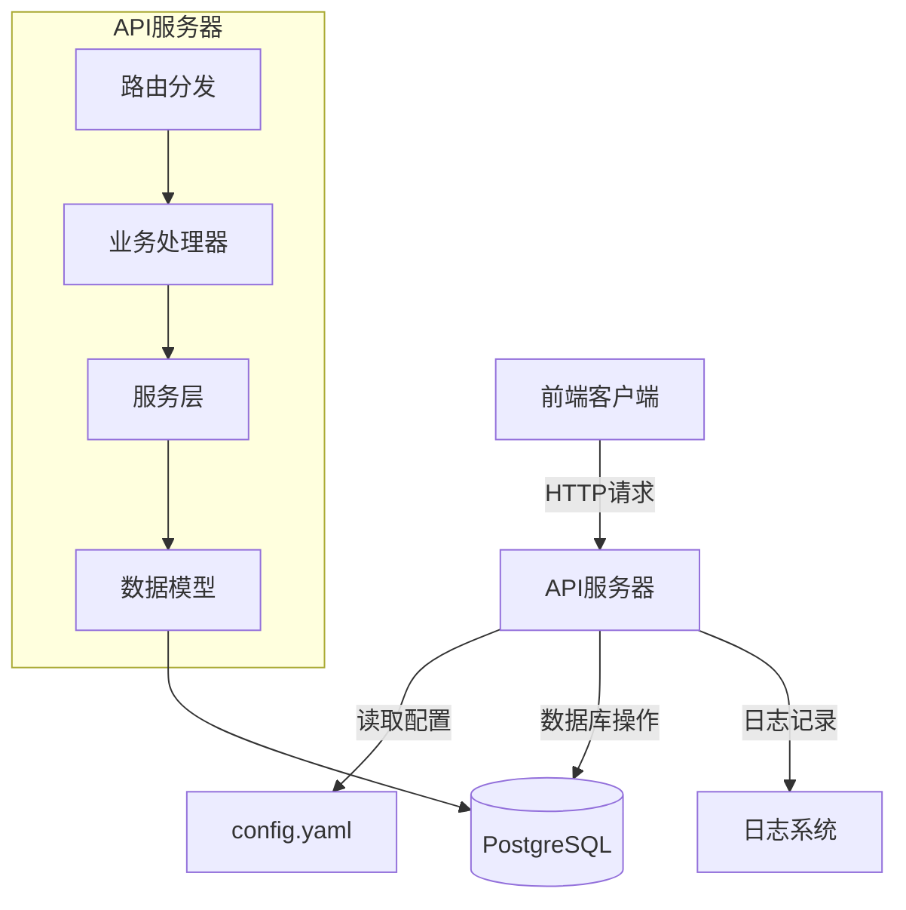
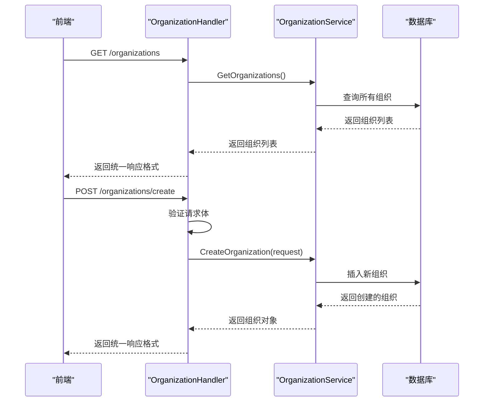
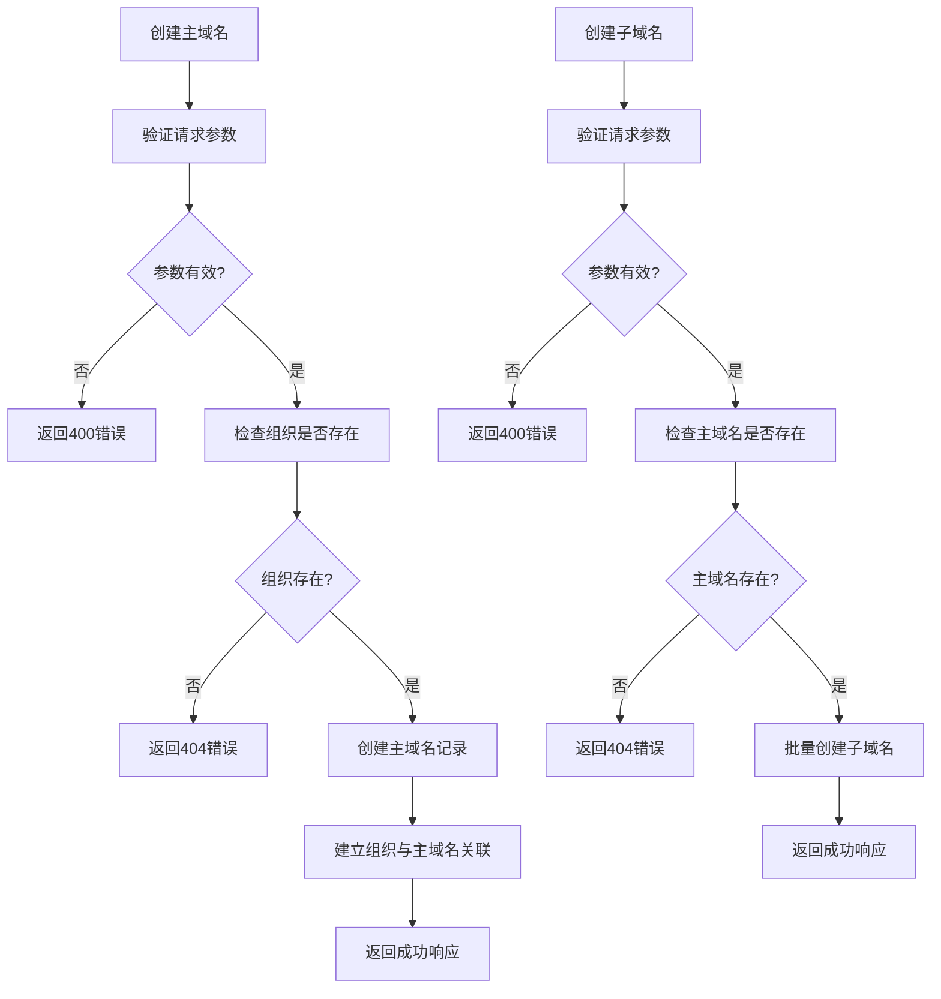
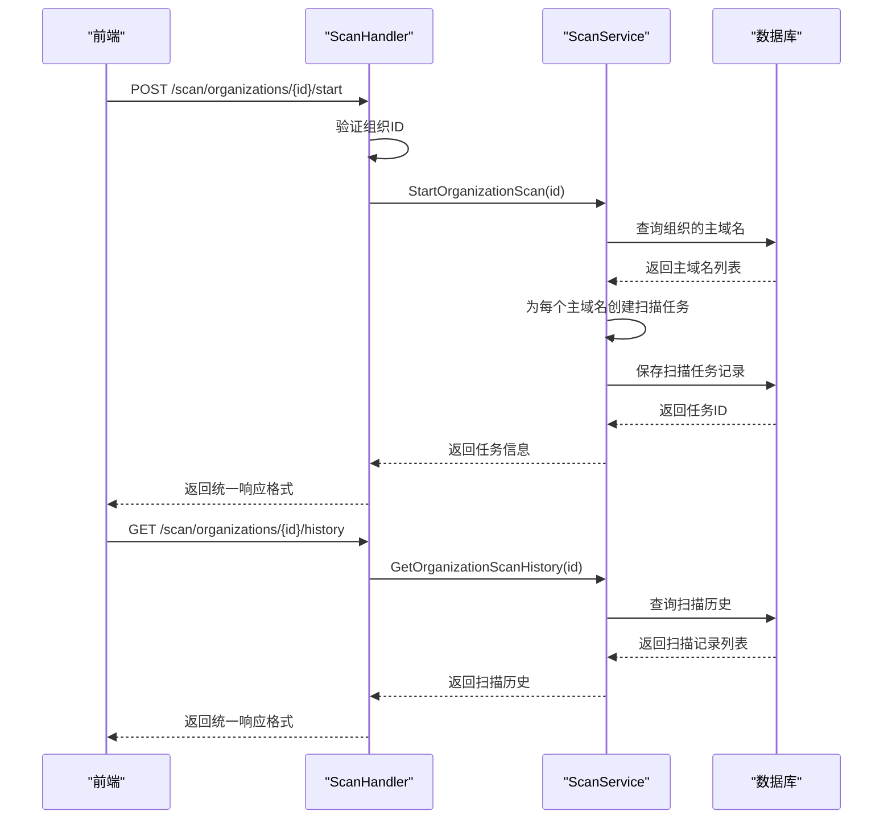
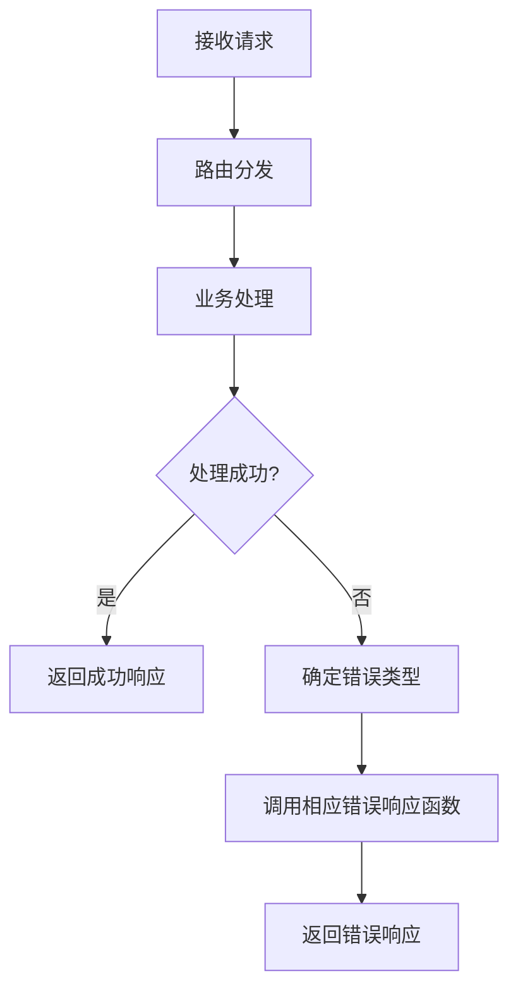

# API参考文档

<cite>
**本文档引用的文件**   
- [main.go](file://backend/cmd/main.go) - *更新于最近提交*
- [config.go](file://backend/config/config.go) - *更新于最近提交*
- [routes.go](file://backend/routes/routes.go) - *路由定义文件*
- [response.go](file://backend/internal/utils/response.go) - *响应工具函数*
- [organization-handler.go](file://backend/internal/handlers/organization-handler.go) - *组织处理器*
- [domain-handler.go](file://backend/internal/handlers/domain-handler.go) - *域名处理器*
- [scan-handler.go](file://backend/internal/handlers/scan-handler.go) - *扫描处理器*
- [vulnerability-handler.go](file://backend/internal/handlers/vulnerability-handler.go) - *漏洞处理器*
- [organization.service.ts](file://front/services/organization.service.ts) - *前端组织服务*
- [api-client.ts](file://front/lib/api-client.ts) - *API客户端配置*
</cite>

## 更新摘要
**已做更改**   
- 修复了API文档文件被删除后重新添加的问题，确保文档完整性
- 更新了组织管理API的请求参数命名规范，反映前端camelCase到后端snake_case的自动转换
- 修正了资产管理API的URL路径，与实际路由定义保持一致
- 更新了前端集成示例，反映最新的服务调用方式
- 移除了过时的API文档引用，确保所有引用文件均存在

## 目录
1. [概述](#概述)
2. [基础信息](#基础信息)
3. [通用响应格式](#通用响应格式)
4. [组织管理API](#组织管理api)
5. [资产管理API](#资产管理api)
6. [扫描管理API](#扫描管理api)
7. [漏洞管理API](#漏洞管理api)
8. [认证与安全](#认证与安全)
9. [错误处理](#错误处理)
10. [前端集成示例](#前端集成示例)

## 概述

本API参考文档详细描述了漏洞扫描系统的后端接口。系统采用RESTful架构，基于Gin框架构建，提供组织管理、资产（域名）管理、扫描任务管理和漏洞管理等功能。API设计遵循统一的响应格式，便于前后端集成。

**Section sources**
- [main.go](file://backend/cmd/main.go#L1-L10)
- [routes.go](file://backend/routes/routes.go#L1-L64)

## 基础信息

- **基础URL**: `http://localhost:8080/api/v1`
- **响应格式**: JSON
- **字符编码**: UTF-8
- **版本**: v1
- **服务器端口**: 8080 (可通过配置文件修改)

系统通过`config.yaml`文件进行配置管理，支持环境变量覆盖。服务器运行模式（debug/release）可在配置中设置。



**Diagram sources**
- [main.go](file://backend/cmd/main.go#L50-L55)
- [config.go](file://backend/config/config.go#L1-L120)

**Section sources**
- [config.go](file://backend/config/config.go#L1-L120)
- [main.go](file://backend/cmd/main.go#L1-L109)

## 通用响应格式

所有API响应均采用统一的JSON格式，包含状态码、消息和数据三个主要字段。

```json
{
  "code": "SUCCESS",
  "message": "操作成功",
  "data": {...}
}
```

### 响应字段说明

- **code**: 状态码，表示操作结果
  - `SUCCESS`: 操作成功
  - `ERROR`: 操作失败
- **message**: 人类可读的消息描述
- **data**: 响应数据，仅在成功时存在，可选

```mermaid
classDiagram
class APIResponse {
+string code
+string message
+interface{} data
}
note right of APIResponse
通用API响应结构
data字段为可选，仅在成功时返回
end note
```

**Diagram sources**
- [response.go](file://backend/internal/models/response.go#L1-L7)
- [response.go](file://backend/internal/utils/response.go#L1-L47)

**Section sources**
- [response.go](file://backend/internal/models/response.go#L1-L7)
- [response.go](file://backend/internal/utils/response.go#L1-L47)

## 组织管理API

组织管理API提供对组织实体的CRUD操作，是系统的核心资源之一。

### 获取所有组织
- **HTTP方法**: GET
- **URL路径**: `/organizations`
- **认证要求**: 无
- **响应**: 组织对象列表

### 创建组织
- **HTTP方法**: POST
- **URL路径**: `/organizations/create`
- **认证要求**: 无
- **请求体**:
```json
{
  "name": "组织名称",
  "description": "组织描述"
}
```
- **请求参数说明**:
  - `name`: 组织名称，必填
  - `description`: 组织描述，可选

### 获取组织详情
- **HTTP方法**: GET
- **URL路径**: `/organizations/{id}`
- **认证要求**: 无
- **路径参数**:
  - `id`: 组织ID
- **响应**: 单个组织对象

### 更新组织
- **HTTP方法**: POST
- **URL路径**: `/organizations/{id}/update`
- **认证要求**: 无
- **路径参数**:
  - `id`: 组织ID
- **请求体**:
```json
{
  "name": "新组织名称",
  "description": "新组织描述"
}
```

### 删除组织
- **HTTP方法**: POST
- **URL路径**: `/organizations/delete`
- **认证要求**: 无
- **请求体**:
```json
{
  "organization_id": "组织ID"
}
```

### 批量删除组织
- **HTTP方法**: POST
- **URL路径**: `/organizations/batch-delete`
- **认证要求**: 无
- **请求体**:
```json
{
  "organization_ids": ["id1", "id2", "id3"]
}
```

### 搜索组织
- **HTTP方法**: GET
- **URL路径**: `/organizations/search?q=搜索关键词`
- **认证要求**: 无
- **查询参数**:
  - `q`: 搜索关键词



**Section sources**
- [routes.go](file://backend/routes/routes.go#L6-L25)
- [organization-handler.go](file://backend/internal/handlers/organization-handler.go)
- [organization.go](file://backend/internal/models/organization.go#L1-L30)

## 资产管理API

资产管理API负责处理主域名和子域名的创建与查询。

### 创建主域名
- **HTTP方法**: POST
- **URL路径**: `/assets/main-domains/create`
- **认证要求**: 无
- **请求体**:
```json
{
  "main_domains": ["example.com", "test.com"],
  "organization_id": "组织ID"
}
```
- **请求参数说明**:
  - `main_domains`: 主域名列表，必填
  - `organization_id`: 组织ID，必填

### 创建子域名
- **HTTP方法**: POST
- **URL路径**: `/assets/sub-domains/create`
- **认证要求**: 无
- **请求体**:
```json
{
  "sub_domains": ["www", "api", "admin"],
  "main_domain_id": "主域名ID",
  "status": "unknown"
}
```
- **请求参数说明**:
  - `sub_domains`: 子域名前缀列表，必填
  - `main_domain_id`: 主域名ID，必填
  - `status`: 状态，可选，默认为"unknown"

### 获取组织主域名
- **HTTP方法**: GET
- **URL路径**: `/organizations/{id}/main-domains`
- **认证要求**: 无
- **路径参数**:
  - `id`: 组织ID
- **响应**:
```json
{
  "code": "SUCCESS",
  "message": "操作成功",
  "data": {
    "main_domains": [
      {
        "id": "域名ID",
        "main_domain_name": "example.com",
        "created_at": "2024-01-01T00:00:00Z"
      }
    ]
  }
}
```

### 获取组织子域名
- **HTTP方法**: GET
- **URL路径**: `/organizations/{id}/sub-domains?page=1&pageSize=10`
- **认证要求**: 无
- **路径参数**:
  - `id`: 组织ID
- **查询参数**:
  - `page`: 页码，可选，默认为1
  - `pageSize`: 每页数量，可选，默认为10
- **响应**:
```json
{
  "code": "SUCCESS",
  "message": "操作成功",
  "data": {
    "sub_domains": [
      {
        "id": "子域名ID",
        "sub_domain_name": "www.example.com",
        "main_domain_id": "主域名ID",
        "status": "active",
        "created_at": "2024-01-01T00:00:00Z",
        "updated_at": "2024-01-01T00:00:00Z",
        "main_domain": {
          "id": "主域名ID",
          "main_domain_name": "example.com",
          "created_at": "2024-01-01T00:00:00Z"
        }
      }
    ],
    "total": 100,
    "page": 1,
    "page_size": 10
  }
}
```

### 移除组织主域名关联
- **HTTP方法**: POST
- **URL路径**: `/organizations/remove-main-domain`
- **认证要求**: 无
- **请求体**:
```json
{
  "organization_id": "组织ID",
  "main_domain_id": "主域名ID"
}
```



**Section sources**
- [routes.go](file://backend/routes/routes.go#L43-L55)
- [domain-handler.go](file://backend/internal/handlers/domain-handler.go)

## 扫描管理API

扫描管理API负责启动扫描任务和查询扫描历史。

### 开始组织扫描
- **HTTP方法**: POST
- **URL路径**: `/scan/organizations/{id}/start`
- **认证要求**: 无
- **路径参数**:
  - `id`: 组织ID
- **响应**:
```json
{
  "code": "SUCCESS",
  "message": "操作成功",
  "data": {
    "task_id": "扫描任务ID",
    "message": "成功创建 3 个扫描任务"
  }
}
```

### 获取组织扫描历史
- **HTTP方法**: GET
- **URL路径**: `/scan/organizations/{id}/history`
- **认证要求**: 无
- **路径参数**:
  - `id`: 组织ID
- **响应**:
```json
{
  "code": "SUCCESS",
  "message": "操作成功",
  "data": [
    {
      "id": "扫描任务ID",
      "organization_id": "组织ID",
      "main_domain_id": "主域名ID",
      "status": "completed",
      "created_at": "2024-01-01T00:00:00Z",
      "updated_at": "2024-01-01T00:00:00Z"
    }
  ]
}
```



**Section sources**
- [routes.go](file://backend/routes/routes.go#L30-L41)
- [scan-handler.go](file://backend/internal/handlers/scan-handler.go)

## 漏洞管理API

漏洞管理API提供组织漏洞信息的查询功能。

### 获取组织漏洞
- **HTTP方法**: GET
- **URL路径**: `/organizations/{id}/vulnerabilities`
- **认证要求**: 无
- **路径参数**:
  - `id`: 组织ID
- **响应**:
```json
{
  "code": "SUCCESS",
  "message": "操作成功",
  "data": [
    {
      "id": "VUL-001",
      "title": "SQL 注入漏洞",
      "severity": "高危",
      "cvss": 9.8,
      "cve": "CVE-2024-1234",
      "domain": "api.example.com",
      "port": 443,
      "service": "Web Application",
      "description": "漏洞描述",
      "discovered_date": "2024-01-01T00:00:00Z",
      "status": "待修复",
      "organization": "组织名称",
      "affected_url": "https://api.example.com/login",
      "risk_score": 95,
      "poc": "漏洞验证代码",
      "solution": "修复方案",
      "organization_id": "组织ID"
    }
  ]
}
```

**Section sources**
- [routes.go](file://backend/routes/routes.go#L23-L25)
- [vulnerability-handler.go](file://backend/internal/handlers/vulnerability-handler.go)

## 认证与安全

当前API版本暂未实现认证机制，建议在生产环境中添加认证和授权机制。

### 安全配置
系统安全配置位于`config.yaml`文件中，包含JWT相关设置：

```yaml
security:
  jwt_secret: your-secret-key
  jwt_expiry_hour: 24
```

### 注意事项
1. 所有日期时间均为UTC时间，格式为ISO 8601
2. 建议在生产环境中添加认证和授权机制
3. 扫描功能目前只创建任务记录，实际扫描逻辑需要后续实现

**Section sources**
- [config.go](file://backend/config/config.go#L30-L35)
- [main.go](file://backend/cmd/main.go#L1-L109)

## 错误处理

系统提供统一的错误处理机制，返回标准化的错误响应。

### 状态代码
- `200` - 请求成功
- `400` - 请求参数错误
- `404` - 资源未找到
- `422` - 验证错误
- `500` - 服务器内部错误

### 错误响应格式
```json
{
  "code": "ERROR",
  "message": "错误描述"
}
```

### 错误处理工具函数
后端使用统一的响应工具函数处理错误：

```go
// BadRequestResponse 请求错误响应
func BadRequestResponse(c *gin.Context, message string) {
	ErrorResponse(c, http.StatusBadRequest, message)
}

// NotFoundResponse 未找到响应
func NotFoundResponse(c *gin.Context, message string) {
	ErrorResponse(c, http.StatusNotFound, message)
}

// InternalServerErrorResponse 服务器错误响应
func InternalServerErrorResponse(c *gin.Context, message string) {
	ErrorResponse(c, http.StatusInternalServerError, message)
}
```



**Section sources**
- [response.go](file://backend/internal/utils/response.go#L20-L47)
- [main.go](file://backend/cmd/main.go#L100-L109)

## 前端集成示例

### API客户端配置
前端使用Axios封装API客户端，提供统一的请求方法：

```typescript
// api-client.ts
export default apiClient;

// 导出常用的 HTTP 方法
export const api = {
  get: <T = any>(url: string, config?: any) => apiClient.get<T>(url, config),
  post: <T = any>(url: string, data?: any, config?: any) => apiClient.post<T>(url, data, config),
};
```

### 创建组织示例
```typescript
// add-organization-dialog.tsx
try {
  const response = await api.post("/organizations/create", {
    name: formData.name,
    description: formData.description,
  });

  if (response.data.code === "SUCCESS" && response.data.data) {
    onAdd(response.data.data);
    toast({
      title: "添加成功",
      description: `组织 "${formData.name}" 已成功添加`,
    });
  } else {
    toast({
      title: "错误",
      description: response.data.message || "创建组织失败，请重试。",
      variant: "destructive",
    });
  }
} catch (error: any) {
  toast({
    title: "错误",
    description: getErrorMessage(error),
    variant: "destructive",
  });
}
```

### 获取组织详情示例
```typescript
// organization-detail.tsx
const fetchOrganization = async (id: string) => {
  try {
    setViewState("loading");
    setError(null);

    const response = await api.get(`/organizations/${id}`);

    if (response.data.code === "SUCCESS" && response.data.data) {
      setOrganization(response.data.data);
      setViewState("data");
    } else {
      throw new Error("API 返回了无效的数据格式");
    }
  } catch (err: any) {
    console.error('Error fetching organization details:', err);
    setError(getErrorMessage(err));
    setViewState("error");
  }
};
```

### 错误处理工具
```typescript
// 错误处理工具函数
export const getErrorMessage = (error: any): string => {
  if (axios.isCancel(error)) {
    return '请求已被取消';
  }
  
  if (error.code === 'ECONNABORTED') {
    return '请求超时，请稍后重试';
  }
  
  if (error.response?.data?.message) {
    return error.response.data.message;
  }
  
  if (error.message) {
    return error.message;
  }
  
  return '发生未知错误';
};
```

**Section sources**
- [api-client.ts](file://front/lib/api-client.ts#L51-L78)
- [add-organization-dialog.tsx](file://front/components/pages/assets/organizations/add-organization-dialog.tsx#L60-L101)
- [organization-detail.tsx](file://front/components/pages/assets/organizations/organization-detail.tsx#L40-L90)
- [organization.service.ts](file://front/services/organization.service.ts#L49-L78)