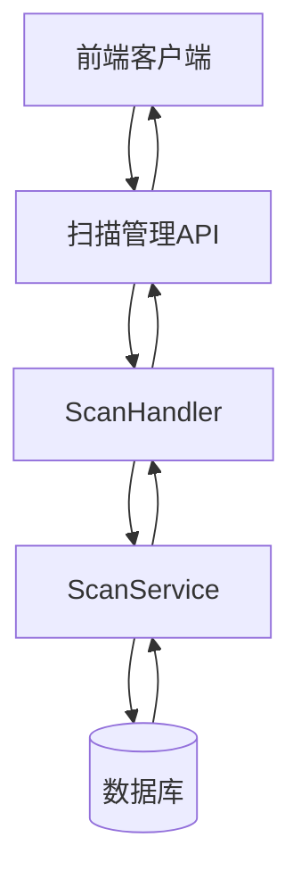
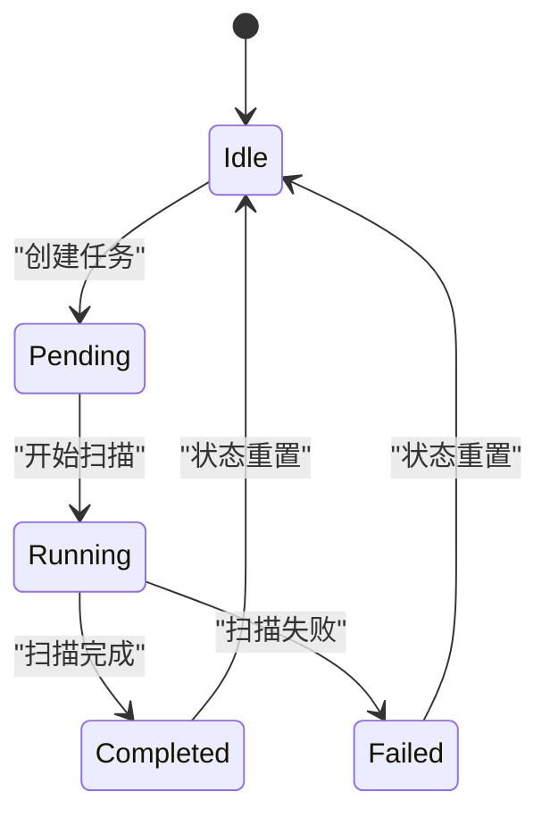
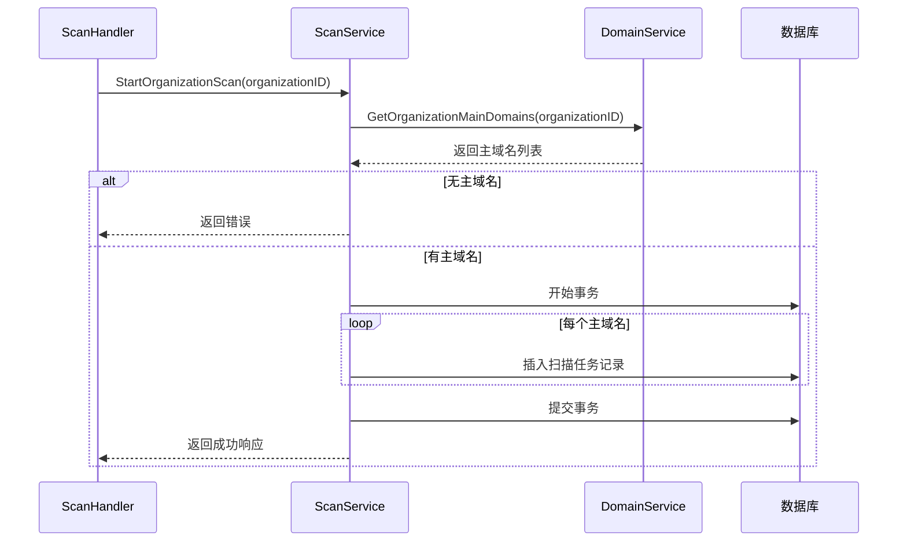
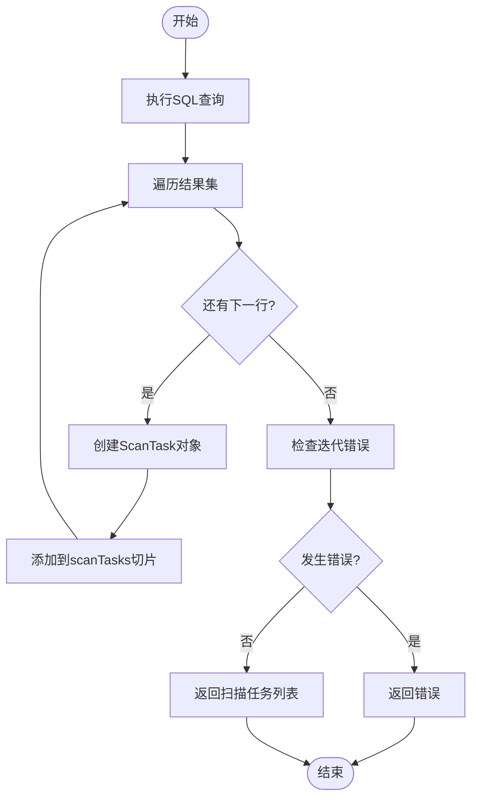

# 扫描管理API

<cite>
**本文档引用的文件**   
- [scan-handler.go](file://backend/internal/handlers/scan-handler.go#L1-L48)
- [scan-service.go](file://backend/internal/services/scan-service.go#L1-L121)
- [scan.go](file://backend/internal/models/scan.go#L1-L40)
- [routes.go](file://backend/routes/routes.go#L1-L64)
</cite>

## 目录
1. [简介](#简介)
2. [核心功能概述](#核心功能概述)
3. [API端点详解](#api端点详解)
4. [数据模型与结构](#数据模型与结构)
5. [扫描任务生命周期](#扫描任务生命周期)
6. [服务层实现分析](#服务层实现分析)
7. [前端轮询状态示例](#前端轮询状态示例)

## 简介
本技术文档详细说明了漏洞扫描系统中的扫描管理API，重点介绍组织级扫描任务的生命周期管理接口。系统通过RESTful API提供启动扫描、查询扫描历史等功能，支持异步任务处理机制。API基于Gin框架构建，采用分层架构设计，包含路由层、处理器层、服务层和数据模型层。

**Section sources**
- [routes.go](file://backend/routes/routes.go#L1-L64)

## 核心功能概述
扫描管理模块主要负责组织级别资产的扫描任务调度与状态追踪。核心功能包括：
- 启动组织扫描任务
- 查询组织扫描历史记录
- 管理扫描任务状态生命周期

系统设计遵循REST架构风格，所有API均通过HTTPS提供服务，返回统一格式的JSON响应。扫描任务采用异步执行模式，避免长时间请求阻塞。



**Diagram sources**
- [scan-handler.go](file://backend/internal/handlers/scan-handler.go#L1-L48)
- [scan-service.go](file://backend/internal/services/scan-service.go#L1-L121)

## API端点详解

### 启动组织扫描
**端点**: `POST /api/v1/scan/organizations/:id/start`  
**功能**: 为指定组织启动扫描任务

#### 请求参数
- **路径参数**:
  - `id`: 组织唯一标识符 (必填)

#### 响应结构
```json
{
  "code": 200,
  "success": true,
  "data": {
    "task_id": "string",
    "message": "string"
  }
}
```

#### 错误处理
- `400 Bad Request`: 组织ID为空或该组织无主域名可扫描
- `500 Internal Server Error`: 服务端处理失败

**Section sources**
- [scan-handler.go](file://backend/internal/handlers/scan-handler.go#L7-L24)
- [routes.go](file://backend/routes/routes.go#L55-L56)

### 获取扫描历史
**端点**: `GET /api/v1/scan/organizations/:id/history`  
**功能**: 查询指定组织的扫描历史记录

#### 请求参数
- **路径参数**:
  - `id`: 组织唯一标识符 (必填)

#### 响应结构
```json
{
  "code": 200,
  "success": true,
  "data": {
    "scan_tasks": [
      {
        "id": "string",
        "organization_id": "string",
        "main_domain_id": "string",
        "status": "string",
        "created_at": "datetime",
        "updated_at": "datetime"
      }
    ]
  }
}
```

#### 错误处理
- `400 Bad Request`: 组织ID为空
- `500 Internal Server Error`: 数据库查询失败

**Section sources**
- [scan-handler.go](file://backend/internal/handlers/scan-handler.go#L26-L48)
- [routes.go](file://backend/routes/routes.go#L57-L58)

## 数据模型与结构

### 扫描任务模型
表示单个扫描任务的实体结构。

```go
type ScanTask struct {
	ID             string    `json:"id" db:"id"`
	OrganizationID string    `json:"organization_id" db:"organization_id"`
	MainDomainID   string    `json:"main_domain_id" db:"main_domain_id"`
	Status         string    `json:"status" db:"status"`
	CreatedAt      time.Time `json:"created_at" db:"created_at"`
	UpdatedAt      time.Time `json:"updated_at" db:"updated_at"`
}
```

**字段说明**:
- **id**: 任务唯一标识
- **organization_id**: 关联组织ID
- **main_domain_id**: 主域名ID
- **status**: 任务状态（如pending, running, completed）
- **created_at**: 创建时间
- **updated_at**: 更新时间

### 响应数据模型
定义API返回的数据结构。

```go
type StartOrganizationScanResponse struct {
	TaskID  string `json:"task_id"`
	Message string `json:"message"`
}

type GetOrganizationScanHistoryResponse struct {
	ScanTasks []ScanTask `json:"scan_tasks"`
}
```

**Section sources**
- [scan.go](file://backend/internal/models/scan.go#L1-L40)

## 扫描任务生命周期



**状态流转说明**:
1. **Idle**: 初始状态
2. **Pending**: 任务已创建但尚未开始
3. **Running**: 扫描正在执行中
4. **Completed**: 扫描成功完成
5. **Failed**: 扫描过程中发生错误

当前实现中，任务状态在创建时设为"pending"，实际的扫描执行逻辑将在后续版本中实现。

**Diagram sources**
- [scan-service.go](file://backend/internal/services/scan-service.go#L45-L80)

## 服务层实现分析

### 扫描服务结构
```go
type ScanService struct {
	db *sql.DB
}
```

**Section sources**
- [scan-service.go](file://backend/internal/services/scan-service.go#L10-L13)

### 启动组织扫描流程


**关键实现细节**:
1. 使用事务确保多个扫描任务的原子性创建
2. 为每个主域名创建独立的扫描任务
3. 返回第一个任务ID作为代表性标识
4. 记录详细的日志信息用于调试

**Diagram sources**
- [scan-service.go](file://backend/internal/services/scan-service.go#L28-L80)

### 获取扫描历史实现


**性能考虑**:
- 结果按创建时间倒序排列
- 使用预编译语句防止SQL注入
- 及时关闭数据库游标释放资源

**Diagram sources**
- [scan-service.go](file://backend/internal/services/scan-service.go#L82-L121)

## 前端轮询状态示例

### 轮询机制实现
```javascript
// 扫描任务轮询服务
class ScanPollingService {
  constructor(httpClient) {
    this.httpClient = httpClient;
    this.pollingInterval = 3000; // 3秒轮询一次
    this.maxAttempts = 20;
  }

  /**
   * 启动组织扫描并轮询状态
   * @param {string} organizationId - 组织ID
   * @returns {Promise<Object>} 扫描结果
   */
  async startAndPollScan(organizationId) {
    try {
      // 1. 启动扫描
      const startResponse = await this.httpClient.post(
        `/api/v1/scan/organizations/${organizationId}/start`
      );
      
      if (!startResponse.success) {
        throw new Error(startResponse.message);
      }

      const taskId = startResponse.data.task_id;
      console.log(`扫描任务已启动，任务ID: ${taskId}`);

      // 2. 开始轮询
      return await this.pollScanStatus(organizationId, taskId);

    } catch (error) {
      console.error('启动扫描失败:', error);
      throw error;
    }
  }

  /**
   * 轮询扫描状态
   * @param {string} organizationId - 组织ID
   * @param {string} taskId - 任务ID
   * @returns {Promise<Object>} 最终状态
   */
  async pollScanStatus(organizationId, taskId) {
    let attempts = 0;
    
    const poll = async () => {
      attempts++;
      
      try {
        const response = await this.httpClient.get(
          `/api/v1/scan/organizations/${organizationId}/history`
        );

        if (!response.success) {
          throw new Error(response.message);
        }

        const task = response.data.scan_tasks.find(t => t.id === taskId);
        
        if (!task) {
          throw new Error('任务未找到');
        }

        console.log(`第${attempts}次轮询 - 当前状态: ${task.status}`);

        // 检查最终状态
        if (['completed', 'failed'].includes(task.status)) {
          return {
            status: task.status,
            task: task,
            attempts: attempts
          };
        }

        // 继续轮询
        if (attempts < this.maxAttempts) {
          return new Promise((resolve, reject) => {
            setTimeout(() => {
              poll().then(resolve).catch(reject);
            }, this.pollingInterval);
          });
        } else {
          throw new Error('轮询次数超限');
        }

      } catch (error) {
        console.error('轮询失败:', error);
        throw error;
      }
    };

    return poll();
  }
}

// 使用示例
const scanService = new ScanPollingService(axios);

// 启动扫描并获取结果
scanService.startAndPollScan('org-123')
  .then(result => {
    console.log('扫描完成:', result);
    // 更新UI显示结果
  })
  .catch(error => {
    console.error('扫描过程出错:', error);
    // 显示错误提示
  });
```

**轮询策略说明**:
- **间隔时间**: 3秒一次，避免过于频繁的请求
- **最大尝试次数**: 20次，约1分钟超时
- **状态检查**: 持续查询直到任务完成或失败
- **错误处理**: 包含网络错误和业务逻辑错误的处理

**Section sources**
- [scan-handler.go](file://backend/internal/handlers/scan-handler.go#L7-L48)
- [scan-service.go](file://backend/internal/services/scan-service.go#L28-L121)