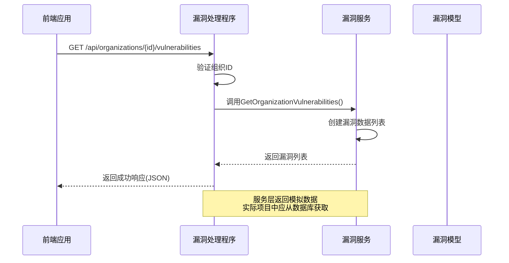
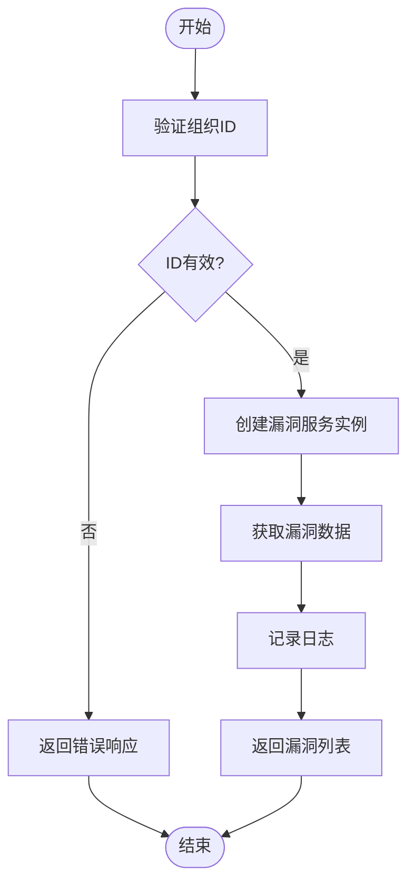
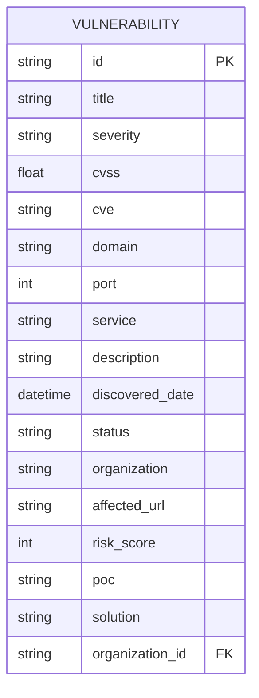
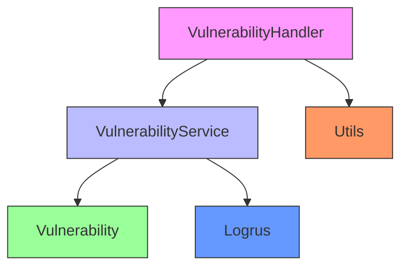

# 漏洞管理API

<cite>
**本文档引用文件**   
- [vulnerability-handler.go](file://backend/internal/handlers/vulnerability-handler.go)
- [vulnerability-service.go](file://backend/internal/services/vulnerability-service.go)
- [vulnerability.go](file://backend/internal/models/vulnerability.go)
- [organization-vulnerabilities.tsx](file://front/components/pages/assets/organizations/detail/organization-vulnerabilities.tsx)
</cite>

## 目录
1. [简介](#简介)
2. [项目结构](#项目结构)
3. [核心组件](#核心组件)
4. [架构概述](#架构概述)
5. [详细组件分析](#详细组件分析)
6. [依赖分析](#依赖分析)
7. [性能考虑](#性能考虑)
8. [故障排除指南](#故障排除指南)
9. [结论](#结论)

## 简介
本文档详细描述了漏洞管理API的设计与实现，重点介绍如何通过API接口访问和管理组织的漏洞数据。系统提供了获取漏洞列表、查看漏洞详情、更新漏洞状态等核心功能，支持按组织、域名、严重程度和状态进行过滤。后端采用Go语言和Gin框架实现，前端使用React构建用户界面。本文档将深入分析API的工作机制、数据结构和业务逻辑，为开发者和安全管理人员提供全面的技术参考。

## 项目结构
漏洞管理系统的项目结构遵循典型的前后端分离架构，后端服务位于`backend`目录，前端应用位于`front`目录。后端采用分层架构设计，包含处理程序（handlers）、服务层（services）和模型层（models），确保代码的可维护性和可扩展性。

```mermaid
graph TD
subgraph "Backend"
A[handlers]
B[services]
C[models]
D[utils]
A --> B
B --> C
A --> D
end
subgraph "Frontend"
E[components]
F[pages]
G[services]
E --> F
G --> E
end
A < --> G
```

**图示来源**
- [vulnerability-handler.go](file://backend/internal/handlers/vulnerability-handler.go)
- [vulnerability-service.go](file://backend/internal/services/vulnerability-service.go)
- [vulnerability.go](file://backend/internal/models/vulnerability.go)
- [organization-vulnerabilities.tsx](file://front/components/pages/assets/organizations/detail/organization-vulnerabilities.tsx)

**本节来源**
- [vulnerability-handler.go](file://backend/internal/handlers/vulnerability-handler.go)
- [vulnerability-service.go](file://backend/internal/services/vulnerability-service.go)

## 核心组件
漏洞管理API的核心组件包括漏洞处理程序、漏洞服务和漏洞数据模型。这些组件协同工作，实现漏洞数据的获取、处理和响应。处理程序负责接收HTTP请求并返回响应，服务层包含业务逻辑，数据模型定义了漏洞数据的结构。

**本节来源**
- [vulnerability-handler.go](file://backend/internal/handlers/vulnerability-handler.go#L1-L25)
- [vulnerability-service.go](file://backend/internal/services/vulnerability-service.go#L1-L125)
- [vulnerability.go](file://backend/internal/models/vulnerability.go#L1-L30)

## 架构概述
漏洞管理API采用典型的MVC（Model-View-Controller）架构模式，但在Go语言中更准确地描述为Handler-Service-Model分层架构。这种分层设计确保了关注点分离，提高了代码的可测试性和可维护性。



**图示来源**
- [vulnerability-handler.go](file://backend/internal/handlers/vulnerability-handler.go#L1-L25)
- [vulnerability-service.go](file://backend/internal/services/vulnerability-service.go#L1-L125)

## 详细组件分析
本节将深入分析漏洞管理API的各个关键组件，包括其功能、实现细节和相互关系。通过详细的代码分析和图表展示，帮助开发者理解系统的内部工作机制。

### 漏洞处理程序分析
漏洞处理程序是API的入口点，负责接收HTTP请求、验证参数、调用服务层方法并返回适当的响应。`GetOrganizationVulnerabilities`函数是获取组织漏洞的核心API端点。

```mermaid
classDiagram
class VulnerabilityHandler {
+GetOrganizationVulnerabilities(c *gin.Context)
}
class VulnerabilityService {
+GetOrganizationVulnerabilities(organizationID string) []Vulnerability
+NewVulnerabilityService() *VulnerabilityService
}
class Vulnerability {
+ID string
+Title string
+Severity string
+CVSS float64
+CVE string
+Domain string
+Port int
+Service string
+Description string
+DiscoveredDate time.Time
+Status string
+Organization string
+AffectedURL string
+RiskScore int
+POC string
+Solution string
+OrganizationID string
}
class Utils {
+BadRequestResponse(c *gin.Context, message string)
+InternalServerErrorResponse(c *gin.Context, message string)
+SuccessResponse(c *gin.Context, data interface{})
}
VulnerabilityHandler --> VulnerabilityService : "使用"
VulnerabilityHandler --> Utils : "使用"
VulnerabilityService --> Vulnerability : "返回"
```

**图示来源**
- [vulnerability-handler.go](file://backend/internal/handlers/vulnerability-handler.go#L1-L25)
- [vulnerability-service.go](file://backend/internal/services/vulnerability-service.go#L1-L125)
- [vulnerability.go](file://backend/internal/models/vulnerability.go#L1-L30)

**本节来源**
- [vulnerability-handler.go](file://backend/internal/handlers/vulnerability-handler.go#L1-L25)
- [vulnerability-service.go](file://backend/internal/services/vulnerability-service.go#L1-L125)

### 漏洞服务分析
漏洞服务层包含核心业务逻辑，负责处理漏洞数据的获取和操作。`VulnerabilityService`结构体提供了获取组织漏洞的方法，目前返回模拟数据，实际生产环境中应从数据库或其他数据源获取。



**图示来源**
- [vulnerability-service.go](file://backend/internal/services/vulnerability-service.go#L1-L125)

**本节来源**
- [vulnerability-service.go](file://backend/internal/services/vulnerability-service.go#L1-L125)

### 漏洞数据模型分析
漏洞数据模型定义了漏洞实体的结构和属性，是系统中数据交换的基础。`Vulnerability`结构体包含了漏洞的完整信息，包括标识、严重程度、技术细节和修复建议。



**图示来源**
- [vulnerability.go](file://backend/internal/models/vulnerability.go#L1-L30)

**本节来源**
- [vulnerability.go](file://backend/internal/models/vulnerability.go#L1-L30)

## 依赖分析
漏洞管理API的组件之间存在清晰的依赖关系，遵循单向依赖原则，即高层组件依赖于低层组件，但低层组件不依赖于高层组件。这种设计模式提高了系统的模块化程度和可测试性。



**图示来源**
- [vulnerability-handler.go](file://backend/internal/handlers/vulnerability-handler.go#L1-L25)
- [vulnerability-service.go](file://backend/internal/services/vulnerability-service.go#L1-L125)
- [vulnerability.go](file://backend/internal/models/vulnerability.go#L1-L30)

**本节来源**
- [vulnerability-handler.go](file://backend/internal/handlers/vulnerability-handler.go#L1-L25)
- [vulnerability-service.go](file://backend/internal/services/vulnerability-service.go#L1-L125)

## 性能考虑
当前实现使用模拟数据，性能表现优异，响应时间极短。然而，在生产环境中，当数据量增大时，需要考虑数据库查询优化、缓存机制和分页策略。建议实现Redis缓存来存储频繁访问的漏洞数据，并使用数据库索引优化基于组织ID、严重程度和状态的查询。

## 故障排除指南
当遇到API调用问题时，可以按照以下步骤进行排查：
1. 检查组织ID是否正确传递且不为空
2. 验证API端点URL是否正确
3. 检查后端服务日志以获取详细错误信息
4. 确认数据库连接是否正常（在生产环境中）
5. 验证前端组件是否正确处理API响应

**本节来源**
- [vulnerability-handler.go](file://backend/internal/handlers/vulnerability-handler.go#L1-L25)
- [vulnerability-service.go](file://backend/internal/services/vulnerability-service.go#L1-L125)

## 结论
漏洞管理API提供了一套完整的漏洞数据访问接口，支持按组织、严重程度和状态进行过滤。系统采用清晰的分层架构，便于维护和扩展。当前实现使用模拟数据，未来应集成实际的数据库存储。前端组件与后端API良好集成，提供了直观的用户界面来查看和管理漏洞。建议在生产环境中实现数据持久化、缓存机制和更复杂的查询功能，以满足实际安全运营需求。