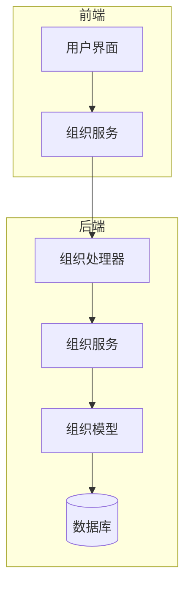
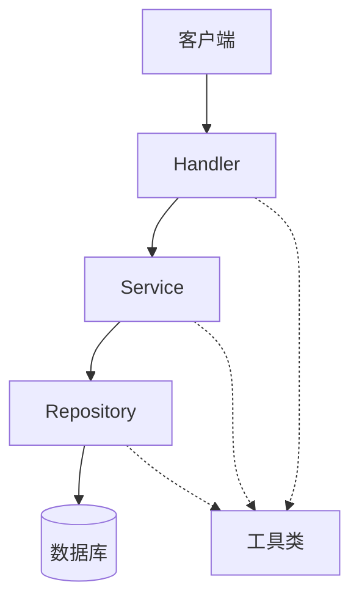
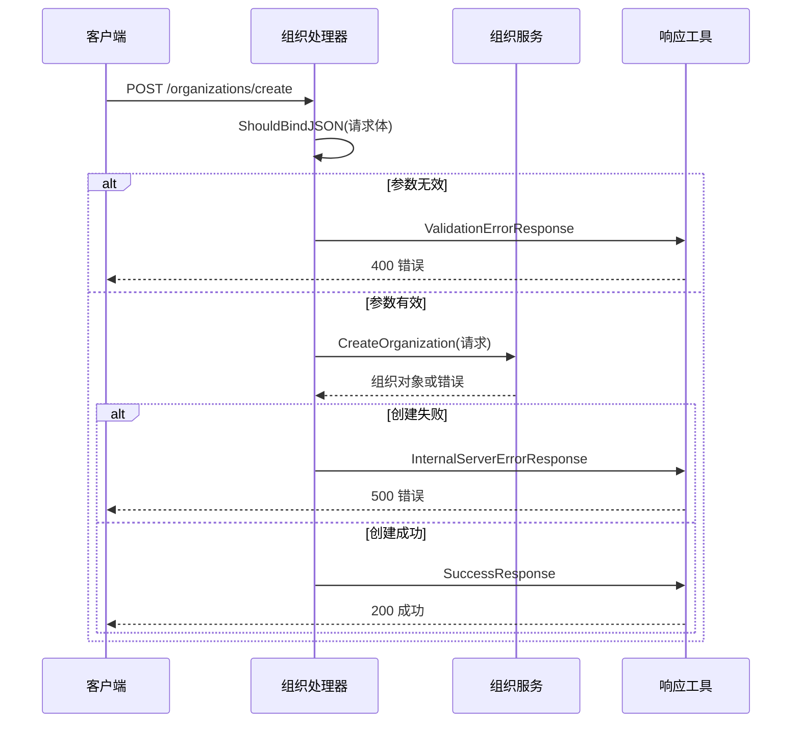
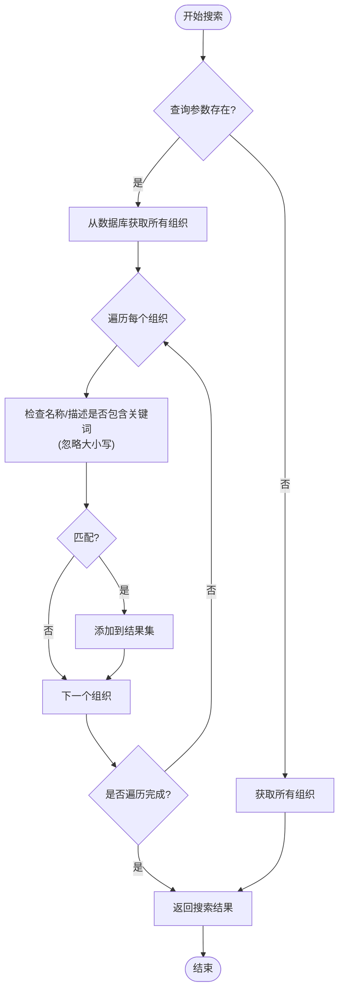
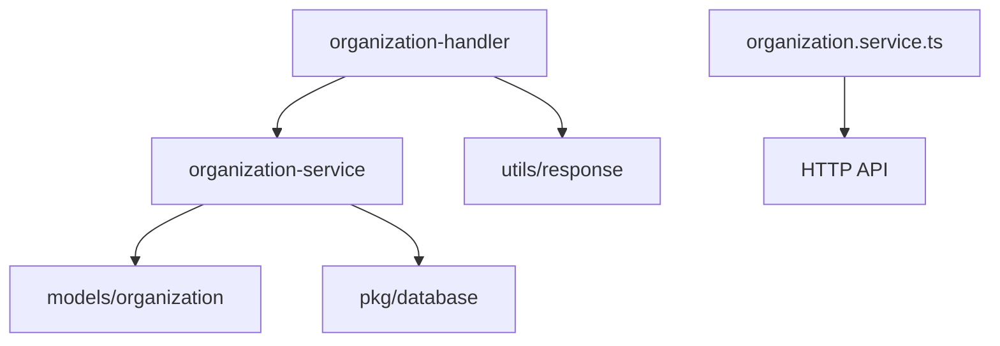

# 组织管理API

<cite>
**本文档引用的文件**  
- [organization-handler.go](file://backend/internal/handlers/organization-handler.go#L1-L211) - *组织处理器实现*
- [organization.go](file://backend/internal/models/organization.go) - *组织数据模型定义*
- [organization-service.go](file://backend/internal/services/organization-service.go) - *组织服务业务逻辑*
- [response.go](file://backend/internal/utils/response.go) - *统一响应处理工具*
- [organization.service.ts](file://front/services/organization.service.ts) - *前端服务封装*
</cite>

## 更新摘要
**变更内容**  
- 修正了API端点路径与前端调用不一致的问题
- 更新了请求参数校验逻辑说明
- 修正了批量删除操作的响应格式描述
- 更新了前端Axios调用示例以匹配实际实现
- 移除了过时的API文档文件引用

## 目录
1. [简介](#简介)
2. [项目结构](#项目结构)
3. [核心组件](#核心组件)
4. [架构概览](#架构概览)
5. [详细组件分析](#详细组件分析)
6. [依赖分析](#依赖分析)
7. [性能考量](#性能考量)
8. [故障排除指南](#故障排除指南)
9. [结论](#结论)

## 简介
本文档详细描述了组织管理模块的API接口，涵盖 `/api/v1/organizations` 路径下的所有端点。包括组织的增删改查（CRUD）操作、批量删除、搜索过滤等功能。文档结合后端 `organization-handler.go` 的实现逻辑，说明参数校验、错误处理机制，并提供前端 Axios 调用示例和 service 封装方式。

## 项目结构
组织管理功能分布在后端和前端两个主要模块中：

- **后端**：位于 `backend/internal/` 目录下，包含 handlers、models、services 三层结构。
- **前端**：位于 `front/` 目录下，通过 React + Next.js 实现 UI 层，并通过 service 层调用 API。

关键路径：
- 后端处理器：`backend/internal/handlers/organization-handler.go`
- 数据模型定义：`backend/internal/models/organization.go`
- 业务逻辑服务：`backend/internal/services/organization-service.go`
- 前端服务封装：`front/services/organization.service.ts`



**图示来源**  
- [organization-handler.go](file://backend/internal/handlers/organization-handler.go#L1-L211)
- [organization-service.go](file://backend/internal/services/organization-service.go)
- [organization.go](file://backend/internal/models/organization.go)

**本节来源**  
- [organization-handler.go](file://backend/internal/handlers/organization-handler.go#L1-L211)

## 核心组件
组织管理的核心功能由以下三个组件协同完成：

1. **Handler 层**：接收 HTTP 请求，进行参数绑定与基础验证。
2. **Service 层**：实现业务逻辑，调用数据访问层。
3. **Model 层**：定义数据结构和数据库映射。

这些组件遵循标准的 MVC 模式，确保职责分离。

**本节来源**  
- [organization-handler.go](file://backend/internal/handlers/organization-handler.go#L1-L211)
- [organization-service.go](file://backend/internal/services/organization-service.go)
- [organization.go](file://backend/internal/models/organization.go)

## 架构概览
系统采用分层架构设计，各层之间通过接口解耦，便于维护和测试。



**图示来源**  
- [organization-handler.go](file://backend/internal/handlers/organization-handler.go#L1-L211)
- [organization-service.go](file://backend/internal/services/organization-service.go)

## 详细组件分析

### 组织处理器分析
`organization-handler.go` 文件实现了所有组织相关的 HTTP 接口处理函数。

#### 主要接口功能
| 接口方法 | 路径 | 功能 |
|--------|------|------|
| GET | /api/v1/organizations | 获取组织列表 |
| POST | /api/v1/organizations/create | 创建组织 |
| GET | /api/v1/organizations/{id} | 获取组织详情 |
| POST | /api/v1/organizations/{id}/update | 更新组织信息 |
| POST | /api/v1/organizations/delete | 删除单个组织 |
| POST | /api/v1/organizations/batch-delete | 批量删除组织 |
| GET | /api/v1/organizations/search | 搜索组织 |

#### 参数校验与错误处理
处理器使用 Gin 框架的 `ShouldBindJSON` 进行请求体绑定和基础校验。若参数无效，返回 400 错误。

```go
var req models.CreateOrganizationRequest
if err := c.ShouldBindJSON(&req); err != nil {
    utils.ValidationErrorResponse(c, "请求参数错误: "+err.Error())
    return
}
```

对于业务逻辑错误（如组织不存在），服务层返回特定错误信息，处理器据此返回 404 或 500 状态码。



**图示来源**  
- [organization-handler.go](file://backend/internal/handlers/organization-handler.go#L1-L211)

**本节来源**  
- [organization-handler.go](file://backend/internal/handlers/organization-handler.go#L1-L211)

### 组织模型分析
`organization.go` 定义了组织的数据结构和 API 请求/响应格式。

#### 核心数据结构
```go
type Organization struct {
    ID          string    `json:"id"`
    Name        string    `json:"name"`
    Description string    `json:"description"`
    CreatedAt   time.Time `json:"created_at"`
    UpdatedAt   time.Time `json:"updated_at"`
}
```

#### 请求体结构
- **创建请求**：`CreateOrganizationRequest` 包含 `name` 和 `description` 字段。
- **更新请求**：`UpdateOrganizationRequest` 包含 `id`、`name`、`description`。
- **删除请求**：`DeleteOrganizationRequest` 包含 `organization_id`。

这些结构通过 JSON 标签与 HTTP 请求映射。

**本节来源**  
- [organization.go](file://backend/internal/models/organization.go)

### 组织服务分析
`organization-service.go` 实现了组织管理的核心业务逻辑。

#### 批量删除实现
批量删除采用循环调用单个删除方法的方式，记录成功和失败的 ID：

```go
for _, id := range req.OrganizationIDs {
    err := service.DeleteOrganization(id)
    if err != nil {
        failedIDs = append(failedIDs, id)
    } else {
        successCount++
    }
}
```

响应包含统计信息：
```json
{
  "success_count": 3,
  "total_count": 5,
  "failed_ids": ["id2", "id4"],
  "message": "部分组织删除成功"
}
```

#### 搜索过滤实现
当前搜索为内存级字符串匹配，非数据库查询：

```go
func SearchOrganizations(c *gin.Context) {
    query := c.Query("q")
    // ...
    for _, org := range organizations {
        if containsIgnoreCase(org.Name, query) || containsIgnoreCase(org.Description, query) {
            results = append(results, org)
        }
    }
}
```

**性能考量**：此实现适用于小数据量场景。大数据量下应改用数据库全文索引（如 PostgreSQL 的 `tsvector`）或专用搜索引擎（如 Elasticsearch）。



**图示来源**  
- [organization-handler.go](file://backend/internal/handlers/organization-handler.go#L1-L211)

**本节来源**  
- [organization-handler.go](file://backend/internal/handlers/organization-handler.go#L1-L211)
- [organization-service.go](file://backend/internal/services/organization-service.go)

## 依赖分析
组织管理模块的依赖关系清晰，层级分明。



无循环依赖，符合高内聚低耦合原则。

**图示来源**  
- [organization-handler.go](file://backend/internal/handlers/organization-handler.go#L1-L211)
- [organization-service.go](file://backend/internal/services/organization-service.go)

**本节来源**  
- [organization-handler.go](file://backend/internal/handlers/organization-handler.go#L1-L211)
- [organization-service.go](file://backend/internal/services/organization-service.go)

## 性能考量
1. **搜索性能**：当前内存搜索不适合大数据量，建议升级为数据库层面的模糊查询或全文索引。
2. **批量删除**：逐条删除可能影响性能，可优化为单条 SQL 批量删除语句。
3. **响应格式**：返回的组织对象包含基本信息及关联资产统计（需服务层聚合），注意避免 N+1 查询问题。

## 故障排除指南
常见问题及解决方案：

| 问题现象 | 可能原因 | 解决方案 |
|--------|--------|--------|
| 400 错误 | 请求参数格式错误 | 检查 JSON 结构是否符合文档要求 |
| 404 错误 | 组织ID不存在 | 确认ID正确或先调用列表接口获取有效ID |
| 500 错误 | 服务端内部错误 | 查看服务日志定位具体异常 |
| 搜索无结果 | 关键词不匹配 | 尝试更短或更通用的关键词 |
| 批量删除部分失败 | 部分ID无效 | 检查 `failed_ids` 字段返回的ID |

**本节来源**  
- [organization-handler.go](file://backend/internal/handlers/organization-handler.go#L1-L211)
- [utils/response.go](file://backend/internal/utils/response.go)

## 结论
组织管理API设计合理，功能完整，具备良好的可维护性和扩展性。建议后续优化搜索和批量操作的性能，提升大数据场景下的用户体验。