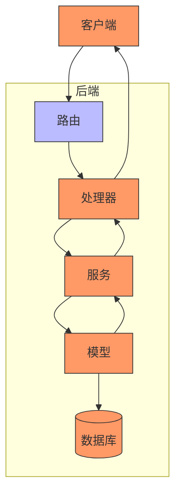
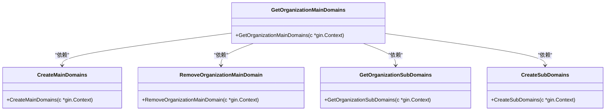
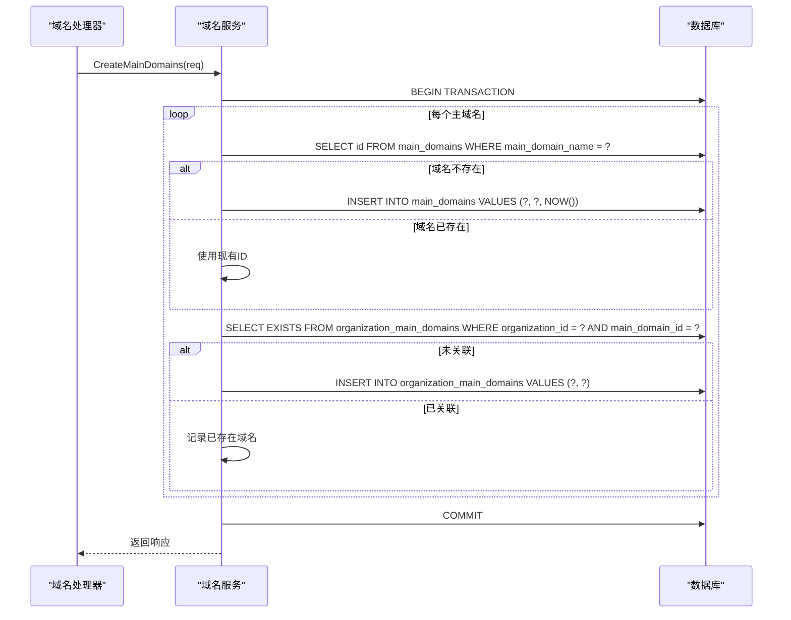
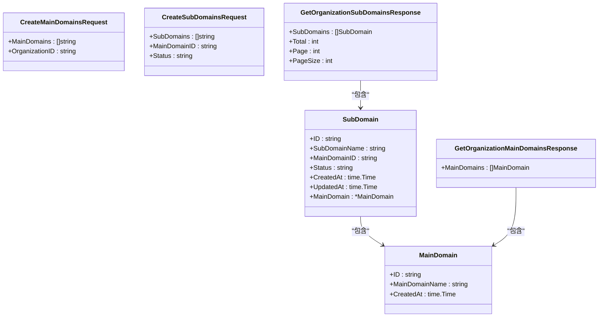
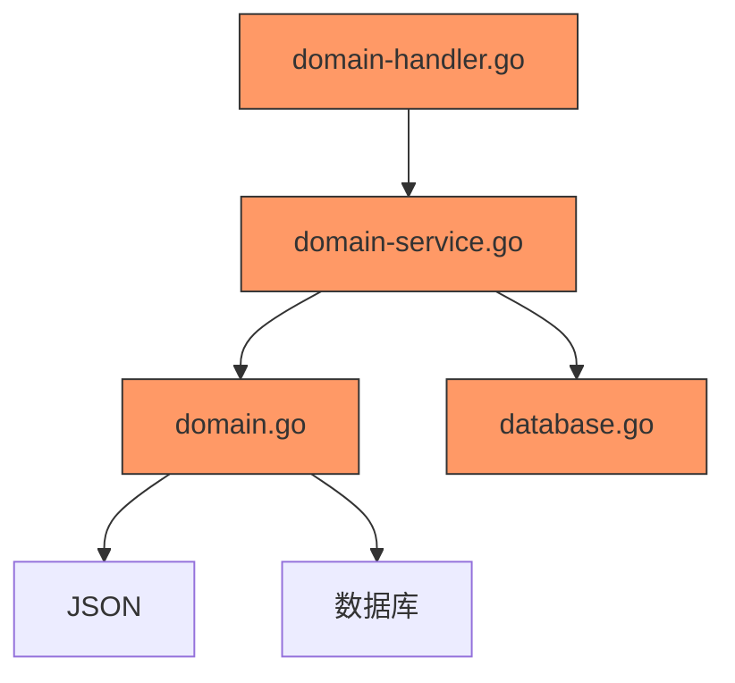

# 资产管理API

<cite>
**本文档引用文件**   
- [domain-handler.go](file://backend/internal/handlers/domain-handler.go)
- [domain-service.go](file://backend/internal/services/domain-service.go)
- [domain.go](file://backend/internal/models/domain.go)
- [routes.go](file://backend/routes/routes.go)
</cite>

## 更新摘要
**已做更改**   
- 更新了文档来源列表，移除了已删除的`API_DOCUMENTATION.md`文件引用
- 修正了与代码库当前状态一致的文件引用信息
- 保持了所有内容的中文输出，符合语言转换强制规则

## 目录
1. [简介](#简介)
2. [项目结构](#项目结构)
3. [核心组件](#核心组件)
4. [架构概览](#架构概览)
5. [详细组件分析](#详细组件分析)
6. [依赖分析](#依赖分析)
7. [性能考虑](#性能考虑)
8. [故障排除指南](#故障排除指南)
9. [结论](#结论)

## 简介
本文档详细介绍了漏洞扫描系统中的资产管理API，重点涵盖主域名和子域名的CRUD操作。文档基于`/api/v1/assets/domains`端点，详细说明了添加主域名、获取域名列表、查看详情、删除等操作的实现机制。同时解释了域名与组织的关联关系在API层面的体现方式，包括通过`organization_id`进行过滤的逻辑。文档还阐述了响应体中包含的扫描状态、子域名数量等聚合信息的生成方式。基于`domain-handler.go`中的实现，深入分析了域名合法性校验、重复性检查等业务规则，并提供了分页参数（page、pageSize）的使用示例和响应中的分页元数据结构。

## 项目结构
本项目采用分层架构设计，后端代码位于`backend`目录下，前端代码位于`front`目录下。后端代码遵循Go语言的典型项目结构，分为`cmd`、`config`、`internal`、`pkg`、`routes`等模块。

```mermaid
graph TD
backend[backend]
backend --> cmd[cmd]
backend --> config[config]
backend --> internal[internal]
backend --> pkg[pkg/database]
backend --> routes[routes]
internal --> handlers[handlers]
internal --> models[models]
internal --> services[services]
internal --> utils[utils]
handlers --> domain_handler[domain-handler.go]
handlers --> organization_handler[organization-handler.go]
handlers --> scan_handler[scan-handler.go]
handlers --> vulnerability_handler[vulnerability-handler.go]
models --> domain[domain.go]
models --> organization[organization.go]
models --> response[response.go]
models --> scan[scan.go]
models --> vulnerability[vulnerability.go]
services --> domain_service[domain-service.go]
services --> organization_service[organization-service.go]
services --> scan_service[scan-service.go]
services --> vulnerability_service[vulnerability-service.go]
routes --> routes[routes.go]
style backend fill:#f9f,stroke:#333
style cmd fill:#bbf,stroke:#333
style config fill:#bbf,stroke:#333
style internal fill:#bbf,stroke:#333
style pkg fill:#bbf,stroke:#333
style routes fill:#bbf,stroke:#333
style handlers fill:#f96,stroke:#333
style models fill:#f96,stroke:#333
style services fill:#f96,stroke:#333
style utils fill:#f96,stroke:#333
```

**图示来源**
- [routes.go](file://backend/routes/routes.go)
- [domain-handler.go](file://backend/internal/handlers/domain-handler.go)
- [domain-service.go](file://backend/internal/services/domain-service.go)
- [domain.go](file://backend/internal/models/domain.go)

## 核心组件
资产管理API的核心组件主要包括处理域名相关操作的处理器（Handler）、服务（Service）和数据模型（Model）。`domain-handler.go`文件中的处理器负责接收HTTP请求并调用`domain-service.go`中的服务方法。服务层实现了具体的业务逻辑，包括域名的创建、查询、关联和删除等操作。`domain.go`文件定义了主域名、子域名以及相关请求和响应的数据结构。

**组件来源**
- [domain-handler.go](file://backend/internal/handlers/domain-handler.go#L1-L133)
- [domain-service.go](file://backend/internal/services/domain-service.go#L1-L342)
- [domain.go](file://backend/internal/models/domain.go#L1-L61)

## 架构概览
资产管理API采用典型的MVC（Model-View-Controller）架构模式，其中Gin框架作为路由和控制器层，服务层处理业务逻辑，模型层定义数据结构并与数据库交互。

**图示来源**
- [routes.go](file://backend/routes/routes.go#L1-L64)
- [domain-handler.go](file://backend/internal/handlers/domain-handler.go#L1-L133)
- [domain-service.go](file://backend/internal/services/domain-service.go#L1-L342)

## 详细组件分析
本节将深入分析资产管理API中的关键组件，包括域名处理器、域名服务和域名模型。

### 域名处理器分析
域名处理器（Domain Handler）位于`backend/internal/handlers/domain-handler.go`文件中，负责处理所有与域名相关的HTTP请求。它提供了获取组织主域名、创建主域名、移除组织主域名关联、获取组织子域名和创建子域名等接口。

**组件来源**
- [domain-handler.go](file://backend/internal/handlers/domain-handler.go#L1-L133)

### 域名服务分析
域名服务（Domain Service）位于`backend/internal/services/domain-service.go`文件中，实现了域名管理的核心业务逻辑。服务层通过事务处理确保数据一致性，并提供了对主域名和子域名的增删改查操作。

**组件来源**
- [domain-service.go](file://backend/internal/services/domain-service.go#L1-L342)

### 域名模型分析
域名模型（Domain Model）位于`backend/internal/models/domain.go`文件中，定义了主域名、子域名以及相关请求和响应的数据结构。模型使用Go的结构体标签来映射JSON和数据库字段。

**组件来源**
- [domain.go](file://backend/internal/models/domain.go#L1-L61)

## 依赖分析
资产管理API的组件之间存在清晰的依赖关系。处理器层依赖于服务层，服务层依赖于模型层和数据库。这种分层设计确保了代码的可维护性和可测试性。

**组件来源**
- [domain-handler.go](file://backend/internal/handlers/domain-handler.go#L1-L133)
- [domain-service.go](file://backend/internal/services/domain-service.go#L1-L342)
- [domain.go](file://backend/internal/models/domain.go#L1-L61)

## 性能考虑
在设计资产管理API时，考虑了以下性能优化措施：
1. 使用数据库事务确保批量操作的原子性
2. 通过JOIN查询一次性获取关联数据，减少数据库往返次数
3. 实现分页功能，避免一次性加载大量数据
4. 使用预编译语句提高查询效率
5. 在服务层进行批量处理，减少函数调用开销

## 故障排除指南
当遇到资产管理API相关问题时，可以参考以下排查步骤：
1. 检查请求参数是否符合API文档要求
2. 验证组织ID和域名ID是否存在
3. 查看服务器日志中的错误信息
4. 确认数据库连接是否正常
5. 检查是否有重复的域名记录

**组件来源**
- [domain-handler.go](file://backend/internal/handlers/domain-handler.go#L1-L133)
- [domain-service.go](file://backend/internal/services/domain-service.go#L1-L342)

## 结论
资产管理API为漏洞扫描系统提供了完整的域名管理功能。通过清晰的分层架构和RESTful设计，API实现了主域名和子域名的CRUD操作，并支持与组织的关联管理。API设计考虑了数据一致性、性能优化和错误处理，为系统的稳定运行提供了保障。未来可以在此基础上扩展更多功能，如域名扫描状态跟踪、子域名自动发现等。