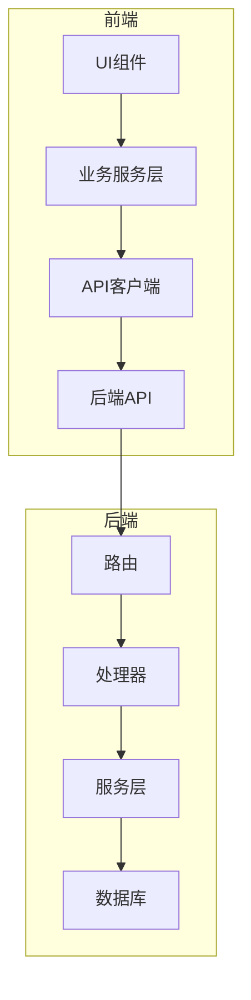
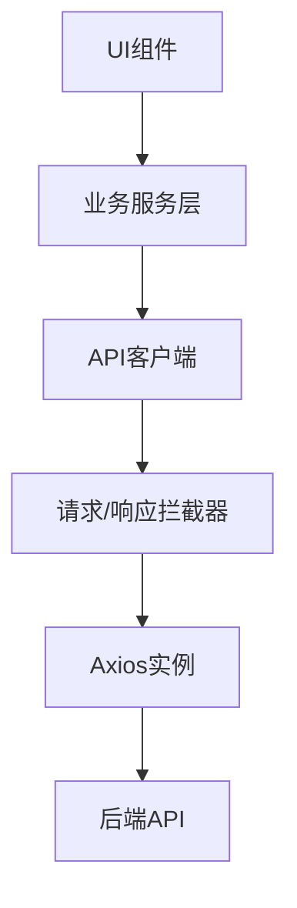
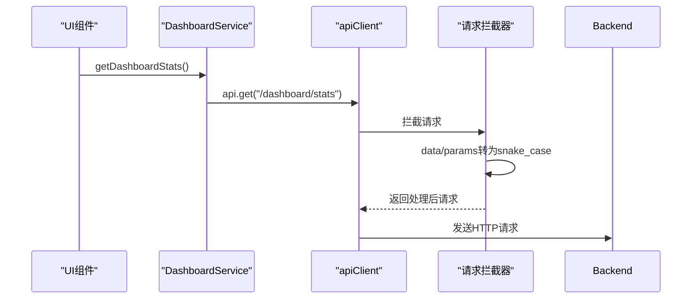
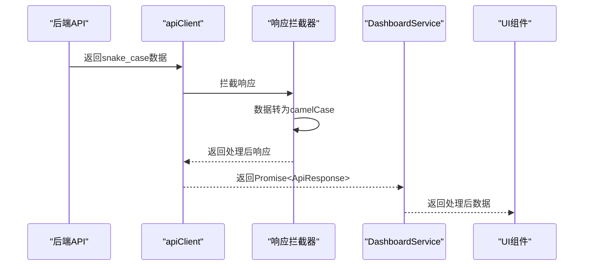
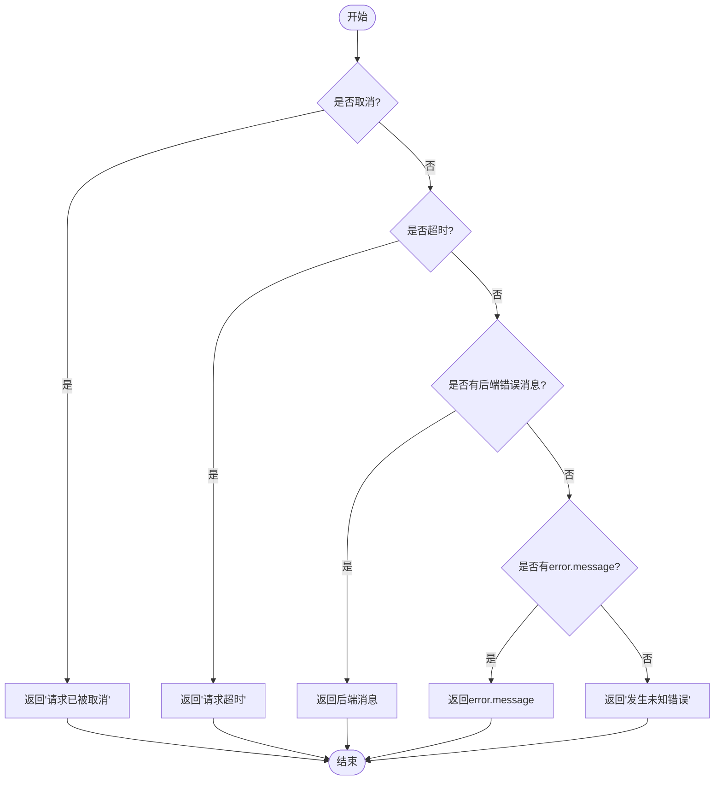
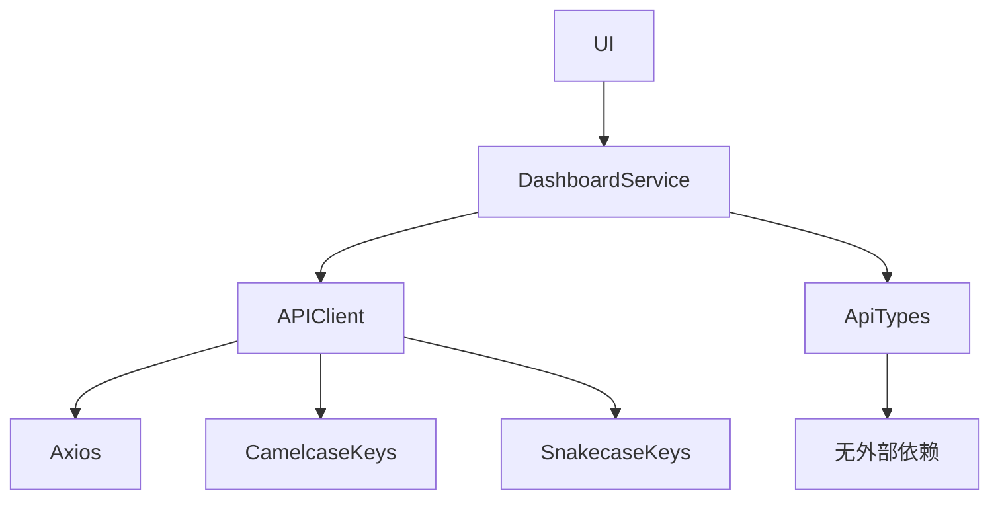

# API客户端与服务层

<cite>
**本文档引用文件**  
- [api-client.ts](file://front/lib/api-client.ts#L1-L79)
- [dashboard.service.ts](file://front/services/dashboard.service.ts#L1-L27)
- [api.types.ts](file://front/types/api.types.ts#L1-L117)
</cite>

## 目录
1. [简介](#简介)
2. [项目结构](#项目结构)
3. [核心组件](#核心组件)
4. [架构概览](#架构概览)
5. [详细组件分析](#详细组件分析)
6. [依赖关系分析](#依赖关系分析)
7. [性能考虑](#性能考虑)
8. [故障排查指南](#故障排查指南)
9. [结论](#结论)

## 简介
本项目是一个漏洞扫描系统，前后端分离架构清晰。前端使用Next.js构建，通过API与后端Go服务通信。本文档重点分析前端API客户端与业务服务层的设计与实现，涵盖请求封装、拦截器、错误处理、类型安全及模拟API集成等关键机制。

## 项目结构
项目分为`backend`和`front`两个主要目录：
- `backend`：Go语言编写的后端服务，包含路由、处理器、服务逻辑和数据库操作。
- `front`：React/Next.js前端应用，采用组件化设计，包含UI组件、页面、服务层和工具函数。

核心通信机制位于`front/lib/api-client.ts`，所有API调用通过该客户端进行统一管理。



**图示来源**  
- [api-client.ts](file://front/lib/api-client.ts#L1-L79)
- [dashboard.service.ts](file://front/services/dashboard.service.ts#L1-L27)

**中文段落来源**  
- [api-client.ts](file://front/lib/api-client.ts#L1-L79)
- [dashboard.service.ts](file://front/services/dashboard.service.ts#L1-L27)

## 核心组件
核心通信组件包括：
- `api-client.ts`：基于Axios的HTTP客户端，封装了请求/响应拦截器、超时、数据格式转换。
- `dashboard.service.ts`：业务服务类，封装仪表盘相关API调用。
- `api.types.ts`：定义所有API响应和数据类型的TypeScript接口，确保类型安全。

这些组件共同构成了前后端通信的基础设施，提供一致、可靠、类型安全的API访问方式。

**中文段落来源**  
- [api-client.ts](file://front/lib/api-client.ts#L1-L79)
- [dashboard.service.ts](file://front/services/dashboard.service.ts#L1-L27)
- [api.types.ts](file://front/types/api.types.ts#L1-L117)

## 架构概览
系统采用分层架构，前端通过API客户端与后端交互。API客户端负责底层通信细节，业务服务层负责组织具体API调用，UI层仅调用服务层方法，实现关注点分离。



**图示来源**  
- [api-client.ts](file://front/lib/api-client.ts#L1-L79)
- [dashboard.service.ts](file://front/services/dashboard.service.ts#L1-L27)

## 详细组件分析

### API客户端分析
`api-client.ts`是整个前端API通信的核心，基于Axios创建了一个配置化的实例，并通过拦截器实现了关键功能。

#### 请求拦截器
在请求发送前，将请求体和查询参数从camelCase转换为snake_case，以匹配后端Go服务的命名习惯。



**图示来源**  
- [api-client.ts](file://front/lib/api-client.ts#L15-L28)

#### 响应拦截器
在接收到响应后，将响应数据从snake_case转换为camelCase，便于前端JavaScript使用。



**图示来源**  
- [api-client.ts](file://front/lib/api-client.ts#L30-L43)

#### 错误处理
提供了统一的错误处理函数`getErrorMessage`，能够识别请求取消、超时、后端错误消息等场景。



**图示来源**  
- [api-client.ts](file://front/lib/api-client.ts#L60-L75)

**中文段落来源**  
- [api-client.ts](file://front/lib/api-client.ts#L1-L79)

### 业务服务层分析
`dashboard.service.ts`展示了如何组织业务API调用，提供类型安全的接口。

#### 类型定义
`api.types.ts`中定义了通用响应结构`ApiResponse<T>`和分页响应`PaginatedResponse<T>`，确保所有API返回格式一致。

```mermaid
classDiagram
class ApiResponse~T~ {
+success : boolean
+message : string
+data? : T
+error? : string
+timestamp? : string
}
class PaginatedResponse~T~ {
+data : T[]
+pagination : Pagination
}
class Pagination {
+page : number
+limit : number
+total : number
+totalPages : number
+hasNext : boolean
+hasPrev : boolean
}
class DashboardStats {
+totalOrganizations : number
+totalDomains : number
+totalSubdomains : number
+activeScanTasks : number
+securityAlerts : number
+organizationGrowth : number
+domainGrowth : number
+subdomainGrowth : number
+alertGrowth : number
}
ApiResponse~DashboardStats~ --> DashboardStats : "泛型约束"
ApiResponse~PaginatedResponse~ScanTask~~ --> PaginatedResponse~ScanTask~
PaginatedResponse~ScanTask~ --> ScanTask
```

**图示来源**  
- [api.types.ts](file://front/types/api.types.ts#L1-L117)

#### 服务方法
`DashboardService`使用静态方法封装API调用，简化调用方使用。

```typescript
// 示例：获取仪表盘统计数据
const response = await DashboardService.getDashboardStats();
if (response.success) {
  console.log(response.data.totalOrganizations);
}
```

**中文段落来源**  
- [dashboard.service.ts](file://front/services/dashboard.service.ts#L1-L27)
- [api.types.ts](file://front/types/api.types.ts#L1-L117)

## 依赖关系分析
前端模块间依赖清晰：
- UI组件依赖业务服务层
- 业务服务层依赖API客户端
- API客户端依赖Axios和转换库（camelcase-keys, snakecase-keys）
- 所有服务层依赖类型定义文件



**图示来源**  
- [api-client.ts](file://front/lib/api-client.ts#L1-L79)
- [dashboard.service.ts](file://front/services/dashboard.service.ts#L1-L27)
- [api.types.ts](file://front/types/api.types.ts#L1-L117)

## 性能考虑
- **超时设置**：30秒超时避免请求长时间挂起。
- **数据转换**：拦截器中进行数据格式转换，避免在业务逻辑中处理。
- **类型安全**：使用TypeScript接口减少运行时错误，提高开发效率。
- **静态方法**：服务类使用静态方法，避免实例化开销。

## 故障排查指南
常见问题及解决方案：
- **请求超时**：检查网络连接或后端性能，可适当增加超时时间。
- **字段名不匹配**：确认拦截器是否正常工作，检查前后端命名约定。
- **类型错误**：更新`api.types.ts`以匹配最新API响应。
- **CORS错误**：确保后端正确配置CORS中间件。

**中文段落来源**  
- [api-client.ts](file://front/lib/api-client.ts#L1-L79)

## 结论
该项目的API客户端与服务层设计良好，通过Axios拦截器实现了请求/响应的自动格式转换，提供了统一的错误处理机制，并通过TypeScript确保了类型安全。业务服务层抽象了API调用细节，使UI层可以专注于用户交互。整体架构清晰，易于维护和扩展。