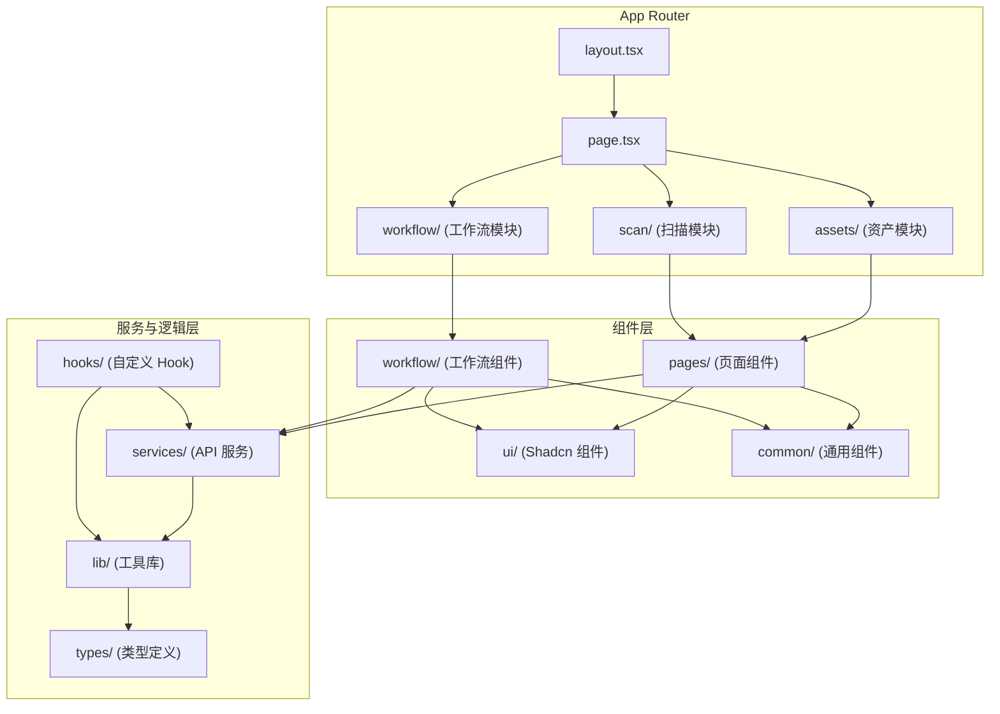
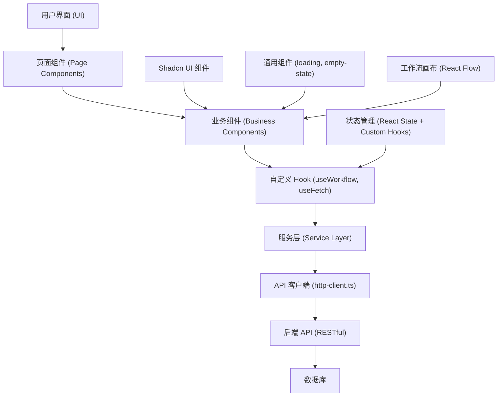
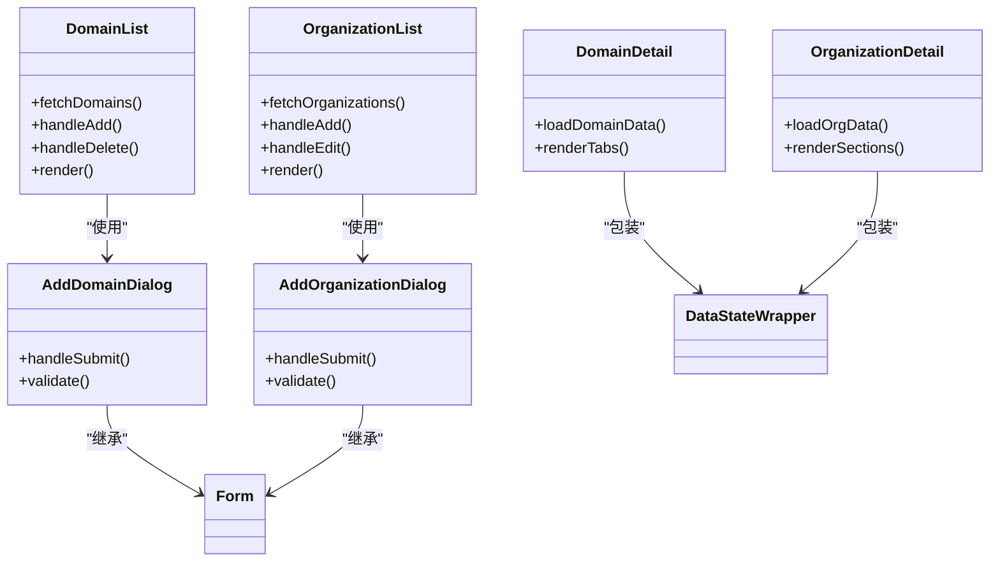
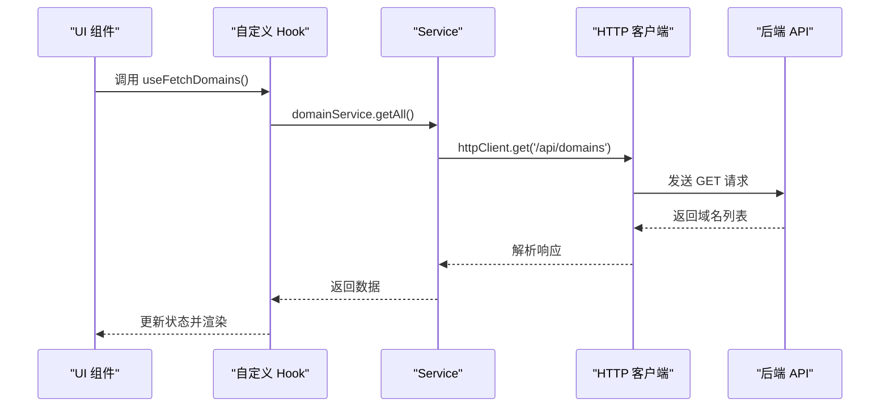
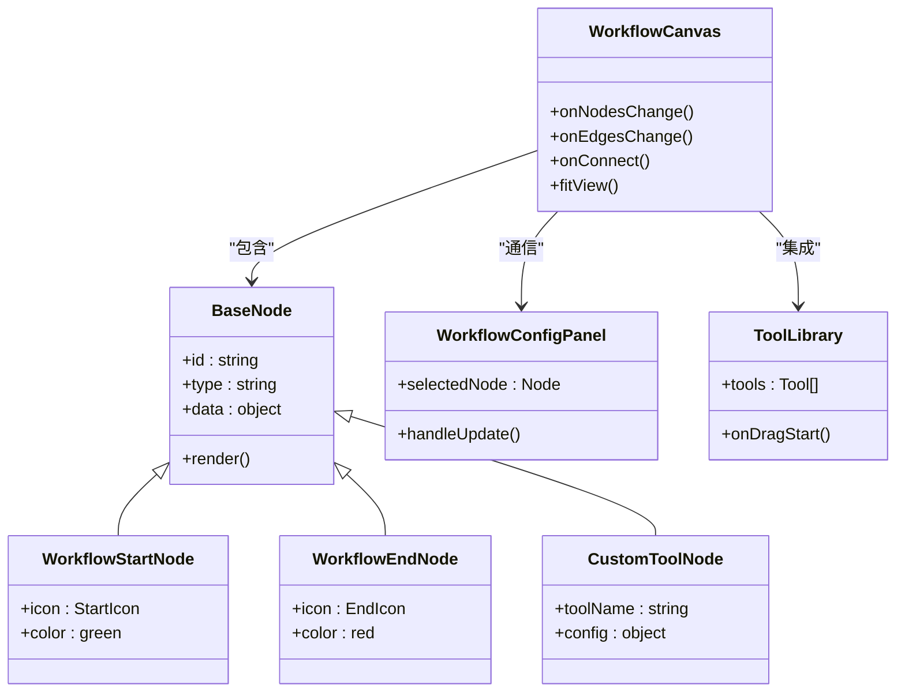
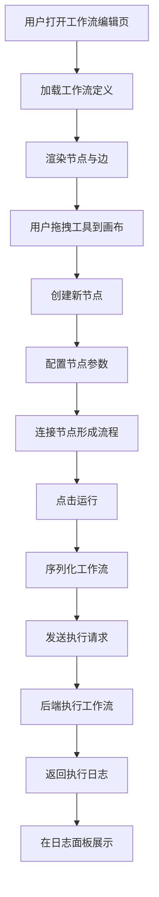
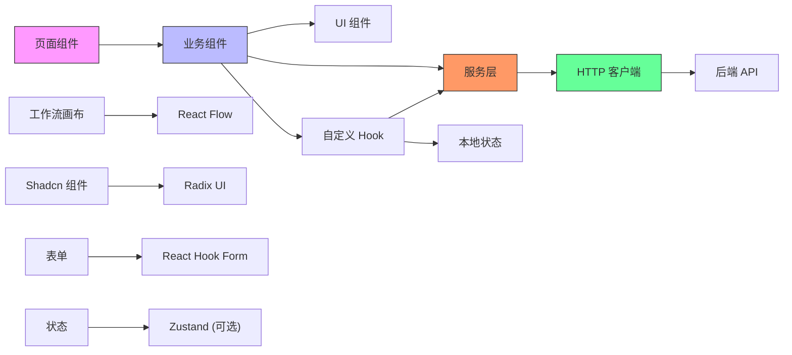

# 前端架构

<cite>
**本文档引用的文件**  
- [page.tsx](file://front/app/page.tsx)
- [app-layout.tsx](file://front/components/layout/app-layout.tsx)
- [dashboard.tsx](file://front/components/pages/dashboard/dashboard.tsx)
- [layout.tsx](file://front/app/layout.tsx)
- [domain.service.ts](file://front/services/domain.service.ts)
- [organization.service.ts](file://front/services/organization.service.ts)
- [workflow-api.ts](file://front/services/workflow/workflow-api.ts)
- [use-workflow.ts](file://front/hooks/workflow/use-workflow.ts)
- [workflow-canvas.tsx](file://front/components/workflow/canvas/workflow-canvas.tsx)
- [base-node.tsx](file://front/components/workflow/nodes/_base/base-node.tsx)
- [http-client.ts](file://front/lib/http-client.ts)
- [types.ts](file://front/lib/workflow/types.ts)
- [constants.ts](file://front/lib/workflow/constants.ts)
- [api.types.ts](file://front/types/api.types.ts)
- [workflow.types.ts](file://front/types/workflow.types.ts)
- [domain-list.tsx](file://front/components/pages/assets/domains/domain-list.tsx)
- [organization-list.tsx](file://front/components/pages/assets/organizations/organization-list.tsx)
- [domain-detail.tsx](file://front/components/pages/assets/domains/domain-detail.tsx)
- [organization-detail.tsx](file://front/components/pages/assets/organizations/organization-detail.tsx)
- [add-domain-dialog.tsx](file://front/components/pages/assets/domains/add-domain-dialog.tsx)
- [add-organization-dialog.tsx](file://front/components/pages/assets/organizations/add-organization-dialog.tsx)
- [workflow-config-panel.tsx](file://front/components/workflow/panels/workflow-config-panel.tsx)
- [workflow-log-panel.tsx](file://front/components/workflow/panels/workflow-log-panel.tsx)
- [tool-library.tsx](file://front/components/workflow/toolbar/tool-library.tsx)
- [loading.tsx](file://front/components/common/loading.tsx)
- [data-state-wrapper.tsx](file://front/components/common/data-state-wrapper.tsx)
</cite>

## 目录
1. [项目结构](#项目结构)  
2. [核心组件](#核心组件)  
3. [架构概览](#架构概览)  
4. [详细组件分析](#详细组件分析)  
5. [依赖关系分析](#依赖关系分析)  
6. [性能考量](#性能考量)  
7. [故障排查指南](#故障排查指南)  
8. [结论](#结论)

## 项目结构

项目采用基于 Next.js 的 App Router 架构，整体结构清晰，按功能模块组织。前端代码位于 `front` 目录下，遵循分层设计原则，包含页面、组件、服务、工具库等。

主要目录结构如下：
- `app/`：Next.js 应用路由入口，包含页面和布局组件
- `components/`：UI 组件库，分为通用组件、页面级组件、Shadcn UI 组件及工作流专用组件
- `services/`：API 服务层，封装与后端交互的业务逻辑
- `hooks/`：自定义 Hook，用于状态逻辑复用
- `lib/`：工具函数、HTTP 客户端、常量等共享逻辑
- `types/`：全局类型定义
- `mocks/`：MSW 模拟数据配置

**图示来源**  
- [layout.tsx](file://front/app/layout.tsx)
- [page.tsx](file://front/app/page.tsx)
- [components](file://front/components)
- [services](file://front/services)
- [lib](file://front/lib)
- [hooks](file://front/hooks)

**本节来源**  
- [front/app](file://front/app)
- [front/components](file://front/components)

## 核心组件

系统核心组件围绕资产（域名、组织）管理和安全工作流构建，采用组件化设计，职责清晰。

### 页面组件
- `assets/organizations/[id]/page.tsx`：组织详情页，展示组织信息、子域名、漏洞历史
- `assets/domains/[id]/page.tsx`：域名详情页，展示域名扫描结果
- `workflow/components/page.tsx`：工作流画布页面，集成 React Flow 实现可视化编排

### 业务组件
- `domain-list.tsx`：域名列表组件，支持分页、搜索、批量操作
- `organization-list.tsx`：组织列表组件，展示组织元数据及统计信息
- `organization-detail.tsx`：组织详情组件，包含多个子模块（概览、子域名、漏洞、扫描历史）

### 工作流组件
- `workflow-canvas.tsx`：基于 React Flow 的画布组件，支持节点拖拽、连接、编辑
- `base-node.tsx`：节点基类，定义通用节点样式与交互逻辑
- `workflow-config-panel.tsx`：右侧配置面板，用于编辑节点参数
- `workflow-log-panel.tsx`：日志面板，展示工作流执行过程

**本节来源**  
- [domain-list.tsx](file://front/components/pages/assets/domains/domain-list.tsx)
- [organization-list.tsx](file://front/components/pages/assets/organizations/organization-list.tsx)
- [organization-detail.tsx](file://front/components/pages/assets/organizations/organization-detail.tsx)
- [workflow-canvas.tsx](file://front/components/workflow/canvas/workflow-canvas.tsx)
- [base-node.tsx](file://front/components/workflow/nodes/_base/base-node.tsx)
- [workflow-config-panel.tsx](file://front/components/workflow/panels/workflow-config-panel.tsx)

## 架构概览

系统采用分层架构，从前端到后端形成清晰的数据流与职责划分。

**图示来源**  
- [page.tsx](file://front/app/page.tsx)
- [use-workflow.ts](file://front/hooks/workflow/use-workflow.ts)
- [http-client.ts](file://front/lib/http-client.ts)
- [domain.service.ts](file://front/services/domain.service.ts)

**本节来源**  
- [front/app](file://front/app)
- [front/hooks](file://front/hooks)
- [front/lib](file://front/lib)
- [front/services](file://front/services)

## 详细组件分析

### 资产管理模块分析

资产管理模块包含域名与组织两大实体，采用相似的组件结构。

#### 组件结构

**图示来源**  
- [domain-list.tsx](file://front/components/pages/assets/domains/domain-list.tsx)
- [add-domain-dialog.tsx](file://front/components/pages/assets/domains/add-domain-dialog.tsx)
- [domain-detail.tsx](file://front/components/pages/assets/domains/domain-detail.tsx)
- [data-state-wrapper.tsx](file://front/components/common/data-state-wrapper.tsx)

#### 数据流分析

**图示来源**  
- [domain.service.ts](file://front/services/domain.service.ts)
- [http-client.ts](file://front/lib/http-client.ts)
- [use-workflow.ts](file://front/hooks/workflow/use-workflow.ts)

### 工作流模块分析

工作流模块是系统核心功能，基于 React Flow 实现可视化安全流程编排。

#### 组件结构

**图示来源**  
- [workflow-canvas.tsx](file://front/components/workflow/canvas/workflow-canvas.tsx)
- [base-node.tsx](file://front/components/workflow/nodes/_base/base-node.tsx)
- [workflow-config-panel.tsx](file://front/components/workflow/panels/workflow-config-panel.tsx)
- [tool-library.tsx](file://front/components/workflow/toolbar/tool-library.tsx)

#### 工作流执行流程

**图示来源**  
- [workflow-canvas.tsx](file://front/components/workflow/canvas/workflow-canvas.tsx)
- [use-workflow.ts](file://front/hooks/workflow/use-workflow.ts)
- [workflow-api.ts](file://front/services/workflow/workflow-api.ts)

**本节来源**  
- [workflow-canvas.tsx](file://front/components/workflow/canvas/workflow-canvas.tsx)
- [base-node.tsx](file://front/components/workflow/nodes/_base/base-node.tsx)
- [use-workflow.ts](file://front/hooks/workflow/use-workflow.ts)
- [workflow-api.ts](file://front/services/workflow/workflow-api.ts)

## 依赖关系分析

系统依赖关系清晰，各层之间通过接口或 Hook 进行通信，耦合度低。

**图示来源**  
- [package.json](file://front/package.json)
- [domain.service.ts](file://front/services/domain.service.ts)
- [http-client.ts](file://front/lib/http-client.ts)
- [use-workflow.ts](file://front/hooks/workflow/use-workflow.ts)

**本节来源**  
- [package.json](file://front/package.json)
- [services](file://front/services)
- [lib](file://front/lib)
- [hooks](file://front/hooks)

## 性能考量

### 数据加载优化
- 采用懒加载（`next/dynamic`）加载仪表板等重型组件
- 使用 `Suspense` 包裹异步组件，提供加载状态
- 服务层封装分页、缓存逻辑，避免重复请求

### 组件渲染优化
- 使用 `React.memo` 优化高频更新组件
- 工作流画布采用虚拟滚动或分片渲染处理大规模节点
- 列表组件使用 `table-pagination.tsx` 实现分页加载

### 网络请求优化
- `http-client.ts` 封装统一的请求拦截、错误处理、重试机制
- 服务层方法支持缓存策略，减少不必要的 API 调用
- 批量操作采用合并请求，降低网络开销

## 故障排查指南

### 常见问题
1. **页面空白**：检查 `layout.tsx` 是否正确包裹子组件，确认 `AppLayout` 初始化正常
2. **数据未加载**：查看浏览器控制台网络请求，确认 API 地址与认证信息正确
3. **工作流节点不显示**：检查节点类型注册是否完整，确保 `node-factory.ts` 包含对应类型
4. **表单提交失败**：验证 `Form` 组件与 `zod` 模式是否匹配，检查字段名称一致性

### 调试建议
- 使用 `console.log` 在 `use-workflow.ts` 中跟踪状态变化
- 在 `http-client.ts` 中添加请求/响应日志
- 利用 React DevTools 检查组件状态与属性
- 启用 MSW 模拟服务（`msw-provider.tsx`）进行离线测试

**本节来源**  
- [http-client.ts](file://front/lib/http-client.ts)
- [use-workflow.ts](file://front/hooks/workflow/use-workflow.ts)
- [msw-provider.tsx](file://front/components/msw-provider.tsx)

## 结论

该前端架构采用 Next.js App Router 与组件化设计，结构清晰、可维护性强。通过分层架构将 UI、业务逻辑、数据服务分离，结合自定义 Hook 实现状态逻辑复用。基于 Shadcn 的 UI 组件库保证了视觉一致性，而 React Flow 的集成则实现了复杂的工作流可视化编排。整体设计遵循现代前端最佳实践，具备良好的扩展性与可测试性，为安全扫描系统的持续迭代奠定了坚实基础。