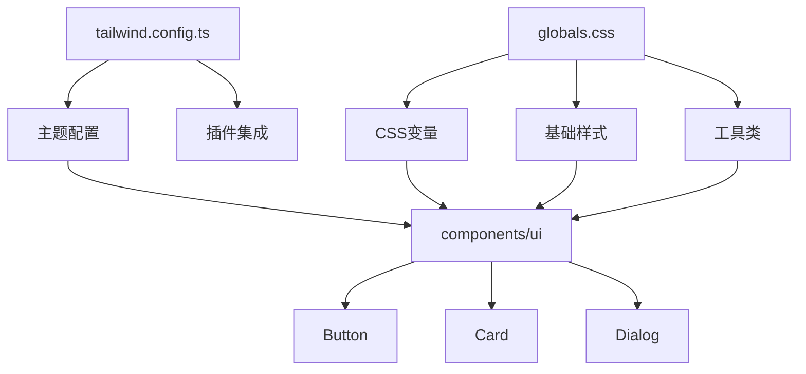
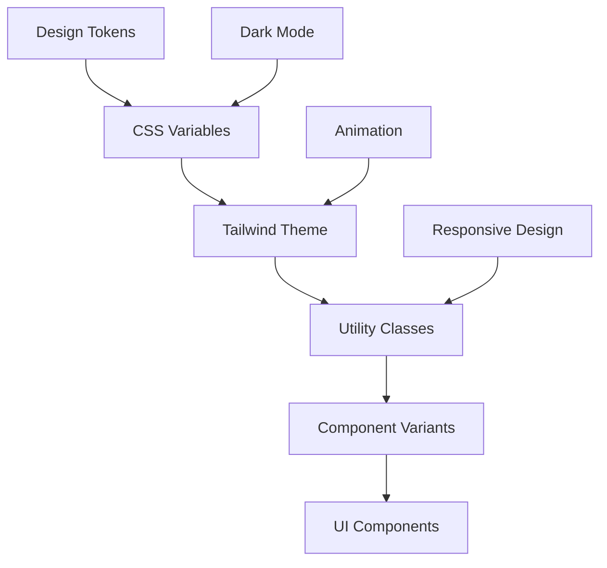
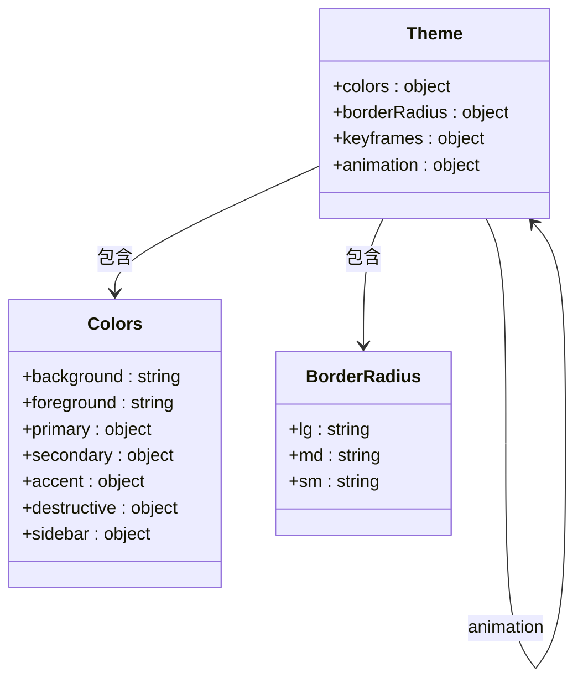
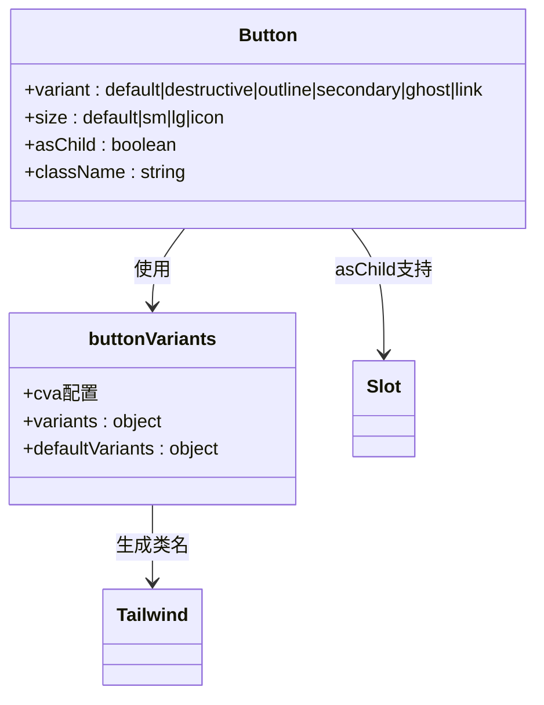

# 样式系统

<cite>
**本文档中引用的文件**  
- [tailwind.config.ts](file://front/tailwind.config.ts)
- [globals.css](file://front/app/globals.css)
- [button.tsx](file://front/components/ui/button.tsx)
- [components.json](file://front/components.json)
</cite>

## 目录
1. [简介](#简介)
2. [项目结构](#项目结构)
3. [核心组件](#核心组件)
4. [架构概览](#架构概览)
5. [详细组件分析](#详细组件分析)
6. [依赖分析](#依赖分析)
7. [性能考虑](#性能考虑)
8. [故障排除指南](#故障排除指南)
9. [结论](#结论)

## 简介
本文档全面介绍了基于 Tailwind CSS 和 Shadcn UI 的前端样式系统。重点阐述了 `tailwind.config.ts` 中的主题配置、插件扩展机制、自定义样式变量定义，以及 `globals.css` 中的全局重置与类复用策略。同时分析了组件级别的样式覆盖机制、暗色模式实现原理和响应式设计实践。

## 项目结构
前端样式系统主要由以下几个核心文件构成：
- `tailwind.config.ts`：Tailwind 主配置文件，定义主题、颜色、动画等
- `app/globals.css`：全局样式表，包含 CSS 变量、基础样式重置和图层定义
- `components/ui/`：Shadcn UI 组件库，封装可复用的 UI 组件
- `components.json`：Shadcn UI 配置文件，指定样式相关路径

该结构遵循现代 React + Tailwind 最佳实践，实现了样式配置与组件实现的分离，便于维护和扩展。



**Diagram sources**
- [tailwind.config.ts](file://front/tailwind.config.ts#L1-L97)
- [globals.css](file://front/app/globals.css#L1-L140)
- [components.json](file://front/components.json#L1-L20)

## 核心组件
样式系统的核心是 Tailwind CSS 与 Shadcn UI 的深度集成。通过 `tailwind.config.ts` 定义设计系统变量，`globals.css` 实现主题切换逻辑，`class-variance-authority` (CVA) 在组件中创建可变体的样式系统。

**Section sources**
- [tailwind.config.ts](file://front/tailwind.config.ts#L1-L97)
- [globals.css](file://front/app/globals.css#L1-L140)

## 架构概览
整个样式系统采用分层架构设计，从底层到顶层分别为：



**Diagram sources**
- [tailwind.config.ts](file://front/tailwind.config.ts#L1-L97)
- [globals.css](file://front/app/globals.css#L1-L140)

## 详细组件分析

### 主题配置分析
`tailwind.config.ts` 文件定义了完整的主题系统，包括颜色、圆角、动画等设计令牌。



**Diagram sources**
- [tailwind.config.ts](file://front/tailwind.config.ts#L15-L95)

**Section sources**
- [tailwind.config.ts](file://front/tailwind.config.ts#L1-L97)

### 全局样式分析
`globals.css` 文件通过 CSS 自定义属性实现了主题系统，并包含全局样式重置。

```mermaid
flowchart TD
A[:root] --> B[定义明色主题变量]
C[.dark] --> D[定义暗色主题变量]
E[@layer base] --> F[全局边框颜色]
E --> G[禁用焦点环]
E --> H[禁用ring效果]
I[@layer utilities] --> J[定义text-balance]
K[body] --> L[隐藏滚动条]
```

**Diagram sources**
- [globals.css](file://front/app/globals.css#L1-L140)

**Section sources**
- [globals.css](file://front/app/globals.css#L1-L140)

### 按钮组件分析
以 `button.tsx` 为例，展示了 Shadcn UI 组件如何利用 `class-variance-authority` 实现样式变体系统。



**Diagram sources**
- [button.tsx](file://front/components/ui/button.tsx#L1-L57)

**Section sources**
- [button.tsx](file://front/components/ui/button.tsx#L1-L57)

## 依赖分析
样式系统依赖关系清晰，各层之间耦合度低。

```mermaid
graph LR
A[tailwindcss] --> B[tailwindcss-animate]
C[class-variance-authority] --> D[Button组件]
E[clsx] --> F[Button组件]
G[@radix-ui/react-slot] --> H[Button组件]
I[components.json] --> J[Tailwind配置]
I --> K[全局CSS]
```

**Diagram sources**
- [tailwind.config.ts](file://front/tailwind.config.ts#L1-L97)
- [button.tsx](file://front/components/ui/button.tsx#L1-L57)
- [components.json](file://front/components.json#L1-L20)

## 性能考虑
1. **CSS 体积优化**：通过 `content` 配置精确指定扫描路径，避免生成未使用的工具类
2. **焦点环优化**：全局禁用默认焦点环，减少不必要的样式渲染
3. **滚动条优化**：使用 `::-webkit-scrollbar` 隐藏滚动条但保留滚动功能
4. **变量复用**：通过 CSS 变量实现主题颜色的集中管理，减少重复代码

## 故障排除指南
### 主题不生效
检查 `components.json` 中的 `tailwind.css` 配置是否正确指向 `app/globals.css`

### 暗色模式无法切换
确保根元素可以添加 `.dark` 类，检查 `darkMode: ["class"]` 配置

### 按钮样式异常
检查 `buttonVariants` 的 `cva` 配置是否正确引用了主题颜色变量

### 动画不显示
确认 `tailwindcss-animate` 插件已正确安装并添加到 `plugins` 数组中

**Section sources**
- [tailwind.config.ts](file://front/tailwind.config.ts#L1-L97)
- [globals.css](file://front/app/globals.css#L1-L140)
- [components.json](file://front/components.json#L1-L20)

## 结论
本项目采用 Tailwind CSS + Shadcn UI 的现代化样式方案，通过 CSS 变量实现主题系统，利用 `class-variance-authority` 创建可维护的组件变体，结合全局样式重置确保一致的用户体验。该方案具有高可维护性、良好的性能表现和优秀的开发体验，适合中大型前端项目。