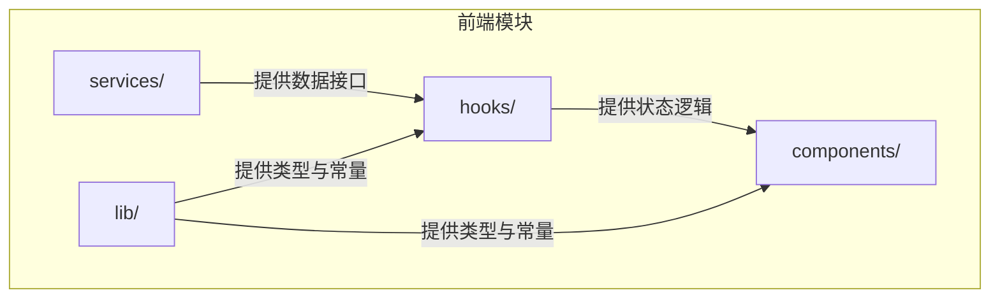
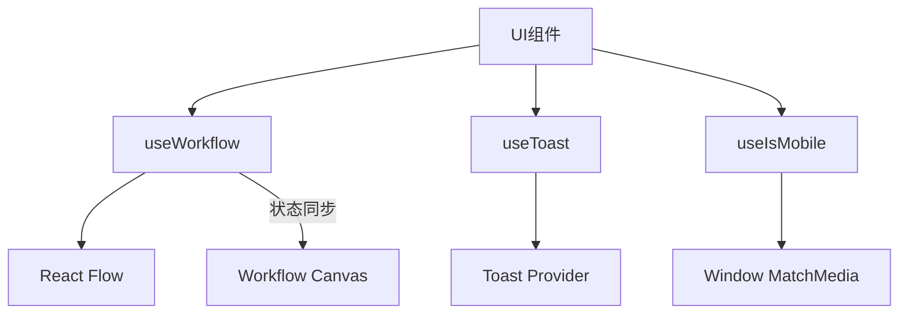
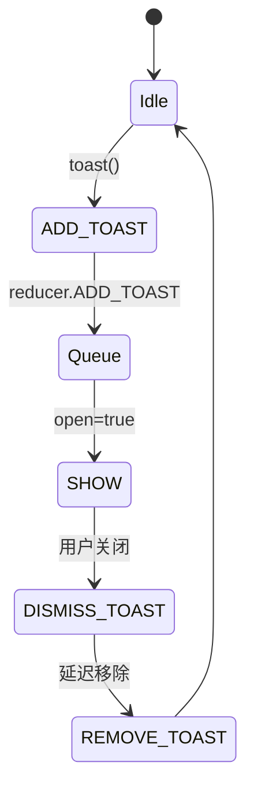
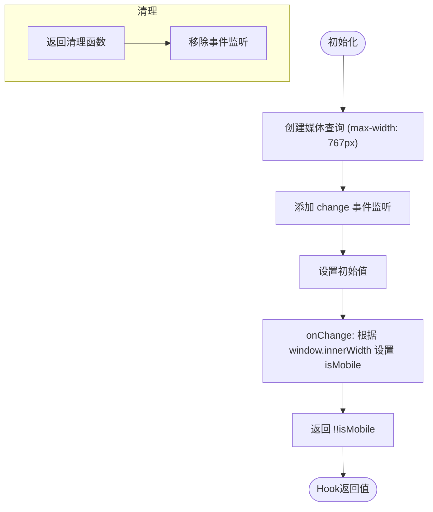
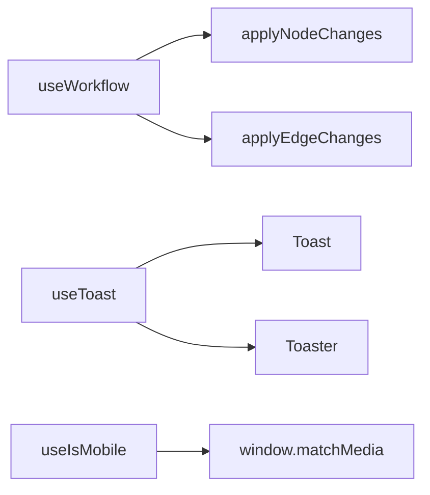

# 状态管理

<cite>
**本文档引用的文件**  
- [use-workflow.ts](file://front/components/canvas/hooks/use-workflow.ts)
- [use-mobile.tsx](file://front/hooks/use-mobile.tsx)
- [use-toast.ts](file://front/hooks/use-toast.ts)
- [workflow.types.ts](file://front/components/workflow/lib/workflow.types.ts)
- [canvas-workflow-editor.tsx](file://front/components/canvas/core/canvas-workflow-editor.tsx)
- [canvas.tsx](file://front/components/canvas/core/canvas.tsx)
</cite>

## 目录
1. [简介](#简介)
2. [项目结构](#项目结构)
3. [核心组件](#核心组件)
4. [架构概览](#架构概览)
5. [详细组件分析](#详细组件分析)
6. [依赖分析](#依赖分析)
7. [性能考虑](#性能考虑)
8. [故障排除指南](#故障排除指南)
9. [结论](#结论)

## 简介
本文档深入探讨了前端应用中基于自定义Hook的状态管理机制，重点分析了`useWorkflow`等核心Hook如何封装复杂的工作流画布状态（包括节点、边、执行日志）与交互逻辑。文档详细阐述了React状态提升、Context使用以及与React Flow状态同步的实现方式，并结合`use-mobile.tsx`和`use-toast.ts`等通用Hook，说明状态抽象与复用的设计模式。同时提供错误处理、副作用管理及性能优化建议。

## 项目结构
项目采用分层与功能混合的组织方式，前端部分（`front`）包含应用逻辑、组件、Hook、服务等模块。状态管理相关代码主要分布在`hooks`和`components/canvas/hooks`目录中，通过自定义Hook实现跨组件状态共享。



**图示来源**  
- [use-workflow.ts](file://front/components/canvas/hooks/use-workflow.ts)
- [use-mobile.tsx](file://front/hooks/use-mobile.tsx)

**本节来源**  
- [use-workflow.ts](file://front/components/canvas/hooks/use-workflow.ts)
- [use-mobile.tsx](file://front/hooks/use-mobile.tsx)

## 核心组件
核心状态管理组件包括`useWorkflow`、`useToast`和`useIsMobile`三个自定义Hook。`useWorkflow`负责工作流画布的完整状态管理，`useToast`实现全局通知状态，`useIsMobile`管理响应式布局状态。

**本节来源**  
- [use-workflow.ts](file://front/components/canvas/hooks/use-workflow.ts)
- [use-toast.ts](file://front/hooks/use-toast.ts)
- [use-mobile.tsx](file://front/hooks/use-mobile.tsx)

## 架构概览
系统采用React函数式组件+自定义Hook的架构模式，通过`useState`和`useCallback`封装状态与逻辑，实现高内聚、低耦合的状态管理。`useWorkflow`作为工作流核心Hook，集中管理节点、边、执行状态等数据，并通过回调函数暴露操作接口。



**图示来源**  
- [use-workflow.ts](file://front/components/canvas/hooks/use-workflow.ts)
- [canvas.tsx](file://front/components/canvas/core/canvas.tsx)
- [use-toast.ts](file://front/hooks/use-toast.ts)

## 详细组件分析
### useWorkflow 分析
`useWorkflow`是工作流系统的状态中枢，封装了节点、边、执行状态等核心数据的管理逻辑。

#### 状态定义
```typescript
export interface UseWorkflowState {
  nodes: SecurityNode[]
  edges: SecurityEdge[]
  selectedNodeId: string | null
  isExecuting: boolean
  variables: Array<{ name: string; value: string; type: 'file_path' | 'number' | 'string' }>
}
```

#### 操作方法
- `onNodesChange`: 处理节点位置、选择、删除等变更
- `onEdgesChange`: 处理连接线的变更
- `addNode/updateNode/deleteNode`: 节点CRUD操作
- `addEdge/updateEdge/deleteEdge`: 连接线CRUD操作
- `executeWorkflow`: 执行工作流，更新`isExecuting`状态

```mermaid
classDiagram
class UseWorkflowState {
+nodes : SecurityNode[]
+edges : SecurityEdge[]
+selectedNodeId : string | null
+isExecuting : boolean
+variables : Array<{name, value, type}>
}
class UseWorkflowActions {
+onNodesChange(changes : NodeChange[]) : void
+onEdgesChange(changes : EdgeChange[]) : void
+addNode(node : SecurityNode) : void
+updateNode(nodeId : string, updates : any) : void
+updateNodeWithEdges(nodeId : string, updates : any) : void
+deleteNode(nodeId : string) : void
+addEdge(edge : SecurityEdge) : void
+updateEdge(edgeId : string, updates : any) : void
+deleteEdge(edgeId : string) : void
+selectNode(nodeId : string | null) : void
+executeWorkflow() : Promise<void>
+clearWorkflow() : void
}
UseWorkflowState <|-- UseWorkflowReturn
UseWorkflowActions <|-- UseWorkflowReturn
```

**图示来源**  
- [use-workflow.ts](file://front/components/canvas/hooks/use-workflow.ts#L50-L88)

**本节来源**  
- [use-workflow.ts](file://front/components/canvas/hooks/use-workflow.ts#L0-L370)

### useToast 分析
`useToast`实现了一个基于全局状态的轻量级通知系统，使用单例模式管理通知队列。

#### 状态流转


**图示来源**  
- [use-toast.ts](file://front/hooks/use-toast.ts#L0-L194)

**本节来源**  
- [use-toast.ts](file://front/hooks/use-toast.ts#L0-L194)

### useIsMobile 分析
`useIsMobile`监听窗口大小变化，判断当前是否为移动端视图。

#### 实现逻辑


**图示来源**  
- [use-mobile.tsx](file://front/hooks/use-mobile.tsx#L0-L19)

**本节来源**  
- [use-mobile.tsx](file://front/hooks/use-mobile.tsx#L0-L19)

## 依赖分析
状态管理组件之间存在清晰的依赖关系。`useWorkflow`依赖React Flow的`applyNodeChanges`和`applyEdgeChanges`工具函数处理状态变更，`useToast`依赖UI组件中的`Toast`和`Toaster`，`useIsMobile`直接依赖浏览器的`window.matchMedia` API。



**图示来源**  
- [use-workflow.ts](file://front/components/canvas/hooks/use-workflow.ts)
- [use-toast.ts](file://front/hooks/use-toast.ts)
- [use-mobile.tsx](file://front/hooks/use-mobile.tsx)

**本节来源**  
- [use-workflow.ts](file://front/components/canvas/hooks/use-workflow.ts)
- [use-toast.ts](file://front/hooks/use-toast.ts)
- [use-mobile.tsx](file://front/hooks/use-mobile.tsx)

## 性能考虑
1. **useCallback优化**：所有状态更新函数均使用`useCallback`包裹，避免不必要的重新渲染。
2. **批量更新**：`updateNodeWithEdges`在单次`setState`中同时更新节点和连接线，减少渲染次数。
3. **内存状态管理**：`useToast`使用全局内存状态`memoryState`和监听器列表，避免频繁的`useState`调用。
4. **事件清理**：`useIsMobile`在组件卸载时移除媒体查询监听器，防止内存泄漏。

## 故障排除指南
- **节点更新不生效**：检查`updateNode`是否正确使用`useCallback`，确保依赖项正确。
- **通知不显示**：确认`<Toaster />`组件已正确渲染，且`useToast`在Client Component中使用。
- **移动端检测失效**：检查`MOBILE_BREAKPOINT`阈值是否合理，确认`window.matchMedia`兼容性。
- **状态不同步**：确保`useWorkflow`的`setWorkflowData`在数据加载后正确调用。

**本节来源**  
- [use-workflow.ts](file://front/components/canvas/hooks/use-workflow.ts)
- [use-toast.ts](file://front/hooks/use-toast.ts)
- [use-mobile.tsx](file://front/hooks/use-mobile.tsx)

## 结论
本文档详细分析了前端应用中基于自定义Hook的状态管理实现。`useWorkflow`通过集中式状态管理有效封装了复杂的工作流逻辑，`useToast`和`useIsMobile`展示了通用状态逻辑的抽象模式。整体设计遵循React最佳实践，通过`useCallback`优化性能，合理管理副作用，为复杂前端应用提供了可维护、可扩展的状态解决方案。