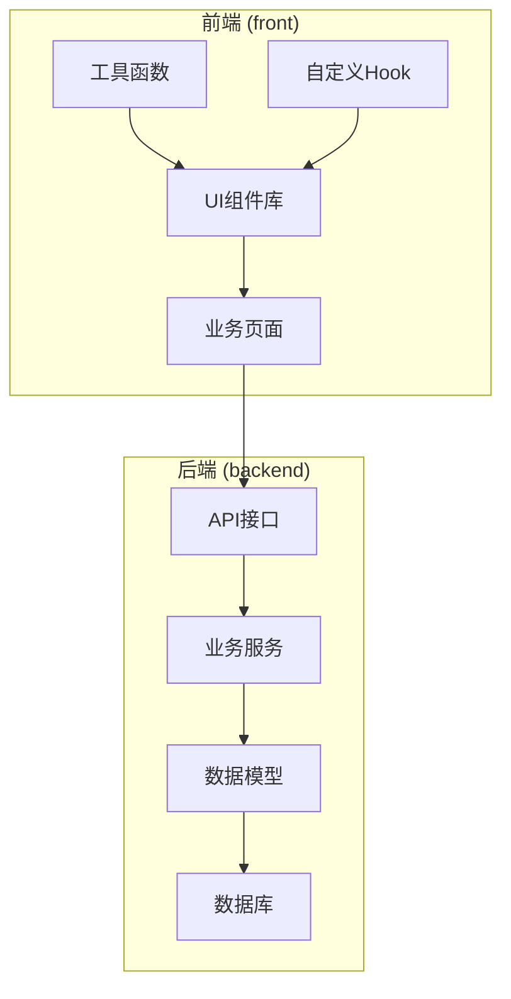
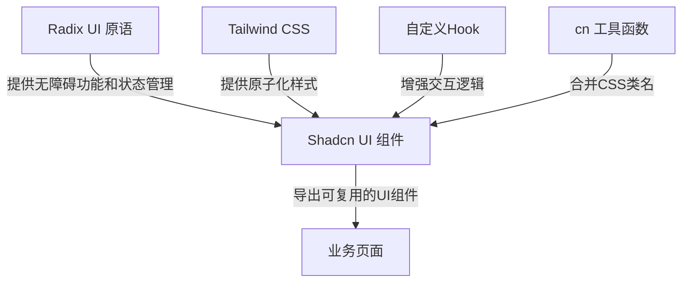
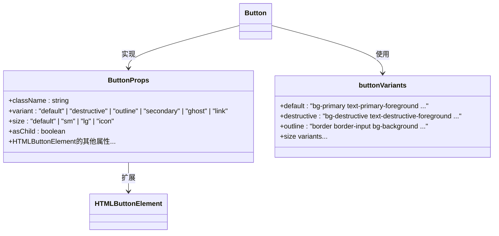
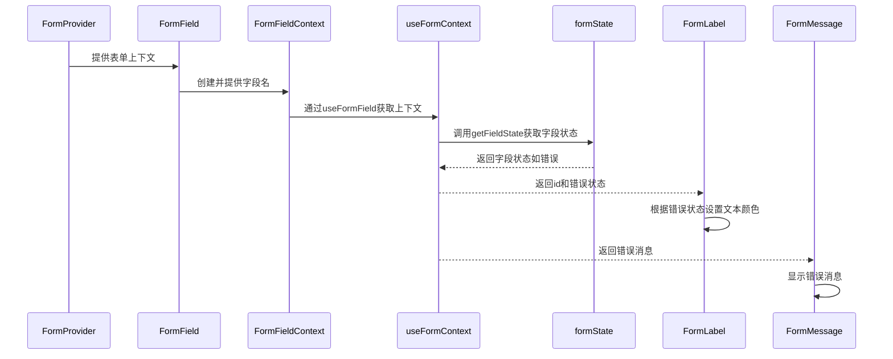
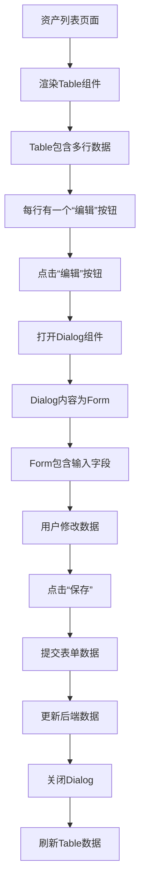
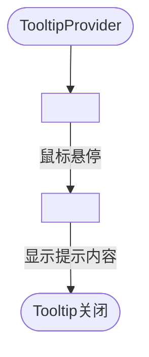
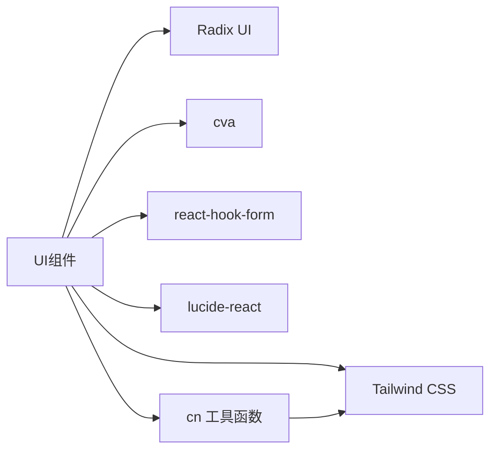

# UI组件库

<cite>
**本文档引用文件**  
- [button.tsx](file://front/components/ui/button.tsx)
- [form.tsx](file://front/components/ui/form.tsx)
- [table.tsx](file://front/components/ui/table.tsx)
- [dialog.tsx](file://front/components/ui/dialog.tsx)
- [dropdown-menu.tsx](file://front/components/ui/dropdown-menu.tsx)
- [tabs.tsx](file://front/components/ui/tabs.tsx)
- [tooltip.tsx](file://front/components/ui/tooltip.tsx)
- [skeleton.tsx](file://front/components/ui/skeleton.tsx)
- [lib/utils.ts](file://front/lib/utils.ts)
- [cn](file://front/lib/utils.ts)
</cite>

## 目录
1. [简介](#简介)
2. [项目结构](#项目结构)
3. [核心组件](#核心组件)
4. [架构概览](#架构概览)
5. [详细组件分析](#详细组件分析)
6. [依赖分析](#依赖分析)
7. [性能考量](#性能考量)
8. [故障排除指南](#故障排除指南)
9. [结论](#结论)

## 简介
本文档旨在全面介绍基于Shadcn UI构建的原子化UI组件库，重点阐述按钮、表单、表格、对话框、下拉菜单、标签页、提示框等核心组件的实现机制。文档详细说明各组件的Props接口定义、通过className与Tailwind CSS的样式定制方法、状态管理策略及可访问性（a11y）支持。通过代码示例展示如何组合这些基础组件以构建复杂的业务界面，例如使用Table与Dialog实现资产列表的编辑弹窗。同时，解释组件如何集成Radix UI原语并进行样式封装，以及如何利用use-toast、use-mobile等自定义Hook增强交互体验。

## 项目结构
项目采用前后端分离架构，前端基于React与Next.js框架，使用Shadcn UI作为UI组件库的基础，通过Radix UI提供无样式的可访问性原语，并利用Tailwind CSS进行样式定制。组件库位于`/front/components/ui`目录下，遵循原子化设计原则，将UI分解为可复用的微小单元。

**图示来源**
- [button.tsx](file://front/components/ui/button.tsx#L1-L57)
- [form.tsx](file://front/components/ui/form.tsx#L1-L179)

## 核心组件
核心UI组件包括Button、Form、Table、Dialog、DropdownMenu、Tabs、Tooltip和Skeleton，它们共同构成了应用的用户界面基础。这些组件均采用React函数式组件编写，利用TypeScript定义精确的接口类型，并通过`class-variance-authority`（cva）实现灵活的变体（variant）和尺寸（size）控制。

**组件来源**
- [button.tsx](file://front/components/ui/button.tsx#L1-L57)
- [form.tsx](file://front/components/ui/form.tsx#L1-L179)
- [table.tsx](file://front/components/ui/table.tsx#L1-L118)

## 架构概览
该UI组件库的核心架构是“封装与扩展”模式。底层依赖Radix UI提供的无障碍、无样式的原语（如`@radix-ui/react-dialog`），中层使用Tailwind CSS进行样式设计和布局，上层通过Shadcn UI的模式将两者结合，创建出既美观又功能完备的可复用组件。`cn`工具函数（来自`@/lib/utils`）用于合并和条件化处理CSS类名，是连接样式与逻辑的关键。

**图示来源**
- [dialog.tsx](file://front/components/ui/dialog.tsx#L1-L123)
- [lib/utils.ts](file://front/lib/utils.ts#L1-L10)

## 详细组件分析
本节深入分析几个关键组件的实现细节，包括其Props定义、内部逻辑和使用方式。

### 按钮组件分析
`Button`组件是用户交互的基础。它通过`cva`函数定义了多种变体（如默认、危险、轮廓等）和尺寸（如小、中、大），并通过`asChild`属性支持复合组件模式，允许将样式应用到任意子元素上。

**图示来源**
- [button.tsx](file://front/components/ui/button.tsx#L10-L57)

**组件来源**
- [button.tsx](file://front/components/ui/button.tsx#L1-L57)

### 表单组件分析
`Form`组件基于`react-hook-form`库构建，提供了一套完整的表单管理解决方案。它通过`<FormField>`、`<FormItem>`、`<FormLabel>`、`<FormControl>`、`<FormDescription>`和`<FormMessage>`等子组件，实现了表单字段的结构化、标签关联、错误消息显示和可访问性支持。

**图示来源**
- [form.tsx](file://front/components/ui/form.tsx#L1-L179)

**组件来源**
- [form.tsx](file://front/components/ui/form.tsx#L1-L179)

### 表格与对话框组合应用
一个典型的复杂界面是使用`Table`展示数据列表，并通过`Dialog`实现编辑弹窗。例如，在资产列表页面，点击“编辑”按钮会打开一个`Dialog`，其内容是一个`Form`，用于修改选中资产的信息。

**组件来源**
- [table.tsx](file://front/components/ui/table.tsx#L1-L118)
- [dialog.tsx](file://front/components/ui/dialog.tsx#L1-L123)

### 下拉菜单与标签页分析
`DropdownMenu`和`Tabs`组件都利用Radix UI的原语来处理复杂的交互逻辑（如键盘导航、焦点管理）。`DropdownMenu`通过`DropdownMenuTrigger`和`DropdownMenuContent`分离触发器和内容，支持嵌套子菜单（`DropdownMenuSub`）。`Tabs`组件则通过`TabsList`、`TabsTrigger`和`TabsContent`实现标签页的切换。

**组件来源**
- [dropdown-menu.tsx](file://front/components/ui/dropdown-menu.tsx#L1-L201)
- [tabs.tsx](file://front/components/ui/tabs.tsx#L1-L56)

### 提示框与骨架屏分析
`Tooltip`组件在用户悬停时显示额外信息，增强了用户体验。`Skeleton`组件则在数据加载时显示占位符，提供更好的加载反馈。`Skeleton`的实现非常简洁，仅通过`animate-pulse`类名和`bg-muted`背景色创建脉冲动画效果。

**图示来源**
- [tooltip.tsx](file://front/components/ui/tooltip.tsx#L1-L31)

**组件来源**
- [tooltip.tsx](file://front/components/ui/tooltip.tsx#L1-L31)
- [skeleton.tsx](file://front/components/ui/skeleton.tsx#L1-L16)

## 依赖分析
UI组件库的依赖关系清晰且层次分明。核心依赖包括：
*   **Radix UI**: 提供所有底层原语，确保组件的高可访问性和健壮的交互逻辑。
*   **Tailwind CSS**: 提供原子化CSS类，实现快速、一致的样式定制。
*   **class-variance-authority (cva)**: 用于定义和管理组件的变体和尺寸，使样式逻辑更清晰。
*   **react-hook-form**: 为表单组件提供强大的状态管理和验证功能。
*   **lucide-react**: 提供一致的图标集。

**图示来源**
- [package.json](file://front/package.json#L1-L20)

## 性能考量
对于大数据量场景，应结合使用`Table`组件与虚拟滚动技术，避免渲染过多DOM节点导致页面卡顿。`Skeleton`组件是实现骨架屏（Skeleton Screen）的理想选择，能有效提升加载过程中的用户体验。此外，通过`use-mobile`自定义Hook可以实现响应式设计，为移动设备提供优化的交互体验。

## 故障排除指南
*   **组件样式不生效**: 检查`tailwind.config.ts`是否正确配置了Shadcn UI的插件，并确认`cn`函数是否被正确导入和使用。
*   **Dialog或Dropdown不显示**: 确保组件被正确地包裹在`<body>`内，并检查是否有z-index冲突。
*   **Form表单验证失败**: 检查`react-hook-form`的`Controller`是否正确地包裹了受控组件，并确认`name`属性与表单结构匹配。
*   **TypeScript类型错误**: 确保`ButtonProps`等接口正确扩展了原生HTML元素的属性。

**组件来源**
- [button.tsx](file://front/components/ui/button.tsx#L1-L57)
- [form.tsx](file://front/components/ui/form.tsx#L1-L179)
- [tailwind.config.ts](file://front/tailwind.config.ts#L1-L15)

## 结论
该UI组件库通过巧妙地结合Radix UI、Tailwind CSS和Shadcn UI的设计模式，成功构建了一套既美观又实用的原子化组件。其清晰的架构、良好的可访问性支持和灵活的定制能力，为快速开发高质量的前端应用提供了坚实的基础。遵循本文档的指导，开发者可以高效地使用和扩展这些组件，构建出一致且用户友好的界面。