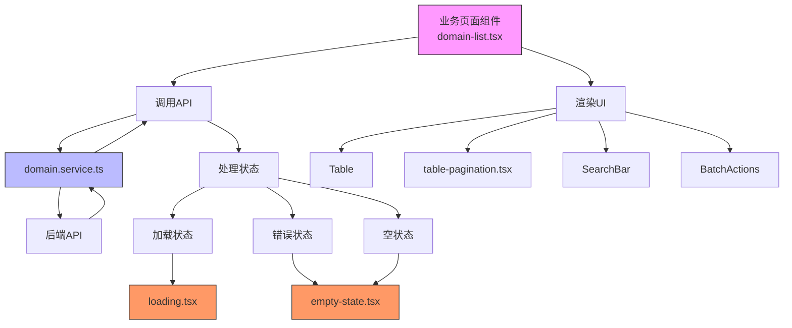
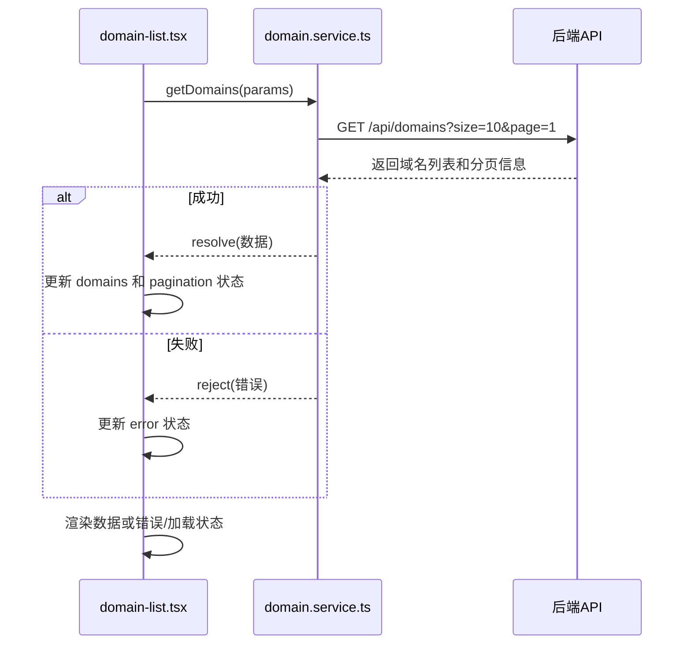
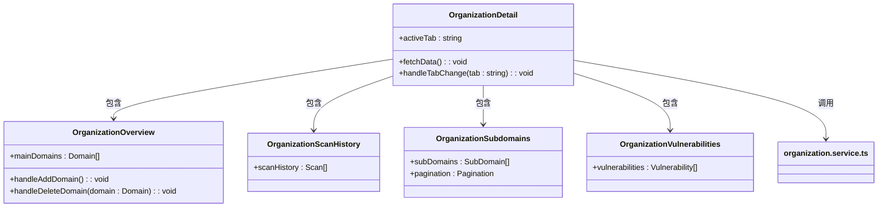
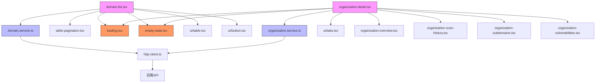

# 业务页面组件

<cite>
**本文档引用的文件**  
- [domain-list.tsx](file://front/components/pages/assets/domains/domain-list.tsx)
- [organization-detail.tsx](file://front/components/pages/assets/organizations/organization-detail.tsx)
- [table-pagination.tsx](file://front/components/common/table-pagination.tsx)
- [domain.service.ts](file://front/services/domain.service.ts)
- [organization.service.ts](file://front/services/organization.service.ts)
- [loading.tsx](file://front/components/common/loading.tsx)
- [empty-state.tsx](file://front/components/common/empty-state.tsx)
- [organization-overview.tsx](file://front/components/pages/assets/organizations/detail/organization-overview.tsx)
- [organization-scan-history.tsx](file://front/components/pages/assets/organizations/detail/organization-scan-history.tsx)
- [organization-subdomains.tsx](file://front/components/pages/assets/organizations/detail/organization-subdomains.tsx)
- [organization-vulnerabilities.tsx](file://front/components/pages/assets/organizations/detail/organization-vulnerabilities.tsx)
</cite>

## 目录
1. [简介](#简介)
2. [项目结构](#项目结构)
3. [核心组件](#核心组件)
4. [架构概览](#架构概览)
5. [详细组件分析](#详细组件分析)
6. [依赖分析](#依赖分析)
7. [性能考量](#性能考量)
8. [故障排查指南](#故障排查指南)
9. [结论](#结论)

## 简介
本文档旨在深入解析漏洞扫描系统前端中与资产（域名、组织）及仪表盘相关的业务页面组件。重点分析 `domain-list.tsx` 和 `organization-detail.tsx` 的实现逻辑，涵盖数据获取、分页、搜索过滤、批量操作、多标签页内容组织、API 调用、状态处理（加载、错误、空状态）以及组件拆分的最佳实践。

## 项目结构
项目采用典型的前后端分离架构。前端位于 `front` 目录，使用 Next.js 框架构建，遵循功能模块化组织。核心业务页面组件位于 `front/components/pages` 目录下，按功能域（如 `assets`、`scan`）划分。通用 UI 组件和业务逻辑服务分别位于 `components/ui` 和 `services` 目录。

```mermaid
graph TB
subgraph "前端 (front)"
subgraph "页面路由 (app)"
Assets[assets/]
Scan[scan/]
Layout[layout.tsx]
end
subgraph "组件 (components)"
Pages[pages/]
Common[common/]
UI[ui/]
end
subgraph "服务 (services)"
DomainService[domain.service.ts]
OrgService[organization.service.ts]
end
subgraph "类型定义 (types)"
ApiTypes[api.types.ts]
end
end
subgraph "后端 (backend)"
Handlers[handlers/]
Services[services/]
Models[models/]
end
Assets --> Pages
Pages --> Common
Pages --> UI
Pages --> DomainService
Pages --> OrgService
DomainService --> ApiTypes
OrgService --> ApiTypes
DomainService < --> BackendAPI[(后端API)]
OrgService < --> BackendAPI
```

**图示来源**
- [app/assets/organizations/page.tsx](file://front/app/assets/organizations/page.tsx)
- [components/pages/assets/organizations/organization-list.tsx](file://front/components/pages/assets/organizations/organization-list.tsx)
- [services/organization.service.ts](file://front/services/organization.service.ts)

## 核心组件
核心业务组件包括 `domain-list.tsx` 和 `organization-detail.tsx`。前者负责展示和管理域名列表，集成了搜索、分页和批量操作；后者作为组织详情的容器，通过标签页组织多个子组件，分别展示组织概览、扫描历史、子域名和漏洞详情。

**本节来源**
- [domain-list.tsx](file://front/components/pages/assets/domains/domain-list.tsx)
- [organization-detail.tsx](file://front/components/pages/assets/organizations/organization-detail.tsx)

## 架构概览
整个业务页面的架构遵循“容器-展示”模式。容器组件（如 `domain-list.tsx`）负责数据获取、状态管理和业务逻辑，通过 `props` 将数据和回调函数传递给展示型子组件（如 `table-pagination.tsx`、`empty-state.tsx`）。API 调用通过 `services` 目录下的服务层进行封装，实现了数据访问与 UI 逻辑的解耦。



**图示来源**
- [domain-list.tsx](file://front/components/pages/assets/domains/domain-list.tsx)
- [domain.service.ts](file://front/services/domain.service.ts)
- [loading.tsx](file://front/components/common/loading.tsx)
- [empty-state.tsx](file://front/components/common/empty-state.tsx)

## 详细组件分析

### 域名列表组件 (domain-list.tsx) 分析
`domain-list.tsx` 是一个复合型容器组件，负责管理域名数据的全生命周期。

#### 数据获取与状态管理
该组件通过 `useEffect` 钩子在挂载时调用 `domainService.getDomains()` 方法获取数据。它维护了 `domains`、`loading`、`error` 和 `pagination` 等状态，以处理不同的 UI 场景。



**图示来源**
- [domain-list.tsx](file://front/components/pages/assets/domains/domain-list.tsx#L20-L50)
- [domain.service.ts](file://front/services/domain.service.ts#L5-L20)

#### 分页、搜索与批量操作
组件集成了 `table-pagination.tsx` 实现分页功能，通过回调函数同步当前页码和每页大小。搜索功能通过本地状态 `searchTerm` 过滤 `domains` 数组实现。批量操作（如批量删除）通过维护一个 `selectedIds` 数组来跟踪选中的域名，并提供相应的操作按钮和确认对话框。

**本节来源**
- [domain-list.tsx](file://front/components/pages/assets/domains/domain-list.tsx)
- [table-pagination.tsx](file://front/components/common/table-pagination.tsx)

### 组织详情组件 (organization-detail.tsx) 分析
`organization-detail.tsx` 是一个典型的标签页容器组件，它不直接渲染复杂内容，而是协调多个子组件。

#### 多标签页内容组织
该组件使用 `Tabs` 组件（来自 `ui/tabs.tsx`）创建标签页。每个标签页的 `value` 对应一个子组件，如 `overview`、`scan-history`、`subdomains`、`vulnerabilities`。当用户切换标签时，对应的子组件被渲染。

#### 子组件职责划分
- **organization-overview.tsx**: 展示组织基本信息和主域名列表，包含添加和删除主域名的功能。
- **organization-scan-history.tsx**: 展示该组织下所有域名的扫描历史记录。
- **organization-subdomains.tsx**: 展示从该组织主域名发现的所有子域名，并提供表格分页和筛选。
- **organization-vulnerabilities.tsx**: 展示在该组织资产上发现的漏洞详情。



**图示来源**
- [organization-detail.tsx](file://front/components/pages/assets/organizations/organization-detail.tsx)
- [organization-overview.tsx](file://front/components/pages/assets/organizations/detail/organization-overview.tsx)
- [organization-scan-history.tsx](file://front/components/pages/assets/organizations/detail/organization-scan-history.tsx)
- [organization-subdomains.tsx](file://front/components/pages/assets/organizations/detail/organization-subdomains.tsx)
- [organization-vulnerabilities.tsx](file://front/components/pages/assets/organizations/detail/organization-vulnerabilities.tsx)

#### API 调用与状态处理
`organization-detail.tsx` 在挂载时调用 `organizationService.getOrganization(id)` 获取组织详情。它同样管理 `loading` 和 `error` 状态，并在数据加载时显示 `loading.tsx`，在出错时显示 `empty-state.tsx` 或错误提示。子组件可能根据需要发起自己的 API 调用（如 `organization-subdomains.tsx` 可能调用获取子域名的 API）。

**本节来源**
- [organization-detail.tsx](file://front/components/pages/assets/organizations/organization-detail.tsx)
- [organization.service.ts](file://front/services/organization.service.ts)
- [loading.tsx](file://front/components/common/loading.tsx)
- [empty-state.tsx](file://front/components/common/empty-state.tsx)

## 依赖分析
业务页面组件与多个模块存在依赖关系，形成了清晰的层次结构。



**图示来源**
- [domain-list.tsx](file://front/components/pages/assets/domains/domain-list.tsx)
- [organization-detail.tsx](file://front/components/pages/assets/organizations/organization-detail.tsx)
- [domain.service.ts](file://front/services/domain.service.ts)
- [organization.service.ts](file://front/services/organization.service.ts)
- [lib/http-client.ts](file://front/lib/http-client.ts)

## 性能考量
- **数据获取**: 使用分页避免一次性加载过多数据，减少网络传输和内存占用。
- **状态管理**: 在 `domain-list.tsx` 中，搜索过滤在客户端进行，对于小到中等规模的数据集是高效的。若数据量巨大，应考虑后端分页搜索。
- **组件渲染**: `organization-detail.tsx` 的标签页设计实现了按需加载，未激活的标签页内容不会被渲染，提升了初始加载性能。
- **API 调用**: 服务层 (`domain.service.ts`, `organization.service.ts`) 封装了 API 调用，便于添加缓存、请求合并等优化。

## 故障排查指南
- **页面空白或加载中**: 检查浏览器开发者工具的网络面板，确认 API 请求是否成功。若请求失败，检查后端服务状态和网络连接。
- **数据显示不正确**: 检查 `services` 层返回的数据结构是否与组件期望的 `types` 匹配。查看控制台是否有类型错误。
- **分页失效**: 确认 `table-pagination.tsx` 的 `onPageChange` 回调是否正确传递给了 `domain-list.tsx`，并触发了数据的重新获取。
- **批量操作无响应**: 检查 `selectedIds` 状态的更新逻辑，确保复选框的 `onCheckedChange` 事件正确触发了状态更新。

**本节来源**
- [domain-list.tsx](file://front/components/pages/assets/domains/domain-list.tsx)
- [organization-detail.tsx](file://front/components/pages/assets/organizations/organization-detail.tsx)
- [domain.service.ts](file://front/services/domain.service.ts)
- [organization.service.ts](file://front/services/organization.service.ts)

## 结论
通过对 `domain-list.tsx` 和 `organization-detail.tsx` 的分析，可以看出该项目在业务页面开发上遵循了良好的实践。通过将复杂页面拆分为职责单一的子组件，并利用服务层封装 API 调用，实现了代码的高内聚、低耦合。状态管理清晰，能够有效处理加载、错误和空状态。这种架构模式易于维护和扩展，为开发更复杂的业务功能奠定了坚实的基础。