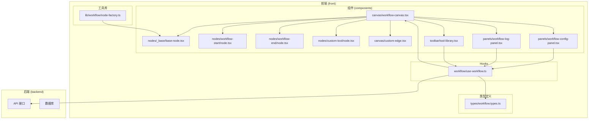
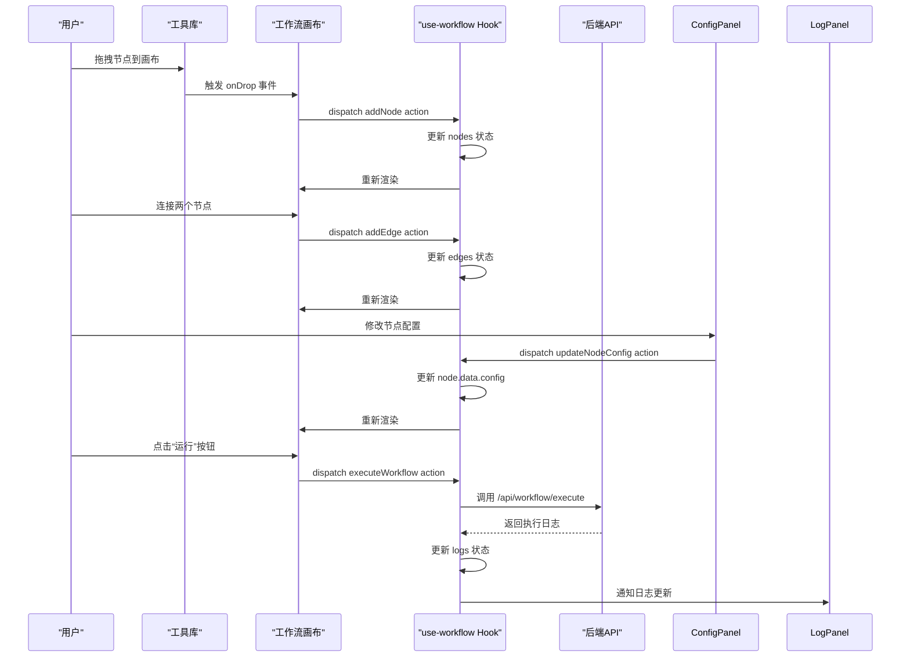
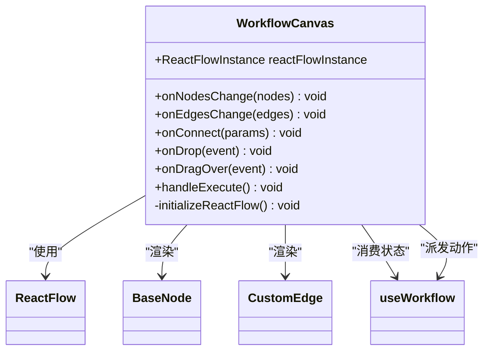
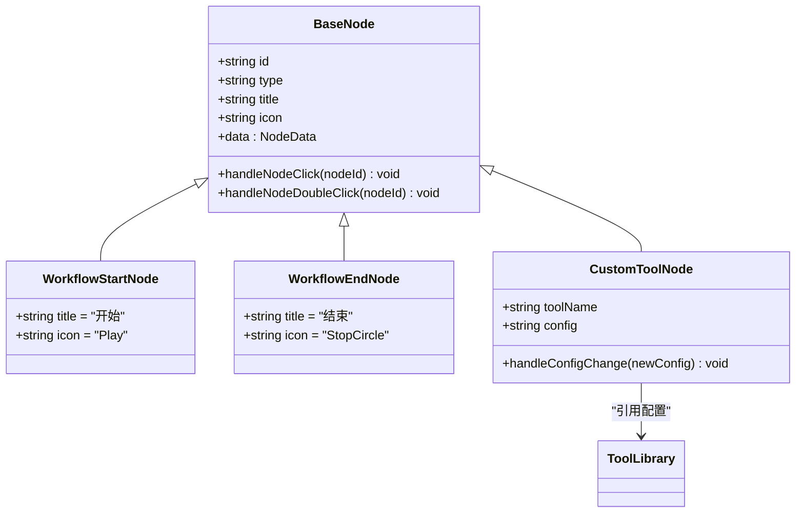
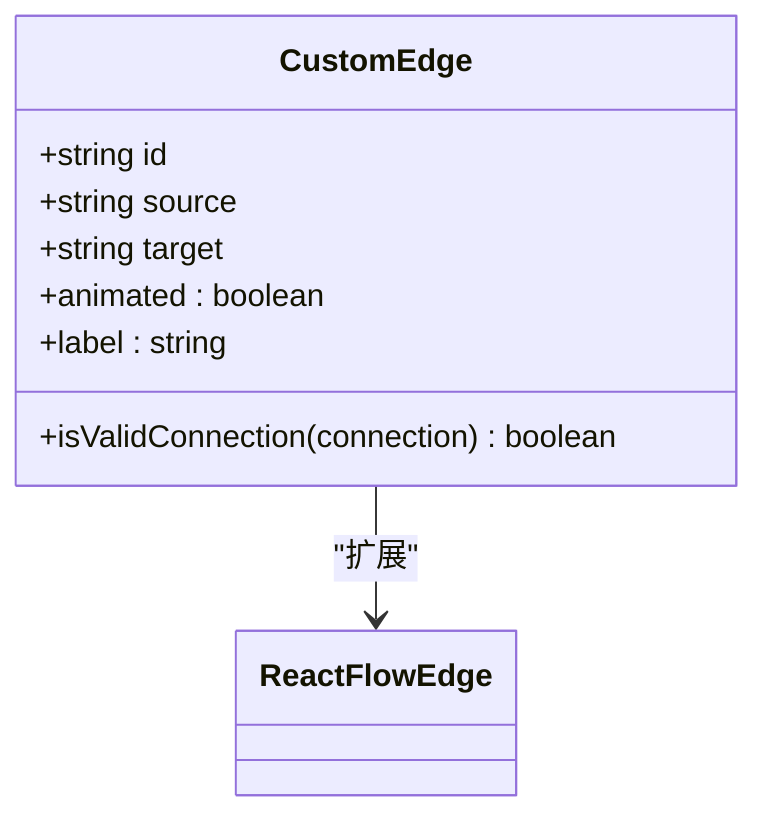
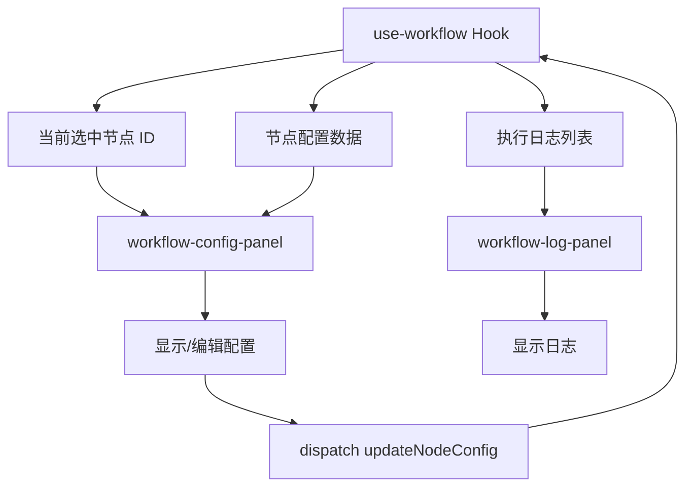
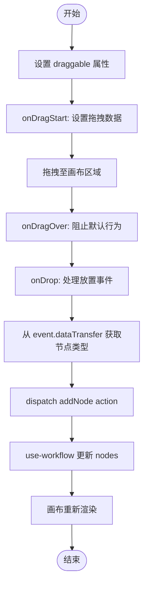
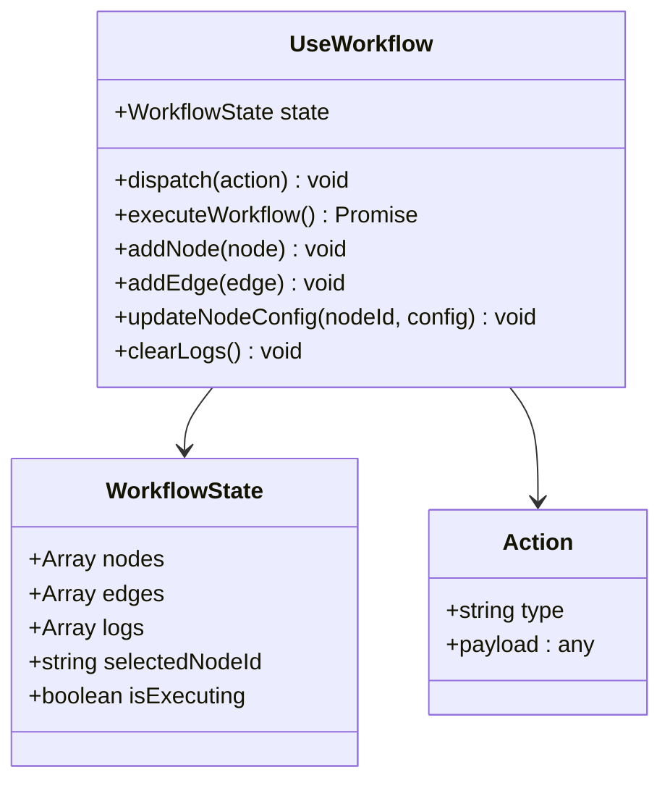
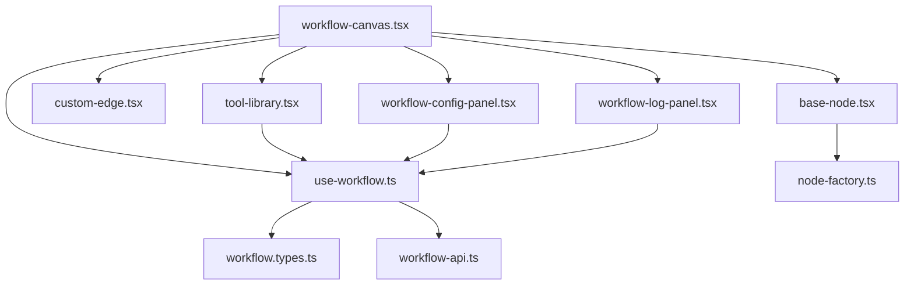

# 工作流专用组件

<cite>
**本文档引用的文件**  
- [workflow-canvas.tsx](file://front/components/workflow/canvas/workflow-canvas.tsx)
- [base-node.tsx](file://front/components/workflow/nodes/_base/base-node.tsx)
- [workflow-start/node.tsx](file://front/components/workflow/nodes/workflow-start/node.tsx)
- [custom-edge.tsx](file://front/components/workflow/canvas/custom-edge.tsx)
- [workflow-config-panel.tsx](file://front/components/workflow/panels/workflow-config-panel.tsx)
- [workflow-log-panel.tsx](file://front/components/workflow/panels/workflow-log-panel.tsx)
- [tool-library.tsx](file://front/components/workflow/toolbar/tool-library.tsx)
- [use-workflow.ts](file://front/hooks/workflow/use-workflow.ts)
- [workflow.types.ts](file://front/types/workflow.types.ts)
- [node-factory.ts](file://front/lib/workflow/node-factory.ts)
</cite>

## 目录
1. [简介](#简介)
2. [项目结构](#项目结构)
3. [核心组件](#核心组件)
4. [架构概览](#架构概览)
5. [详细组件分析](#详细组件分析)
6. [依赖关系分析](#依赖关系分析)
7. [性能考量](#性能考量)
8. [故障排查指南](#故障排查指南)
9. [结论](#结论)

## 简介
本技术文档深入解析基于 React Flow 的工作流可视化系统，重点阐述工作流画布（workflow-canvas）的集成架构、自定义节点与边的实现机制、配置与日志面板的状态同步逻辑、工具库的拖拽功能，以及 use-workflow Hook 的状态管理与流程控制。文档旨在为开发者提供清晰的技术实现路径和扩展新节点类型的指导。

## 项目结构
项目采用前后端分离架构，前端基于 Next.js 框架构建，工作流相关组件集中于 `front/components/workflow` 目录下，形成高内聚的模块化设计。核心功能模块包括画布、节点、边、面板和工具栏，通过 hooks 和 types 统一管理状态与数据结构。

**图示来源**
- [workflow-canvas.tsx](file://front/components/workflow/canvas/workflow-canvas.tsx)
- [use-workflow.ts](file://front/hooks/workflow/use-workflow.ts)
- [workflow.types.ts](file://front/types/workflow.types.ts)

**本节来源**
- [workflow-canvas.tsx](file://front/components/workflow/canvas/workflow-canvas.tsx)
- [use-workflow.ts](file://front/hooks/workflow/use-workflow.ts)

## 核心组件
系统核心由工作流画布、自定义节点、自定义边、配置面板、日志面板和工具库构成。`use-workflow` Hook 作为状态中枢，协调各组件间的数据流与事件响应。`workflow.types.ts` 定义了统一的数据契约，确保类型安全。

**本节来源**
- [workflow-canvas.tsx](file://front/components/workflow/canvas/workflow-canvas.tsx)
- [use-workflow.ts](file://front/hooks/workflow/use-workflow.ts)
- [workflow.types.ts](file://front/types/workflow.types.ts)

## 架构概览
整个工作流系统的架构遵循“单一数据源”和“组件化”原则。React Flow 提供基础的画布渲染与交互能力，`workflow-canvas` 组件对其进行封装和扩展。`use-workflow` Hook 管理工作流的完整状态（节点、边、执行日志、配置等），并通过 React Context 或直接 props 传递给子组件。所有 UI 组件（如面板、工具栏）都订阅该状态，并通过 dispatch action 来触发状态更新。

**图示来源**
- [workflow-canvas.tsx](file://front/components/workflow/canvas/workflow-canvas.tsx)
- [use-workflow.ts](file://front/hooks/workflow/use-workflow.ts)
- [tool-library.tsx](file://front/components/workflow/toolbar/tool-library.tsx)
- [workflow-config-panel.tsx](file://front/components/workflow/panels/workflow-config-panel.tsx)
- [workflow-log-panel.tsx](file://front/components/workflow/panels/workflow-log-panel.tsx)

## 详细组件分析

### 工作流画布 (workflow-canvas.tsx) 分析
`workflow-canvas.tsx` 是整个工作流的容器组件，它集成了 React Flow 的核心功能，并注入了自定义的节点和边。

**图示来源**
- [workflow-canvas.tsx](file://front/components/workflow/canvas/workflow-canvas.tsx)

**本节来源**
- [workflow-canvas.tsx](file://front/components/workflow/canvas/workflow-canvas.tsx)

### 自定义节点 (base-node.tsx) 分析
所有节点均继承自 `base-node.tsx` 中定义的基类。该基类封装了节点的通用 UI 结构（标题、图标、端口）和事件处理逻辑（点击、双击）。

**图示来源**
- [base-node.tsx](file://front/components/workflow/nodes/_base/base-node.tsx)
- [workflow-start/node.tsx](file://front/components/workflow/nodes/workflow-start/node.tsx)
- [workflow-end/node.tsx](file://front/components/workflow/nodes/workflow-end/node.tsx)
- [custom-tool/node.tsx](file://front/components/workflow/nodes/custom-tool/node.tsx)

**本节来源**
- [base-node.tsx](file://front/components/workflow/nodes/_base/base-node.tsx)
- [workflow-start/node.tsx](file://front/components/workflow/nodes/workflow-start/node.tsx)

### 自定义边 (custom-edge.tsx) 分析
`custom-edge.tsx` 实现了自定义的边，可能包含动画效果、标签或特定的连接验证逻辑。

**图示来源**
- [custom-edge.tsx](file://front/components/workflow/canvas/custom-edge.tsx)

**本节来源**
- [custom-edge.tsx](file://front/components/workflow/canvas/custom-edge.tsx)

### 配置与日志面板分析
`workflow-config-panel.tsx` 和 `workflow-log-panel.tsx` 通过 `use-workflow` Hook 订阅当前选中节点和日志状态，实现与画布的实时同步。

**图示来源**
- [workflow-config-panel.tsx](file://front/components/workflow/panels/workflow-config-panel.tsx)
- [workflow-log-panel.tsx](file://front/components/workflow/panels/workflow-log-panel.tsx)
- [use-workflow.ts](file://front/hooks/workflow/use-workflow.ts)

**本节来源**
- [workflow-config-panel.tsx](file://front/components/workflow/panels/workflow-config-panel.tsx)
- [workflow-log-panel.tsx](file://front/components/workflow/panels/workflow-log-panel.tsx)

### 工具库 (tool-library.tsx) 分析
`tool-library.tsx` 实现了可拖拽的节点库，用户可将节点拖入画布。

**图示来源**
- [tool-library.tsx](file://front/components/workflow/toolbar/tool-library.tsx)
- [workflow-canvas.tsx](file://front/components/workflow/canvas/workflow-canvas.tsx)

**本节来源**
- [tool-library.tsx](file://front/components/workflow/toolbar/tool-library.tsx)

### use-workflow Hook 分析
`use-workflow.ts` 是状态管理的核心，使用 `useReducer` 或 `useState` 管理复杂的工作流状态。

**图示来源**
- [use-workflow.ts](file://front/hooks/workflow/use-workflow.ts)
- [workflow.types.ts](file://front/types/workflow.types.ts)

**本节来源**
- [use-workflow.ts](file://front/hooks/workflow/use-workflow.ts)

## 依赖关系分析
系统内部依赖清晰，上层组件依赖下层 Hook 和类型定义。外部依赖主要为 React Flow 库，提供了画布的基础能力。

**图示来源**
- [go.mod](file://go.mod)
- [package.json](file://front/package.json)

**本节来源**
- [workflow-canvas.tsx](file://front/components/workflow/canvas/workflow-canvas.tsx)
- [use-workflow.ts](file://front/hooks/workflow/use-workflow.ts)

## 性能考量
- **渲染性能**：React Flow 本身对大量节点有优化，但自定义节点的复杂度会影响性能。建议保持节点组件轻量。
- **状态更新**：`use-workflow` 的状态更新应避免不必要的重渲染，可使用 `React.memo` 或 `useCallback` 优化子组件。
- **API 调用**：流程执行可能耗时，应在 UI 上提供加载反馈，并考虑超时和重试机制。

## 故障排查指南
- **节点无法拖拽**：检查 `tool-library.tsx` 的 `draggable` 属性和 `onDragStart` 事件是否正确设置。
- **连接线无法创建**：检查 `custom-edge.tsx` 的 `isValidConnection` 逻辑或 React Flow 的 `connectionMode` 配置。
- **配置未保存**：确认 `workflow-config-panel.tsx` 是否正确调用了 `use-workflow` 的更新函数。
- **Hook 状态不更新**：检查 `use-workflow` 的 reducer 是否正确处理了 action，以及组件是否正确订阅了状态。

## 结论
该工作流系统架构清晰，组件职责分明，通过 `use-workflow` Hook 实现了高效的状态管理。开发者可基于现有模式，通过扩展 `node-factory.ts` 和创建新的节点组件来添加新类型节点，实现功能的灵活扩展。