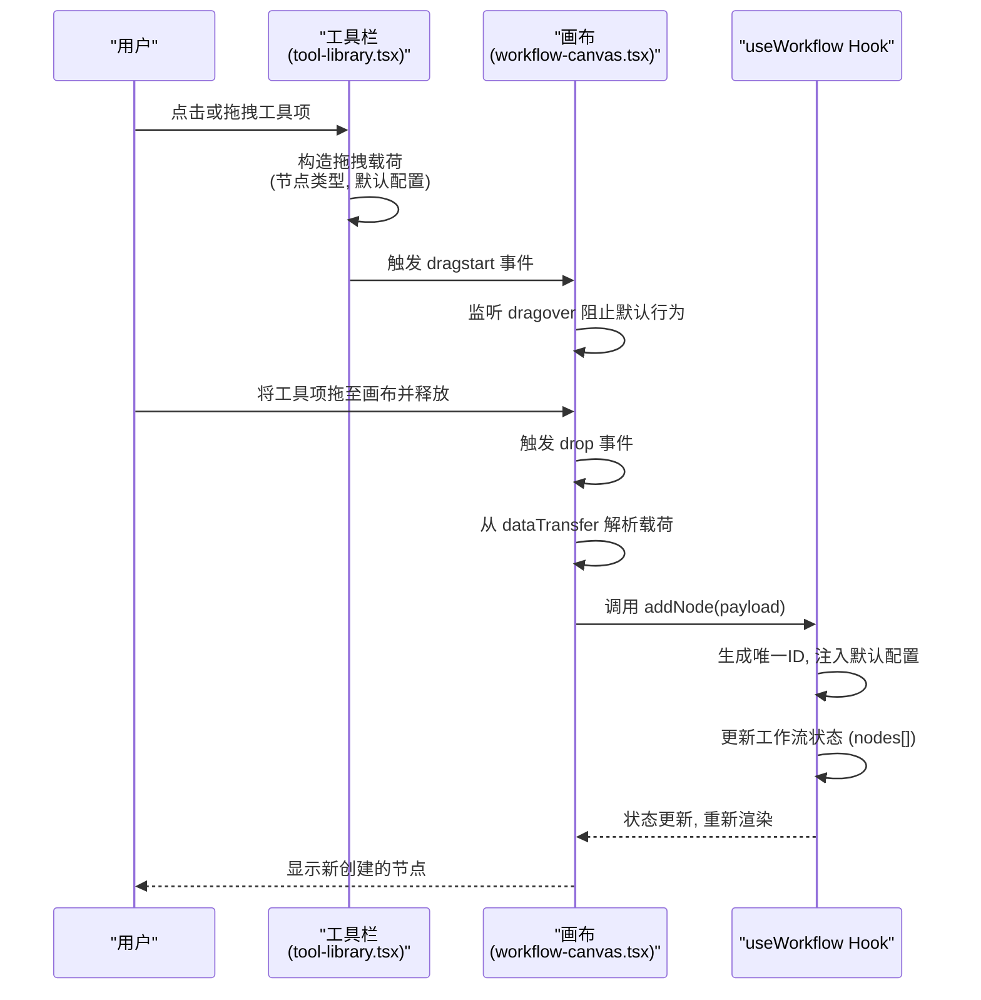
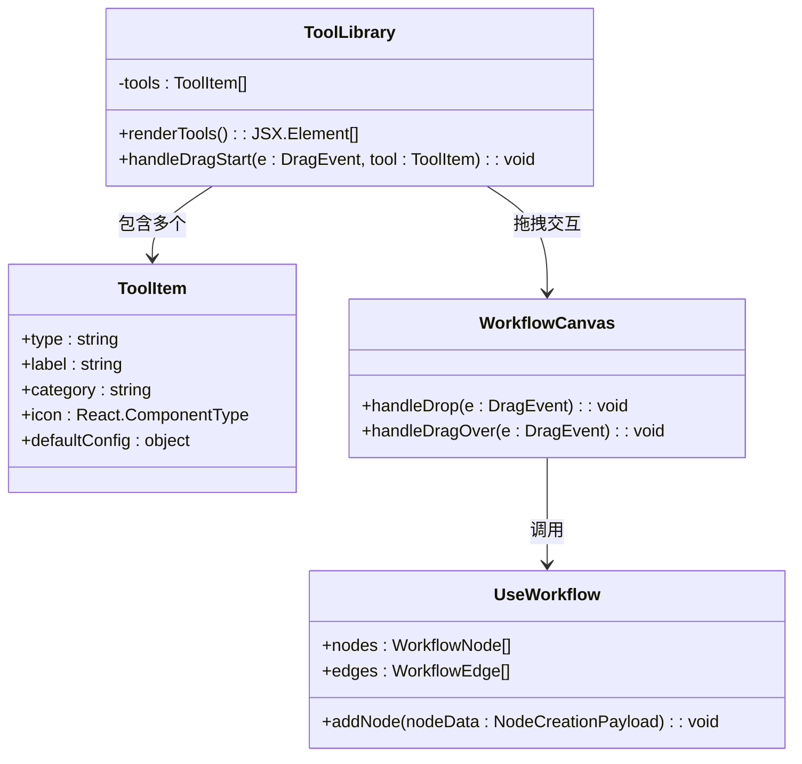
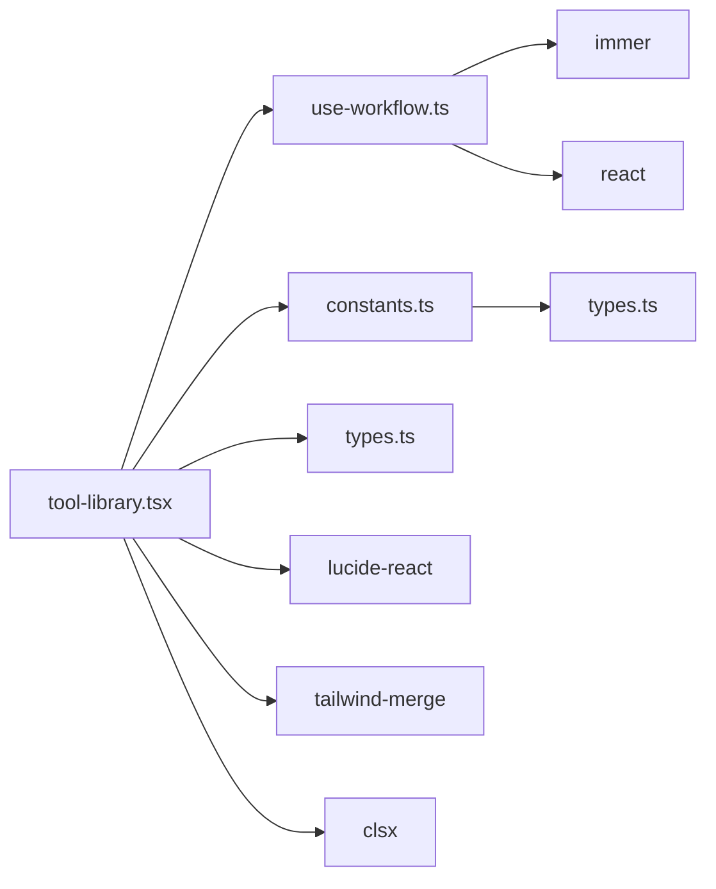

# 工作流工具栏

<cite>
**本文档引用的文件**  
- [tool-library.tsx](file://front/components/workflow/toolbar/tool-library.tsx)
- [use-workflow.ts](file://front/hooks/workflow/use-workflow.ts)
- [workflow-canvas.tsx](file://front/components/workflow/canvas/workflow-canvas.tsx)
- [constants.ts](file://front/lib/workflow/constants.ts)
- [types.ts](file://front/lib/workflow/types.ts)
</cite>

## 目录
1. [简介](#简介)
2. [项目结构](#项目结构)
3. [核心组件](#核心组件)
4. [架构概览](#架构概览)
5. [详细组件分析](#详细组件分析)
6. [依赖关系分析](#依赖关系分析)
7. [性能考量](#性能考量)
8. [故障排查指南](#故障排查指南)
9. [结论](#结论)

## 简介
本文档详细说明了“工作流工具栏”模块的功能实现与集成机制，重点围绕 `tool-library.tsx` 组件展开。该组件为用户提供了一个可拖拽的工具库界面，支持通过点击或拖拽方式向画布添加新节点。文档将深入解析工具项的注册、数据载荷构造、画布接收逻辑、分类展示、搜索过滤、图标渲染机制，并结合 `useWorkflow` Hook 阐述节点创建流程的触发与状态同步。同时，提供扩展新工具项的技术路径，包括元数据定义与国际化支持。

## 项目结构
项目采用典型的前后端分离架构，前端基于 Next.js 框架构建，组件组织遵循功能模块化原则。工作流相关功能集中于 `front/components/workflow` 目录下，主要包括画布（canvas）、节点（nodes）、面板（panels）和工具栏（toolbar）四大模块。工具栏组件 `tool-library.tsx` 位于 `front/components/workflow/toolbar/` 路径，是用户与工作流编辑器交互的核心入口之一。

```mermaid
graph TB
subgraph "前端 (front)"
subgraph "组件 (components)"
subgraph "工作流 (workflow)"
Toolbar[工具栏<br/>tool-library.tsx]
Canvas[画布<br/>workflow-canvas.tsx]
Nodes[节点<br/>nodes/]
Panels[面板<br/>panels/]
end
UI[UI 组件库]
end
subgraph "Hooks"
UseWorkflow[use-workflow.ts]
end
subgraph "工具库 (lib)"
WorkflowLib[workflow/<br/>constants.ts, types.ts]
end
end
subgraph "后端 (backend)"
API[REST API]
DB[(数据库)]
end
Toolbar --> Canvas : 拖拽添加节点
UseWorkflow --> Canvas : 状态管理
UseWorkflow --> Toolbar : 触发节点创建
WorkflowLib --> UseWorkflow : 提供常量与类型
Canvas --> DB : 数据持久化
API --> DB : 数据交互
```

**图示来源**
- [tool-library.tsx](file://front/components/workflow/toolbar/tool-library.tsx)
- [workflow-canvas.tsx](file://front/components/workflow/canvas/workflow-canvas.tsx)
- [use-workflow.ts](file://front/hooks/workflow/use-workflow.ts)
- [constants.ts](file://front/lib/workflow/constants.ts)
- [types.ts](file://front/lib/workflow/types.ts)

**本节来源**
- [tool-library.tsx](file://front/components/workflow/toolbar/tool-library.tsx)
- [use-workflow.ts](file://front/hooks/workflow/use-workflow.ts)

## 核心组件
`tool-library.tsx` 是工作流工具栏的核心实现，负责渲染所有可用的工具项（节点类型），并支持拖拽交互。每个工具项包含图标、名称、分类和元数据。该组件通过读取预定义的工具配置（通常来自 `constants.ts` 或独立的配置文件），动态生成可拖拽的 DOM 元素。拖拽过程中，通过 HTML5 Drag & Drop API 的 `dataTransfer` 对象携带节点类型标识和初始配置。

`useWorkflow` Hook 是工作流状态管理的核心，它封装了节点的增删改查、连接线操作、画布状态同步等逻辑。当工具项被拖拽到画布上并释放时，`workflow-canvas.tsx` 组件会监听 `drop` 事件，解析 `dataTransfer` 中的数据，并调用 `useWorkflow` 提供的 `addNode` 方法完成节点创建。

## 架构概览
整个工具栏与画布的交互流程遵循清晰的数据流：工具项配置 → 工具栏渲染 → 拖拽开始（载荷构造）→ 画布接收（事件处理）→ 调用 Hook（节点创建）→ 状态更新与 UI 反馈。



**图示来源**
- [tool-library.tsx](file://front/components/workflow/toolbar/tool-library.tsx#L50-L80)
- [workflow-canvas.tsx](file://front/components/workflow/canvas/workflow-canvas.tsx#L100-L150)
- [use-workflow.ts](file://front/hooks/workflow/use-workflow.ts#L20-L60)

## 详细组件分析

### 工具栏功能实现分析

#### 工具项注册与数据载荷构造
工具项的元数据通常在 `lib/workflow/constants.ts` 中定义，包含 `type`、`label`、`category`、`icon` 等字段。`tool-library.tsx` 导入这些配置并遍历渲染。在 `dragStart` 事件处理器中，使用 `setData` 方法将节点类型和基础配置序列化后存入 `dataTransfer`。



**图示来源**
- [constants.ts](file://front/lib/workflow/constants.ts#L5-L40)
- [tool-library.tsx](file://front/components/workflow/toolbar/tool-library.tsx#L20-L40)
- [use-workflow.ts](file://front/hooks/workflow/use-workflow.ts#L10-L15)
- [types.ts](file://front/lib/workflow/types.ts#L1-L20)

#### 分类展示与搜索过滤
`tool-library.tsx` 支持按 `category` 对工具项进行分组展示。通常使用 `Array.reduce` 或 `Object.groupBy` 将扁平的工具列表转换为以分类为键的对象。搜索功能通过监听输入框的 `onChange` 事件，对工具项的 `label` 和 `type` 进行模糊匹配，动态过滤显示列表。

#### 图标渲染机制
图标通过 `icon` 字段以 React 组件的形式传入（例如来自 `lucide-react` 库的图标组件）。在渲染时，直接将 `tool.icon` 作为 JSX 元素插入。

```tsx
{tools.map((tool) => (
  <div 
    key={tool.type} 
    draggable 
    onDragStart={(e) => handleDragStart(e, tool)}
  >
    <tool.icon className="w-5 h-5" />
    <span>{tool.label}</span>
  </div>
))}
```

#### 节点创建流程与状态同步
当画布接收到 `drop` 事件后，`handleDrop` 函数执行以下步骤：
1.  阻止默认行为和事件冒泡。
2.  从 `e.dataTransfer.getData('text/plain')` 获取 JSON 字符串化的载荷。
3.  解析 JSON 得到 `nodeType` 和 `defaultConfig`。
4.  调用 `useWorkflow` 的 `addNode` 方法，传入一个包含 `id`、`type`、`position`、`data` 等字段的对象。
5.  `addNode` 内部使用 `immer` 或不可变更新逻辑生成新节点 ID（如 `uuidv4()`），合并默认配置，并更新状态。

```mermaid
flowchart TD
A[拖拽开始] --> B[构造载荷<br/>{type, defaultConfig}]
B --> C[存储至 dataTransfer]
C --> D[拖拽至画布]
D --> E[触发 drop 事件]
E --> F[解析 dataTransfer 载荷]
F --> G[调用 useWorkflow.addNode()]
G --> H[生成唯一ID]
H --> I[合并默认配置]
I --> J[更新 nodes 状态]
J --> K[画布重新渲染]
K --> L[新节点显示]
```

**图示来源**
- [tool-library.tsx](file://front/components/workflow/toolbar/tool-library.tsx#L60-L90)
- [workflow-canvas.tsx](file://front/components/workflow/canvas/workflow-canvas.tsx#L120-L180)
- [use-workflow.ts](file://front/hooks/workflow/use-workflow.ts#L30-L70)

**本节来源**
- [tool-library.tsx](file://front/components/workflow/toolbar/tool-library.tsx)
- [workflow-canvas.tsx](file://front/components/workflow/canvas/workflow-canvas.tsx)
- [use-workflow.ts](file://front/hooks/workflow/use-workflow.ts)

## 依赖关系分析
`tool-library.tsx` 的正常运行依赖于多个模块：
- **强依赖**：`useWorkflow` Hook（用于触发创建）、`constants.ts`（提供工具元数据）、`types.ts`（定义数据结构）。
- **UI 依赖**：`lucide-react`（图标）、`tailwind-merge`（样式合并）、`clsx`（条件类名）。
- **框架依赖**：React（核心）、Next.js（路由与构建）。



**图示来源**
- [tool-library.tsx](file://front/components/workflow/toolbar/tool-library.tsx)
- [use-workflow.ts](file://front/hooks/workflow/use-workflow.ts)
- [constants.ts](file://front/lib/workflow/constants.ts)
- [types.ts](file://front/lib/workflow/types.ts)
- [package.json](file://front/package.json)

**本节来源**
- [tool-library.tsx](file://front/components/workflow/toolbar/tool-library.tsx)
- [package.json](file://front/package.json)

## 性能考量
- **渲染性能**：工具项列表若过于庞大，应考虑虚拟滚动（Virtual Scrolling）优化，避免一次性渲染所有 DOM 节点。
- **事件处理**：`dragover` 事件可能高频触发，确保其处理函数轻量，避免复杂计算。
- **状态更新**：`useWorkflow` 的状态更新应保证不可变性，避免不必要的重渲染，可结合 `React.memo` 对工具项组件进行优化。

## 故障排查指南
- **问题：拖拽无反应**
  - 检查 `draggable` 属性是否正确设置。
  - 检查 `dragStart` 事件处理器是否被正确绑定。
  - 确认 `dataTransfer.setData` 是否成功执行。
- **问题：画布无法接收节点**
  - 检查 `handleDragOver` 是否调用了 `e.preventDefault()`。
  - 检查 `handleDrop` 事件监听器是否存在。
  - 确认 `dataTransfer.getData` 的 MIME 类型与 `setData` 时一致。
- **问题：新节点未显示**
  - 检查 `useWorkflow.addNode` 是否被成功调用。
  - 检查状态更新逻辑是否有误，`nodes` 数组是否真正发生了变化。
  - 检查画布组件是否正确订阅了 `nodes` 状态的变化。

**本节来源**
- [tool-library.tsx](file://front/components/workflow/toolbar/tool-library.tsx)
- [workflow-canvas.tsx](file://front/components/workflow/canvas/workflow-canvas.tsx)
- [use-workflow.ts](file://front/hooks/workflow/use-workflow.ts)

## 结论
`tool-library.tsx` 组件通过结合 HTML5 拖拽 API 与 `useWorkflow` 状态管理 Hook，实现了高效、直观的节点添加功能。其设计体现了清晰的关注点分离：工具栏负责展示和发起拖拽，画布负责接收和解析，而 Hook 负责核心的业务逻辑和状态维护。通过标准化的元数据定义和模块化设计，该系统具备良好的可扩展性，开发者可以轻松地通过在 `constants.ts` 中添加新的工具项配置来扩展功能，并通过 `useWorkflow` 的统一接口确保新节点的正确集成。