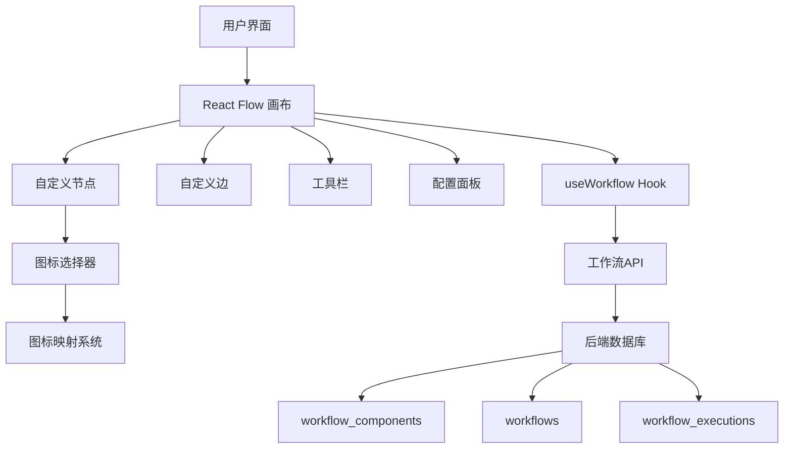
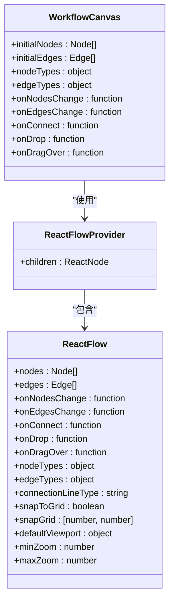
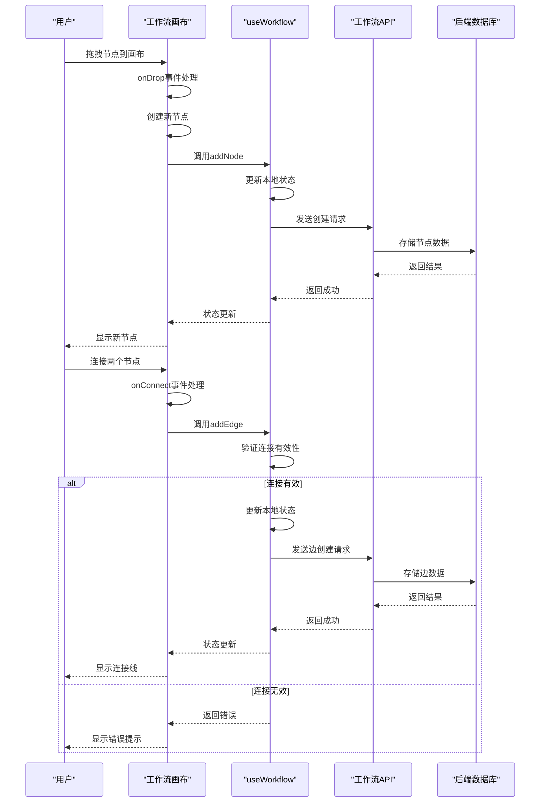
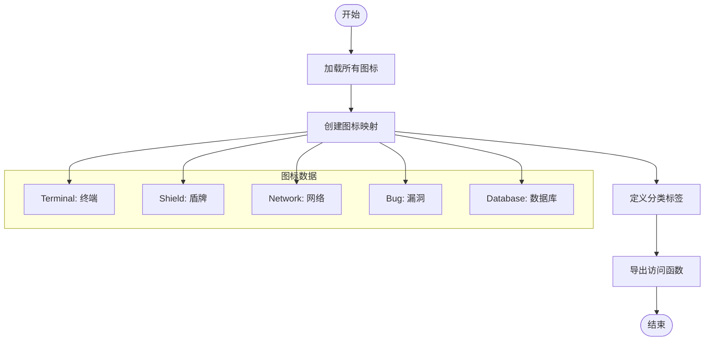
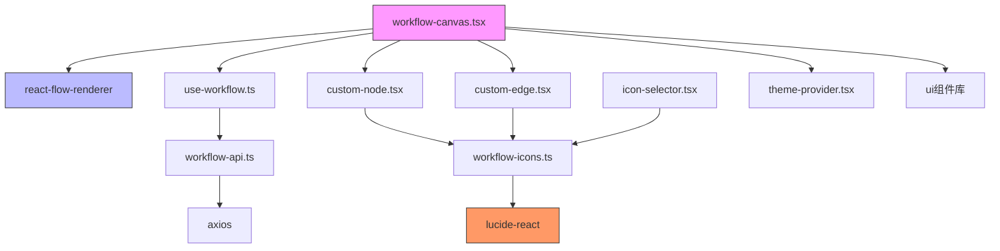

# 工作流画布

<cite>
**本文档引用的文件**  
- [workflow-canvas.tsx](file://front/components/workflow/canvas/workflow-canvas.tsx)
- [use-workflow.ts](file://front/hooks/workflow/use-workflow.ts)
- [custom-edge.tsx](file://front/components/workflow/canvas/custom-edge.tsx)
- [base-node.tsx](file://front/components/workflow/nodes/_base/base-node.tsx)
- [workflow-icons.ts](file://front/lib/icons/workflow-icons.ts)
- [初始化.sql](file://backend/初始化.sql)
- [icon-selector.tsx](file://front/components/ui/icon-selector.tsx)
</cite>

## 目录
1. [介绍](#介绍)
2. [项目结构](#项目结构)
3. [核心组件](#核心组件)
4. [架构概览](#架构概览)
5. [详细组件分析](#详细组件分析)
6. [依赖分析](#依赖分析)
7. [性能考虑](#性能考虑)
8. [故障排除指南](#故障排除指南)
9. [结论](#结论)

## 介绍
工作流画布是本安全扫描系统中的核心可视化组件，用于构建和编辑安全检测工作流。该组件基于React Flow库实现，提供直观的拖拽式节点编辑界面，支持用户自定义扫描流程。画布允许用户添加、连接和配置各类安全工具节点，形成完整的漏洞扫描工作流。通过与后端数据库的交互，工作流可被持久化存储并用于后续执行。

## 项目结构
工作流画布组件位于前端项目的特定目录结构中，与其他工作流相关组件协同工作。整个工作流模块采用组件化设计，分离关注点，便于维护和扩展。

```mermaid
graph TB
subgraph "前端组件"
WC["workflow-canvas.tsx"]
CN["custom-node.tsx"]
CE["custom-edge.tsx"]
UP["use-workflow.ts"]
WF["workflow-config-panel.tsx"]
end
subgraph "图标系统"
WI["workflow-icons.ts"]
IS["icon-selector.tsx"]
end
subgraph "后端数据"
DB["初始化.sql"]
WC --> UP
WC --> CN
WC --> CE
WC --> WI
UP --> DB
IS --> WI
```

**图示来源**  
- [workflow-canvas.tsx](file://front/components/workflow/canvas/workflow-canvas.tsx)
- [初始化.sql](file://backend/初始化.sql)

## 核心组件
工作流画布的核心功能由多个组件协同实现。`workflow-canvas.tsx`作为主组件，负责初始化React Flow实例并管理全局状态。`useWorkflow` Hook提供与后端API的交互能力，处理工作流的增删改查操作。自定义节点和边组件实现特定的视觉效果和交互行为。图标系统统一管理所有节点的可视化表示，确保风格一致性。

**组件来源**  
- [workflow-canvas.tsx](file://front/components/workflow/canvas/workflow-canvas.tsx)
- [use-workflow.ts](file://front/hooks/workflow/use-workflow.ts)

## 架构概览
工作流画布采用分层架构设计，将UI渲染、状态管理和数据持久化分离。React Flow提供基础的画布功能，包括节点拖拽、连接和缩放。自定义Hook封装业务逻辑，处理与后端服务的通信。组件间通过React上下文和状态管理机制进行数据传递，确保数据一致性。



**图示来源**  
- [workflow-canvas.tsx](file://front/components/workflow/canvas/workflow-canvas.tsx)
- [use-workflow.ts](file://front/hooks/workflow/use-workflow.ts)
- [初始化.sql](file://backend/初始化.sql)

## 详细组件分析

### 工作流画布分析
工作流画布组件是整个工作流编辑器的核心，负责渲染和管理所有可视化元素。它通过ReactFlowProvider提供全局状态，确保所有子组件能够访问和修改画布数据。

#### 组件结构


**图示来源**  
- [workflow-canvas.tsx](file://front/components/workflow/canvas/workflow-canvas.tsx)

#### 交互流程


**图示来源**  
- [workflow-canvas.tsx](file://front/components/workflow/canvas/workflow-canvas.tsx)
- [use-workflow.ts](file://front/hooks/workflow/use-workflow.ts)

### 图标系统分析
图标系统为工作流节点提供统一的视觉表示，支持分类管理和搜索功能。

#### 图标分类流程


**图示来源**  
- [workflow-icons.ts](file://front/lib/icons/workflow-icons.ts)

## 依赖分析
工作流画布组件依赖多个内部和外部库，形成复杂的依赖网络。这些依赖关系确保了组件的功能完整性和可维护性。



**图示来源**  
- [workflow-canvas.tsx](file://front/components/workflow/canvas/workflow-canvas.tsx)
- [workflow-icons.ts](file://front/lib/icons/workflow-icons.ts)

## 性能考虑
工作流画布在设计时考虑了多项性能优化措施，确保在处理复杂工作流时仍能保持流畅的用户体验。

- **节点更新防抖**：对频繁的状态更新操作进行防抖处理，避免不必要的重渲染
- **虚拟滚动**：对于大型工作流，采用虚拟滚动技术只渲染可见区域的节点
- **连接验证优化**：在连接建立前进行快速验证，避免无效操作导致的状态混乱
- **图标懒加载**：大型图标库采用按需加载策略，减少初始加载时间
- **状态批处理**：将多个状态变更操作合并为单次更新，提高React渲染效率

## 故障排除指南
当工作流画布出现异常时，可参考以下常见问题及解决方案：

- **节点无法拖拽**：检查浏览器控制台是否有JavaScript错误，确认React Flow库正确加载
- **连接线不显示**：验证边组件是否正确注册到React Flow实例的edgeTypes中
- **状态不同步**：检查useWorkflow Hook是否正确处理了API响应，确保本地状态与服务器同步
- **图标不显示**：确认图标名称与workflow-icons.ts中的定义完全匹配，注意大小写敏感
- **性能下降**：对于大型工作流，建议启用虚拟化功能，减少DOM节点数量

**组件来源**  
- [workflow-canvas.tsx](file://front/components/workflow/canvas/workflow-canvas.tsx)
- [use-workflow.ts](file://front/hooks/workflow/use-workflow.ts)

## 结论
工作流画布作为安全扫描系统的核心可视化组件，成功实现了直观、灵活的工作流编辑功能。通过基于React Flow的架构设计，组件提供了强大的图形化编辑能力，同时通过合理的状态管理和数据持久化机制确保了数据的一致性和可靠性。图标系统的引入增强了用户体验，使工作流结构更加清晰易懂。整体设计遵循了组件化和可扩展性原则，为未来功能扩展奠定了良好基础。