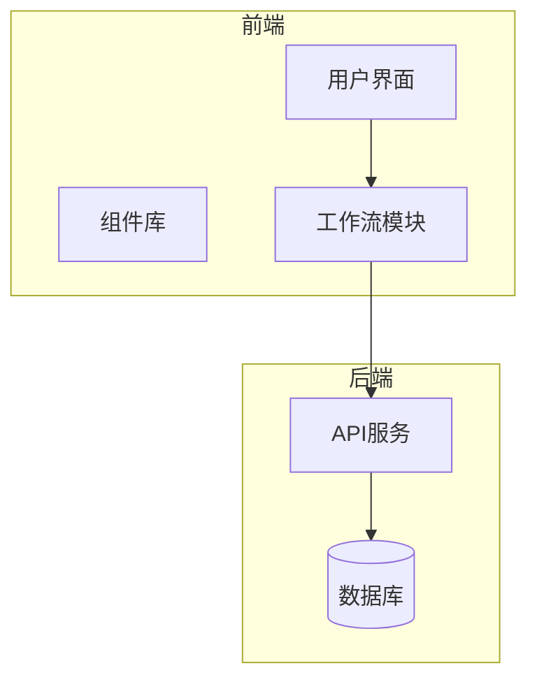
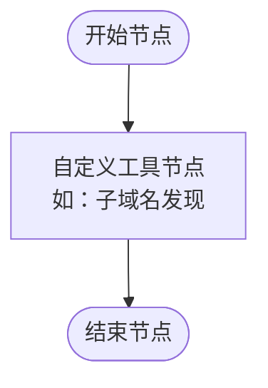
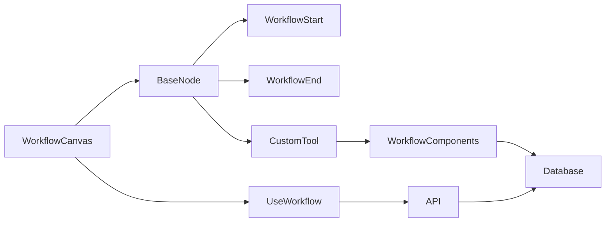

# 工作流节点

<cite>
**本文档引用的文件**  
- [初始化.sql](file://backend/初始化.sql#L58-L97)
- [workflow-icons.ts](file://front/lib/icons/workflow-icons.ts#L198-L226)
- [scan-create.tsx](file://front/components/pages/scan/create/scan-create.tsx#L364-L407)
</cite>

## 目录
1. [引言](#引言)
2. [项目结构](#项目结构)
3. [核心组件](#核心组件)
4. [架构概述](#架构概述)
5. [详细组件分析](#详细组件分析)
6. [依赖分析](#依赖分析)
7. [性能考虑](#性能考虑)
8. [故障排除指南](#故障排除指南)
9. [结论](#结论)

## 引言
本文档旨在深入解析工作流节点体系的实现机制，涵盖基础节点与具体节点类型（如起始节点、结束节点、自定义工具节点）的设计与功能。通过分析前端与后端代码结构，揭示节点如何封装通用样式、端口布局、拖拽行为，并作为其他节点的继承基类。同时，结合数据库定义与前端组件，说明节点的UI结构、数据模型与交互逻辑，以及如何响应用户操作并与状态管理同步。

## 项目结构
项目采用前后端分离架构，前端基于React与Next.js构建，后端使用Go语言开发。前端组件集中于`front`目录，包含UI组件、页面逻辑与工作流相关模块；后端位于`backend`目录，包含API路由、业务逻辑与数据库操作。工作流节点的核心数据结构定义于数据库脚本中，而前端通过React Flow等库实现可视化编辑。



**图示来源**  
- [初始化.sql](file://backend/初始化.sql#L58-L97)
- [scan-create.tsx](file://front/components/pages/scan/create/scan-create.tsx#L364-L407)

## 核心组件
工作流系统的核心组件包括节点定义、边连接、执行流程与状态管理。节点类型由`workflow_data`字段中的JSON结构定义，包含`id`、`type`、`position`和`data`等属性。每种节点类型对应不同的功能，如`workflow-start`表示流程起点，`custom-tool`表示可执行的安全扫描工具，`workflow-end`表示流程终点。

**本节来源**  
- [初始化.sql](file://backend/初始化.sql#L58-L97)

## 架构概述
系统采用模块化设计，前端通过`workflow-canvas.tsx`渲染工作流画布，利用`base-node.tsx`作为所有节点的基类，封装通用样式与交互逻辑。具体节点类型（如`workflow-start`、`workflow-end`、`custom-tool`）继承自基类，并扩展特定UI与行为。节点间通过边（edges）连接，形成有向无环图（DAG），表示执行顺序。

```mermaid
classDiagram
class BaseNode {
+id : string
+type : string
+position : {x : number, y : number}
+data : NodeData
+renderHandles()
+onDragStart()
+onDoubleClick()
}
class WorkflowStart {
+icon : StartIcon
+title : "开始"
+desc : "工作流开始节点"
}
class WorkflowEnd {
+icon : EndIcon
+title : "结束"
+desc : "工作流结束节点"
}
class CustomTool {
+toolConfig : {componentId : string}
+title : string
+desc : string
}
BaseNode <|-- WorkflowStart
BaseNode <|-- WorkflowEnd
BaseNode <|-- CustomTool
```

**图示来源**  
- [初始化.sql](file://backend/初始化.sql#L58-L97)
- [workflow-icons.ts](file://front/lib/icons/workflow-icons.ts#L198-L226)

## 详细组件分析

### 基础节点（BaseNode）
基础节点封装了所有工作流节点的通用行为，包括端口（handles）的布局、拖拽事件处理、双击编辑响应等。它通过React Flow库提供的API实现节点的可视化与交互，并作为其他节点类型的父类。

#### 节点数据模型
根据`workflow.types.ts`中的定义，节点数据结构如下：

```typescript
interface NodeData {
  title: string;
  desc: string;
  type: NodeType;
  toolConfig?: {
    componentId: string;
  };
}
```

其中`NodeType`为枚举类型，包含`workflow-start`、`workflow-end`、`custom-tool`等。

**本节来源**  
- [初始化.sql](file://backend/初始化.sql#L58-L97)

### 起始节点与结束节点
起始节点和结束节点是工作流的边界节点，分别表示流程的开始与终止。它们在UI上通常使用特定图标（如“开始”、“结束”）标识，并且不执行实际任务，仅用于定义流程的起点与终点。



**图示来源**  
- [初始化.sql](file://backend/初始化.sql#L214-L225)

### 自定义工具节点
自定义工具节点代表可执行的安全扫描任务，如使用Subfinder进行子域名发现、Nmap进行端口扫描等。每个工具节点通过`componentId`关联到`workflow_components`表中的具体工具配置，包含命令模板与占位符参数。

#### 工具组件表结构
```sql
CREATE TABLE workflow_components (
    id UUID PRIMARY KEY,
    name VARCHAR(255) NOT NULL UNIQUE,
    description TEXT,
    category VARCHAR(100) NOT NULL,
    icon VARCHAR(50) NOT NULL DEFAULT 'Terminal',
    command_template TEXT NOT NULL,
    placeholders JSONB,
    status VARCHAR(20) NOT NULL DEFAULT 'active'
);
```

**本节来源**  
- [初始化.sql](file://backend/初始化.sql#L58-L97)

## 依赖分析
工作流节点系统依赖多个前端与后端模块：
- 前端依赖`react-flow-renderer`实现画布与节点渲染
- 使用`zustand`或`useWorkflow`进行全局状态管理
- 后端通过`workflow-service.go`提供节点数据的持久化与执行调度
- 图标系统由`workflow-icons.ts`统一管理，支持按分类检索与搜索



**图示来源**  
- [初始化.sql](file://backend/初始化.sql#L58-L97)
- [workflow-icons.ts](file://front/lib/icons/workflow-icons.ts#L198-L226)

## 性能考虑
- 节点渲染采用虚拟化技术避免大量DOM节点导致的性能下降
- 工作流数据使用JSONB存储于PostgreSQL，支持高效查询与索引
- 前端使用`React.memo`优化节点重渲染
- 边连接采用自定义`security-edge`类型，确保视觉清晰与性能平衡

## 故障排除指南
常见问题包括节点无法拖拽、连接失败、工具执行异常等。排查步骤：
1. 检查浏览器控制台是否有JavaScript错误
2. 确认`workflow_data`结构符合JSON Schema
3. 验证`componentId`在`workflow_components`表中存在且状态为`active`
4. 查看后端日志确认API调用是否成功

**本节来源**  
- [初始化.sql](file://backend/初始化.sql#L58-L97)
- [scan-create.tsx](file://front/components/pages/scan/create/scan-create.tsx#L364-L407)

## 结论
工作流节点体系通过前后端协同实现，前端负责可视化编辑与用户交互，后端负责数据持久化与任务调度。基础节点封装通用逻辑，具体节点类型扩展功能，形成灵活可扩展的架构。未来可增加节点类型、支持条件分支、并行执行等高级功能。