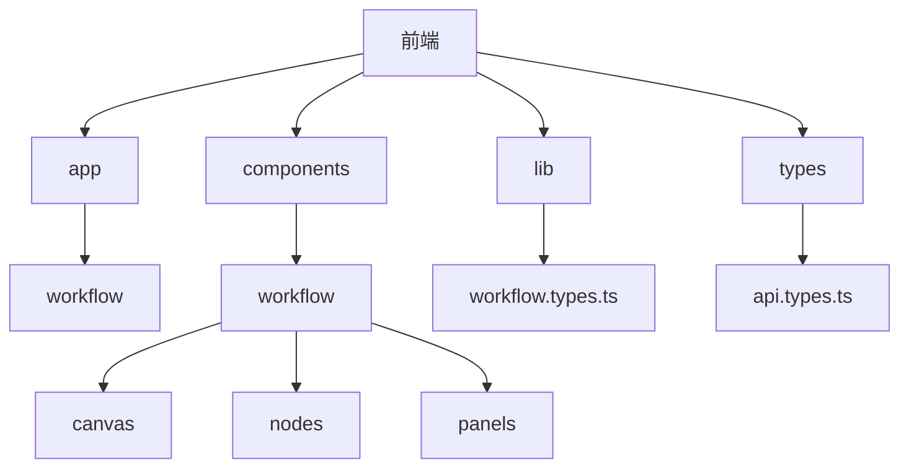
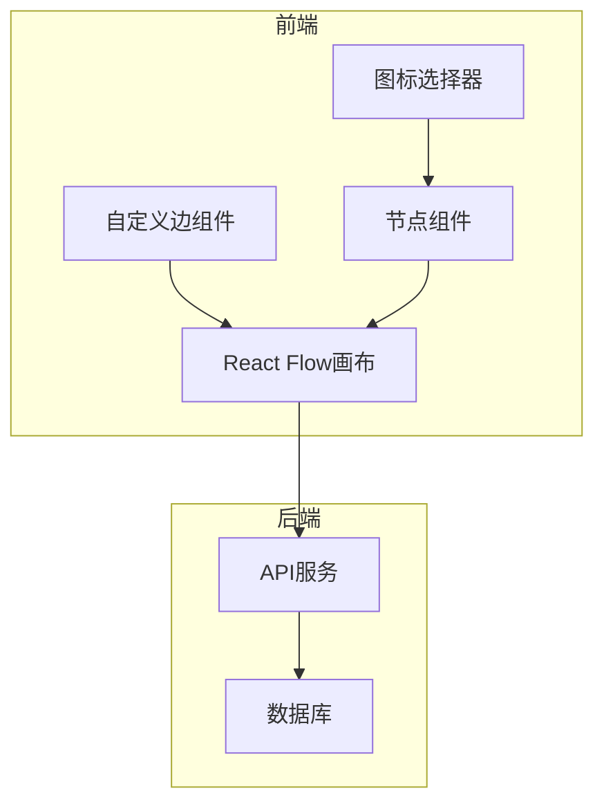
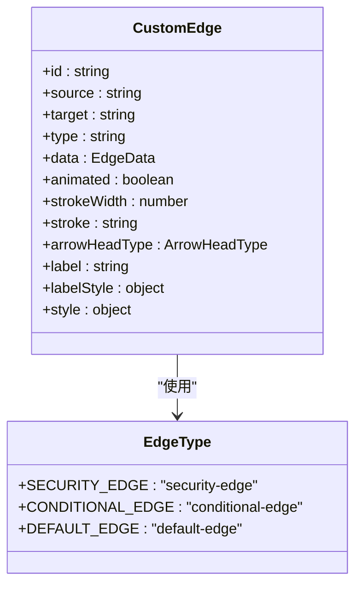
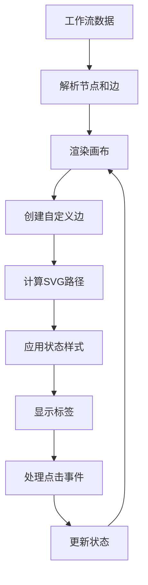

# 工作流边

<cite>
**本文档引用的文件**  
- [custom-edge.tsx](file://front/components/workflow/canvas/custom-edge.tsx)
- [workflow.types.ts](file://front/types/workflow.types.ts)
- [workflow-canvas.tsx](file://front/components/workflow/canvas/workflow-canvas.tsx)
</cite>

## 目录
1. [介绍](#介绍)
2. [项目结构](#项目结构)
3. [核心组件](#核心组件)
4. [架构概述](#架构概述)
5. [详细组件分析](#详细组件分析)
6. [依赖分析](#依赖分析)
7. [性能考虑](#性能考虑)
8. [故障排除指南](#故障排除指南)
9. [结论](#结论)

## 介绍
本项目是一个基于React和Next.js构建的安全漏洞扫描系统，包含前后端完整架构。前端使用React Flow实现可视化工作流编排功能，允许用户通过拖拽方式构建安全扫描流程。系统支持多种安全工具集成，如Subfinder、Nmap、Amass等，可进行子域名发现、端口扫描、Web漏洞检测等任务。工作流边（custom-edge）是可视化工作流中的关键组件，负责连接各个节点并展示执行路径、状态信息和条件标签。

## 项目结构
项目采用前后端分离架构，前端位于`front`目录，后端位于`backend`目录。前端使用Next.js框架，集成React Flow实现可视化工作流编辑器。工作流相关组件集中在`front/components/workflow`目录下，包括画布、节点、工具栏等。图标系统统一管理在`front/lib/icons/workflow-icons.ts`中，支持分类浏览和搜索过滤。



**Diagram sources**
- [project_structure](file://project_structure)

## 核心组件
工作流边（custom-edge.tsx）扩展了React Flow的默认边组件，实现了丰富的可视化效果。该组件支持带箭头的路径、条件标签显示、状态着色（成功/失败/进行中）等功能。边的数据结构定义在workflow.types.ts中，包含id、source、target、type等字段。自定义边通过SVG路径实现平滑曲线，并支持动态属性绑定和动画效果集成。

**Section sources**
- [custom-edge.tsx](file://front/components/workflow/canvas/custom-edge.tsx)
- [workflow.types.ts](file://front/types/workflow.types.ts)

## 架构概述
系统采用模块化设计，前端通过API与后端交互。工作流数据以JSON格式存储，包含节点和边的完整配置。React Flow提供画布基础功能，自定义组件扩展其能力。图标系统集中管理所有workflow相关图标，支持类型安全的引用。状态管理使用React内置的useState和useEffect，配合自定义Hook实现复杂逻辑。



**Diagram sources**
- [workflow-canvas.tsx](file://front/components/workflow/canvas/workflow-canvas.tsx)
- [custom-edge.tsx](file://front/components/workflow/canvas/custom-edge.tsx)

## 详细组件分析
### 自定义边组件分析
自定义边组件通过扩展React Flow的BaseEdge实现，主要功能包括路径渲染、箭头显示、标签展示和状态指示。组件根据边的type属性决定样式，支持security-edge等自定义类型。状态着色通过条件判断实现，成功为绿色，失败为红色，进行中为黄色。

#### 组件实现


**Diagram sources**
- [custom-edge.tsx](file://front/components/workflow/canvas/custom-edge.tsx)
- [workflow.types.ts](file://front/types/workflow.types.ts)

#### 数据流分析


**Diagram sources**
- [workflow-canvas.tsx](file://front/components/workflow/canvas/workflow-canvas.tsx)
- [custom-edge.tsx](file://front/components/workflow/canvas/custom-edge.tsx)

**Section sources**
- [custom-edge.tsx](file://front/components/workflow/canvas/custom-edge.tsx)
- [workflow-canvas.tsx](file://front/components/workflow/canvas/workflow-canvas.tsx)

## 依赖分析
工作流边组件依赖React Flow核心库和项目内的类型定义。通过@xyflow/react提供基础边功能，扩展为自定义视觉效果。与workflow.types.ts中的EdgeType定义紧密耦合，确保数据结构一致性。图标系统通过workflow-icons.ts集中管理，支持动态加载和搜索。

```mermaid
graph LR
A[custom-edge.tsx] --> B[@xyflow/react]
A --> C[workflow.types.ts]
A --> D[workflow-icons.ts]
B --> E[React]
C --> F[TypeScript]
D --> G[Lucide图标]
```

**Diagram sources**
- [pnpm-lock.yaml](file://front/pnpm-lock.yaml)
- [custom-edge.tsx](file://front/components/workflow/canvas/custom-edge.tsx)

**Section sources**
- [custom-edge.tsx](file://front/components/workflow/canvas/custom-edge.tsx)
- [workflow.types.ts](file://front/types/workflow.types.ts)

## 性能考虑
自定义边组件使用React.memo进行性能优化，避免不必要的重新渲染。SVG路径计算采用记忆化处理，提高重复渲染效率。大量边的情况下，建议启用虚拟滚动或简化视觉效果以保持流畅性。状态更新通过批量处理减少重绘次数。

## 故障排除指南
常见问题包括边不显示、标签错位、状态更新不及时等。检查边的type属性是否正确，确保数据结构符合EdgeType定义。验证SVG路径计算逻辑，确认坐标转换正确。对于状态更新问题，检查useEffect依赖数组是否完整。

**Section sources**
- [custom-edge.tsx](file://front/components/workflow/canvas/custom-edge.tsx)
- [workflow-canvas.tsx](file://front/components/workflow/canvas/workflow-canvas.tsx)

## 结论
工作流边组件成功扩展了React Flow的功能，提供了丰富的可视化效果和交互能力。通过合理的架构设计和性能优化，实现了高效稳定的工作流编排体验。未来可进一步增强动画效果和交互反馈，提升用户体验。