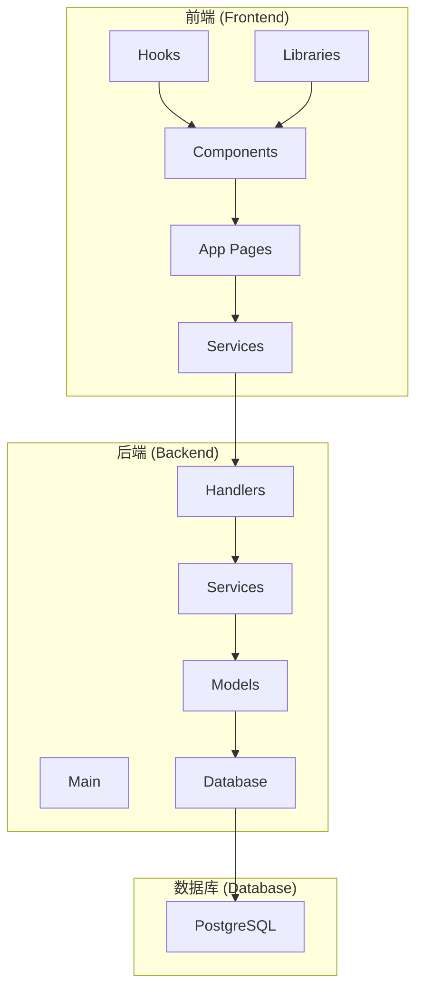
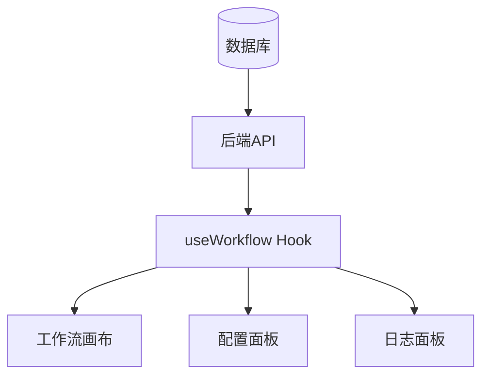
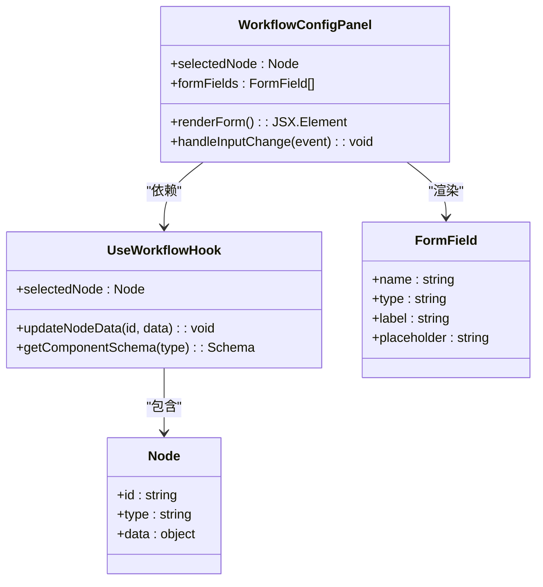
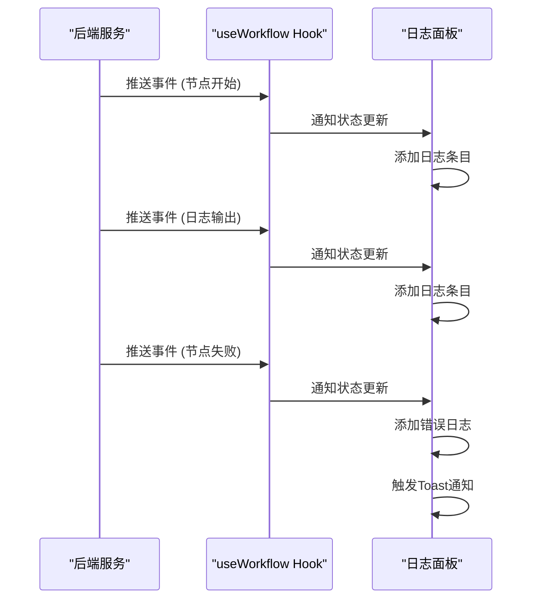
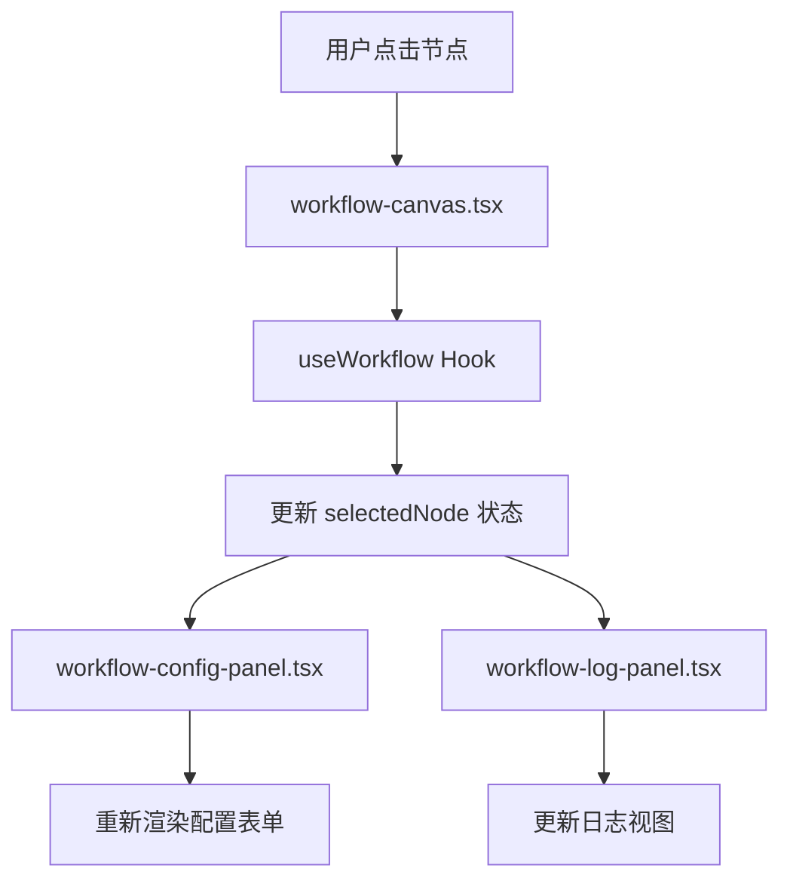
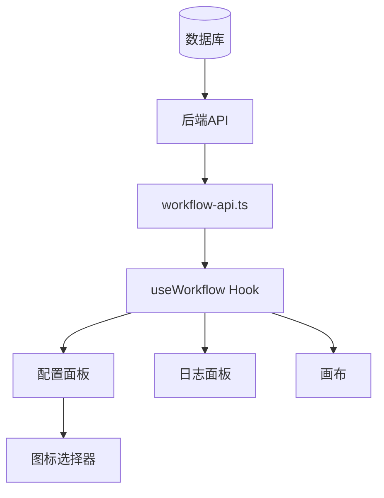

# 工作流面板

<cite>
**本文档引用的文件**   
- [workflow-config-panel.tsx](file://front/components/workflow/panels/workflow-config-panel.tsx)
- [workflow-log-panel.tsx](file://front/components/workflow/panels/workflow-log-panel.tsx)
- [use-workflow.ts](file://front/hooks/workflow/use-workflow.ts)
- [workflow-canvas.tsx](file://front/components/workflow/canvas/workflow-canvas.tsx)
- [base-node.tsx](file://front/components/workflow/nodes/_base/base-node.tsx)
- [workflow-icons.ts](file://front/lib/icons/workflow-icons.ts)
- [icon-selector.tsx](file://front/components/ui/icon-selector.tsx)
- [app-layout.tsx](file://front/components/layout/app-layout.tsx)
- [scan-create.tsx](file://front/components/pages/scan/create/scan-create.tsx)
- [初始化.sql](file://backend/初始化.sql)
</cite>

## 目录
1. [引言](#引言)
2. [项目结构](#项目结构)
3. [核心组件](#核心组件)
4. [架构概览](#架构概览)
5. [详细组件分析](#详细组件分析)
6. [依赖分析](#依赖分析)
7. [性能考量](#性能考量)
8. [故障排除指南](#故障排除指南)
9. [结论](#结论)

## 引言
本文档全面阐述了“工作流配置面板”与“日志面板”的设计与实现机制。系统通过React组件与自定义Hook协同工作，实现了可视化工作流的动态配置与执行监控。配置面板支持根据当前选中节点动态渲染表单控件，涵盖参数输入、条件设置与插件配置等功能，并通过`useWorkflow` Hook实现数据的双向绑定。日志面板则实时订阅工作流执行过程中的事件流，展示节点执行状态、输出日志与错误信息。两个面板通过React Context与状态管理机制与画布保持同步，确保用户操作的一致性。同时，系统还实现了面板布局切换、折叠控制与响应式适配等用户体验优化功能。

## 项目结构
项目采用前后端分离架构，前端基于Next.js框架构建，后端使用Go语言开发。前端代码位于`/front`目录，采用组件化设计，主要分为`app`（页面路由）、`components`（UI组件）、`hooks`（自定义Hook）、`lib`（工具库）和`services`（API服务）等模块。工作流相关的核心组件位于`/front/components/workflow`目录下，包括画布、节点、工具栏及配置与日志面板。后端代码位于`/backend`目录，采用标准的Go项目结构，包含`cmd`、`internal`、`models`、`services`等包，通过Gin框架提供RESTful API。数据库使用PostgreSQL，其表结构定义在`初始化.sql`文件中。

**图示来源**
- [app-layout.tsx](file://front/components/layout/app-layout.tsx#L68-L87)
- [初始化.sql](file://backend/初始化.sql#L58-L97)

## 核心组件
系统的核心功能由工作流画布、配置面板、日志面板和`useWorkflow` Hook共同实现。`workflow-canvas.tsx`是工作流的主视图，基于React Flow库构建，负责渲染节点和边，并处理用户的拖拽、连接等交互。`workflow-config-panel.tsx`和`workflow-log-panel.tsx`作为侧边栏面板，分别提供节点配置和执行日志功能。`useWorkflow.ts`是核心状态管理Hook，封装了工作流数据的获取、更新、执行等逻辑，并通过Context为整个工作流模块提供统一的数据源和操作接口。这些组件通过`useWorkflow` Hook紧密耦合，实现了数据驱动的UI更新。

**组件来源**
- [workflow-config-panel.tsx](file://front/components/workflow/panels/workflow-config-panel.tsx)
- [workflow-log-panel.tsx](file://front/components/workflow/panels/workflow-log-panel.tsx)
- [use-workflow.ts](file://front/hooks/workflow/use-workflow.ts)
- [workflow-canvas.tsx](file://front/components/workflow/canvas/workflow-canvas.tsx)

## 架构概览
系统的整体架构遵循分层设计原则。最底层是数据库，存储工作流定义、组件元数据和执行记录。中间层是后端API，提供对工作流资源的CRUD操作和执行触发。前端应用位于最上层，通过`workflow-api.ts`服务与后端通信。在前端内部，`useWorkflow` Hook作为数据中枢，从API获取数据并管理本地状态。UI组件（如画布、面板）订阅该Hook的状态，实现视图的自动更新。这种架构实现了关注点分离，使得数据逻辑与视图逻辑解耦，提高了代码的可维护性和可测试性。

**图示来源**
- [use-workflow.ts](file://front/hooks/workflow/use-workflow.ts)
- [workflow-api.ts](file://front/services/workflow/workflow-api.ts)

## 详细组件分析

### 配置面板分析
工作流配置面板（`workflow-config-panel.tsx`）是用户与工作流节点交互的主要界面。其核心功能是根据当前在画布上选中的节点，动态生成并渲染相应的配置表单。

#### 动态表单渲染
面板通过`useWorkflow` Hook获取当前选中的节点信息（`selectedNode`）。一旦节点被选中，面板会根据节点的类型（`type`）和预定义的元数据，从`workflow_components`表中加载对应的配置模板。该模板定义了表单所需的控件类型（如输入框、下拉菜单、开关等）、占位符和验证规则。面板使用React的条件渲染机制，遍历模板中的字段并生成对应的UI控件，从而实现“一个面板，适配所有节点”的灵活设计。

#### 双向数据绑定
面板与`useWorkflow` Hook之间建立了双向数据绑定。当用户在表单中修改参数时，`onChange`事件处理器会调用Hook提供的`updateNodeData`方法，将新的配置数据同步到全局状态中。反之，当`useWorkflow` Hook中的节点数据因外部操作（如API更新）而改变时，由于Hook状态的变化会触发面板组件的重新渲染，从而使表单UI自动更新以反映最新状态。这种机制确保了数据源的唯一性和UI的一致性。

#### 插件与条件配置
对于支持插件或条件分支的复杂节点，配置面板会提供专门的UI区域。例如，通过`icon-selector.tsx`组件，用户可以为节点选择一个图标，该组件提供了一个包含“终端”、“盾牌”、“网络”等安全领域图标的搜索和选择界面。对于条件节点，面板会渲染一个规则编辑器，允许用户添加、删除和配置多个条件表达式。

**图示来源**
- [workflow-config-panel.tsx](file://front/components/workflow/panels/workflow-config-panel.tsx)
- [use-workflow.ts](file://front/hooks/workflow/use-workflow.ts)
- [icon-selector.tsx](file://front/components/ui/icon-selector.tsx)

### 日志面板分析
工作流日志面板（`workflow-log-panel.tsx`）负责监控和展示工作流的执行过程。

#### 实时事件订阅
日志面板通过`useWorkflow` Hook订阅一个事件流（Event Stream）。当工作流开始执行时，后端会通过WebSocket或轮询机制推送执行事件。这些事件包括“节点开始执行”、“节点执行成功”、“节点执行失败”、“日志输出”等。面板监听这些事件，并将它们格式化后追加到日志列表中。

#### 状态与日志展示
面板以时间线的形式展示日志。每个日志条目包含时间戳、节点名称、事件类型（用不同颜色和图标区分）和详细信息。例如，一个成功的节点执行会显示为绿色的“✓”图标，而错误则会显示为红色的“✗”图标，并附带错误堆栈信息。用户可以通过折叠/展开操作来管理日志的可见性，避免信息过载。

#### 错误处理
当接收到错误事件时，日志面板不仅会高亮显示错误信息，还会触发`useToast` Hook弹出一个通知，确保用户不会错过关键的失败信息。同时，面板会更新对应节点在画布上的视觉状态（如变为红色），实现跨组件的状态同步。

**图示来源**
- [workflow-log-panel.tsx](file://front/components/workflow/panels/workflow-log-panel.tsx)
- [use-workflow.ts](file://front/hooks/workflow/use-workflow.ts)

### 画布与面板同步机制
配置面板和日志面板与工作流画布的同步是通过`useWorkflow` Hook和React Context实现的。

#### 状态共享
`useWorkflow` Hook内部维护着一个包含所有节点、边、执行状态等信息的全局状态。这个Hook被封装在一个`WorkflowContext`中。画布、配置面板和日志面板都通过`useContext`或直接调用`useWorkflow`来访问这个共享状态。当任何一个组件修改了状态（如面板更新了节点数据），React的响应式机制会自动触发所有订阅了该状态的组件进行重新渲染。

#### 选中节点同步
当用户在画布上点击一个节点时，`workflow-canvas.tsx`会调用`useWorkflow` Hook的`setSelectedNode`方法。这个状态变更会立即反映在`workflow-config-panel.tsx`中，使其重新渲染该节点的配置表单。这种基于状态的通信方式避免了复杂的直接组件引用，使得组件间的耦合度降到最低。

#### 响应式布局
面板的布局和折叠状态由`app-layout.tsx`中的`useSidebar` Hook管理。例如，当用户进入`/workflow/edit`页面时，`app-layout.tsx`会自动将侧边栏收起，为画布腾出更多空间。用户也可以手动点击折叠按钮来切换面板的可见性。这种响应式设计极大地提升了在大画布上的操作体验。

**图示来源**
- [workflow-canvas.tsx](file://front/components/workflow/canvas/workflow-canvas.tsx)
- [use-workflow.ts](file://front/hooks/workflow/use-workflow.ts)
- [app-layout.tsx](file://front/components/layout/app-layout.tsx#L68-L87)

## 依赖分析
系统各组件间的依赖关系清晰。前端组件高度依赖`useWorkflow` Hook作为数据源。`useWorkflow` Hook又依赖`workflow-api.ts`服务与后端进行数据交换。后端服务则直接依赖数据库进行持久化操作。UI组件之间通过共享状态进行通信，而非直接依赖。例如，`icon-selector.tsx`是一个独立的UI组件，被`workflow-config-panel.tsx`复用，但它不依赖于任何工作流特定的逻辑，体现了良好的组件复用性。

**图示来源**
- [初始化.sql](file://backend/初始化.sql)
- [workflow-api.ts](file://front/services/workflow/workflow-api.ts)
- [use-workflow.ts](file://front/hooks/workflow/use-workflow.ts)

## 性能考量
系统在性能方面做了多项优化。首先，`useWorkflow` Hook使用了`useMemo`和`useCallback`等React优化Hook，避免了不必要的计算和渲染。其次，日志面板采用虚拟滚动技术，当日志条目过多时，只渲染可视区域内的条目，保证了滚动的流畅性。此外，图标选择器（`icon-selector.tsx`）使用了`useMemo`对搜索结果进行缓存，提升了搜索性能。后端数据库对关键字段（如`workflows.id`）建立了索引，确保了查询效率。

## 故障排除指南
*   **问题：配置面板未更新。** 检查`useWorkflow` Hook中的`selectedNode`状态是否正确更新。确认画布组件是否正确调用了`setSelectedNode`。
*   **问题：日志未实时显示。** 检查后端事件推送服务是否正常运行。确认`useWorkflow` Hook的事件订阅逻辑是否有误。
*   **问题：节点图标不显示。** 检查`icon-selector.tsx`中`WORKFLOW_ICONS`映射是否包含该图标名称。确认`workflow-icons.ts`文件是否正确导出图标组件。
*   **问题：面板无法折叠。** 检查`app-layout.tsx`中的`useSidebar` Hook是否正确初始化。确认页面路由是否触发了自动收起逻辑。

**组件来源**
- [workflow-config-panel.tsx](file://front/components/workflow/panels/workflow-config-panel.tsx)
- [workflow-log-panel.tsx](file://front/components/workflow/panels/workflow-log-panel.tsx)
- [app-layout.tsx](file://front/components/layout/app-layout.tsx)

## 结论
工作流配置面板与日志面板的设计体现了现代前端应用的先进理念。通过将状态管理（`useWorkflow` Hook）与UI组件（面板、画布）分离，系统实现了高度的模块化和可维护性。动态表单渲染和双向数据绑定机制为用户提供了一个灵活且直观的配置界面。实时日志订阅功能则极大地增强了工作流执行过程的可观测性。整体架构清晰，依赖关系明确，为系统的持续演进奠定了坚实的基础。