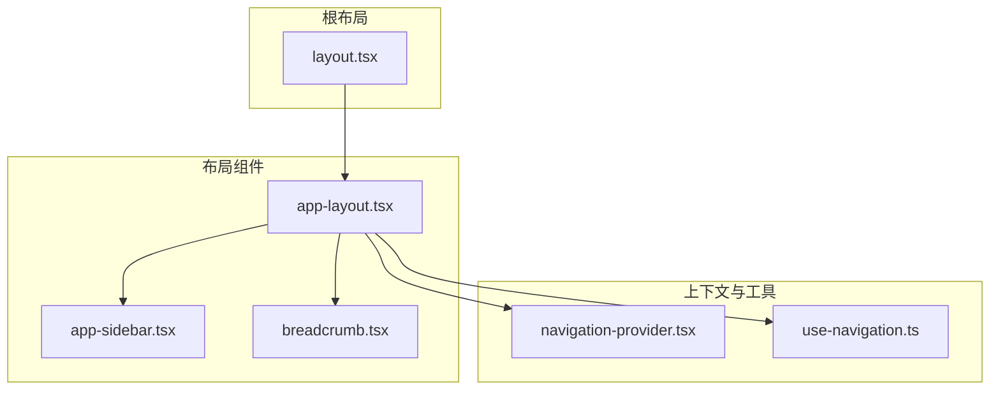
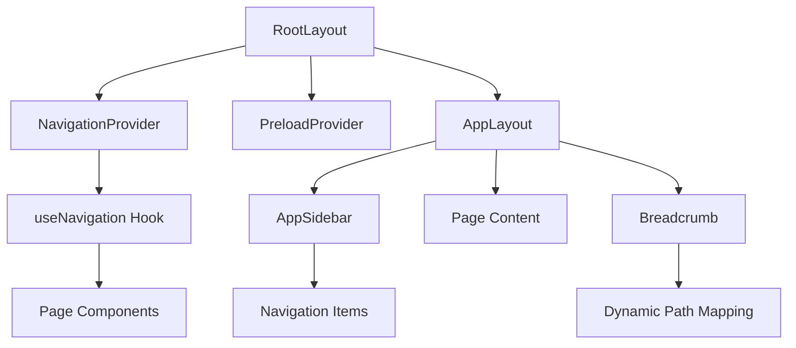
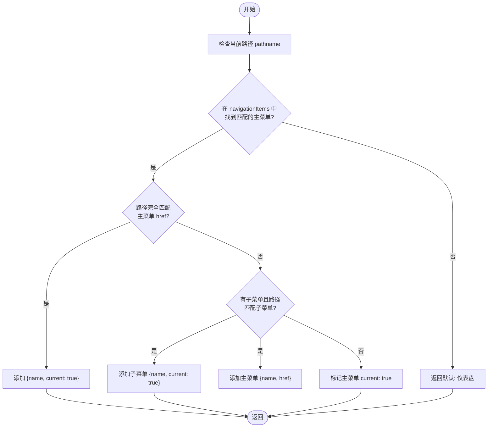
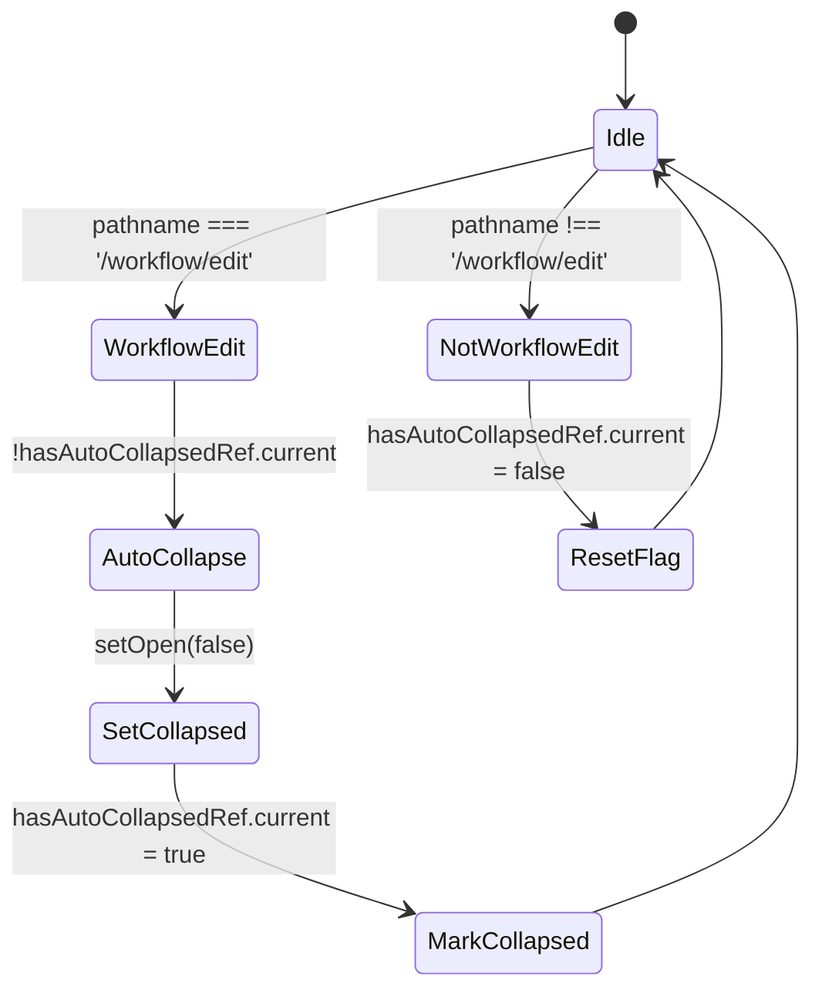
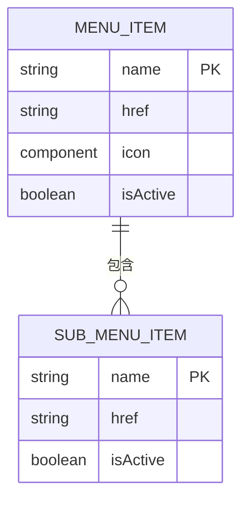
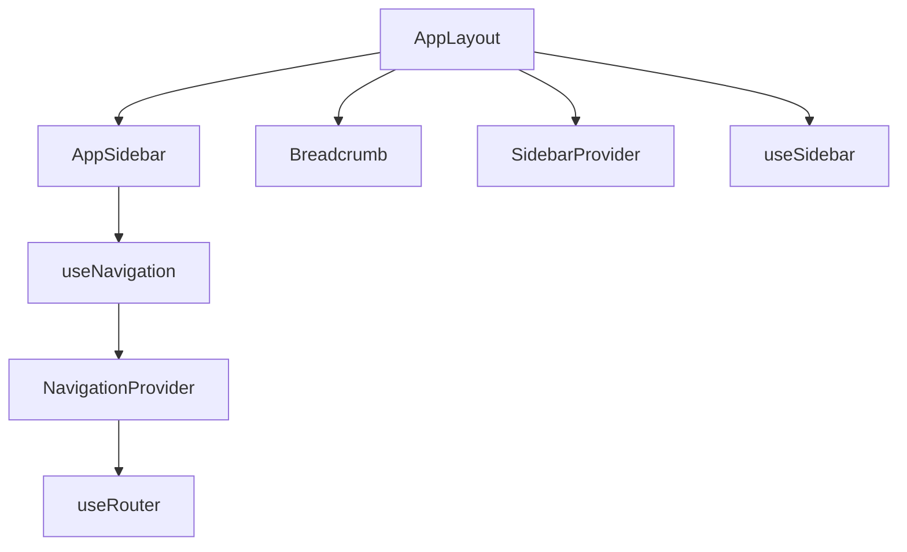

# 布局组件

<cite>
**本文档引用的文件**  
- [layout.tsx](file://front/app/layout.tsx)
- [app-layout.tsx](file://front/components/layout/app-layout.tsx)
- [app-sidebar.tsx](file://front/components/layout/app-sidebar.tsx)
- [breadcrumb.tsx](file://front/components/ui/breadcrumb.tsx)
- [navigation-provider.tsx](file://front/components/providers/navigation-provider.tsx)
- [use-navigation.ts](file://front/hooks/use-navigation.ts)
- [page.tsx](file://front/app/page.tsx)
</cite>

## 目录
1. [简介](#简介)
2. [项目结构](#项目结构)
3. [核心组件](#核心组件)
4. [架构概览](#架构概览)
5. [详细组件分析](#详细组件分析)
6. [依赖分析](#依赖分析)
7. [性能考虑](#性能考虑)
8. [故障排除指南](#故障排除指南)
9. [结论](#结论)

## 简介
本文档深入解析前端布局组件体系，重点阐述 `AppLayout` 主布局容器的结构设计，包括侧边栏（Sidebar）、导航栏（Navbar）与面包屑（Breadcrumb）的集成方式。说明布局组件如何通过 React Context 或 props 向下传递应用状态（如当前组织、用户权限），实现跨页面的一致性体验。结合 `layout.tsx` 文件分析 Next.js App Router 下的根布局实现机制，以及如何响应式适配桌面与移动端。提供在新页面中复用布局组件的标准模式，并展示如何动态更新 Breadcrumb 路径以反映用户导航状态。

## 项目结构
前端布局组件主要位于 `front/components/layout` 目录下，由 `AppLayout`、`AppSidebar` 和 `Breadcrumb` 组件构成。根布局文件 `front/app/layout.tsx` 定义了全局 HTML 结构和应用级提供者（Provider），而具体页面布局则通过 `AppLayout` 组件在各页面中复用。

**图示来源**  
- [layout.tsx](file://front/app/layout.tsx)
- [app-layout.tsx](file://front/components/layout/app-layout.tsx)
- [app-sidebar.tsx](file://front/components/layout/app-sidebar.tsx)

**本节来源**  
- [layout.tsx](file://front/app/layout.tsx)
- [app-layout.tsx](file://front/components/layout/app-layout.tsx)

## 核心组件
`AppLayout` 是应用的主布局容器，封装了侧边栏、顶部导航栏、面包屑导航和用户头像等 UI 元素。它通过 `SidebarProvider` 管理侧边栏的展开/收起状态，并利用 `usePathname` 钩子动态生成当前页面的面包屑路径。`AppSidebar` 组件定义了导航菜单结构，支持主菜单项和子菜单项的折叠展开。`Breadcrumb` 组件来自 UI 库，用于展示用户当前位置和导航路径。

**本节来源**  
- [app-layout.tsx](file://front/components/layout/app-layout.tsx#L1-L166)
- [app-sidebar.tsx](file://front/components/layout/app-sidebar.tsx#L1-L165)

## 架构概览
整个布局系统基于 Next.js App Router 构建，采用组件化和上下文管理的设计模式。根布局 `layout.tsx` 提供全局的 `NavigationProvider` 和 `PreloadProvider`，确保所有子页面都能访问导航状态和预加载功能。`AppLayout` 作为页面级布局组件，接收 `children` 和可选的 `breadcrumbItems` 属性，自动或手动渲染面包屑路径。侧边栏状态由 `SidebarProvider` 管理，通过 `useSidebar` 钩子在组件内部访问。

**图示来源**  
- [layout.tsx](file://front/app/layout.tsx#L1-L40)
- [app-layout.tsx](file://front/components/layout/app-layout.tsx#L1-L166)
- [navigation-provider.tsx](file://front/components/providers/navigation-provider.tsx#L1-L39)

## 详细组件分析

### AppLayout 分析
`AppLayout` 组件是整个应用布局的核心，负责整合侧边栏、导航栏和内容区域。它支持通过 `breadcrumbItems` 属性传入自定义面包屑，若未提供则根据当前路径自动推导。

#### 面包屑路径推导逻辑

**图示来源**  
- [app-layout.tsx](file://front/components/layout/app-layout.tsx#L21-L66)

#### 自动收起侧边栏逻辑
`AppLayout` 内部组件 `AppLayoutContent` 使用 `useEffect` 监听路径变化，当用户首次进入 `/workflow/edit` 页面时，自动收起侧边栏以提供更大的工作区。

**图示来源**  
- [app-layout.tsx](file://front/components/layout/app-layout.tsx#L68-L87)

**本节来源**  
- [app-layout.tsx](file://front/components/layout/app-layout.tsx#L1-L166)

### AppSidebar 分析
`AppSidebar` 组件定义了应用的导航菜单结构，使用 `@radix-ui/react-collapsible` 实现可折叠的子菜单。菜单项配置存储在 `navigationItems` 数组中，包含名称、链接、图标和可选的子菜单项。

#### 导航菜单结构

**图示来源**  
- [app-sidebar.tsx](file://front/components/layout/app-sidebar.tsx#L1-L165)

**本节来源**  
- [app-sidebar.tsx](file://front/components/layout/app-sidebar.tsx#L1-L165)

### Breadcrumb 分析
`Breadcrumb` 组件来自 UI 库，由多个子组件构成，包括 `BreadcrumbList`、`BreadcrumbItem`、`BreadcrumbLink` 和 `BreadcrumbPage`。`AppLayout` 根据当前路径调用 `getPathToBreadcrumb` 函数生成面包屑数据，然后渲染为可点击的导航链。

**本节来源**  
- [breadcrumb.tsx](file://front/components/ui/breadcrumb.tsx#L1-L115)
- [app-layout.tsx](file://front/components/layout/app-layout.tsx#L119-L163)

## 依赖分析
布局组件之间存在清晰的依赖关系。`AppLayout` 依赖 `AppSidebar` 和 `Breadcrumb` 组件，同时依赖 `SidebarProvider` 和 `useSidebar` 来管理侧边栏状态。`AppSidebar` 依赖 `useNavigation` 钩子进行页面跳转，而 `useNavigation` 又依赖 `NavigationProvider` 提供的上下文。

**图示来源**  
- [app-layout.tsx](file://front/components/layout/app-layout.tsx)
- [app-sidebar.tsx](file://front/components/layout/app-sidebar.tsx)
- [use-navigation.ts](file://front/hooks/use-navigation.ts)
- [navigation-provider.tsx](file://front/components/providers/navigation-provider.tsx)

**本节来源**  
- [app-layout.tsx](file://front/components/layout/app-layout.tsx)
- [app-sidebar.tsx](file://front/components/layout/app-sidebar.tsx)
- [use-navigation.ts](file://front/hooks/use-navigation.ts)

## 性能考虑
布局组件采用客户端渲染（"use client"），确保交互性。`AppLayout` 内部使用 `useRef` 存储状态，避免不必要的重新渲染。面包屑路径推导使用简单的循环查找，时间复杂度为 O(n)，在当前菜单项数量较少的情况下性能良好。对于更复杂的路径匹配，可考虑使用 Trie 树或哈希表优化。

## 故障排除指南
- **面包屑未更新**：检查 `pathname` 是否正确，确认 `navigationItems` 中的 `href` 与路径匹配。
- **侧边栏无法收起**：确保 `AppLayout` 被包裹在 `SidebarProvider` 内，检查 `useSidebar` 钩子是否正确导入。
- **导航无响应**：确认 `NavigationProvider` 已在根布局中提供，检查 `useNavigation` 是否在 Provider 内部使用。
- **样式错乱**：检查 Tailwind CSS 类名是否正确，确认 `globals.css` 已正确导入。

**本节来源**  
- [app-layout.tsx](file://front/components/layout/app-layout.tsx#L1-L166)
- [navigation-provider.tsx](file://front/components/providers/navigation-provider.tsx#L121-L170)
- [use-navigation.ts](file://front/hooks/use-navigation.ts#L0-L17)

## 结论
`AppLayout` 布局组件体系设计合理，实现了高复用性和良好的用户体验。通过将侧边栏、面包屑和导航状态管理解耦，使得各组件职责清晰，易于维护和扩展。动态面包屑生成和自动收起侧边栏等特性提升了应用的智能化水平。未来可考虑增加权限控制，根据用户角色动态渲染菜单项，进一步提升安全性。