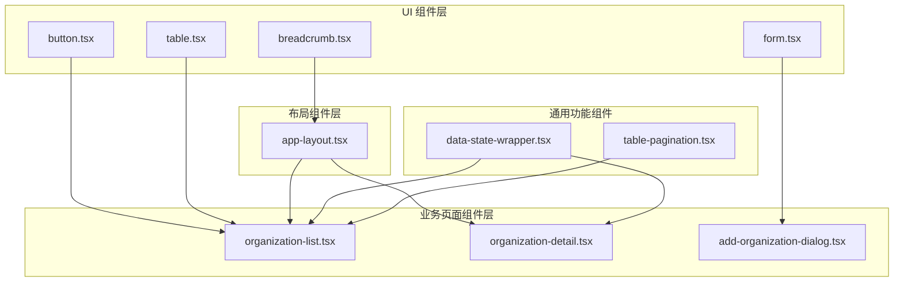
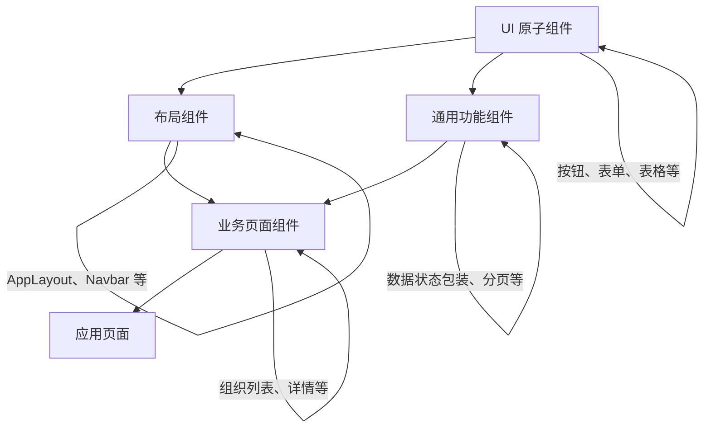
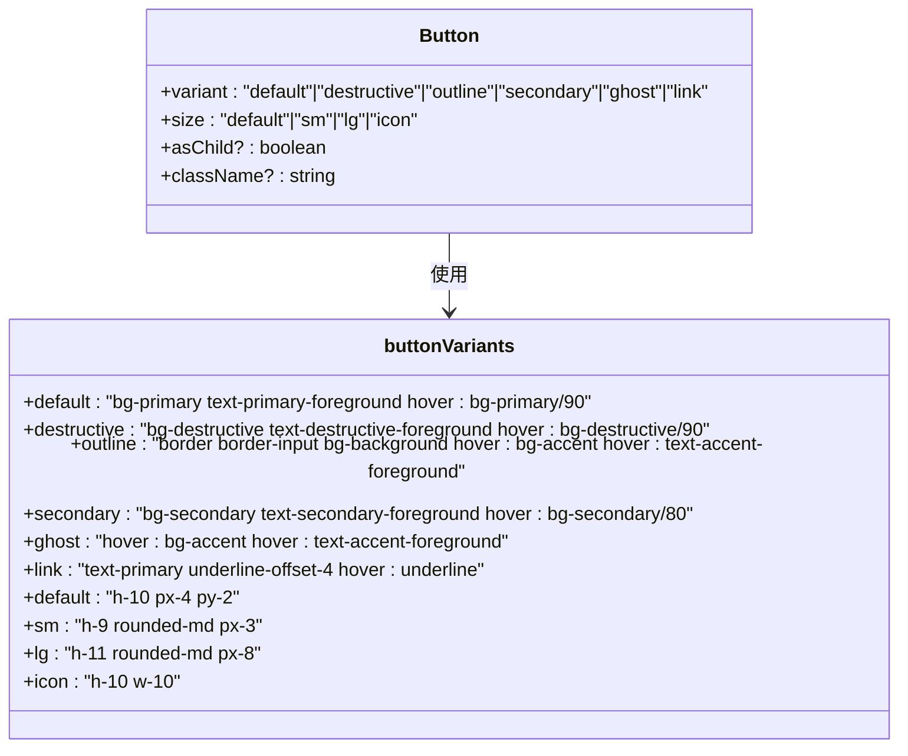
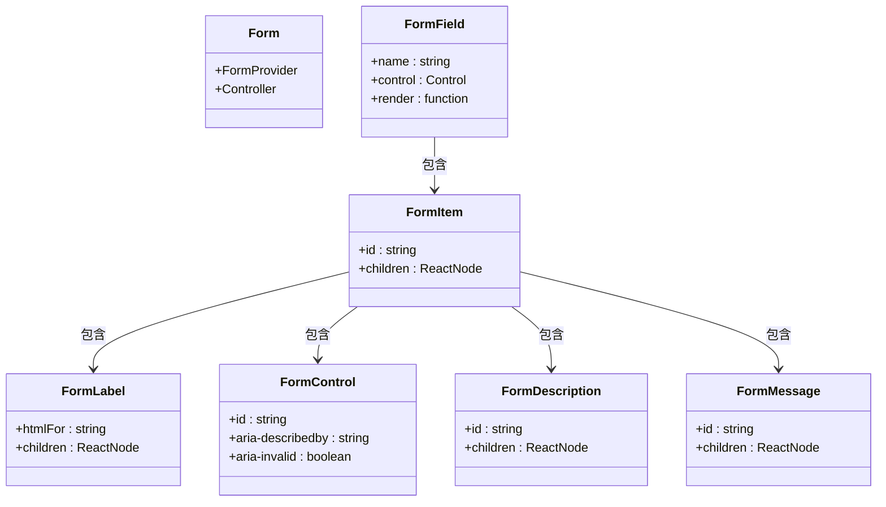
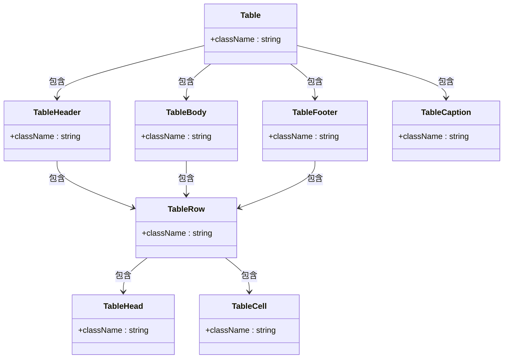
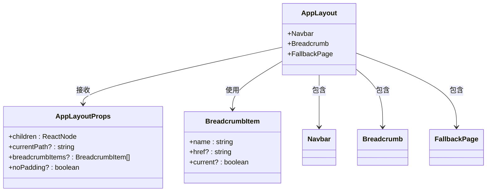
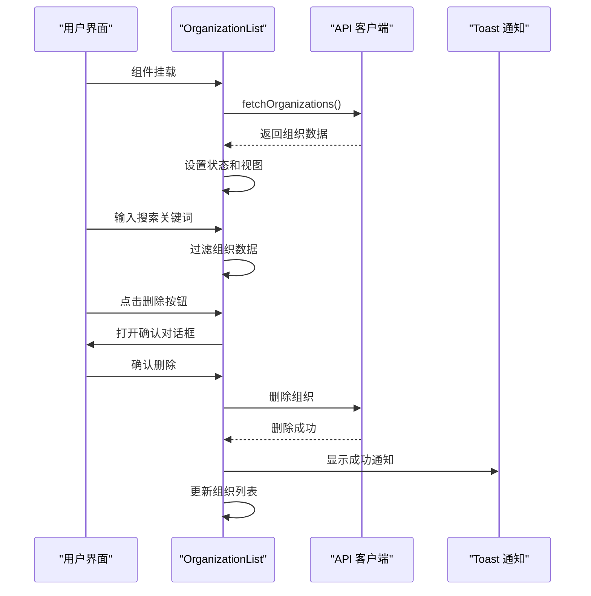
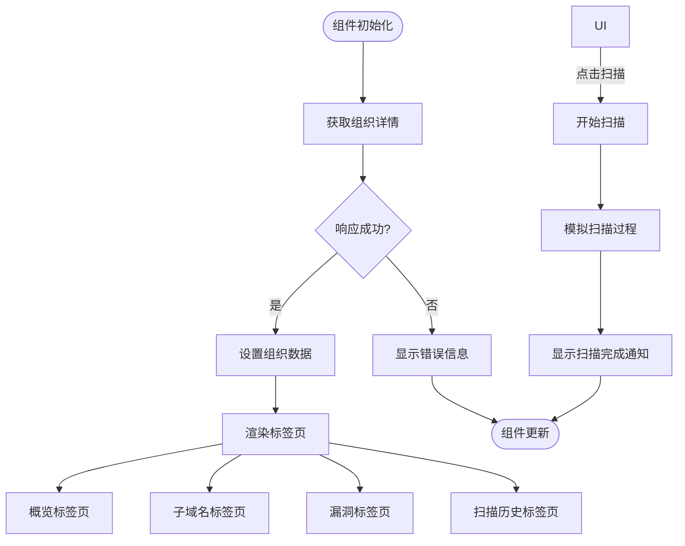
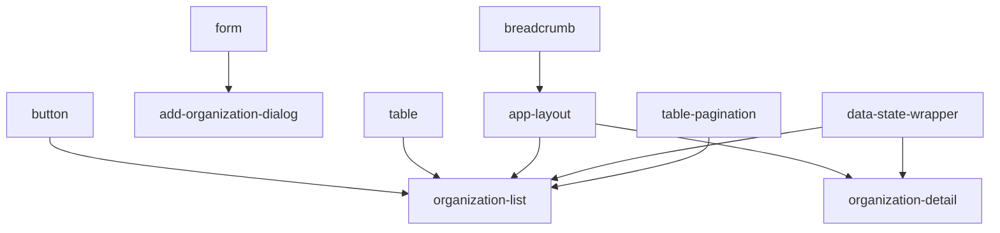

# 组件体系

<cite>
**本文档引用的文件**  
- [button.tsx](file://front/components/ui/button.tsx)
- [form.tsx](file://front/components/ui/form.tsx)
- [table.tsx](file://front/components/ui/table.tsx)
- [app-layout.tsx](file://front/components/layout/app-layout.tsx)
- [breadcrumb.tsx](file://front/components/ui/breadcrumb.tsx)
- [organization-list.tsx](file://front/components/pages/assets/organizations/organization-list.tsx)
- [organization-detail.tsx](file://front/components/pages/assets/organizations/organization-detail.tsx)
- [add-organization-dialog.tsx](file://front/components/pages/assets/organizations/add-organization-dialog.tsx)
- [data-state-wrapper.tsx](file://front/components/common/data-state-wrapper.tsx)
- [table-pagination.tsx](file://front/components/common/table-pagination.tsx)
</cite>

## 目录
1. [简介](#简介)
2. [项目结构](#项目结构)
3. [核心组件](#核心组件)
4. [架构概览](#架构概览)
5. [详细组件分析](#详细组件分析)
6. [依赖分析](#依赖分析)
7. [性能考虑](#性能考虑)
8. [故障排除指南](#故障排除指南)
9. [结论](#结论)

## 简介
本文档详细介绍了基于 Shadcn UI 构建的前端组件体系，涵盖 UI 原子组件、布局组件、业务页面组件和工作流组件的分层架构。重点分析了组件的设计原则、复用机制、领域逻辑封装以及实际使用场景，旨在为开发者提供清晰的组件使用和扩展指南。

## 项目结构
项目采用分层架构，将组件分为通用 UI 组件、布局组件、业务页面组件和工作流组件。这种结构提高了代码的可维护性和可复用性。

**图示来源**
- [button.tsx](file://front/components/ui/button.tsx)
- [form.tsx](file://front/components/ui/form.tsx)
- [table.tsx](file://front/components/ui/table.tsx)
- [breadcrumb.tsx](file://front/components/ui/breadcrumb.tsx)
- [app-layout.tsx](file://front/components/layout/app-layout.tsx)
- [organization-list.tsx](file://front/components/pages/assets/organizations/organization-list.tsx)
- [organization-detail.tsx](file://front/components/pages/assets/organizations/organization-detail.tsx)

**本节来源**
- [app-layout.tsx](file://front/components/layout/app-layout.tsx)
- [organization-list.tsx](file://front/components/pages/assets/organizations/organization-list.tsx)

## 核心组件
系统的核心组件包括基于 Shadcn UI 定制的原子化 UI 组件、可复用的布局组件和封装了业务逻辑的页面组件。这些组件通过清晰的 Props 传递和状态管理机制协同工作。

**本节来源**
- [button.tsx](file://front/components/ui/button.tsx)
- [form.tsx](file://front/components/ui/form.tsx)
- [table.tsx](file://front/components/ui/table.tsx)

## 架构概览
整个组件体系采用分层架构，从底层的原子化 UI 组件到顶层的业务页面组件，形成了清晰的依赖关系和职责划分。

**图示来源**
- [app-layout.tsx](file://front/components/layout/app-layout.tsx)
- [organization-list.tsx](file://front/components/pages/assets/organizations/organization-list.tsx)
- [organization-detail.tsx](file://front/components/pages/assets/organizations/organization-detail.tsx)

## 详细组件分析
对关键组件进行深入分析，包括其设计模式、实现细节和使用方法。

### UI 原子组件分析
基于 Shadcn UI 的原子化组件提供了统一的设计语言和交互体验。

#### 按钮组件分析
按钮组件使用 `class-variance-authority` 实现了灵活的样式变体管理。

**图示来源**
- [button.tsx](file://front/components/ui/button.tsx#L1-L56)

**本节来源**
- [button.tsx](file://front/components/ui/button.tsx#L1-L56)

#### 表单组件分析
表单组件集成了 react-hook-form，提供了完整的表单管理解决方案。

**图示来源**
- [form.tsx](file://front/components/ui/form.tsx#L1-L178)

**本节来源**
- [form.tsx](file://front/components/ui/form.tsx#L1-L178)

#### 表格组件分析
表格组件提供了完整的表格结构封装，支持响应式布局。

**图示来源**
- [table.tsx](file://front/components/ui/table.tsx#L1-L117)

**本节来源**
- [table.tsx](file://front/components/ui/table.tsx#L1-L117)

### 布局组件分析
布局组件提供了应用的整体结构和导航功能。

#### 应用布局组件分析
AppLayout 组件封装了应用的通用布局结构，包括导航栏和面包屑。

**图示来源**
- [app-layout.tsx](file://front/components/layout/app-layout.tsx#L1-L49)
- [breadcrumb.tsx](file://front/components/ui/breadcrumb.tsx#L1-L115)

**本节来源**
- [app-layout.tsx](file://front/components/layout/app-layout.tsx#L1-L49)

### 业务页面组件分析
业务页面组件封装了特定领域的业务逻辑和用户交互。

#### 组织列表组件分析
OrganizationList 组件展示了组织数据的完整管理功能。

**图示来源**
- [organization-list.tsx](file://front/components/pages/assets/organizations/organization-list.tsx#L1-L306)

**本节来源**
- [organization-list.tsx](file://front/components/pages/assets/organizations/organization-list.tsx#L1-L306)

#### 组织详情组件分析
OrganizationDetail 组件提供了组织的详细信息展示和操作功能。

**图示来源**
- [organization-detail.tsx](file://front/components/pages/assets/organizations/organization-detail.tsx#L1-L178)

**本节来源**
- [organization-detail.tsx](file://front/components/pages/assets/organizations/organization-detail.tsx#L1-L178)

## 依赖分析
组件之间的依赖关系清晰，遵循了低耦合、高内聚的设计原则。

**图示来源**
- [button.tsx](file://front/components/ui/button.tsx)
- [form.tsx](file://front/components/ui/form.tsx)
- [table.tsx](file://front/components/ui/table.tsx)
- [breadcrumb.tsx](file://front/components/ui/breadcrumb.tsx)
- [app-layout.tsx](file://front/components/layout/app-layout.tsx)
- [organization-list.tsx](file://front/components/pages/assets/organizations/organization-list.tsx)
- [organization-detail.tsx](file://front/components/pages/assets/organizations/organization-detail.tsx)
- [data-state-wrapper.tsx](file://front/components/common/data-state-wrapper.tsx)
- [table-pagination.tsx](file://front/components/common/table-pagination.tsx)

**本节来源**
- [app-layout.tsx](file://front/components/layout/app-layout.tsx)
- [organization-list.tsx](file://front/components/pages/assets/organizations/organization-list.tsx)

## 性能考虑
- 使用 `React.memo` 和 `useCallback` 优化组件渲染
- 采用分页加载减少初始数据量
- 使用虚拟滚动处理大量数据
- 合理使用状态管理避免不必要的重新渲染

## 故障排除指南
- **组件不显示**：检查父组件是否正确传递了必要的 Props
- **样式错乱**：确认 Tailwind CSS 类名是否正确，检查全局样式冲突
- **API 调用失败**：检查网络连接，验证 API 端点和参数
- **状态更新异常**：确保使用正确的状态更新模式，避免直接修改状态

## 结论
该组件体系通过分层架构和模块化设计，实现了高可维护性和可扩展性。基于 Shadcn UI 的原子化组件提供了统一的设计语言，而业务组件则有效封装了领域逻辑。建议在新功能开发中遵循现有模式，保持代码风格和架构的一致性。