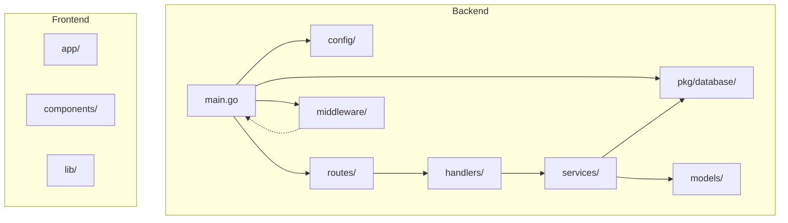
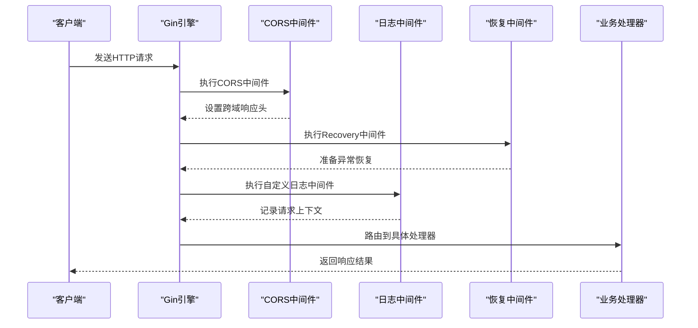
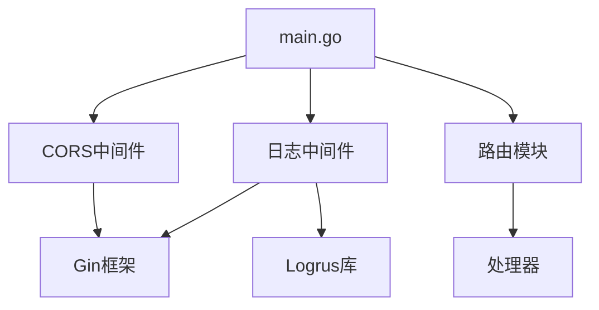

# 中间件系统

<cite>
**本文档引用的文件**  
- [cors.go](file://backend/internal/middleware/cors.go)
- [logger.go](file://backend/internal/middleware/logger.go)
- [main.go](file://backend/cmd/main.go)
- [routes.go](file://backend/routes/routes.go)
- [config.go](file://backend/config/config.go)
</cite>

## 目录
1. [简介](#简介)
2. [项目结构](#项目结构)
3. [核心组件](#核心组件)
4. [架构概览](#架构概览)
5. [详细组件分析](#详细组件分析)
6. [依赖分析](#依赖分析)
7. [性能考量](#性能考量)
8. [故障排查指南](#故障排查指南)
9. [结论](#结论)

## 简介
本文档详细记录了漏洞扫描系统后端中间件的实现机制与运行原理，重点解析CORS（跨域资源共享）和日志记录中间件在HTTP请求生命周期中的作用。通过分析`cors.go`和`logger.go`文件，阐述了跨域策略的配置方式以及基于Logrus的结构化日志方案。同时说明了中间件的注册机制与执行顺序，帮助开发者理解请求处理链的增强流程。

## 项目结构
本项目采用分层架构设计，主要分为前端（front）和后端（backend）两个部分。后端基于Go语言的Gin框架构建，遵循清晰的模块化结构，包含配置、路由、处理器、服务、模型、中间件等关键目录。



**图示来源**  
- [main.go](file://backend/cmd/main.go#L1-L110)
- [routes.go](file://backend/routes/routes.go#L1-L65)

## 核心组件
系统的核心中间件组件包括CORS中间件和自定义日志中间件。CORS中间件用于处理浏览器的跨域请求安全策略，允许前端开发环境顺利调用后端API。日志中间件则基于Logrus库实现结构化日志记录，便于系统监控和问题排查。

**本节来源**  
- [cors.go](file://backend/internal/middleware/cors.go#L1-L23)
- [logger.go](file://backend/internal/middleware/logger.go#L1-L26)

## 架构概览
整个系统的请求处理流程始于Gin引擎的初始化，在`main.go`中完成中间件的注册和路由的配置。当HTTP请求到达时，会依次经过多个中间件处理，最终路由到相应的处理器函数。



**图示来源**  
- [main.go](file://backend/cmd/main.go#L50-L77)
- [cors.go](file://backend/internal/middleware/cors.go#L1-L23)
- [logger.go](file://backend/internal/middleware/logger.go#L1-L26)

## 详细组件分析

### CORS中间件分析
CORS中间件用于解决前端开发中的跨域问题，通过设置适当的HTTP响应头，允许来自不同源的请求访问API资源。

```go
func CORS() gin.HandlerFunc {
	return func(c *gin.Context) {
		c.Header("Access-Control-Allow-Origin", "*")
		c.Header("Access-Control-Allow-Credentials", "true")
		c.Header("Access-Control-Allow-Headers", "Content-Type, Content-Length, Accept-Encoding, X-CSRF-Token, Authorization, accept, origin, Cache-Control, X-Requested-With")
		c.Header("Access-Control-Allow-Methods", "POST, OPTIONS, GET, PUT, DELETE")

		if c.Request.Method == "OPTIONS" {
			c.AbortWithStatus(204)
			return
		}

		c.Next()
	}
}
```

该中间件配置了以下跨域策略：
- **允许的源**: `*`（所有源），适用于开发环境
- **允许的凭据**: `true`，支持携带Cookie等认证信息
- **允许的头部**: 包含常用的内容类型、授权、缓存控制等头部字段
- **允许的方法**: 支持POST、GET、PUT、DELETE和OPTIONS方法

对于预检请求（OPTIONS方法），中间件直接返回204状态码并终止后续处理，符合CORS协议规范。

**本节来源**  
- [cors.go](file://backend/internal/middleware/cors.go#L1-L23)

### 日志中间件分析
日志中间件基于Logrus库实现，提供结构化的日志输出，便于日志收集和分析。

```go
func Logger() gin.HandlerFunc {
	return gin.LoggerWithFormatter(func(param gin.LogFormatterParams) string {
		logrus.WithFields(logrus.Fields{
			"method":     param.Method,
			"path":       param.Path,
			"status":     param.StatusCode,
			"latency":    param.Latency,
			"ip":         param.ClientIP,
			"user_agent": param.Request.UserAgent(),
			"timestamp":  param.TimeStamp.Format(time.RFC3339),
		}).Info("API Request")

		return ""
	})
}
```

该中间件记录的关键信息包括：
- **请求方法**: 如GET、POST等
- **请求路径**: 完整的URL路径
- **响应状态码**: HTTP状态码
- **延迟时间**: 请求处理耗时
- **客户端IP**: 发起请求的客户端IP地址
- **用户代理**: 客户端浏览器或应用信息
- **时间戳**: RFC3339格式的时间

日志以JSON格式输出，便于ELK等日志系统进行解析和可视化。

**本节来源**  
- [logger.go](file://backend/internal/middleware/logger.go#L1-L26)
- [main.go](file://backend/cmd/main.go#L20-L22)

### 中间件注册与执行顺序
在`main.go`的`setupRouter`函数中，中间件按照特定顺序注册，这决定了它们的执行顺序：

```go
r.Use(gin.Logger())
r.Use(gin.Recovery())
r.Use(middleware.CORS())
r.Use(middleware.Logger())
```

执行顺序如下：
1. Gin内置日志中间件
2. Gin内置恢复中间件（处理panic）
3. CORS中间件
4. 自定义日志中间件

这种顺序确保了即使在发生异常时，CORS头也能正确设置，同时自定义日志能记录完整的请求上下文。

**本节来源**  
- [main.go](file://backend/cmd/main.go#L58-L62)

## 依赖分析
中间件组件与其他系统组件存在明确的依赖关系：



**图示来源**  
- [main.go](file://backend/cmd/main.go#L1-L110)
- [cors.go](file://backend/internal/middleware/cors.go#L1-L23)
- [logger.go](file://backend/internal/middleware/logger.go#L1-L26)

## 性能考量
中间件对系统性能的影响较小，但需要注意：
- CORS中间件仅添加响应头，开销极小
- 日志中间件在每次请求结束时写入日志，应确保日志系统具有足够的I/O性能
- 在生产环境中，建议将CORS的`Access-Control-Allow-Origin`从`*`改为具体的前端域名，以提高安全性

## 故障排查指南
常见问题及解决方案：
- **跨域请求被拒绝**: 检查CORS中间件是否已正确注册，确认前端请求的源、方法和头部是否在允许范围内
- **日志未输出**: 确认Logrus的日志级别设置，检查是否有其他日志中间件冲突
- **OPTIONS请求失败**: 确保CORS中间件能正确处理预检请求并返回204状态码

**本节来源**  
- [cors.go](file://backend/internal/middleware/cors.go#L1-L23)
- [logger.go](file://backend/internal/middleware/logger.go#L1-L26)

## 结论
本系统的中间件设计合理，CORS中间件有效解决了开发环境的跨域问题，日志中间件提供了完善的请求追踪能力。通过在`main.go`中集中注册中间件，实现了请求处理链的清晰管理和扩展。建议在生产环境中进一步优化CORS策略，并考虑添加请求限流、身份验证等安全中间件。