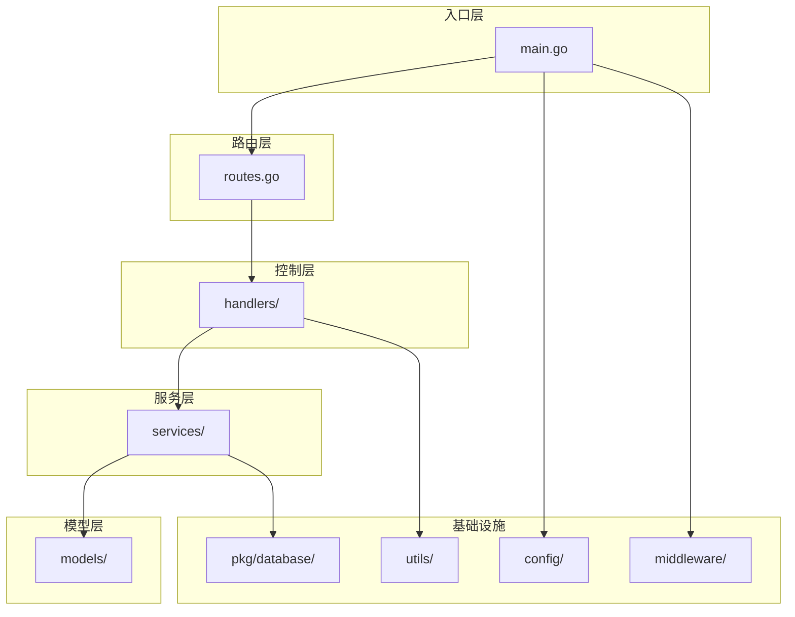
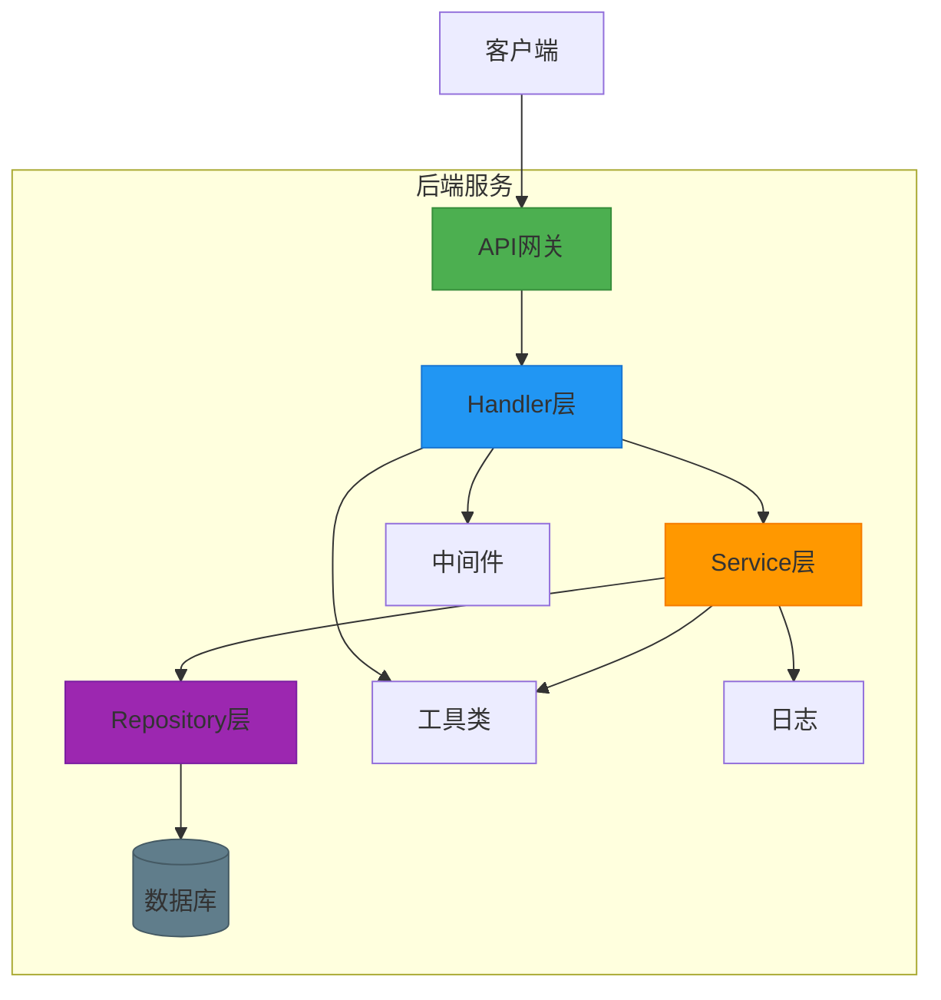
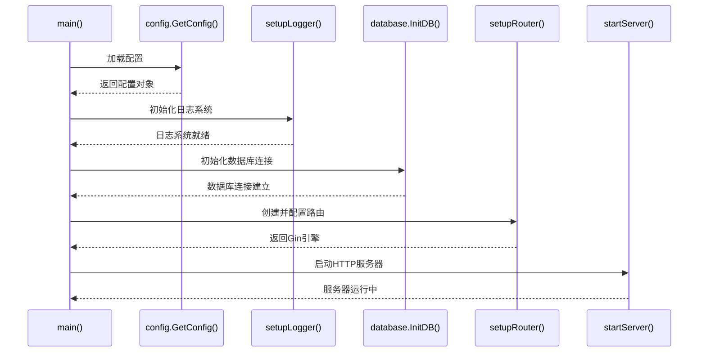
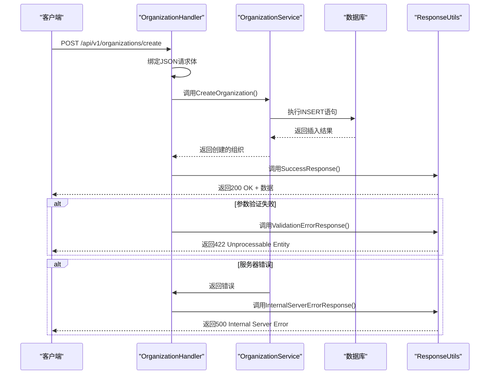
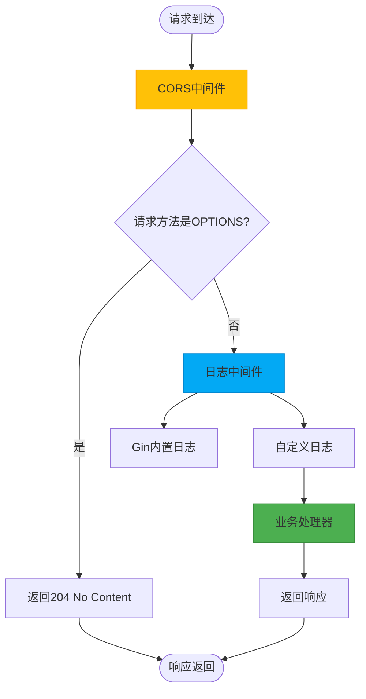
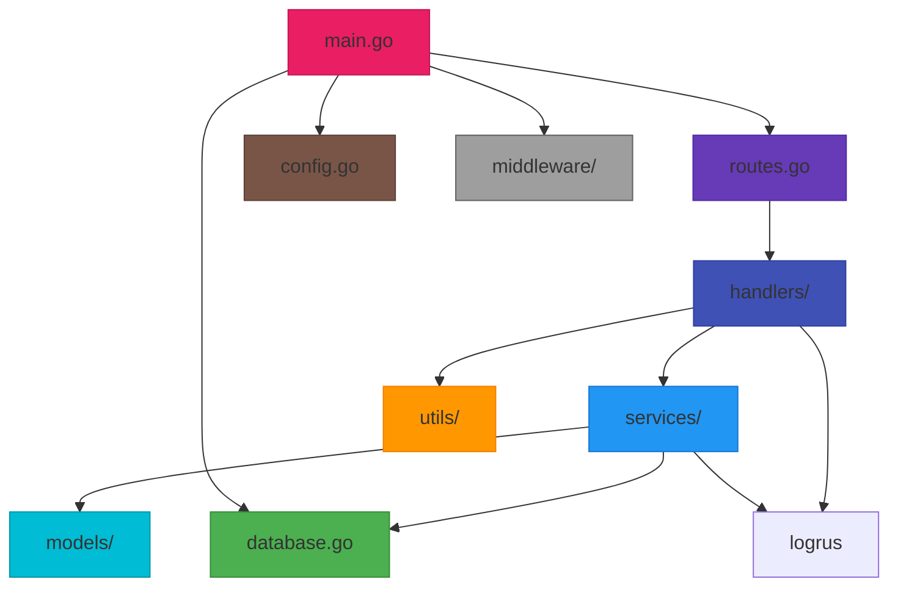

# 后端架构

<cite>
**本文档引用文件**   
- [main.go](file://backend/cmd/main.go)
- [routes.go](file://backend/routes/routes.go)
- [organization-handler.go](file://backend/internal/handlers/organization-handler.go)
- [organization-service.go](file://backend/internal/services/organization-service.go)
- [organization.go](file://backend/internal/models/organization.go)
- [cors.go](file://backend/internal/middleware/cors.go)
- [logger.go](file://backend/internal/middleware/logger.go)
- [response.go](file://backend/internal/utils/response.go)
- [config.go](file://backend/config/config.go)
- [database.go](file://backend/pkg/database/database.go)
</cite>

## 目录
1. [项目结构](#项目结构)
2. [核心组件](#核心组件)
3. [架构概览](#架构概览)
4. [详细组件分析](#详细组件分析)
5. [依赖分析](#依赖分析)
6. [性能考虑](#性能考虑)
7. [故障排除指南](#故障排除指南)
8. [结论](#结论)

## 项目结构

本项目采用标准的Go语言MVC分层架构，结合Gin框架实现RESTful API服务。项目结构清晰，按功能模块划分，主要包括：

- **cmd**: 程序入口，包含main.go
- **config**: 配置管理，包含配置文件和配置加载逻辑
- **internal**: 核心业务逻辑，包含handlers、services、models等MVC分层
- **pkg/database**: 数据库封装包
- **routes**: 路由注册中心
- **scripts**: 脚本文件
- **API_DOCUMENTATION.md**: API文档
- **初始化.sql**: 数据库初始化脚本



**图示来源**
- [main.go](file://backend/cmd/main.go#L1-L110)
- [routes.go](file://backend/routes/routes.go#L1-L65)

**本节来源**
- [main.go](file://backend/cmd/main.go#L1-L110)

## 核心组件

项目的核心组件遵循MVC设计模式，各层职责分明：

- **Main入口**: 程序启动入口，负责初始化配置、日志、数据库和路由
- **Router路由**: 统一注册API路由，将请求分发到对应的处理器
- **Handler处理器**: 处理HTTP请求，进行参数验证和响应封装
- **Service服务**: 封装业务逻辑，处理核心业务规则
- **Model模型**: 定义数据结构和数据库映射
- **Middleware中间件**: 提供跨切面功能，如CORS、日志记录

这些组件共同构成了一个可维护、可扩展的后端系统。

**本节来源**
- [main.go](file://backend/cmd/main.go#L1-L110)
- [routes.go](file://backend/routes/routes.go#L1-L65)

## 架构概览

系统采用分层架构设计，从上到下分别为：HTTP接口层、业务逻辑层、数据访问层。这种设计实现了关注点分离，提高了代码的可测试性和可维护性。



**图示来源**
- [main.go](file://backend/cmd/main.go#L1-L110)
- [routes.go](file://backend/routes/routes.go#L1-L65)
- [organization-handler.go](file://backend/internal/handlers/organization-handler.go#L1-L212)

**本节来源**
- [main.go](file://backend/cmd/main.go#L1-L110)

## 详细组件分析

### 主程序入口分析

main.go是应用程序的入口点，负责初始化整个系统。它按照特定顺序执行关键的初始化任务。



**图示来源**
- [main.go](file://backend/cmd/main.go#L15-L110)

**本节来源**
- [main.go](file://backend/cmd/main.go#L1-L110)

### 路由系统分析

路由系统采用模块化设计，通过路由组的方式组织API端点。每个功能模块都有独立的路由注册函数。

```mermaid
classDiagram
class Routes {
+SetupOrganizationRoutes(api *gin.RouterGroup)
+SetupScanRoutes(api *gin.RouterGroup)
+SetupAssetsRoutes(api *gin.RouterGroup)
+SetupWorkflowRoutes(api *gin.RouterGroup)
+SetupDashboardRoutes(api *gin.RouterGroup)
}
class RouterGroup {
+Group(relativePath string) *RouterGroup
+GET(relativePath string, handlers ...HandlerFunc)
+POST(relativePath string, handlers ...HandlerFunc)
+PUT(relativePath string, handlers ...HandlerFunc)
+DELETE(relativePath string, handlers ...HandlerFunc)
}
Routes --> RouterGroup : "使用"
note right of Routes
路由注册中心
- 按功能模块组织路由
- 使用Gin的路由组特性
- 支持版本化API (/api/v1)
end note
```

**图示来源**
- [routes.go](file://backend/routes/routes.go#L1-L65)

**本节来源**
- [routes.go](file://backend/routes/routes.go#L1-L65)

### 组织管理功能分析

组织管理功能展示了完整的MVC调用链，从HTTP请求到数据库操作的完整流程。



**图示来源**
- [organization-handler.go](file://backend/internal/handlers/organization-handler.go#L1-L212)
- [organization-service.go](file://backend/internal/services/organization-service.go#L1-L158)
- [organization.go](file://backend/internal/models/organization.go#L1-L32)

**本节来源**
- [organization-handler.go](file://backend/internal/handlers/organization-handler.go#L1-L212)

### 中间件系统分析

中间件系统提供了跨切面的功能支持，包括CORS和日志记录。



**图示来源**
- [cors.go](file://backend/internal/middleware/cors.go#L1-L23)
- [logger.go](file://backend/internal/middleware/logger.go#L1-L26)

**本节来源**
- [cors.go](file://backend/internal/middleware/cors.go#L1-L23)
- [logger.go](file://backend/internal/middleware/logger.go#L1-L26)

### 响应处理机制分析

统一的响应处理机制确保了API响应格式的一致性，提高了客户端的可预测性。

```mermaid
classDiagram
class APIResponse {
+Code string
+Message string
+Data interface{}
}
class ResponseUtils {
+SuccessResponse(c *gin.Context, data interface{})
+ErrorResponse(c *gin.Context, statusCode int, message string)
+BadRequestResponse(c *gin.Context, message string)
+NotFoundResponse(c *gin.Context, message string)
+InternalServerErrorResponse(c *gin.Context, message string)
+ValidationErrorResponse(c *gin.Context, message string)
}
ResponseUtils --> APIResponse : "创建"
note right of APIResponse
统一响应结构
- Code : 状态码 (SUCCESS/ERROR)
- Message : 人类可读消息
- Data : 业务数据 (仅成功时存在)
end note
note right of ResponseUtils
响应工具类
- 封装了常见的HTTP响应
- 确保响应格式一致性
- 简化错误处理
end note
```

**图示来源**
- [response.go](file://backend/internal/utils/response.go#L1-L49)
- [organization.go](file://backend/internal/models/organization.go#L1-L32)

**本节来源**
- [response.go](file://backend/internal/utils/response.go#L1-L49)

## 依赖分析

系统各组件之间的依赖关系清晰，遵循了依赖倒置原则，高层模块依赖于抽象而非具体实现。



**图示来源**
- [main.go](file://backend/cmd/main.go#L1-L110)
- [routes.go](file://backend/routes/routes.go#L1-L65)
- [organization-handler.go](file://backend/internal/handlers/organization-handler.go#L1-L212)

**本节来源**
- [main.go](file://backend/cmd/main.go#L1-L110)

## 性能考虑

系统在设计时考虑了性能因素，主要体现在以下几个方面：

1. **数据库连接池**: 通过database/sql包的连接池机制，复用数据库连接，减少连接开销
2. **批量操作支持**: 提供批量删除接口，减少网络往返次数
3. **查询优化**: 在服务层进行数据库查询优化，避免N+1查询问题
4. **超时设置**: HTTP服务器设置了读写超时，防止请求长时间挂起
5. **日志级别控制**: 支持不同运行模式下的日志级别配置，生产环境使用INFO级别减少日志开销

虽然当前的搜索功能在应用层实现（内存中过滤），但在数据量增大时建议迁移到数据库层面的全文搜索。

## 故障排除指南

### 常见错误及解决方案

**Section sources**
- [response.go](file://backend/internal/utils/response.go#L1-L49)
- [organization-handler.go](file://backend/internal/handlers/organization-handler.go#L1-L212)

#### 400 Bad Request
- **原因**: 请求参数缺失或格式错误
- **解决方案**: 检查请求JSON是否符合API文档要求，确保必填字段存在

#### 404 Not Found
- **原因**: 请求的资源不存在
- **解决方案**: 检查URL路径和资源ID是否正确，确认资源确实存在

#### 422 Unprocessable Entity
- **原因**: 请求参数验证失败
- **解决方案**: 检查请求体中的数据类型和格式，确保符合验证规则

#### 500 Internal Server Error
- **原因**: 服务器内部错误，通常是数据库操作失败
- **解决方案**: 查看服务器日志，检查数据库连接和SQL语句

### 调试建议

1. **启用调试模式**: 在config.yaml中设置mode为"debug"，获取更详细的错误信息
2. **查看日志**: 检查服务器输出的JSON格式日志，包含请求方法、路径、状态码、延迟等信息
3. **使用健康检查**: 访问/health端点确认服务器是否正常运行
4. **数据库检查**: 确认数据库服务是否运行，检查表结构是否与代码匹配

## 结论

本项目采用Go语言和Gin框架构建了一个结构清晰、可维护的后端系统。通过MVC分层架构，实现了关注点分离，提高了代码的可测试性和可扩展性。系统具有以下特点：

1. **清晰的架构**: 采用标准的MVC模式，各层职责分明
2. **良好的可扩展性**: 模块化的路由设计，便于添加新的功能模块
3. **健壮的错误处理**: 统一的响应格式和错误处理机制
4. **生产就绪**: 包含日志、监控、CORS等生产环境必需的功能
5. **易于维护**: 代码结构清晰，注释完整，便于团队协作

建议未来可以考虑引入以下改进：
- 添加单元测试和集成测试
- 实现更复杂的搜索功能（如数据库全文搜索）
- 增加身份认证和授权机制
- 引入缓存机制提高性能
- 完善API文档和版本管理