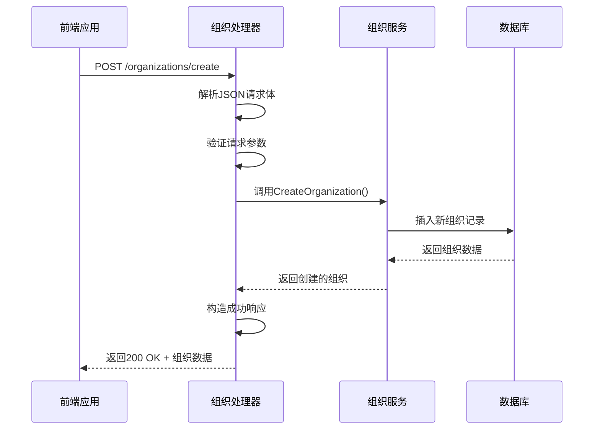
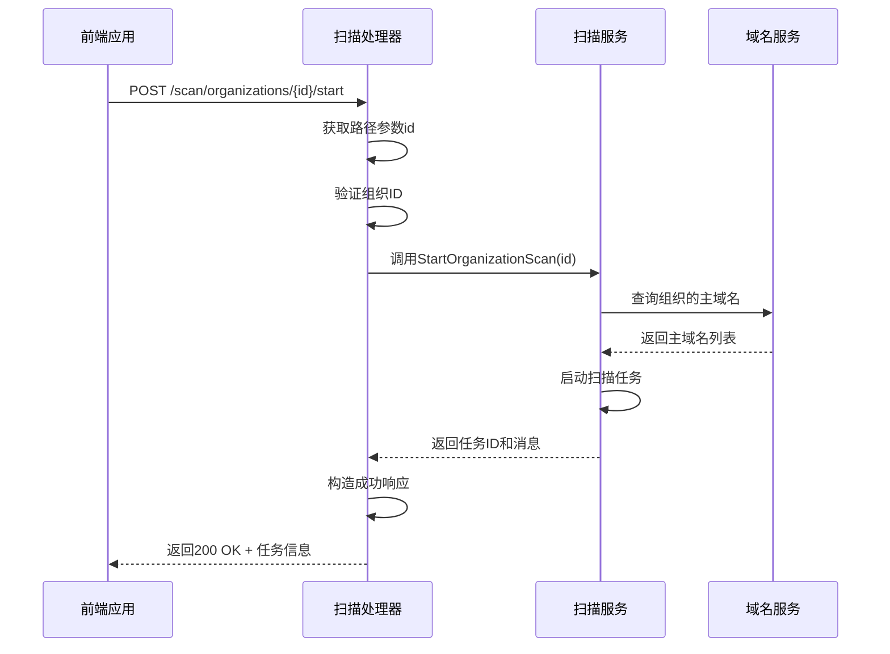

# 处理器层

<cite>
**本文档引用的文件**   
- [organization-handler.go](file://backend/internal/handlers/organization-handler.go)
- [scan-handler.go](file://backend/internal/handlers/scan-handler.go)
- [domain-handler.go](file://backend/internal/handlers/domain-handler.go)
- [vulnerability-handler.go](file://backend/internal/handlers/vulnerability-handler.go)
- [response.go](file://backend/internal/models/response.go)
- [response.go](file://backend/internal/utils/response.go)
- [routes.go](file://backend/routes/routes.go)
- [organization.go](file://backend/internal/models/organization.go)
- [scan.go](file://backend/internal/models/scan.go)
</cite>

## 目录
1. [引言](#引言)
2. [处理器层概述](#处理器层概述)
3. [核心处理器分析](#核心处理器分析)
4. [请求处理流程详解](#请求处理流程详解)
5. [错误处理机制](#错误处理机制)
6. [响应封装规范](#响应封装规范)
7. [与前端API的对应关系](#与前端api的对应关系)
8. [职责边界与解耦设计](#职责边界与解耦设计)

## 引言
本文档深入剖析了漏洞扫描系统中处理器层（handlers）的设计与实现。处理器层作为MVC架构中的控制器，负责接收HTTP请求、解析参数、调用服务层方法并构造响应。文档以组织创建和资产扫描为例，详细展示了请求处理的全流程，涵盖了错误处理模式、请求验证机制、响应封装规范以及与前端API调用的对应关系，强调了处理器层的职责边界和解耦设计原则。

## 处理器层概述
处理器层位于系统的最上层，直接与HTTP请求交互。它不包含任何业务逻辑，其主要职责是：
- 接收来自前端的HTTP请求
- 解析请求参数（如路径参数、查询参数、JSON体）
- 调用对应的服务层（services）方法执行业务逻辑
- 将服务层的返回结果封装成标准的API响应格式
- 处理并返回各种错误情况

该层的设计遵循了清晰的职责分离原则，确保了业务逻辑与HTTP协议细节的解耦。

**Section sources**
- [organization-handler.go](file://backend/internal/handlers/organization-handler.go#L1-L10)
- [scan-handler.go](file://backend/internal/handlers/scan-handler.go#L1-L10)

## 核心处理器分析

### 组织处理器分析
组织处理器（organization-handler.go）负责处理所有与组织管理相关的HTTP请求。



**Diagram sources**
- [organization-handler.go](file://backend/internal/handlers/organization-handler.go#L20-L40)
- [organization.go](file://backend/internal/models/organization.go#L15-L25)

#### 创建组织流程
`CreateOrganization` 函数是创建新组织的核心处理器。其工作流程如下：
1.  **参数绑定**：使用 `c.ShouldBindJSON(&req)` 将HTTP请求体中的JSON数据绑定到 `models.CreateOrganizationRequest` 结构体上。
2.  **参数验证**：Gin框架会根据结构体标签（如 `binding:"required"`）自动进行验证。如果验证失败，会返回422 Unprocessable Entity错误。
3.  **服务调用**：创建 `OrganizationService` 实例，并调用其 `CreateOrganization` 方法。
4.  **错误处理**：如果服务层返回错误，处理器会根据错误类型调用相应的错误响应函数（如 `InternalServerErrorResponse`）。
5.  **成功响应**：如果创建成功，调用 `SuccessResponse` 函数返回200 OK状态码和包含新组织数据的响应。

**Section sources**
- [organization-handler.go](file://backend/internal/handlers/organization-handler.go#L20-L40)
- [organization.go](file://backend/internal/models/organization.go#L15-L25)

### 扫描处理器分析
扫描处理器（scan-handler.go）负责处理与资产扫描相关的操作。



**Diagram sources**
- [scan-handler.go](file://backend/internal/handlers/scan-handler.go#L15-L30)
- [scan.go](file://backend/internal/models/scan.go#L15-L30)

#### 启动扫描流程
`StartOrganizationScan` 函数用于启动对指定组织的扫描任务。
1.  **路径参数提取**：通过 `c.Param("id")` 获取URL路径中的组织ID。
2.  **参数验证**：检查ID是否为空，若为空则返回400 Bad Request错误。
3.  **服务调用**：创建 `ScanService` 实例，并调用 `StartOrganizationScan` 方法。
4.  **业务逻辑错误处理**：服务层可能会返回特定的业务错误，例如“该组织没有主域名可以扫描”。处理器会识别这类错误并返回400 Bad Request，而不是500 Internal Server Error，以提供更精确的用户反馈。
5.  **响应返回**：成功时返回200 OK和包含任务ID的响应。

**Section sources**
- [scan-handler.go](file://backend/internal/handlers/scan-handler.go#L15-L30)
- [scan.go](file://backend/internal/models/scan.go#L15-L30)

## 请求处理流程详解
处理器层的请求处理流程是一个标准化的模式，以 `GetOrganizationByID` 为例：

```go
func GetOrganizationByID(c *gin.Context) {
	id := c.Param("id") // 1. 提取路径参数
	if id == "" {
		utils.BadRequestResponse(c, "组织ID不能为空") // 2. 验证参数
		return
	}

	service := services.NewOrganizationService() // 3. 实例化服务
	organization, err := service.GetOrganizationByID(id) // 4. 调用服务方法
	if err != nil {
		if err.Error() == "organization not found" { // 5. 特定错误处理
			utils.NotFoundResponse(c, "组织不存在")
			return
		}
		utils.InternalServerErrorResponse(c, "获取组织详情失败: "+err.Error()) // 6. 通用错误处理
		return
	}

	utils.SuccessResponse(c, organization) // 7. 成功响应
}
```

这个流程清晰地展示了从请求接收到响应返回的七个步骤，确保了代码的可读性和一致性。

**Section sources**
- [organization-handler.go](file://backend/internal/handlers/organization-handler.go#L42-L65)

## 错误处理机制
处理器层实现了分层的错误处理策略，以提供清晰的错误信息。

```mermaid
flowchart TD
A[HTTP请求] --> B{参数验证}
B --> |失败| C[ValidationErrorResponse<br/>422 Unprocessable Entity]
B --> |成功| D[调用服务层]
D --> E{服务返回错误?}
E --> |是| F{错误类型}
F --> |业务逻辑错误<br/>(如"组织不存在")| G[NotFoundResponse<br/>404 Not Found]
F --> |参数错误<br/>(如"ID为空")| H[BadRequestResponse<br/>400 Bad Request]
F --> |其他错误| I[InternalServerErrorResponse<br/>500 Internal Server Error]
E --> |否| J[SuccessResponse<br/>200 OK]
C --> K[返回错误响应]
G --> K
H --> K
I --> K
J --> K
```

**Diagram sources**
- [organization-handler.go](file://backend/internal/handlers/organization-handler.go#L42-L65)
- [utils/response.go](file://backend/internal/utils/response.go#L15-L48)

处理器会根据错误的性质选择不同的HTTP状态码和响应函数：
- **`BadRequestResponse` (400)**：用于客户端请求参数错误，如ID为空。
- **`NotFoundResponse` (404)**：用于资源未找到，如组织不存在。
- **`ValidationErrorResponse` (422)**：用于请求体JSON数据验证失败。
- **`InternalServerErrorResponse` (500)**：用于服务器内部未知错误。

这种精细化的错误处理有助于前端应用准确地判断错误原因并做出相应处理。

**Section sources**
- [utils/response.go](file://backend/internal/utils/response.go#L15-L48)

## 响应封装规范
所有处理器都使用 `utils/response.go` 中定义的函数来封装响应，确保了API响应格式的统一。

```mermaid
classDiagram
class APIResponse {
+Code string
+Message string
+Data interface{}
}
class SuccessResponse {
+SuccessResponse(c *gin.Context, data interface{})
}
class ErrorResponse {
+ErrorResponse(c *gin.Context, statusCode int, message string)
+BadRequestResponse(c *gin.Context, message string)
+NotFoundResponse(c *gin.Context, message string)
+InternalServerErrorResponse(c *gin.Context, message string)
+ValidationErrorResponse(c *gin.Context, message string)
}
SuccessResponse --> APIResponse : "构造"
ErrorResponse --> APIResponse : "构造"
```

**Diagram sources**
- [models/response.go](file://backend/internal/models/response.go#L4-L10)
- [utils/response.go](file://backend/internal/utils/response.go#L15-L48)

通用的API响应结构体 `APIResponse` 定义了三个字段：
- **`Code`**: 状态码，如 "SUCCESS" 或 "ERROR"。
- **`Message`**: 人类可读的描述信息。
- **`Data`**: 实际的业务数据，在成功响应时返回。

通过 `SuccessResponse` 和 `ErrorResponse` 等函数，处理器可以轻松地生成符合规范的JSON响应，例如：
```json
{
  "code": "SUCCESS",
  "message": "操作成功",
  "data": {
    "id": "org-123",
    "name": "示例组织"
  }
}
```

**Section sources**
- [models/response.go](file://backend/internal/models/response.go#L4-L10)
- [utils/response.go](file://backend/internal/utils/response.go#L15-L48)

## 与前端API的对应关系
处理器层的路由定义在 `routes/routes.go` 文件中，明确地将URL路径映射到具体的处理器函数。

```go
func SetupOrganizationRoutes(api *gin.RouterGroup) {
	orgGroup := api.Group("/organizations")
	{
		orgGroup.GET("", handlers.GetOrganizations) // GET /organizations
		orgGroup.POST("/create", handlers.CreateOrganization) // POST /organizations/create
		orgGroup.GET("/:id", handlers.GetOrganizationByID) // GET /organizations/{id}
	}
}
```

前端应用（位于 `front/` 目录）通过Axios等HTTP客户端库，根据这些路由规则发起请求。例如，前端的 `organization.service.ts` 会调用 `/organizations/create` 来创建新组织。这种清晰的映射关系使得前后端的协作变得简单而高效。

**Section sources**
- [routes.go](file://backend/routes/routes.go#L10-L25)

## 职责边界与解耦设计
处理器层的设计严格遵循了单一职责原则和解耦原则。

- **职责边界**：处理器只负责HTTP层面的交互，包括参数解析、响应构造和基础验证。所有核心业务逻辑（如创建组织、启动扫描）都委托给服务层（services）处理。这使得处理器代码简洁、易于测试和维护。
- **解耦设计**：处理器通过接口与服务层交互，而不是直接操作数据库。这使得服务层可以独立演化，例如更换数据库或添加缓存，而无需修改处理器代码。同时，`utils/response.go` 提供了统一的响应封装，进一步降低了各处理器之间的耦合度。

这种设计模式极大地提高了代码的可维护性和可扩展性。

**Section sources**
- [organization-handler.go](file://backend/internal/handlers/organization-handler.go#L1-L10)
- [scan-handler.go](file://backend/internal/handlers/scan-handler.go#L1-L10)
- [routes.go](file://backend/routes/routes.go#L1-L10)