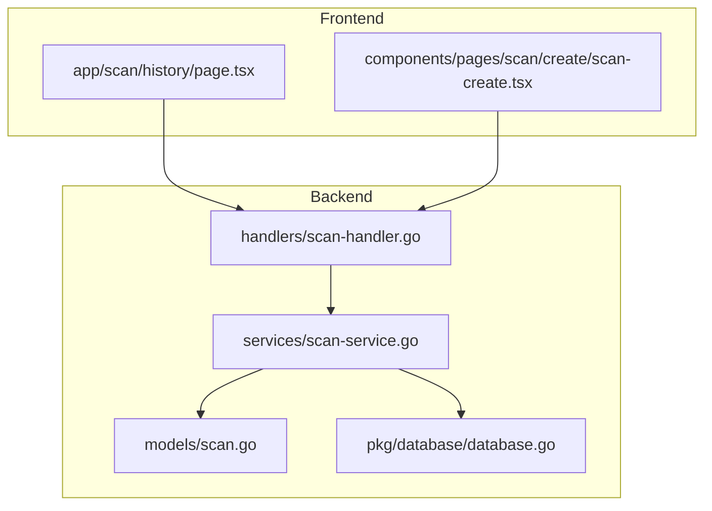
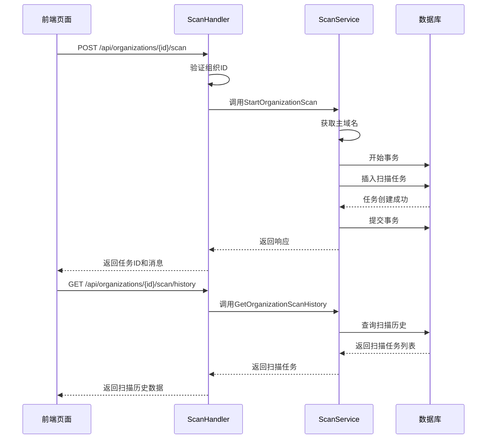
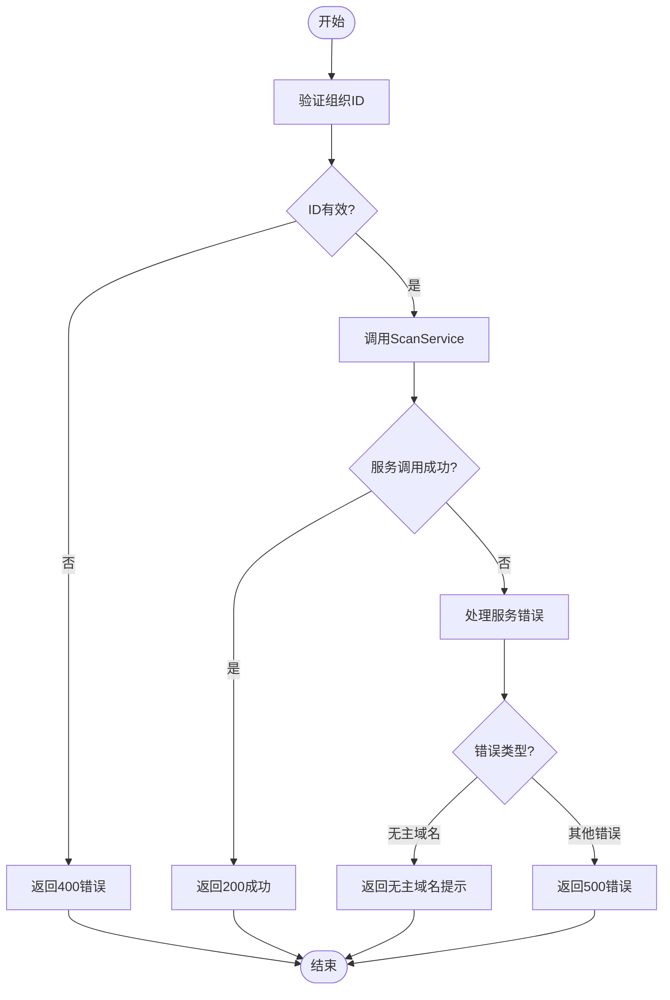
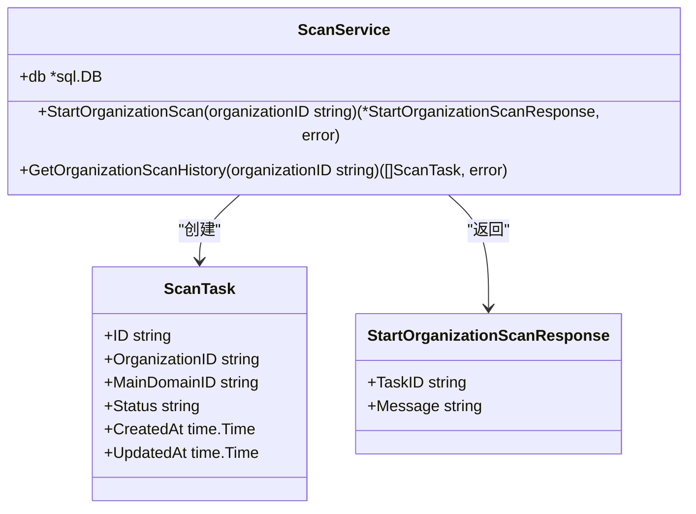

# 扫描管理处理器

<cite>
**本文档引用的文件**   
- [scan-handler.go](file://backend/internal/handlers/scan-handler.go)
- [scan-service.go](file://backend/internal/services/scan-service.go)
- [scan.go](file://backend/internal/models/scan.go)
- [page.tsx](file://front/app/scan/history/page.tsx)
- [初始化.sql](file://backend/初始化.sql)
</cite>

## 目录
1. [简介](#简介)
2. [项目结构](#项目结构)
3. [核心组件](#核心组件)
4. [架构概览](#架构概览)
5. [详细组件分析](#详细组件分析)
6. [依赖分析](#依赖分析)
7. [性能考量](#性能考量)
8. [故障排查指南](#故障排查指南)
9. [结论](#结论)

## 简介
本文档全面解析扫描管理处理器（scan-handler.go）的工作原理，重点说明启动扫描任务、查询扫描历史等核心接口的实现细节。文档涵盖扫描任务的状态机设计、异步处理机制、与数据库的交互方式，并提供典型请求/响应示例及错误处理场景。

## 项目结构
项目采用典型的分层架构，分为前端（front）和后端（backend）两个主要部分。后端采用Go语言开发，使用Gin框架处理HTTP请求，结构清晰，分为handlers、services、models等目录。前端使用Next.js框架构建，包含页面组件和UI库。



**图示来源**
- [scan-handler.go](file://backend/internal/handlers/scan-handler.go)
- [scan-service.go](file://backend/internal/services/scan-service.go)
- [scan.go](file://backend/internal/models/scan.go)
- [page.tsx](file://front/app/scan/history/page.tsx)

## 核心组件
核心组件包括扫描处理器（scan-handler.go）、扫描服务（scan-service.go）和扫描模型（scan.go）。这些组件共同实现了扫描任务的创建、查询和状态管理功能。

**组件来源**
- [scan-handler.go](file://backend/internal/handlers/scan-handler.go#L1-L48)
- [scan-service.go](file://backend/internal/services/scan-service.go#L1-L121)
- [scan.go](file://backend/internal/models/scan.go#L1-L40)

## 架构概览
系统采用MVC架构模式，前端通过HTTP请求调用后端API，后端处理器调用服务层处理业务逻辑，服务层与数据库交互完成数据持久化。



**图示来源**
- [scan-handler.go](file://backend/internal/handlers/scan-handler.go#L7-L48)
- [scan-service.go](file://backend/internal/services/scan-service.go#L25-L121)

## 详细组件分析

### 扫描处理器分析
扫描处理器负责处理HTTP请求，验证输入参数，并调用扫描服务执行业务逻辑。

#### 请求处理流程


**图示来源**
- [scan-handler.go](file://backend/internal/handlers/scan-handler.go#L7-L48)

### 扫描服务分析
扫描服务实现核心业务逻辑，包括创建扫描任务和查询扫描历史。

#### 扫描任务创建流程


**图示来源**
- [scan-service.go](file://backend/internal/services/scan-service.go#L10-L121)
- [scan.go](file://backend/internal/models/scan.go#L5-L40)

## 依赖分析
系统依赖关系清晰，各组件职责分明。处理器依赖服务，服务依赖模型和数据库包。

```mermaid
graph TD
backend/internal/utils@BadRequestResponse[BadRequestResponse]:::function
backend/internal/services@NewScanService[NewScanService]:::function
backend/internal/utils@InternalServerErrorResponse[InternalServerErrorResponse]:::function
backend/internal/utils@SuccessResponse[SuccessResponse]:::function
backend/internal/handlers@StartOrganizationScan[StartOrganizationScan]:::function
backend/internal/handlers@GetOrganizationScanHistory[GetOrganizationScanHistory]:::function
backend/internal/handlers@StartOrganizationScan --> backend/internal/utils@BadRequestResponse
backend/internal/handlers@StartOrganizationScan --> backend/internal/services@NewScanService
backend/internal/handlers@StartOrganizationScan --> backend/internal/utils@InternalServerErrorResponse
backend/internal/handlers@StartOrganizationScan --> backend/internal/utils@SuccessResponse
backend/internal/handlers@GetOrganizationScanHistory --> backend/internal/utils@BadRequestResponse
backend/internal/handlers@GetOrganizationScanHistory --> backend/internal/services@NewScanService
backend/internal/handlers@GetOrganizationScanHistory --> backend/internal/utils@InternalServerErrorResponse
backend/internal/handlers@GetOrganizationScanHistory --> backend/internal/utils@SuccessResponse
```

**图示来源**
- [scan-handler.go](file://backend/internal/handlers/scan-handler.go)
- [scan-service.go](file://backend/internal/services/scan-service.go)

## 性能考量
- 使用数据库事务确保扫描任务创建的原子性
- 通过批量插入提高多任务创建效率
- 查询历史时按创建时间倒序排列，便于前端分页显示
- 错误日志记录详细，便于问题排查

## 故障排查指南
常见问题及解决方案：

**问题：启动扫描返回"组织ID不能为空"**
- 原因：请求路径中的组织ID为空
- 解决方案：确保URL路径格式为`/api/organizations/{id}/scan`

**问题：启动扫描返回"该组织没有主域名可以扫描"**
- 原因：指定组织未配置主域名
- 解决方案：先在组织管理页面添加主域名

**问题：获取扫描历史失败**
- 原因：数据库查询错误
- 解决方案：检查数据库连接状态和scan_tasks表结构

**问题：前端显示"功能开发中"**
- 原因：扫描历史页面尚未实现
- 解决方案：开发人员需完成历史页面的数据绑定和展示逻辑

**组件来源**
- [scan-handler.go](file://backend/internal/handlers/scan-handler.go#L10-L12)
- [scan-service.go](file://backend/internal/services/scan-service.go#L35-L40)
- [page.tsx](file://front/app/scan/history/page.tsx#L1-L20)

## 结论
扫描管理处理器实现了组织扫描的核心功能，通过清晰的分层架构和良好的错误处理机制，为系统提供了可靠的扫描任务管理能力。建议后续完善前端页面，实现完整的扫描历史展示功能，并增加扫描进度查询接口。