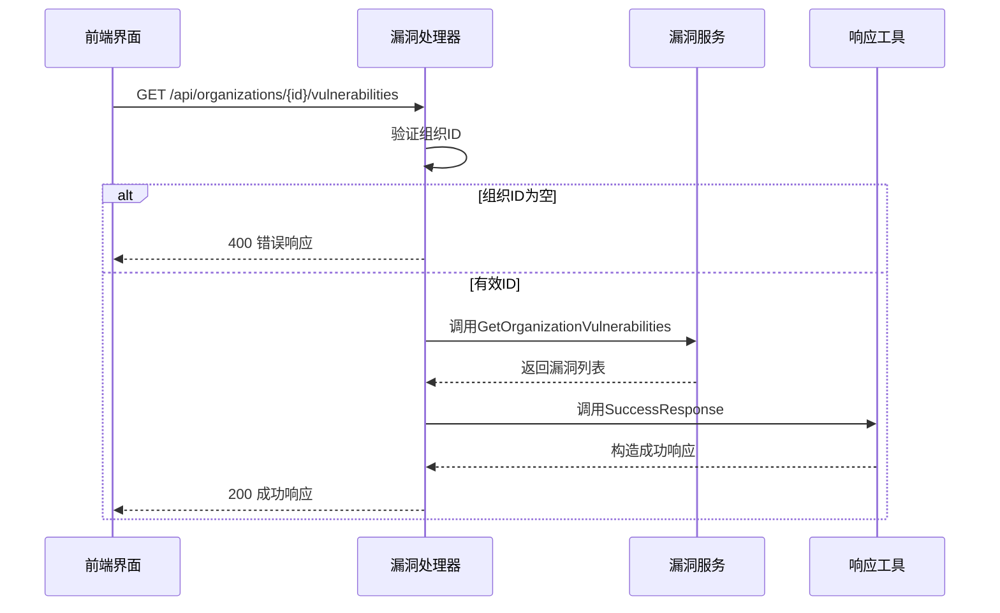
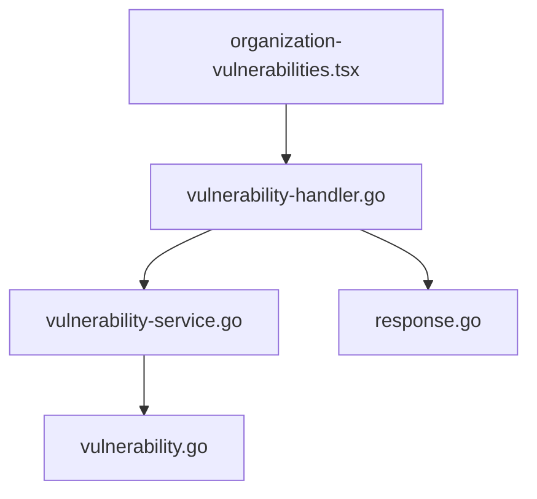

# 漏洞管理处理器

<cite>
**本文档引用文件**  
- [vulnerability-handler.go](file://backend/internal/handlers/vulnerability-handler.go)
- [vulnerability-service.go](file://backend/internal/services/vulnerability-service.go)
- [vulnerability.go](file://backend/internal/models/vulnerability.go)
- [response.go](file://backend/internal/utils/response.go)
- [organization-vulnerabilities.tsx](file://front/components/pages/assets/organizations/detail/organization-vulnerabilities.tsx)
</cite>

## 目录
1. [简介](#简介)
2. [项目结构](#项目结构)
3. [核心组件](#核心组件)
4. [架构概览](#架构概览)
5. [详细组件分析](#详细组件分析)
6. [依赖关系分析](#依赖关系分析)
7. [性能考虑](#性能考虑)
8. [常见问题与应对策略](#常见问题与应对策略)
9. [结论](#结论)

## 简介
本文档系统化讲解漏洞管理处理器（vulnerability-handler.go）的功能实现，重点介绍漏洞列表查询、漏洞详情获取、漏洞状态更新等接口的处理流程。文档涵盖漏洞分级分类标准、修复状态管理、数据过滤性能优化建议，以及前端展示界面的数据映射关系。通过前后端代码联动分析，全面揭示漏洞管理模块的设计与实现。

## 项目结构
项目采用典型的分层架构设计，后端基于 Gin 框架实现 RESTful API，前端使用 React + Next.js 构建用户界面。漏洞管理相关代码分布在以下目录：

- `backend/internal/handlers/vulnerability-handler.go`：漏洞处理器，处理 HTTP 请求
- `backend/internal/services/vulnerability-service.go`：漏洞服务层，业务逻辑处理
- `backend/internal/models/vulnerability.go`：漏洞数据模型定义
- `front/components/pages/assets/organizations/detail/organization-vulnerabilities.tsx`：前端漏洞展示组件

```mermaid
graph TD
subgraph "前端"
A[organization-vulnerabilities.tsx]
end
subgraph "后端"
B[vulnerability-handler.go]
C[vulnerability-service.go]
D[vulnerability.go]
E[response.go]
end
A --> B : HTTP请求
B --> C : 调用服务
C --> D : 使用数据模型
B --> E : 构造响应
```

**图示来源**  
- [vulnerability-handler.go](file://backend/internal/handlers/vulnerability-handler.go)
- [vulnerability-service.go](file://backend/internal/services/vulnerability-service.go)
- [vulnerability.go](file://backend/internal/models/vulnerability.go)
- [organization-vulnerabilities.tsx](file://front/components/pages/assets/organizations/detail/organization-vulnerabilities.tsx)

**本节来源**  
- [vulnerability-handler.go](file://backend/internal/handlers/vulnerability-handler.go)
- [organization-vulnerabilities.tsx](file://front/components/pages/assets/organizations/detail/organization-vulnerabilities.tsx)

## 核心组件
漏洞管理模块的核心组件包括处理器（Handler）、服务（Service）和模型（Model），遵循典型的 MVC 分层架构。处理器负责接收和响应 HTTP 请求，服务层处理业务逻辑，模型定义数据结构。

### 漏洞数据模型
漏洞模型（Vulnerability）定义了漏洞的完整属性，包括标识、严重等级、影响范围、状态等关键信息。

```go
type Vulnerability struct {
	ID             string    `json:"id"`
	Title          string    `json:"title"`
	Severity       string    `json:"severity"`  // 高危/中危/低危
	CVSS           float64   `json:"cvss"`
	CVE            string    `json:"cve"`
	Domain         string    `json:"domain"`
	Port           int       `json:"port"`
	Service        string    `json:"service"`
	Description    string    `json:"description"`
	DiscoveredDate time.Time `json:"discovered_date"`
	Status         string    `json:"status"`    // 待修复/处理中/已修复/已忽略
	Organization   string    `json:"organization"`
	AffectedURL    string    `json:"affected_url"`
	RiskScore      int       `json:"risk_score"`
	POC            string    `json:"poc"`
	Solution       string    `json:"solution"`
	OrganizationID string    `json:"organization_id"`
}
```

**本节来源**  
- [vulnerability.go](file://backend/internal/models/vulnerability.go#L0-L30)

## 架构概览
系统采用前后端分离架构，前端通过 HTTP 请求调用后端 API 获取漏洞数据，后端通过服务层从数据源检索信息并返回结构化响应。



**图示来源**  
- [vulnerability-handler.go](file://backend/internal/handlers/vulnerability-handler.go#L0-L25)
- [vulnerability-service.go](file://backend/internal/services/vulnerability-service.go#L0-L48)

**本节来源**  
- [vulnerability-handler.go](file://backend/internal/handlers/vulnerability-handler.go#L0-L25)

## 详细组件分析

### 漏洞处理器分析
漏洞处理器（vulnerability-handler.go）实现了 `GetOrganizationVulnerabilities` 接口，负责处理获取组织漏洞的 HTTP 请求。

#### 请求处理流程
1. 从 URL 路径参数中提取组织 ID
2. 验证组织 ID 是否为空
3. 创建漏洞服务实例
4. 调用服务方法获取漏洞数据
5. 根据结果构造成功或错误响应

```go
func GetOrganizationVulnerabilities(c *gin.Context) {
	organizationID := c.Param("id")
	if organizationID == "" {
		utils.BadRequestResponse(c, "组织ID不能为空")
		return
	}

	service := services.NewVulnerabilityService()
	vulnerabilities, err := service.GetOrganizationVulnerabilities(organizationID)
	if err != nil {
		utils.InternalServerErrorResponse(c, "获取组织漏洞失败: "+err.Error())
		return
	}

	utils.SuccessResponse(c, vulnerabilities)
}
```

#### 错误处理机制
处理器使用统一的响应工具处理各种错误情况：
- `BadRequestResponse`：请求参数无效（400）
- `InternalServerErrorResponse`：服务内部错误（500）
- `SuccessResponse`：操作成功（200）

**本节来源**  
- [vulnerability-handler.go](file://backend/internal/handlers/vulnerability-handler.go#L0-L25)
- [response.go](file://backend/internal/utils/response.go#L0-L48)

### 漏洞服务分析
漏洞服务（vulnerability-service.go）实现了 `GetOrganizationVulnerabilities` 方法，目前使用模拟数据，实际项目中应从数据库获取。

#### 模拟数据结构
服务返回包含 5 个漏洞的模拟数据集，涵盖不同严重等级和状态：
- **高危**：SQL 注入、目录遍历
- **中危**：XSS、SSL/TLS 配置错误
- **低危**：信息泄露

每个漏洞包含完整的上下文信息，如影响域名、发现日期、修复方案等。

#### 日志记录
服务使用 logrus 记录操作日志，包含组织 ID 和漏洞数量，便于监控和调试。

```go
logrus.WithFields(logrus.Fields{
	"organization_id":       organizationID,
	"vulnerabilities_count": len(vulnerabilities),
}).Info("Retrieved organization vulnerabilities (mock data)")
```

**本节来源**  
- [vulnerability-service.go](file://backend/internal/services/vulnerability-service.go#L0-L125)

### 前端展示分析
前端组件 `organization-vulnerabilities.tsx` 负责展示组织漏洞信息，实现了完整的数据展示和交互功能。

#### 数据字段映射
前端与后端数据字段的映射关系如下：

| 前端字段 | 后端字段 | 说明 |
|---------|---------|------|
| id | ID | 漏洞唯一标识 |
| title | Title | 漏洞标题 |
| severity | Severity | 严重程度 |
| cvss | CVSS | CVSS 评分 |
| cve | CVE | CVE 编号 |
| domain | Domain | 影响域名 |
| discoveredDate | DiscoveredDate | 发现日期 |
| status | Status | 修复状态 |

#### 筛选功能实现
前端实现了多维度筛选功能：
- **搜索**：支持按标题、描述、域名、CVE 编号搜索
- **严重等级筛选**：高危、中危、低危、全部
- **状态筛选**：待修复、处理中、已修复、已忽略、全部

```typescript
const filteredVulnerabilities = vulnerabilities.filter((vuln) => {
    const matchesSearch = 
        vuln.title.toLowerCase().includes(searchTerm.toLowerCase()) ||
        vuln.description.toLowerCase().includes(searchTerm.toLowerCase()) ||
        vuln.domain.toLowerCase().includes(searchTerm.toLowerCase()) ||
        vuln.cve.toLowerCase().includes(searchTerm.toLowerCase())
    
    const matchesSeverity = severityFilter === "all" || vuln.severity === severityFilter
    const matchesStatus = statusFilter === "all" || vuln.status === statusFilter
    
    return matchesSearch && matchesSeverity && matchesStatus
})
```

#### 状态与严重程度可视化
前端使用不同颜色的标签直观展示漏洞状态和严重程度：

```typescript
const getSeverityBadge = (severity: string) => {
    switch (severity) {
        case "高危":
            return <Badge variant="destructive">高危</Badge>
        case "中危":
            return <Badge variant="secondary" className="bg-orange-100 text-orange-800">中危</Badge>
        case "低危":
            return <Badge variant="secondary" className="bg-yellow-100 text-yellow-800">低危</Badge>
        default:
            return <Badge variant="outline">{severity}</Badge>
    }
}
```

**本节来源**  
- [organization-vulnerabilities.tsx](file://front/components/pages/assets/organizations/detail/organization-vulnerabilities.tsx#L12-L50)
- [organization-vulnerabilities.tsx](file://front/components/pages/assets/organizations/detail/organization-vulnerabilities.tsx#L142-L170)

## 依赖关系分析
漏洞管理模块的依赖关系清晰，遵循单一职责原则，各组件职责明确。



**图示来源**  
- [vulnerability-handler.go](file://backend/internal/handlers/vulnerability-handler.go)
- [vulnerability-service.go](file://backend/internal/services/vulnerability-service.go)

**本节来源**  
- [vulnerability-handler.go](file://backend/internal/handlers/vulnerability-handler.go)
- [vulnerability-service.go](file://backend/internal/services/vulnerability-service.go)

## 性能考虑
虽然当前实现使用模拟数据，但实际应用中需考虑性能优化：

### 数据过滤性能优化建议
1. **数据库索引**：为常用查询字段（如 organization_id、severity、status）创建索引
2. **分页查询**：实现分页机制，避免一次性返回大量数据
3. **缓存机制**：对频繁访问的漏洞数据进行缓存
4. **异步加载**：前端实现懒加载，提升用户体验

### 应对数据量过大策略
当数据量过大导致响应缓慢时，可采取以下策略：
- **分页响应**：限制单次返回记录数，提供分页参数
- **流式传输**：对大数据集采用流式传输
- **查询优化**：优化数据库查询语句，避免全表扫描
- **读写分离**：对读密集型操作使用读写分离架构

## 常见问题与应对策略

### 数据量过大导致响应缓慢
**问题**：当组织漏洞数量达到数千甚至上万时，单次请求可能超时或响应缓慢。

**解决方案**：
1. 实现分页查询接口，支持 `page` 和 `limit` 参数
2. 添加排序功能，支持按发现日期、风险评分等字段排序
3. 提供筛选条件，减少返回数据量
4. 使用缓存层（如 Redis）缓存热点数据

### 漏洞分级分类标准
系统采用三级分类标准：
- **高危**（CVSS ≥ 7.0）：可能导致系统完全被控制
- **中危**（4.0 ≤ CVSS < 7.0）：可能导致部分功能受影响
- **低危**（CVSS < 4.0）：信息泄露或轻微功能问题

### 修复状态管理
系统定义四种修复状态：
- **待修复**：新发现的漏洞，尚未处理
- **处理中**：正在修复的漏洞
- **已修复**：已完成修复并验证
- **已忽略**：评估后决定不修复的漏洞

## 结论
漏洞管理处理器实现了组织漏洞查询的核心功能，通过清晰的分层架构和规范的接口设计，提供了稳定可靠的服务。当前实现使用模拟数据，实际部署时需对接数据库并实现完整的 CRUD 操作。前端组件提供了友好的用户界面和强大的筛选功能，提升了漏洞管理的效率。建议后续增加分页、排序、高级筛选等特性，以应对大规模数据场景。