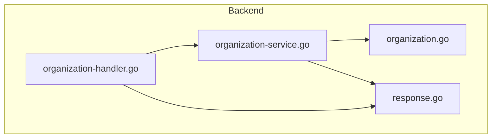
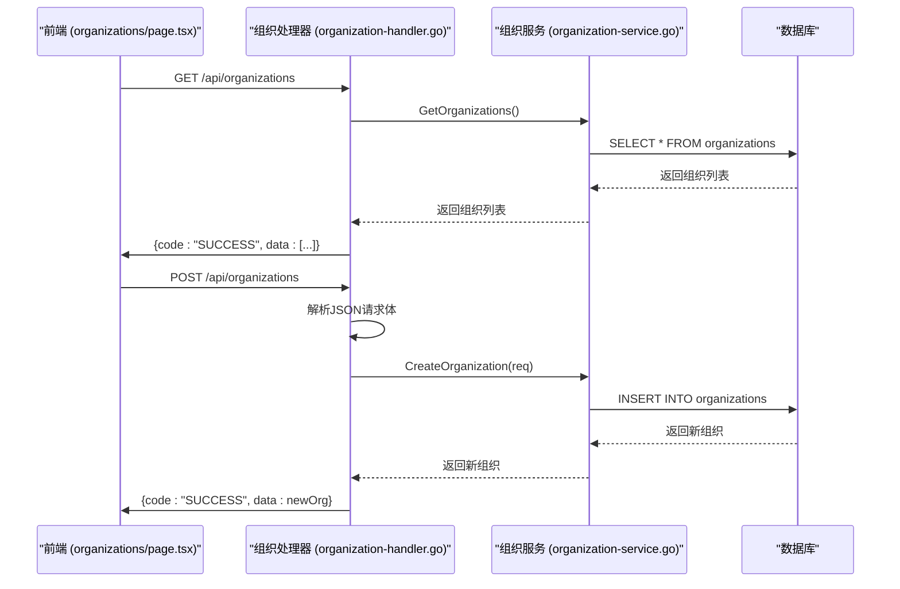
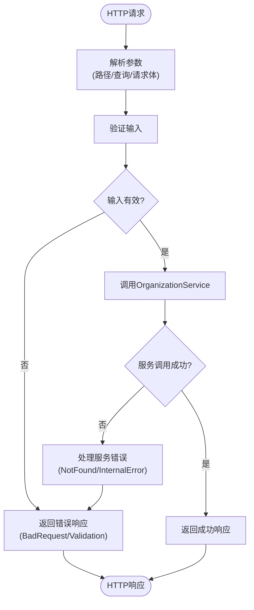
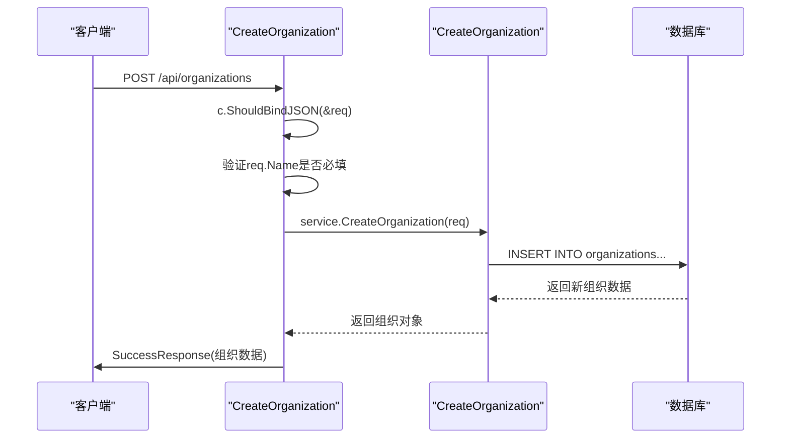
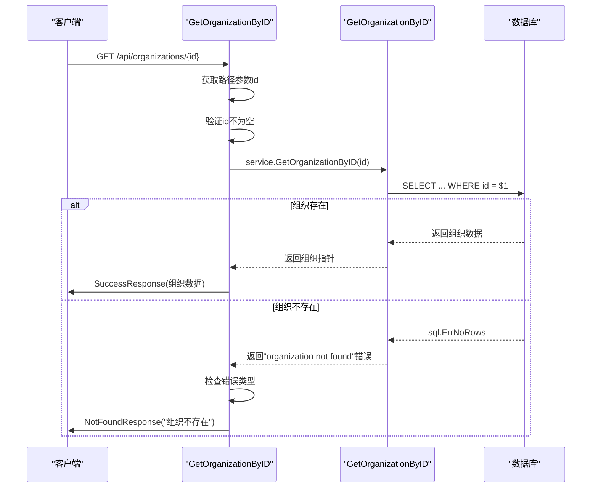
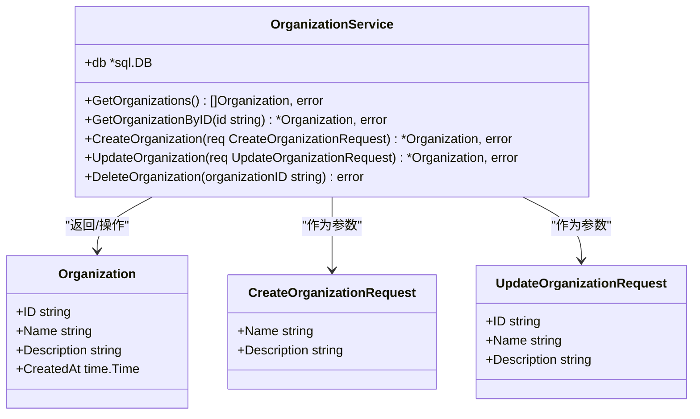
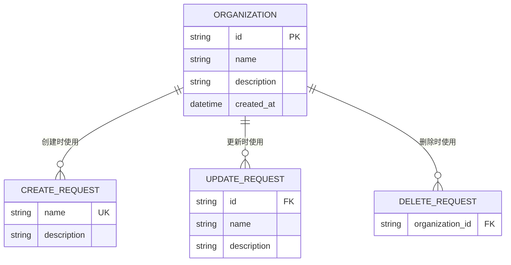
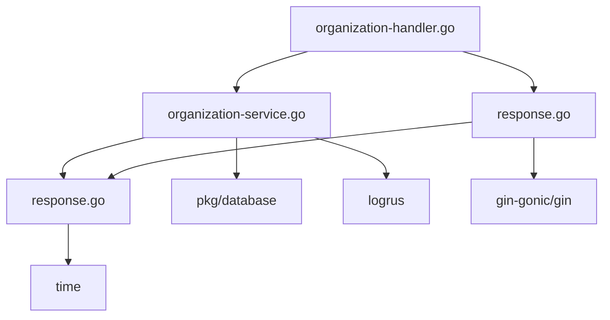

# 组织管理处理器

<cite>
**本文档引用的文件**  
- [organization-handler.go](file://backend/internal/handlers/organization-handler.go)
- [organization-service.go](file://backend/internal/services/organization-service.go)
- [organization.go](file://backend/internal/models/organization.go)
- [response.go](file://backend/internal/utils/response.go)
- [response.go](file://backend/internal/models/response.go)
</cite>

## 目录
1. [简介](#简介)
2. [项目结构](#项目结构)
3. [核心组件](#核心组件)
4. [架构概览](#架构概览)
5. [详细组件分析](#详细组件分析)
6. [依赖分析](#依赖分析)
7. [性能考虑](#性能考虑)
8. [故障排除指南](#故障排除指南)
9. [结论](#结论)

## 简介
本文档深入分析了组织管理处理器（organization-handler.go）的实现机制，重点阐述其如何处理组织相关的HTTP请求，包括组织的创建、查询、更新和删除（CRUD）操作。文档详细说明了请求参数的解析方式（如路径参数、查询参数、请求体）、权限校验逻辑、调用organization-service进行业务处理的过程，以及最终通过response.go封装统一响应格式。结合前端页面（如organizations/page.tsx）的实际调用场景，展示了API接口的完整调用链路。同时涵盖错误处理策略（如组织名重复、非法ID）、输入验证规则、分页查询实现，并提供实际代码片段说明关键函数的调用流程。

## 项目结构
组织管理功能位于后端模块的handlers、services和models三层中，遵循典型的MVC架构模式。`organization-handler.go`负责接收HTTP请求并返回响应，`organization-service.go`封装核心业务逻辑，`organization.go`定义数据模型，`response.go`提供统一的响应格式。



**图示来源**
- [organization-handler.go](file://backend/internal/handlers/organization-handler.go)
- [organization-service.go](file://backend/internal/services/organization-service.go)
- [organization.go](file://backend/internal/models/organization.go)
- [response.go](file://backend/internal/utils/response.go)

**本节来源**
- [organization-handler.go](file://backend/internal/handlers/organization-handler.go)
- [organization-service.go](file://backend/internal/services/organization-service.go)

## 核心组件
组织管理的核心组件包括处理器（Handler）、服务（Service）、模型（Model）和响应工具（Response Utility）。处理器负责HTTP请求的接收与响应，服务层处理业务逻辑并与数据库交互，模型定义数据结构，响应工具封装统一的API响应格式。

**本节来源**
- [organization-handler.go](file://backend/internal/handlers/organization-handler.go#L1-L211)
- [organization-service.go](file://backend/internal/services/organization-service.go#L1-L157)

## 架构概览
组织管理模块采用分层架构，确保关注点分离。HTTP请求首先由Gin框架路由到`organization-handler.go`中的相应处理器函数。处理器解析请求参数，调用`organization-service.go`中的服务方法执行业务逻辑。服务层通过数据库连接执行SQL操作，并将结果返回给处理器。最后，处理器使用`response.go`中的工具函数生成标准化的JSON响应。



**图示来源**
- [organization-handler.go](file://backend/internal/handlers/organization-handler.go#L10-L211)
- [organization-service.go](file://backend/internal/services/organization-service.go#L10-L157)

## 详细组件分析

### 组织处理器分析
`organization-handler.go`文件包含处理组织相关HTTP请求的所有函数，每个函数对应一个RESTful API端点。

#### 处理器函数调用流程


**图示来源**
- [organization-handler.go](file://backend/internal/handlers/organization-handler.go#L10-L211)

#### 创建组织流程


**图示来源**
- [organization-handler.go](file://backend/internal/handlers/organization-handler.go#L25-L35)
- [organization-service.go](file://backend/internal/services/organization-service.go#L50-L70)

**本节来源**
- [organization-handler.go](file://backend/internal/handlers/organization-handler.go#L25-L35)
- [organization-service.go](file://backend/internal/services/organization-service.go#L50-L70)

#### 获取组织详情流程


**图示来源**
- [organization-handler.go](file://backend/internal/handlers/organization-handler.go#L45-L60)
- [organization-service.go](file://backend/internal/services/organization-service.go#L30-L45)

**本节来源**
- [organization-handler.go](file://backend/internal/handlers/organization-handler.go#L45-L60)
- [organization-service.go](file://backend/internal/services/organization-service.go#L30-L45)

### 组织服务分析
`organization-service.go`实现了组织管理的核心业务逻辑，直接与数据库交互。

#### 服务方法调用关系


**图示来源**
- [organization-service.go](file://backend/internal/services/organization-service.go#L10-L157)
- [organization.go](file://backend/internal/models/organization.go#L1-L31)

**本节来源**
- [organization-service.go](file://backend/internal/services/organization-service.go#L10-L157)

### 数据模型分析
`organization.go`文件定义了组织相关的数据结构，包括数据库模型和API请求/响应模型。

#### 数据模型结构


**图示来源**
- [organization.go](file://backend/internal/models/organization.go#L1-L31)

**本节来源**
- [organization.go](file://backend/internal/models/organization.go#L1-L31)

### 响应工具分析
`response.go`提供了统一的API响应格式和错误处理函数。

#### 响应格式结构
```mermaid
classDiagram
class APIResponse {
+Code string
+Message string
+Data interface{}
}
class SuccessResponse {
+Code : "SUCCESS"
+Message : "操作成功"
+Data : 实际数据
}
class ErrorResponse {
+Code : "ERROR"
+Message : 错误信息
+Data : null
}
APIResponse <|-- SuccessResponse
APIResponse <|-- ErrorResponse
```

**图示来源**
- [response.go](file://backend/internal/models/response.go#L1-L8)
- [response.go](file://backend/internal/utils/response.go#L1-L48)

**本节来源**
- [response.go](file://backend/internal/models/response.go#L1-L8)
- [response.go](file://backend/internal/utils/response.go#L1-L48)

## 依赖分析
组织管理模块的依赖关系清晰，遵循单向依赖原则。处理器依赖于服务和响应工具，服务依赖于模型和数据库，模型不依赖其他业务组件。



**图示来源**
- [organization-handler.go](file://backend/internal/handlers/organization-handler.go)
- [organization-service.go](file://backend/internal/services/organization-service.go)
- [organization.go](file://backend/internal/models/organization.go)
- [response.go](file://backend/internal/utils/response.go)

**本节来源**
- [organization-handler.go](file://backend/internal/handlers/organization-handler.go)
- [organization-service.go](file://backend/internal/services/organization-service.go)

## 性能考虑
当前实现中，`SearchOrganizations`函数在服务层进行内存搜索，而非数据库层面搜索，这在组织数量较多时可能成为性能瓶颈。建议优化为在数据库查询中使用`ILIKE`或全文搜索功能。此外，批量删除操作使用循环逐个删除，可以优化为单条SQL语句使用`IN`子句批量删除。

## 故障排除指南
常见问题及解决方案：

- **组织创建失败（500错误）**：检查数据库连接是否正常，确保`organizations`表存在且结构正确。
- **组织不存在（404错误）**：确认提供的组织ID正确，且该组织未被删除。
- **请求参数错误（422错误）**：检查JSON请求体格式是否正确，必填字段是否缺失。
- **搜索功能不工作**：当前搜索为内存搜索，仅支持简单字符串匹配，不支持复杂查询条件。
- **批量删除部分失败**：检查返回的`failed_ids`列表，确认这些组织ID是否存在。

**本节来源**
- [organization-handler.go](file://backend/internal/handlers/organization-handler.go#L10-L211)
- [organization-service.go](file://backend/internal/services/organization-service.go#L10-L157)

## 结论
组织管理处理器实现了完整的CRUD操作，代码结构清晰，职责分离明确。通过Gin框架处理HTTP请求，利用Service层封装业务逻辑，确保了代码的可维护性和可测试性。响应格式统一，错误处理完善。建议优化搜索功能的数据库查询，并考虑批量操作的性能提升。整体设计合理，为系统提供了稳定的组织管理能力。