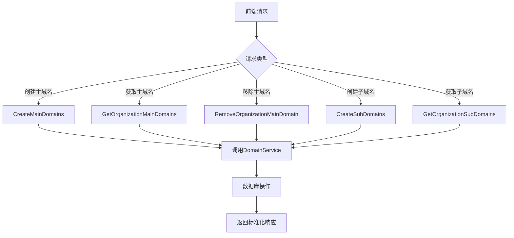
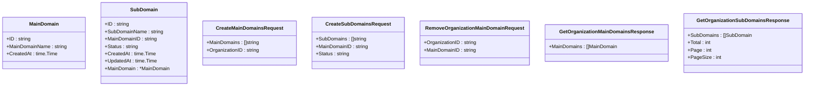
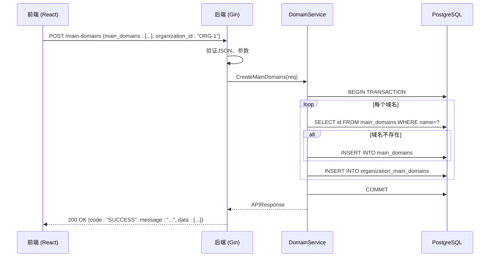

# 资产管理处理器

<cite>
**本文档引用的文件**  
- [domain-handler.go](file://backend/internal/handlers/domain-handler.go#L1-L133)
- [domain-service.go](file://backend/internal/services/domain-service.go#L1-L343)
- [domain.go](file://backend/internal/models/domain.go#L1-L62)
</cite>

## 目录
1. [简介](#简介)
2. [核心功能概述](#核心功能概述)
3. [主域名管理接口](#主域名管理接口)
4. [子域名管理接口](#子域名管理接口)
5. [数据模型与请求结构](#数据模型与请求结构)
6. [错误处理与响应机制](#错误处理与响应机制)
7. [前后端交互流程](#前后端交互流程)
8. [事务与数据库操作](#事务与数据库操作)
9. [总结](#总结)

## 简介

资产管理处理器（`domain-handler.go`）是漏洞扫描系统中负责处理主域名和子域名增删改查请求的核心组件。该模块通过 Gin 框架接收前端请求，调用 `domain-service` 执行业务逻辑，并返回标准化的 JSON 响应。其主要职责包括：接收资产创建请求、验证输入参数、关联组织信息、执行数据库操作、返回操作结果，并在必要时触发后续扫描任务。

本模块与前端资产页面（如 `/assets/organizations/[id]/page.tsx`）紧密配合，支持组织维度的资产管理和分页查询，确保用户能够高效地管理其数字资产。

**Section sources**
- [domain-handler.go](file://backend/internal/handlers/domain-handler.go#L1-L10)

## 核心功能概述

资产管理处理器提供了以下核心功能：
- **创建主域名**：接收主域名列表和组织ID，批量创建主域名并建立与组织的关联。
- **获取组织主域名**：根据组织ID查询其关联的所有主域名。
- **移除主域名关联**：解除组织与特定主域名的关联关系。
- **创建子域名**：为指定主域名批量创建子域名。
- **获取组织子域名**：根据组织ID分页查询其所有子域名，支持分页和总数统计。

这些功能共同构成了资产管理系统的基础，为后续的漏洞扫描和安全分析提供数据支持。



**Diagram sources**
- [domain-handler.go](file://backend/internal/handlers/domain-handler.go#L1-L133)

## 主域名管理接口

### 创建主域名 (CreateMainDomains)

此接口用于为指定组织批量创建主域名。处理流程如下：

1.  **参数绑定与验证**：使用 `c.ShouldBindJSON(&req)` 将请求体绑定到 `CreateMainDomainsRequest` 结构体。若绑定失败，返回 `400 Bad Request` 及验证错误信息。
2.  **空值检查**：检查 `MainDomains` 列表和 `OrganizationID` 是否为空，若为空则返回 `400 Bad Request`。
3.  **调用服务层**：创建 `DomainService` 实例，并调用 `CreateMainDomains(req)` 方法。
4.  **返回响应**：服务层返回 `APIResponse` 对象，通过 `c.JSON(200, response)` 返回。

```go
func CreateMainDomains(c *gin.Context) {
	var req models.CreateMainDomainsRequest
	if err := c.ShouldBindJSON(&req); err != nil {
		utils.ValidationErrorResponse(c, "请求参数错误: "+err.Error())
		return
	}

	if len(req.MainDomains) == 0 {
		utils.BadRequestResponse(c, "主域名列表不能为空")
		return
	}

	service := services.NewDomainService()
	response, err := service.CreateMainDomains(req)
	if err != nil {
		utils.InternalServerErrorResponse(c, "创建主域名失败: "+err.Error())
		return
	}

	c.JSON(200, response)
}
```

**Section sources**
- [domain-handler.go](file://backend/internal/handlers/domain-handler.go#L25-L53)

### 获取组织主域名 (GetOrganizationMainDomains)

此接口根据组织ID查询其关联的所有主域名。

1.  **获取路径参数**：从 URL 路径 `/organizations/:id/main-domains` 中提取 `organizationID`。
2.  **参数验证**：检查 `organizationID` 是否为空。
3.  **调用服务层**：调用 `service.GetOrganizationMainDomains(organizationID)`。
4.  **构建响应**：将服务层返回的 `[]MainDomain` 封装到 `GetOrganizationMainDomainsResponse` 中，并通过 `utils.SuccessResponse` 返回。

```go
func GetOrganizationMainDomains(c *gin.Context) {
	organizationID := c.Param("id")
	if organizationID == "" {
		utils.BadRequestResponse(c, "组织ID不能为空")
		return
	}

	service := services.NewDomainService()
	mainDomains, err := service.GetOrganizationMainDomains(organizationID)
	if err != nil {
		utils.InternalServerErrorResponse(c, "获取组织主域名失败: "+err.Error())
		return
	}

	response := models.GetOrganizationMainDomainsResponse{
		MainDomains: mainDomains,
	}

	utils.SuccessResponse(c, response)
}
```

**Section sources**
- [domain-handler.go](file://backend/internal/handlers/domain-handler.go#L11-L24)

### 移除主域名关联 (RemoveOrganizationMainDomain)

此接口用于解除组织与主域名的关联。

1.  **参数绑定**：将请求体绑定到 `RemoveOrganizationMainDomainRequest`。
2.  **调用服务层**：调用 `service.RemoveOrganizationMainDomain(req)`。
3.  **错误处理**：服务层若返回 `"association not found"` 错误，则返回 `404 Not Found`；其他错误返回 `500 Internal Server Error`。
4.  **成功响应**：删除成功后返回 `200 OK` 和成功消息。

```go
func RemoveOrganizationMainDomain(c *gin.Context) {
	var req models.RemoveOrganizationMainDomainRequest
	if err := c.ShouldBindJSON(&req); err != nil {
		utils.ValidationErrorResponse(c, "请求参数错误: "+err.Error())
		return
	}

	service := services.NewDomainService()
	err := service.RemoveOrganizationMainDomain(req)
	if err != nil {
		if err.Error() == "association not found" {
			utils.NotFoundResponse(c, "未找到关联关系")
			return
		}
		utils.InternalServerErrorResponse(c, "移除主域名关联失败: "+err.Error())
		return
	}

	utils.SuccessResponse(c, gin.H{"message": "主域名关联移除成功"})
}
```

**Section sources**
- [domain-handler.go](file://backend/internal/handlers/domain-handler.go#L54-L74)

## 子域名管理接口

### 获取组织子域名 (GetOrganizationSubDomains)

此接口支持分页查询组织的所有子域名。

1.  **获取参数**：
    - `organizationID`：从路径参数获取。
    - `page` 和 `pageSize`：从查询参数获取，默认值为 `1` 和 `10`，`pageSize` 上限为 `100`。
2.  **参数转换**：使用 `strconv.Atoi` 将字符串转换为整数，并进行边界检查。
3.  **调用服务层**：调用 `service.GetOrganizationSubDomains(organizationID, page, pageSize)`。
4.  **返回响应**：服务层返回包含子域名列表、总数、当前页和页大小的响应对象。

```go
func GetOrganizationSubDomains(c *gin.Context) {
	organizationID := c.Param("id")
	if organizationID == "" {
		utils.BadRequestResponse(c, "组织ID不能为空")
		return
	}

	pageStr := c.DefaultQuery("page", "1")
	pageSizeStr := c.DefaultQuery("pageSize", "10")

	page, err := strconv.Atoi(pageStr)
	if err != nil || page < 1 {
		page = 1
	}

	pageSize, err := strconv.Atoi(pageSizeStr)
	if err != nil || pageSize < 1 || pageSize > 100 {
		pageSize = 10
	}

	service := services.NewDomainService()
	response, err := service.GetOrganizationSubDomains(organizationID, page, pageSize)
	if err != nil {
		utils.InternalServerErrorResponse(c, "获取组织子域名失败: "+err.Error())
		return
	}

	utils.SuccessResponse(c, response)
}
```

**Section sources**
- [domain-handler.go](file://backend/internal/handlers/domain-handler.go#L76-L99)

### 创建子域名 (CreateSubDomains)

此接口为指定主域名创建子域名。

1.  **参数绑定与验证**：与 `CreateMainDomains` 类似，绑定 `CreateSubDomainsRequest` 并检查 `SubDomains` 列表是否为空。
2.  **默认状态**：若请求中未指定 `Status`，则默认为 `"unknown"`。
3.  **调用服务层**：调用 `service.CreateSubDomains(req)`。
4.  **返回响应**：返回包含创建结果的 `APIResponse`。

```go
func CreateSubDomains(c *gin.Context) {
	var req models.CreateSubDomainsRequest
	if err := c.ShouldBindJSON(&req); err != nil {
		utils.ValidationErrorResponse(c, "请求参数错误: "+err.Error())
		return
	}

	if len(req.SubDomains) == 0 {
		utils.BadRequestResponse(c, "子域名列表不能为空")
		return
	}

	service := services.NewDomainService()
	response, err := service.CreateSubDomains(req)
	if err != nil {
		utils.InternalServerErrorResponse(c, "创建子域名失败: "+err.Error())
		return
	}

	c.JSON(200, response)
}
```

**Section sources**
- [domain-handler.go](file://backend/internal/handlers/domain-handler.go#L100-L133)

## 数据模型与请求结构

以下是核心数据模型的定义：



**Diagram sources**
- [domain.go](file://backend/internal/models/domain.go#L1-L62)

## 错误处理与响应机制

处理器采用统一的错误处理策略，通过 `internal/utils/response.go` 中的工具函数返回标准化响应：

- **`BadRequestResponse`**：用于客户端请求错误，如参数缺失或格式错误（HTTP 400）。
- **`ValidationErrorResponse`**：用于 JSON 绑定或验证失败（HTTP 400）。
- **`NotFoundResponse`**：用于资源未找到，如要移除的关联不存在（HTTP 404）。
- **`InternalServerErrorResponse`**：用于服务端内部错误，如数据库操作失败（HTTP 500）。
- **`SuccessResponse`**：用于返回成功的操作结果（HTTP 200）。

这种机制确保了 API 响应的一致性和可预测性，便于前端进行统一处理。

**Section sources**
- [domain-handler.go](file://backend/internal/handlers/domain-handler.go#L1-L133)
- [utils/response.go](file://backend/internal/utils/response.go)

## 前后端交互流程

前端资产页面（如 `assets/organizations/[id]/page.tsx`）通过以下方式与后端交互：

1.  **获取数据**：在组织详情页加载时，发起 `GET /organizations/{id}/sub-domains?page=1&pageSize=10` 请求，获取分页的子域名列表。
2.  **创建资产**：用户在“添加域名”对话框中输入域名后，前端构建 `CreateSubDomainsRequest` 对象，发起 `POST /sub-domains` 请求。
3.  **更新UI**：根据后端返回的 `APIResponse`，前端更新列表或显示成功/错误提示。



**Diagram sources**
- [domain-handler.go](file://backend/internal/handlers/domain-handler.go#L25-L53)
- [domain-service.go](file://backend/internal/services/domain-service.go#L99-L152)

## 事务与数据库操作

`domain-service.go` 在创建主域名和子域名时使用了数据库事务（`tx, err := s.db.Begin()`），以确保操作的原子性：

- **主域名创建**：在一个事务中，依次检查每个主域名是否已存在，若不存在则创建，并建立与组织的关联。如果任何一步失败，整个事务回滚，避免数据不一致。
- **子域名创建**：同样使用事务，确保批量创建子域名的原子性。

这种设计有效防止了部分成功、部分失败导致的数据脏状态。

**Section sources**
- [domain-service.go](file://backend/internal/services/domain-service.go#L99-L152)
- [domain-service.go](file://backend/internal/services/domain-service.go#L282-L343)

## 总结

资产管理处理器（`domain-handler.go`）设计清晰，职责明确，通过分层架构（Handler -> Service -> Database）实现了高内聚、低耦合。它提供了完整的主子域名管理API，支持批量操作、分页查询和精细化的错误处理。与前端页面的交互流畅，为整个漏洞扫描系统的资产发现和管理奠定了坚实的基础。