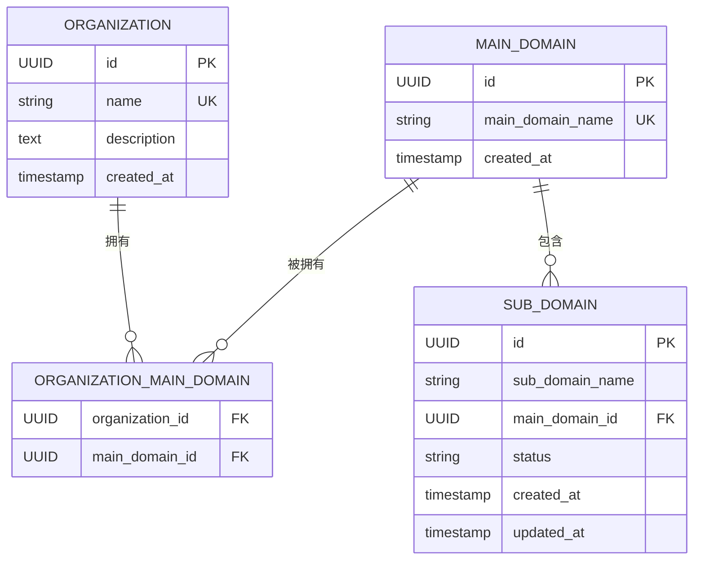
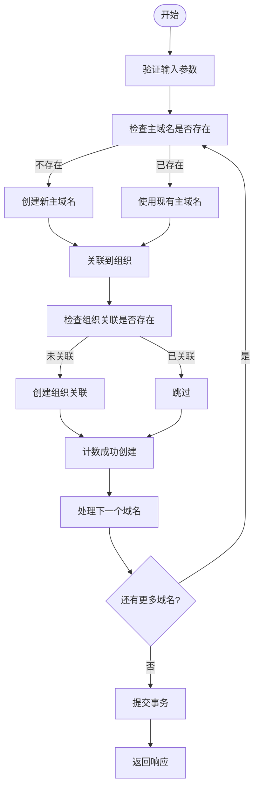
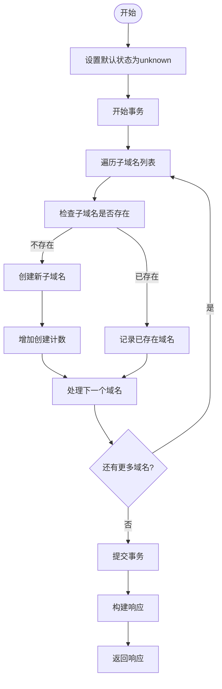
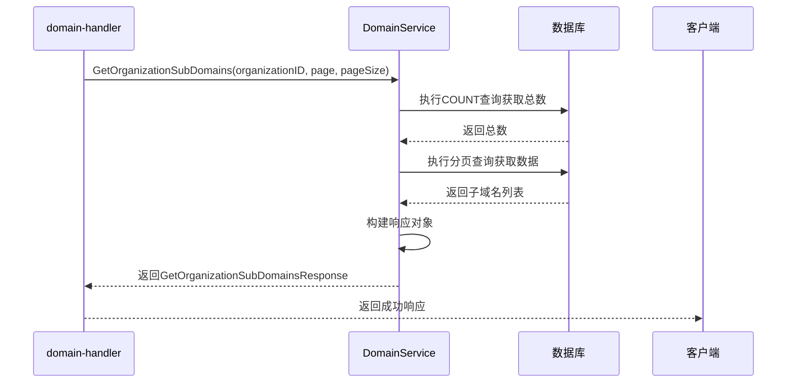
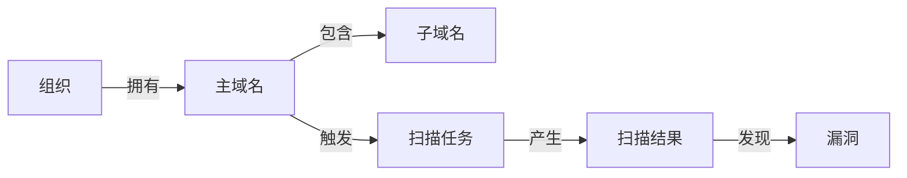

# 域名模型

<cite>
**本文档中引用的文件**   
- [domain.go](file://backend/internal/models/domain.go)
- [domain-service.go](file://backend/internal/services/domain-service.go)
- [domain-handler.go](file://backend/internal/handlers/domain-handler.go)
- [初始化.sql](file://backend/初始化.sql)
</cite>

## 目录
1. [简介](#简介)
2. [数据结构设计](#数据结构设计)
3. [与组织模型的关联关系](#与组织模型的关联关系)
4. [CRUD操作实现](#crud操作实现)
5. [数据校验与去重机制](#数据校验与去重机制)
6. [状态管理与生命周期](#状态管理与生命周期)
7. [资产扫描流程中的核心地位](#资产扫描流程中的核心地位)

## 简介
域名模型是漏洞扫描系统中的核心资产数据结构，用于管理组织的主域名和子域名信息。该模型设计区分了主域名和子域名两种实体，并通过外键与组织模型建立归属关系，形成了清晰的资产层级结构。在资产扫描流程中，域名模型作为扫描任务的输入基础，其完整性和准确性直接影响扫描结果的质量。

## 数据结构设计

### 主域名模型
主域名模型（MainDomain）用于存储组织的核心域名信息，其字段定义如下：

- **ID**: 唯一标识符，字符串类型，对应数据库中的 `id` 字段
- **MainDomainName**: 主域名名称，字符串类型，对应数据库中的 `main_domain_name` 字段
- **CreatedAt**: 创建时间，时间类型，记录域名的创建时间戳

```go
// MainDomain 主域名模型
type MainDomain struct {
	ID             string    `json:"id" db:"id"`
	MainDomainName string    `json:"main_domain_name" db:"main_domain_name"`
	CreatedAt      time.Time `json:"created_at" db:"created_at"`
}
```

### 子域名模型
子域名模型（SubDomain）用于存储属于某个主域名的子域名信息，其字段定义如下：

- **ID**: 唯一标识符，字符串类型，对应数据库中的 `id` 字段
- **SubDomainName**: 子域名名称，字符串类型，对应数据库中的 `sub_domain_name` 字段
- **MainDomainID**: 所属主域名ID，字符串类型，对应数据库中的 `main_domain_id` 字段，作为外键关联到主域名
- **Status**: 状态，字符串类型，对应数据库中的 `status` 字段，用于标识子域名的当前状态
- **CreatedAt**: 创建时间，时间类型，记录子域名的创建时间戳
- **UpdatedAt**: 更新时间，时间类型，记录子域名的最后更新时间戳
- **MainDomain**: 主域名对象指针，JSON序列化时为 `main_domain`，用于在查询时包含主域名的详细信息

```go
// SubDomain 子域名模型
type SubDomain struct {
	ID            string      `json:"id" db:"id"`
	SubDomainName string      `json:"sub_domain_name" db:"sub_domain_name"`
	MainDomainID  string      `json:"main_domain_id" db:"main_domain_id"`
	Status        string      `json:"status" db:"status"`
	CreatedAt     time.Time   `json:"created_at" db:"created_at"`
	UpdatedAt     time.Time   `json:"updated_at" db:"updated_at"`
	MainDomain    *MainDomain `json:"main_domain,omitempty"`
}
```

### 数据库表结构
根据初始化SQL脚本，域名相关的数据库表结构如下：

```sql
-- 主域名表
CREATE TABLE main_domains (
    id UUID PRIMARY KEY DEFAULT gen_random_uuid(),
    main_domain_name VARCHAR(255) NOT NULL UNIQUE,
    created_at TIMESTAMP WITH TIME ZONE NOT NULL
);

-- 子域名表
CREATE TABLE sub_domains (
    id UUID PRIMARY KEY DEFAULT gen_random_uuid(),
    sub_domain_name VARCHAR(255) NOT NULL,
    main_domain_id UUID NOT NULL REFERENCES main_domains(id) ON DELETE CASCADE,
    status VARCHAR(50) NOT NULL DEFAULT 'unknown',
    created_at TIMESTAMP WITH TIME ZONE NOT NULL,
    updated_at TIMESTAMP WITH TIME ZONE NOT NULL,
    UNIQUE (sub_domain_name, main_domain_id)
);
```

**Diagram sources**
- [初始化.sql](file://backend/初始化.sql#L13-L25)

**Section sources**
- [domain.go](file://backend/internal/models/domain.go#L6-L12)
- [domain.go](file://backend/internal/models/domain.go#L15-L26)
- [初始化.sql](file://backend/初始化.sql#L13-L25)

## 与组织模型的关联关系

### 关联模型设计
域名模型与组织模型通过一个中间关联表 `organization_main_domains` 建立多对多关系。这种设计允许一个组织拥有多个主域名，同时一个主域名也可以被多个组织共享。

```go
// OrganizationMainDomain 组织主域名关联模型
type OrganizationMainDomain struct {
	OrganizationID string `json:"organization_id" db:"organization_id"`
	MainDomainID   string `json:"main_domain_id" db:"main_domain_id"`
}
```

### 数据库关联表
```sql
CREATE TABLE organization_main_domains (
    organization_id UUID NOT NULL REFERENCES organizations(id) ON DELETE CASCADE,
    main_domain_id UUID NOT NULL REFERENCES main_domains(id) ON DELETE CASCADE,
    PRIMARY KEY (organization_id, main_domain_id)
);
```

### 关系图示


**Diagram sources**
- [domain.go](file://backend/internal/models/domain.go#L29-L34)
- [初始化.sql](file://backend/初始化.sql#L27-L32)

**Section sources**
- [domain.go](file://backend/internal/models/domain.go#L29-L34)
- [初始化.sql](file://backend/初始化.sql#L27-L32)

## CRUD操作实现

### 创建主域名
创建主域名操作通过 `CreateMainDomains` 方法实现，该方法支持批量创建并自动处理去重逻辑。

```go
// CreateMainDomainsRequest 创建主域名请求
type CreateMainDomainsRequest struct {
	MainDomains    []string `json:"main_domains" binding:"required"`
	OrganizationID string   `json:"organization_id" binding:"required"`
}
```

#### 创建流程


**Diagram sources**
- [domain-service.go](file://backend/internal/services/domain-service.go#L54-L99)
- [domain-service.go](file://backend/internal/services/domain-service.go#L101-L150)

**Section sources**
- [domain.go](file://backend/internal/models/domain.go#L37-L41)
- [domain-service.go](file://backend/internal/services/domain-service.go#L54-L150)

### 获取组织主域名
获取组织主域名操作通过 `GetOrganizationMainDomains` 方法实现，使用SQL JOIN查询获取与组织关联的所有主域名。

```go
// GetOrganizationMainDomains 获取组织的主域名
func (s *DomainService) GetOrganizationMainDomains(organizationID string) ([]models.MainDomain, error) {
	query := `
		SELECT md.id, md.main_domain_name, md.created_at
		FROM main_domains md
		INNER JOIN organization_main_domains omd ON md.id = omd.main_domain_id
		WHERE omd.organization_id = $1
		ORDER BY md.created_at DESC
	`
	// ... 查询执行逻辑
}
```

**Section sources**
- [domain-service.go](file://backend/internal/services/domain-service.go#L65-L99)

### 创建子域名
创建子域名操作通过 `CreateSubDomains` 方法实现，支持批量创建并自动设置默认状态。

```go
// CreateSubDomainsRequest 创建子域名请求
type CreateSubDomainsRequest struct {
	SubDomains   []string `json:"sub_domains" binding:"required"`
	MainDomainID string   `json:"main_domain_id" binding:"required"`
	Status       string   `json:"status"`
}
```

#### 创建流程


**Diagram sources**
- [domain-service.go](file://backend/internal/services/domain-service.go#L280-L322)

**Section sources**
- [domain.go](file://backend/internal/models/domain.go#L43-L47)
- [domain-service.go](file://backend/internal/services/domain-service.go#L233-L322)

### 获取组织子域名（分页）
获取组织子域名操作支持分页查询，通过 `GetOrganizationSubDomains` 方法实现。

```go
// GetOrganizationSubDomainsResponse 获取组织子域名响应
type GetOrganizationSubDomainsResponse struct {
	SubDomains []SubDomain `json:"sub_domains"`
	Total      int         `json:"total"`
	Page       int         `json:"page"`
	PageSize   int         `json:"page_size"`
}
```

#### 查询流程


**Diagram sources**
- [domain-service.go](file://backend/internal/services/domain-service.go#L197-L236)
- [domain.go](file://backend/internal/models/domain.go#L55-L61)

**Section sources**
- [domain.go](file://backend/internal/models/domain.go#L55-L61)
- [domain-service.go](file://backend/internal/services/domain-service.go#L197-L236)

### 移除组织主域名关联
移除组织主域名关联操作通过 `RemoveOrganizationMainDomain` 方法实现，仅删除关联关系而不删除主域名本身。

```go
// RemoveOrganizationMainDomainRequest 移除组织主域名关联请求
type RemoveOrganizationMainDomainRequest struct {
	OrganizationID string `json:"organization_id" binding:"required"`
	MainDomainID   string `json:"main_domain_id" binding:"required"`
}
```

**Section sources**
- [domain.go](file://backend/internal/models/domain.go#L49-L53)
- [domain-service.go](file://backend/internal/services/domain-service.go#L152-L195)

## 数据校验与去重机制

### 前端域名格式校验
前端在添加域名时会进行基本的格式校验，确保域名符合标准格式。

```typescript
// 简单的域名验证
const isValidFormat = /^([a-zA-Z0-9]([a-zA-Z0-9\-]{0,61}[a-zA-Z0-9])?\.)+[a-zA-Z]{2,}$/.test(domain)
```

### 后端去重逻辑
后端在创建域名时实现了完善的去重机制，避免重复数据的产生。

#### 主域名去重
- 在创建主域名时，首先检查数据库中是否已存在相同域名
- 如果存在，则复用现有记录的ID，避免创建重复的主域名
- 仅当组织与主域名的关联不存在时，才创建新的关联记录

#### 子域名去重
- 在创建子域名时，检查在指定主域名下是否已存在相同子域名
- 如果存在，则跳过创建，避免重复记录
- 使用事务确保操作的原子性

**Section sources**
- [domain-service.go](file://backend/internal/services/domain-service.go#L54-L99)
- [domain-service.go](file://backend/internal/services/domain-service.go#L280-L322)
- [add-main-domain-dialog.tsx](file://front/components/pages/assets/organizations/detail/add-main-domain-dialog.tsx#L34-L103)

## 状态管理与生命周期

### 状态字段
子域名模型中的 `Status` 字段用于表示域名的当前状态，系统预定义了以下状态值：

- **active**: 活跃状态，表示该子域名正在使用中
- **unknown**: 未知状态，作为默认状态
- **inactive**: 非活跃状态，表示该子域名已停用

### 生命周期管理
域名的生命周期通过创建时间和更新时间字段进行管理：

- **CreatedAt**: 记录域名首次创建的时间，不可更改
- **UpdatedAt**: 记录域名最后更新的时间，在每次更新时自动刷新

### 状态变更流程
当通过API创建子域名时，如果未指定状态，则自动设置为 "unknown"：

```go
// CreateSubDomains 创建子域名
func (s *DomainService) CreateSubDomains(req models.CreateSubDomainsRequest) (*models.APIResponse, error) {
	if req.Status == "" {
		req.Status = "unknown"
	}
	// ... 其他逻辑
}
```

**Section sources**
- [domain.go](file://backend/internal/models/domain.go#L20)
- [domain-service.go](file://backend/internal/services/domain-service.go#L233-L281)

## 资产扫描流程中的核心地位

### 扫描任务的输入基础
在资产扫描流程中，域名模型作为扫描任务的核心输入。扫描任务（scan_tasks）通过 `main_domain_id` 外键关联到主域名，形成扫描的资产范围。

```sql
CREATE TABLE scan_tasks (
    id UUID PRIMARY KEY DEFAULT gen_random_uuid(),
    organization_id UUID NOT NULL REFERENCES organizations(id) ON DELETE CASCADE,
    main_domain_id UUID NOT NULL REFERENCES main_domains(id) ON DELETE CASCADE,
    status VARCHAR(50) NOT NULL DEFAULT 'pending',
    created_at TIMESTAMP WITH TIME ZONE NOT NULL,
    updated_at TIMESTAMP WITH TIME ZONE NOT NULL
);
```

### 数据流关系


### 示例数据
根据初始化数据，系统包含以下示例：

- **组织**: Example Org 1, Example Org 2 等
- **主域名**: example1.com, example2.com, xingra.io 等
- **子域名**: www.example1.com, api.xingra.io, dashboard.xingra.io 等

这些数据展示了域名模型在实际应用中的使用场景，为资产扫描提供了完整的测试数据集。

**Diagram sources**
- [初始化.sql](file://backend/初始化.sql#L97-L151)

**Section sources**
- [初始化.sql](file://backend/初始化.sql#L97-L151)
- [domain.go](file://backend/internal/models/domain.go)
- [domain-service.go](file://backend/internal/services/domain-service.go)