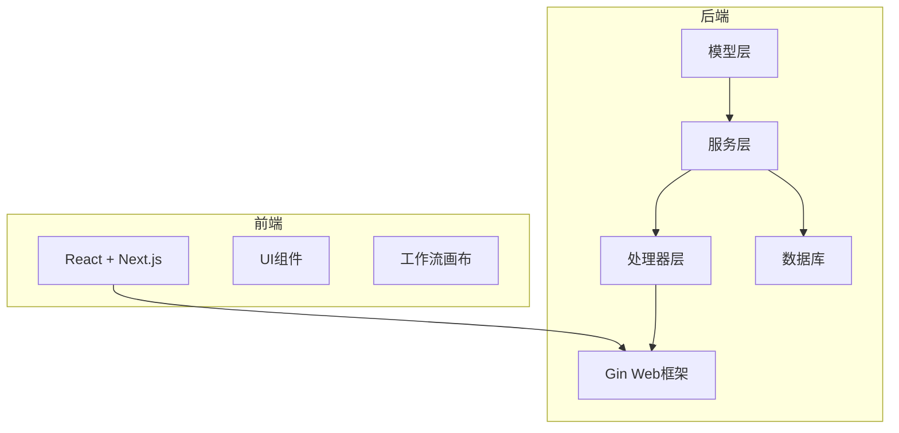
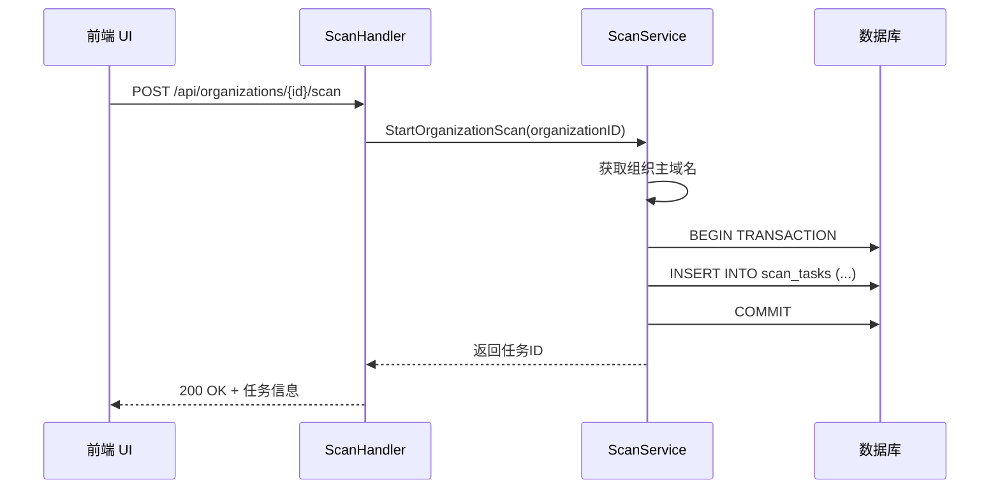
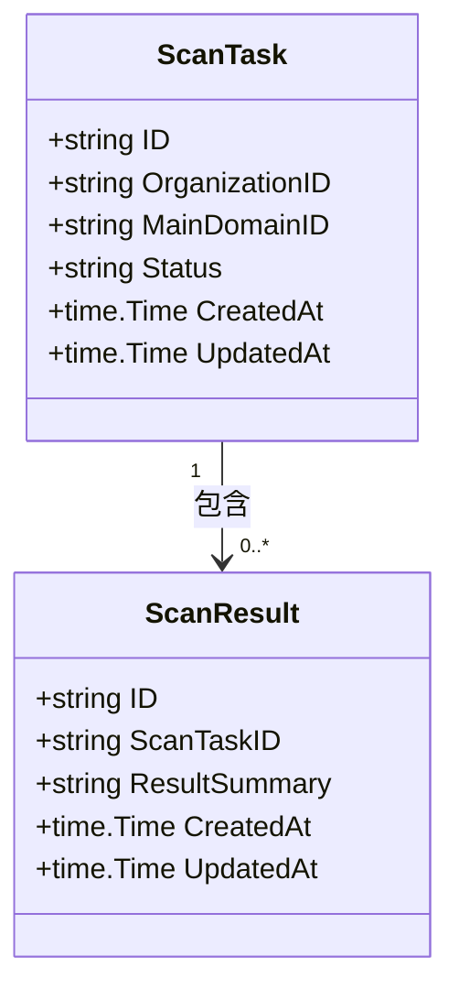
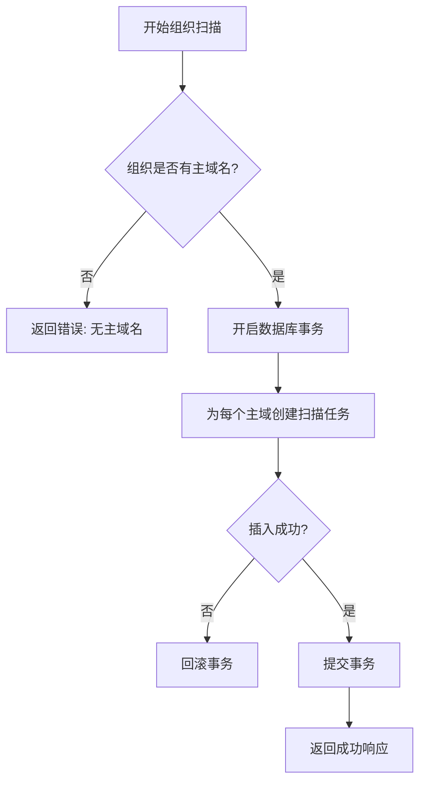
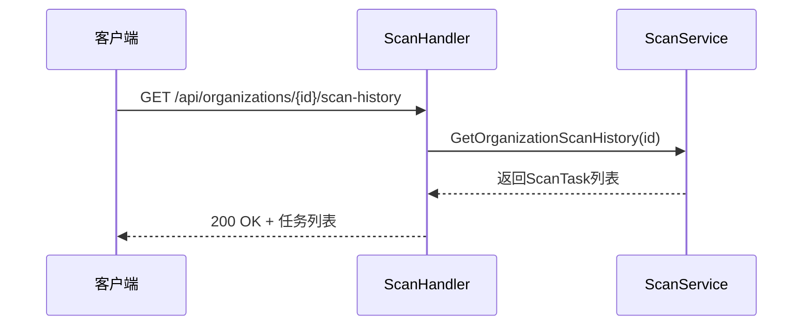
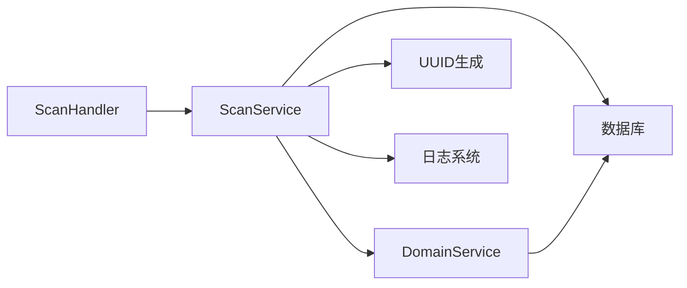

# 扫描任务模型

<cite>
**本文档引用文件**  
- [scan.go](file://backend/internal/models/scan.go)
- [scan-service.go](file://backend/internal/services/scan-service.go)
- [scan-handler.go](file://backend/internal/handlers/scan-handler.go)
- [初始化.sql](file://backend/初始化.sql)
- [database.go](file://backend/pkg/database/database.go)
- [config.go](file://backend/config/config.go)
</cite>

## 目录
1. [引言](#引言)
2. [项目结构](#项目结构)
3. [核心组件](#核心组件)
4. [架构概览](#架构概览)
5. [详细组件分析](#详细组件分析)
6. [依赖分析](#依赖分析)
7. [性能考虑](#性能考虑)
8. [故障排除指南](#故障排除指南)
9. [结论](#结论)

## 引言
本文档详细描述了漏洞扫描系统中的扫描任务模型设计，涵盖任务结构、状态管理、数据库持久化、服务逻辑及API接口。重点分析了扫描任务如何与组织、域名等资产关联，如何记录扫描元数据，并通过结果表与漏洞数据形成关联。同时说明了任务状态机的实现机制、数据库约束以及性能优化策略。

## 项目结构
项目采用典型的分层架构，分为前端（front）和后端（backend）两大部分。后端采用Go语言开发，遵循MVC模式，包含模型（models）、服务（services）、处理器（handlers）等模块。



**图示来源**  
- [scan.go](file://backend/internal/models/scan.go)
- [scan-service.go](file://backend/internal/services/scan-service.go)
- [scan-handler.go](file://backend/internal/handlers/scan-handler.go)

**本节来源**  
- [scan.go](file://backend/internal/models/scan.go)
- [scan-service.go](file://backend/internal/services/scan-service.go)

## 核心组件
扫描任务模型是整个漏洞扫描系统的核心，负责记录每次扫描的元数据，包括任务ID、所属组织、目标域名、执行状态、时间戳等。该模型通过外键与组织（organizations）和主域名（main_domains）建立关联，并通过扫描结果（scan_results）表与具体发现的漏洞数据连接。

**本节来源**  
- [scan.go](file://backend/internal/models/scan.go)
- [初始化.sql](file://backend/初始化.sql)

## 架构概览
系统采用分层架构，从前端UI到后端服务再到数据库，形成完整的扫描任务管理闭环。



**图示来源**  
- [scan-handler.go](file://backend/internal/handlers/scan-handler.go#L5-L25)
- [scan-service.go](file://backend/internal/services/scan-service.go#L25-L75)

## 详细组件分析

### 扫描任务模型分析
扫描任务模型定义了扫描任务的核心字段及其语义。



**字段说明**：
- **ID**: 任务唯一标识符，使用UUID生成
- **OrganizationID**: 所属组织ID，外键关联organizations表
- **MainDomainID**: 目标主域名ID，外键关联main_domains表
- **Status**: 任务状态，枚举值（pending/running/completed/failed）
- **CreatedAt**: 任务创建时间
- **UpdatedAt**: 任务最后更新时间

**图示来源**  
- [scan.go](file://backend/internal/models/scan.go#L8-L20)

**本节来源**  
- [scan.go](file://backend/internal/models/scan.go)

### 服务层逻辑分析
扫描服务（ScanService）实现了扫描任务的核心业务逻辑，包括任务创建和历史查询。



服务层通过事务确保多个扫描任务的原子性创建，避免部分成功的情况。

**图示来源**  
- [scan-service.go](file://backend/internal/services/scan-service.go#L25-L75)

**本节来源**  
- [scan-service.go](file://backend/internal/services/scan-service.go)

### API接口分析
扫描处理器（ScanHandler）暴露了两个RESTful API接口，用于启动扫描和查询历史。



接口采用标准的HTTP响应码和统一的响应格式，通过中间件处理错误和成功响应。

**图示来源**  
- [scan-handler.go](file://backend/internal/handlers/scan-handler.go#L30-L48)

**本节来源**  
- [scan-handler.go](file://backend/internal/handlers/scan-handler.go)

## 依赖分析
扫描任务模块依赖多个其他组件，形成完整的依赖链。



**图示来源**  
- [scan-service.go](file://backend/internal/services/scan-service.go#L1-L25)
- [database.go](file://backend/pkg/database/database.go)

**本节来源**  
- [scan-service.go](file://backend/internal/services/scan-service.go)
- [database.go](file://backend/pkg/database/database.go)

## 性能考虑
为确保扫描任务系统的高性能，系统在数据库层面进行了多项优化。

### 索引优化
数据库初始化脚本中为关键字段创建了索引，提升查询效率：

```sql
CREATE INDEX IF NOT EXISTS idx_scan_tasks_org_id ON scan_tasks(organization_id);
CREATE INDEX IF NOT EXISTS idx_scan_tasks_status ON scan_tasks(status);
CREATE INDEX IF NOT EXISTS idx_scan_results_task_id ON scan_results(scan_task_id);
```

这些索引显著提升了按组织ID和状态查询扫描任务的性能。

### 连接池配置
数据库连接池配置了合理的最大连接数和空闲连接数，避免资源耗尽：

```go
DB.SetMaxOpenConns(cfg.Database.MaxConns)
DB.SetMaxIdleConns(cfg.Database.MaxConns / 2)
DB.SetConnMaxLifetime(5 * time.Minute)
```

**本节来源**  
- [初始化.sql](file://backend/初始化.sql#L270-L273)
- [database.go](file://backend/pkg/database/database.go#L45-L48)

## 故障排除指南
### 常见问题及解决方案
1. **无法启动扫描任务**
   - 检查组织是否有主域名配置
   - 验证组织ID是否正确
   - 查看服务日志中的错误信息

2. **扫描任务状态不更新**
   - 检查数据库连接是否正常
   - 验证事务是否正确提交
   - 查看日志中是否有回滚记录

3. **查询历史记录缓慢**
   - 确认相关索引已创建
   - 检查数据库性能监控
   - 考虑对历史数据进行分表

**本节来源**  
- [scan-service.go](file://backend/internal/services/scan-service.go)
- [scan-handler.go](file://backend/internal/handlers/scan-handler.go)

## 结论
扫描任务模型是漏洞扫描系统的核心组件，通过清晰的字段设计、严谨的状态管理和高效的数据库操作，实现了对扫描任务的全生命周期管理。模型与服务层、处理器层紧密协作，提供了稳定可靠的扫描功能。通过合理的索引和连接池配置，系统具备良好的性能表现，能够支持大规模的扫描任务管理。