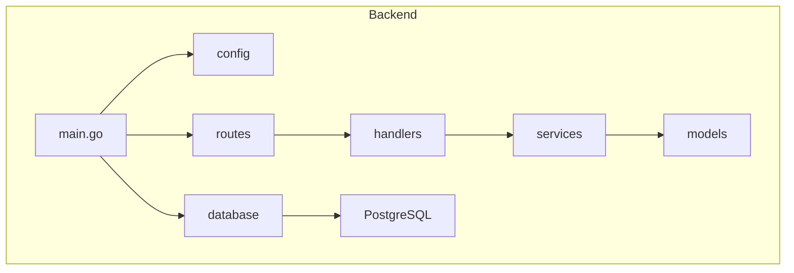
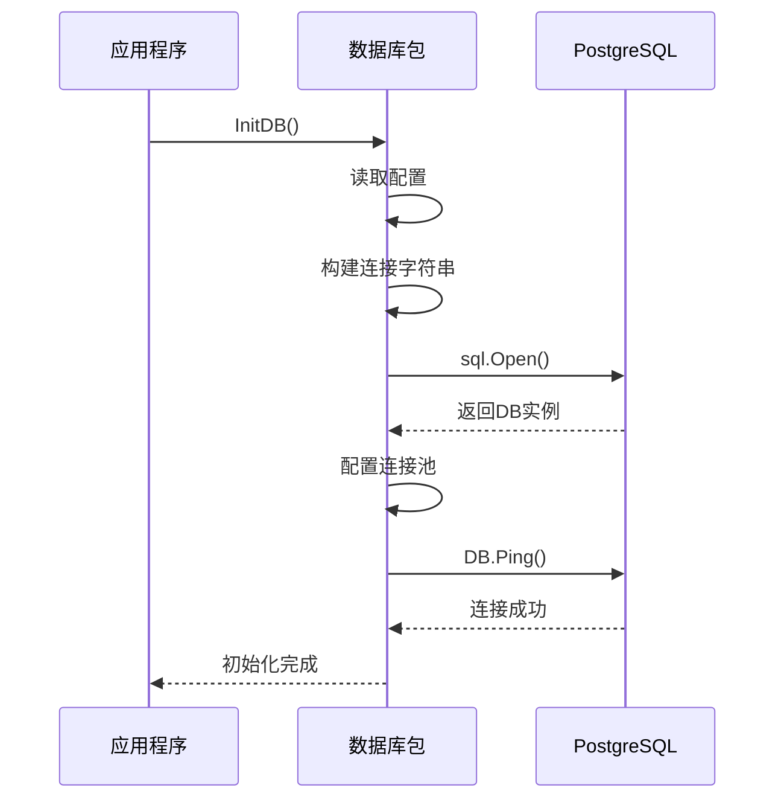

# 数据模型层

<cite>
**本文档引用的文件**   
- [organization.go](file://backend/internal/models/organization.go)
- [domain.go](file://backend/internal/models/domain.go)
- [scan.go](file://backend/internal/models/scan.go)
- [vulnerability.go](file://backend/internal/models/vulnerability.go)
- [response.go](file://backend/internal/models/response.go)
- [database.go](file://backend/pkg/database/database.go)
- [config.go](file://backend/config/config.go)
</cite>

## 目录
1. [简介](#简介)
2. [项目结构](#项目结构)
3. [核心数据模型](#核心数据模型)
4. [统一响应结构](#统一响应结构)
5. [数据库初始化与连接](#数据库初始化与连接)
6. [模型与数据库映射](#模型与数据库映射)
7. [CRUD操作示例](#crud操作示例)
8. [类型安全与数据一致性](#类型安全与数据一致性)

## 简介
本文档旨在构建数据模型层的权威参考，系统阐述系统中各领域实体（组织、域名、扫描任务、漏洞）的结构定义、字段含义及GORM标签配置。同时说明统一响应格式的设计理念与序列化规则，并结合数据库初始化逻辑，解释模型如何映射到PostgreSQL表结构，包括主外键关系、索引设置和数据约束。提供模型使用示例，强调类型安全与数据一致性保障措施。

## 项目结构
本项目采用分层架构设计，后端主要分为`cmd`、`config`、`internal`、`pkg/database`、`routes`等模块。其中`internal/models`目录集中定义了所有数据模型，`pkg/database`负责数据库连接管理，`internal/handlers`和`internal/services`分别处理HTTP请求和业务逻辑。



**图示来源**
- [main.go](file://backend/cmd/main.go)
- [database.go](file://backend/pkg/database/database.go)
- [routes.go](file://backend/routes/routes.go)

## 核心数据模型

### 组织模型 (Organization)
组织模型定义了企业或团队的基本信息，是系统中的顶级实体。

**:Organization 结构体字段说明**
- **ID**: 组织唯一标识符，字符串类型，JSON序列化为`id`，数据库字段名为`id`
- **Name**: 组织名称，字符串类型，必填项，JSON序列化为`name`，数据库字段名为`name`
- **Description**: 组织描述，字符串类型，可选，JSON序列化为`description`，数据库字段名为`description`
- **CreatedAt**: 创建时间，time.Time类型，记录组织创建的精确时间戳

**:CreateOrganizationRequest 请求结构体**
用于创建新组织，包含必填的`Name`和可选的`Description`。

**:UpdateOrganizationRequest 更新请求结构体**
用于更新组织信息，`ID`为必填以确定目标组织，`Name`和`Description`为可选更新字段。

**:DeleteOrganizationRequest 删除请求结构体**
包含待删除组织的`OrganizationID`，用于标识要删除的组织。

**节来源**
- [organization.go](file://backend/internal/models/organization.go#L7-L31)

### 域名模型 (Domain)
域名模型分为主域名、子域名及组织关联关系，形成层次化结构。

**:MainDomain 主域名结构体**
- **ID**: 主域名唯一标识符
- **MainDomainName**: 主域名名称（如example.com）
- **CreatedAt**: 创建时间

**:SubDomain 子域名结构体**
- **ID**: 子域名唯一标识符
- **SubDomainName**: 子域名完整名称（如www.example.com）
- **MainDomainID**: 关联的主域名ID，建立外键关系
- **Status**: 域名状态（如active, inactive）
- **CreatedAt**: 创建时间
- **UpdatedAt**: 更新时间
- **MainDomain**: 嵌套的主域名对象，用于关联查询

**:OrganizationMainDomain 关联结构体**
- **OrganizationID**: 组织ID
- **MainDomainID**: 主域名ID
用于建立组织与主域名的多对多关联关系。

**:CreateMainDomainsRequest 批量创建主域名请求**
支持一次性为指定组织添加多个主域名。

**:GetOrganizationSubDomainsResponse 分页响应结构**
包含子域名列表、总数、当前页码和每页大小，支持分页查询。

**节来源**
- [domain.go](file://backend/internal/models/domain.go#L7-L61)

### 扫描任务模型 (Scan)
扫描任务模型跟踪组织的资产安全扫描过程。

**:ScanTask 扫描任务结构体**
- **ID**: 任务唯一标识符
- **OrganizationID**: 关联的组织ID
- **MainDomainID**: 关联的主域名ID
- **Status**: 任务状态（如pending, running, completed, failed）
- **CreatedAt**: 任务创建时间
- **UpdatedAt**: 任务最后更新时间

**:ScanResult 扫描结果结构体**
- **ID**: 结果唯一标识符
- **ScanTaskID**: 关联的扫描任务ID
- **ResultSummary**: 结果摘要，存储扫描的核心发现
- **CreatedAt**: 结果创建时间
- **UpdatedAt**: 结果更新时间

**:StartOrganizationScanRequest 开始扫描请求**
仅需指定`OrganizationID`即可启动对该组织所有资产的扫描。

**:GetOrganizationScanHistoryResponse 扫描历史响应**
返回指定组织的扫描任务列表，用于展示扫描历史。

**节来源**
- [scan.go](file://backend/internal/models/scan.go#L7-L40)

### 漏洞模型 (Vulnerability)
漏洞模型定义了安全扫描发现的潜在风险。

**:Vulnerability 漏洞结构体**
- **ID**: 漏洞唯一标识符
- **Title**: 漏洞标题
- **Severity**: 严重程度（critical, high, medium, low）
- **CVSS**: CVSS评分，浮点数
- **CVE**: CVE编号
- **Domain**: 受影响域名
- **Port**: 受影响端口
- **Service**: 服务类型
- **Description**: 漏洞描述
- **DiscoveredDate**: 发现日期
- **Status**: 漏洞状态（open, fixed, ignored）
- **Organization**: 所属组织名称
- **AffectedURL**: 受影响URL
- **RiskScore**: 风险评分
- **POC**: 概念验证代码
- **Solution**: 修复方案
- **OrganizationID**: 所属组织ID

**:GetOrganizationVulnerabilitiesResponse 漏洞响应**
返回指定组织的所有漏洞列表。

**节来源**
- [vulnerability.go](file://backend/internal/models/vulnerability.go#L7-L31)

## 统一响应结构

### APIResponse 通用响应设计
系统采用统一的API响应格式，确保前后端交互的一致性和可预测性。

**:APIResponse 结构体**
- **Code**: 响应状态码，字符串类型
- **Message**: 响应消息，描述操作结果
- **Data**: 响应数据，interface{}类型，可容纳任意结构的数据，omitempty标签确保当数据为空时不会出现在JSON输出中

这种设计提供了标准化的错误处理和成功响应模式，前端可以统一处理所有API调用的结果。

```mermaid
classDiagram
class APIResponse {
+string Code
+string Message
+interface{} Data
}
class SuccessResponse {
+string Code : "SUCCESS"
+string Message : "操作成功"
+T Data : 具体业务数据
}
class ErrorResponse {
+string Code : "ERROR_CODE"
+string Message : 错误描述
+null Data
}
APIResponse <|-- SuccessResponse
APIResponse <|-- ErrorResponse
```

**图示来源**
- [response.go](file://backend/internal/models/response.go#L5-L9)
- [utils/response.go](file://backend/internal/utils/response.go)

**节来源**
- [response.go](file://backend/internal/models/response.go#L5-L9)

## 数据库初始化与连接

### 数据库连接管理
`database.go`文件负责数据库的初始化、连接池配置和健康检查。

**:InitDB 函数逻辑**
1. 从配置中获取数据库连接参数
2. 构建PostgreSQL连接字符串
3. 使用`sql.Open`创建数据库连接
4. 配置连接池参数（最大连接数、空闲连接数、连接生命周期）
5. 通过`DB.Ping()`测试连接
6. 记录连接成功日志

**:数据库连接池配置**
- **SetMaxOpenConns**: 设置最大打开连接数，取自配置的`MaxConns`
- **SetMaxIdleConns**: 设置最大空闲连接数，为最大连接数的一半
- **SetConnMaxLifetime**: 设置连接最大生命周期为5分钟，防止长时间空闲连接失效

**:辅助函数**
- **GetDB()**: 获取全局数据库连接实例
- **CloseDB()**: 安全关闭数据库连接
- **HealthCheck()**: 执行数据库健康检查
- **WithTx()**: 提供事务执行的便捷函数，自动处理提交和回滚



**图示来源**
- [database.go](file://backend/pkg/database/database.go#L15-L94)
- [config.go](file://backend/config/config.go)

**节来源**
- [database.go](file://backend/pkg/database/database.go#L15-L94)

## 模型与数据库映射

### 表结构映射
尽管当前代码未直接展示GORM迁移，但模型结构清晰地对应了预期的数据库表结构。

**:预期表结构**
- **organizations**: 存储组织信息，主键为`id`
- **main_domains**: 存储主域名，主键为`id`
- **sub_domains**: 存储子域名，主键为`id`，外键`main_domain_id`关联`main_domains.id`
- **organization_main_domains**: 关联表，存储组织与主域名的多对多关系，复合主键`(organization_id, main_domain_id)`
- **scan_tasks**: 存储扫描任务，外键`organization_id`和`main_domain_id`
- **scan_results**: 存储扫描结果，外键`scan_task_id`

**:数据约束**
- 所有ID字段均作为主键，保证唯一性
- 外键关系确保数据引用完整性
- `status`字段使用枚举值，保证状态一致性
- 时间戳字段自动记录创建和更新时间

```mermaid
erDiagram
ORGANIZATION ||--o{ ORGANIZATION_MAIN_DOMAIN : "拥有"
ORGANIZATION ||--o{ SCAN_TASK : "发起"
MAIN_DOMAIN ||--o{ ORGANIZATION_MAIN_DOMAIN : "被拥有"
MAIN_DOMAIN ||--o{ SUB_DOMAIN : "包含"
MAIN_DOMAIN ||--o{ SCAN_TASK : "被扫描"
SCAN_TASK ||--o{ SCAN_RESULT : "产生"
ORGANIZATION {
string id PK
string name
string description
timestamp created_at
}
MAIN_DOMAIN {
string id PK
string main_domain_name UK
timestamp created_at
}
SUB_DOMAIN {
string id PK
string sub_domain_name UK
string main_domain_id FK
string status
timestamp created_at
timestamp updated_at
}
ORGANIZATION_MAIN_DOMAIN {
string organization_id FK PK
string main_domain_id FK PK
}
SCAN_TASK {
string id PK
string organization_id FK
string main_domain_id FK
string status
timestamp created_at
timestamp updated_at
}
SCAN_RESULT {
string id PK
string scan_task_id FK
text result_summary
timestamp created_at
timestamp updated_at
}
```

**图示来源**
- [organization.go](file://backend/internal/models/organization.go)
- [domain.go](file://backend/internal/models/domain.go)
- [scan.go](file://backend/internal/models/scan.go)

## CRUD操作示例

### 组织的CRUD操作
以下示例展示如何通过服务层进行组织的增删改查。

**:创建组织**
```go
req := models.CreateOrganizationRequest{
    Name:        "示例公司",
    Description: "这是一家示例公司",
}
service := services.NewOrganizationService()
org, err := service.CreateOrganization(req)
```

**:查询组织列表**
```go
service := services.NewOrganizationService()
organizations, err := service.GetOrganizations()
```

**:更新组织**
```go
req := models.UpdateOrganizationRequest{
    ID:          "org-123",
    Name:        "更新后的公司名",
    Description: "更新后的描述",
}
service := services.NewOrganizationService()
org, err := service.UpdateOrganization(req)
```

**:删除组织**
```go
service := services.NewOrganizationService()
err := service.DeleteOrganization("org-123")
```

这些操作通过`organization-service.go`中的服务方法实现，确保了业务逻辑的封装和复用。

**节来源**
- [organization-handler.go](file://backend/internal/handlers/organization-handler.go#L10-L211)
- [organization-service.go](file://backend/internal/services/organization-service.go)

## 类型安全与数据一致性

### 类型安全保障
系统通过多种机制确保类型安全和数据一致性：

**:结构体定义**
使用Go的强类型系统定义所有数据模型，编译时即可捕获类型错误。

**:JSON标签**
通过`json:"field_name"`标签精确控制序列化/反序列化行为，避免字段名不一致问题。

**:数据库标签**
使用`db:"column_name"`标签明确指定数据库字段映射，解耦Go字段名与数据库列名。

**:请求验证**
在handler层使用`binding:"required"`等标签进行请求参数验证，确保输入数据的完整性和正确性。

**:统一响应**
`APIResponse`结构体提供标准化的输出格式，确保所有API返回一致的数据结构。

**:错误处理**
采用分层错误处理机制，从服务层到handler层传递错误信息，最终通过统一的错误响应格式返回给客户端。

这些措施共同构建了一个类型安全、数据一致的系统，降低了运行时错误的风险，提高了系统的可靠性和可维护性。

**节来源**
- [organization.go](file://backend/internal/models/organization.go)
- [domain.go](file://backend/internal/models/domain.go)
- [response.go](file://backend/internal/models/response.go)
- [organization-handler.go](file://backend/internal/handlers/organization-handler.go)