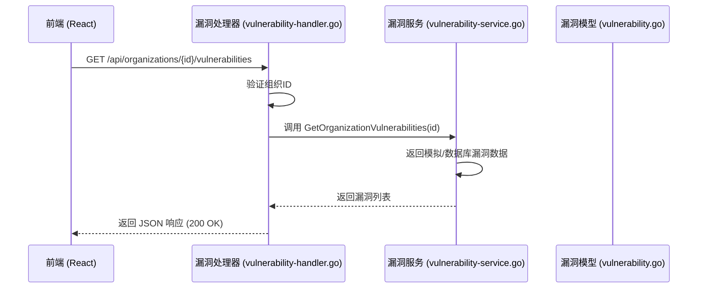
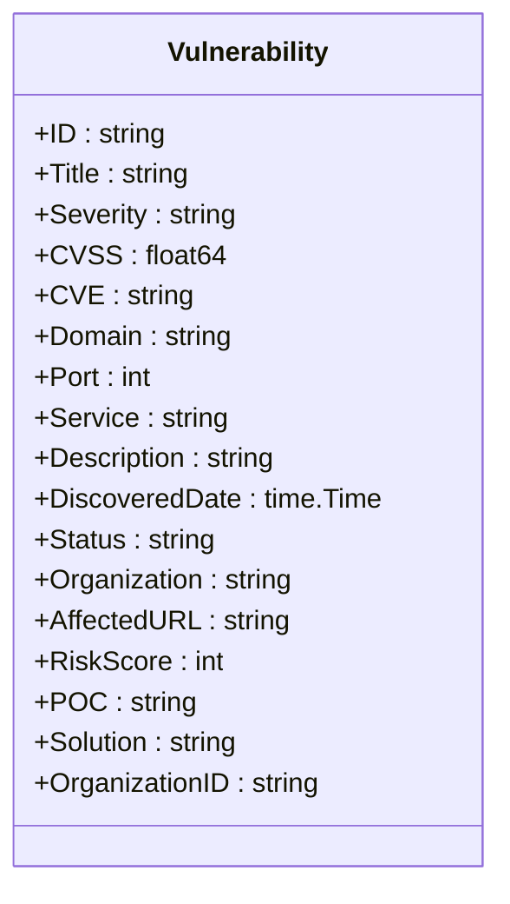
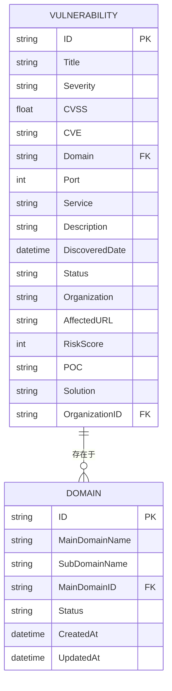
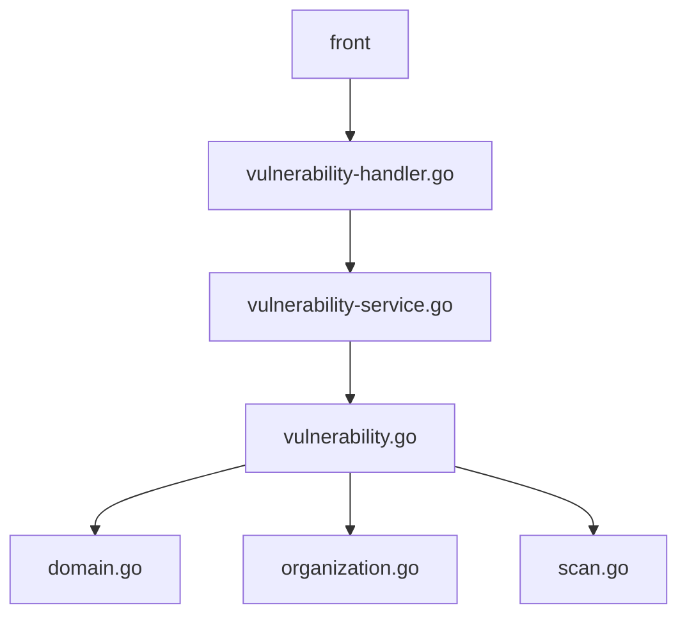

# 漏洞模型

<cite>
**本文档引用文件**  
- [vulnerability.go](file://backend/internal/models/vulnerability.go)
- [vulnerability-service.go](file://backend/internal/services/vulnerability-service.go)
- [vulnerability-handler.go](file://backend/internal/handlers/vulnerability-handler.go)
- [domain.go](file://backend/internal/models/domain.go)
- [scan.go](file://backend/internal/models/scan.go)
</cite>

## 目录
1. [简介](#简介)
2. [项目结构](#项目结构)
3. [核心组件](#核心组件)
4. [架构概览](#架构概览)
5. [详细组件分析](#详细组件分析)
6. [依赖关系分析](#依赖关系分析)
7. [性能考量](#性能考量)
8. [故障排除指南](#故障排除指南)
9. [结论](#结论)

## 简介
本文档全面介绍“漏洞模型”的设计与实现，涵盖漏洞实体的属性定义、与其他模型的关联方式、数据访问模式及其在安全报告和合规审计中的关键作用。通过分析后端模型、服务和处理器代码，揭示该模型如何支持漏洞聚合分析、趋势统计以及未来扩展性。

## 项目结构
项目采用典型的分层架构，分为前端（`front`）和后端（`backend`）两大部分。后端使用 Go 语言开发，遵循 MVC 模式，主要目录包括：
- `backend/cmd`: 应用入口
- `backend/config`: 配置管理
- `backend/internal/models`: 数据模型定义
- `backend/internal/services`: 业务逻辑处理
- `backend/internal/handlers`: HTTP 请求处理
- `backend/pkg/database`: 数据库连接

漏洞相关的核心文件位于 `backend/internal/models/vulnerability.go`、`backend/internal/services/vulnerability-service.go` 和 `backend/internal/handlers/vulnerability-handler.go`。

```mermaid
graph TD
subgraph "Backend"
H[vulnerability-handler.go] --> S[vulnerability-service.go]
S --> M[vulnerability.go]
M --> D[domain.go]
M --> SC[scan.go]
end
subgraph "Frontend"
F[organization-vulnerabilities.tsx] --> API[HTTP API]
end
API < --> H
```

**图示来源**
- [vulnerability.go](file://backend/internal/models/vulnerability.go)
- [vulnerability-service.go](file://backend/internal/services/vulnerability-service.go)
- [vulnerability-handler.go](file://backend/internal/handlers/vulnerability-handler.go)

**本节来源**
- [vulnerability.go](file://backend/internal/models/vulnerability.go)
- [vulnerability-service.go](file://backend/internal/services/vulnerability-service.go)

## 核心组件
漏洞模型是整个安全扫描系统的核心数据结构之一，用于存储和管理发现的安全漏洞信息。它不仅包含漏洞的基本属性，还通过外键与组织、域名和扫描任务等模型建立关联，支持复杂的查询和分析操作。

**本节来源**
- [vulnerability.go](file://backend/internal/models/vulnerability.go)
- [vulnerability-service.go](file://backend/internal/services/vulnerability-service.go)

## 架构概览
系统采用前后端分离架构，前端通过 RESTful API 与后端交互。当用户请求查看某个组织的漏洞列表时，请求流程如下：



**图示来源**
- [vulnerability-handler.go](file://backend/internal/handlers/vulnerability-handler.go#L1-L25)
- [vulnerability-service.go](file://backend/internal/services/vulnerability-service.go#L1-L125)

## 详细组件分析

### 漏洞模型分析
`Vulnerability` 结构体定义了漏洞实体的所有属性，是数据持久化和传输的基础。

#### 漏洞模型属性


**图示来源**
- [vulnerability.go](file://backend/internal/models/vulnerability.go#L10-L30)

**本节来源**
- [vulnerability.go](file://backend/internal/models/vulnerability.go#L1-L31)

#### 属性定义与说明
- **漏洞ID (ID)**: 漏洞的唯一标识符，如 `VUL-001`。
- **标题 (Title)**: 漏洞的简要描述，如 "SQL 注入漏洞"。
- **风险等级 (Severity)**: 漏洞的严重程度，分为 "高危"、"中危"、"低危"、"已忽略"。
- **CVSS评分 (CVSS)**: 通用漏洞评分系统分数，范围 0.0-10.0，数值越高风险越大。
- **CVE编号 (CVE)**: 国际公认的漏洞标识符，如 `CVE-2024-1234`，非必填。
- **域名 (Domain)**: 漏洞所在的域名，如 `api.example.com`。
- **端口 (Port)**: 漏洞服务监听的端口号。
- **服务 (Service)**: 漏洞所在的服务类型，如 "Web Application"。
- **描述 (Description)**: 漏洞的详细技术描述。
- **发现时间 (DiscoveredDate)**: 漏洞被发现的日期和时间。
- **修复状态 (Status)**: 漏洞的当前处理状态，如 "待修复"、"处理中"、"已修复"、"已忽略"。
- **组织 (Organization)**: 漏洞所属的组织名称。
- **影响URL (AffectedURL)**: 漏洞的具体影响地址。
- **风险分值 (RiskScore)**: 综合计算的风险评分，用于排序和优先级判断。
- **验证方法 (POC)**: 漏洞概念验证代码，用于复现漏洞。
- **解决方案 (Solution)**: 修复漏洞的建议方案。
- **组织ID (OrganizationID)**: 关联的组织外键，用于数据库查询。

### 关联模型分析
漏洞模型通过字段与 `域名模型` 和 `扫描任务模型` 建立关联。

#### 与域名模型的关联
漏洞通过 `Domain` 字段直接引用 `domain.go` 中定义的域名信息。`domain.go` 定义了 `MainDomain`（主域名）和 `SubDomain`（子域名）结构体，漏洞可以关联到具体的子域名或主域名。



**图示来源**
- [vulnerability.go](file://backend/internal/models/vulnerability.go#L10-L30)
- [domain.go](file://backend/internal/models/domain.go#L1-L61)

#### 与扫描任务模型的关联
虽然 `vulnerability.go` 中未直接包含扫描任务ID，但逻辑上，每个漏洞都是由一次扫描任务发现的。`scan.go` 中的 `ScanTask` 模型记录了扫描任务的状态和时间，`ScanResult` 可以包含多个漏洞的摘要。这种设计支持通过扫描任务追溯漏洞的发现过程。

### 数据访问与操作示例

#### 按严重程度筛选
```go
// 示例：在服务层筛选高危漏洞
var highRiskVulns []models.Vulnerability
for _, v := range allVulns {
    if v.Severity == "高危" {
        highRiskVulns = append(highRiskVulns, v)
    }
}
```

#### 关联资产信息查询
```go
// 示例：获取漏洞并填充域名信息（实际需数据库JOIN）
func GetVulnerabilitiesWithDomainInfo(orgID string) ([]VulnerabilityWithDomain, error) {
    vulns, err := service.GetOrganizationVulnerabilities(orgID)
    if err != nil {
        return nil, err
    }
    var result []VulnerabilityWithDomain
    for _, v := range vulns {
        domainInfo := getDomainInfo(v.Domain) // 伪代码：查询域名服务
        result = append(result, VulnerabilityWithDomain{Vulnerability: v, DomainInfo: domainInfo})
    }
    return result, nil
}
```

#### 批量状态更新
```go
// 示例：批量更新漏洞状态（需在服务层实现）
func BatchUpdateVulnerabilityStatus(vulnIDs []string, newStatus string) error {
    // 伪代码：遍历ID列表并更新数据库记录
    for _, id := range vulnIDs {
        updateVulnerabilityStatusInDB(id, newStatus)
    }
    return nil
}
```

**本节来源**
- [vulnerability-service.go](file://backend/internal/services/vulnerability-service.go#L1-L125)
- [vulnerability.go](file://backend/internal/models/vulnerability.go#L1-L31)

## 依赖关系分析
漏洞模型是系统中的核心实体，与其他多个组件存在依赖关系。



**图示来源**
- [vulnerability-handler.go](file://backend/internal/handlers/vulnerability-handler.go)
- [vulnerability-service.go](file://backend/internal/services/vulnerability-service.go)
- [vulnerability.go](file://backend/internal/models/vulnerability.go)

**本节来源**
- [vulnerability-handler.go](file://backend/internal/handlers/vulnerability-handler.go#L1-L26)
- [vulnerability-service.go](file://backend/internal/services/vulnerability-service.go#L1-L125)

## 性能考量
- **数据量**: 漏洞数据可能随时间快速增长，需考虑分页查询（如 `GetOrganizationVulnerabilitiesResponse` 可扩展分页字段）。
- **查询效率**: 按 `OrganizationID`、`Severity`、`Status` 等常用字段建立数据库索引可显著提升查询性能。
- **模拟数据**: 当前 `vulnerability-service.go` 使用模拟数据，真实环境需替换为高效的数据库查询。

## 故障排除指南
- **问题**: 无法获取组织漏洞列表。
  - **检查点**: 确认 `organizationID` 参数是否正确传递。
  - **检查点**: 查看后端日志，确认 `GetOrganizationVulnerabilities` 方法是否被调用。
  - **检查点**: 如果使用真实数据库，检查数据库连接和查询语句。
- **问题**: 漏洞状态更新不生效。
  - **检查点**: 确认服务层是否实现了状态更新逻辑。
  - **检查点**: 检查数据库事务是否正确提交。

**本节来源**
- [vulnerability-handler.go](file://backend/internal/handlers/vulnerability-handler.go#L1-L26)
- [vulnerability-service.go](file://backend/internal/services/vulnerability-service.go#L1-L125)

## 结论
漏洞模型是本安全扫描系统的核心，它通过丰富的属性定义和清晰的关联关系，为漏洞管理、聚合分析和趋势统计提供了坚实的数据基础。其设计支持按严重程度、状态、资产等多维度进行高效查询，并通过与组织、域名、扫描任务模型的关联，实现了完整的安全态势可视化。尽管当前使用模拟数据，但其结构清晰，易于扩展，能够很好地支持未来新增漏洞类型和更复杂的业务逻辑。该模型在生成安全报告和满足合规审计要求方面发挥着关键作用。