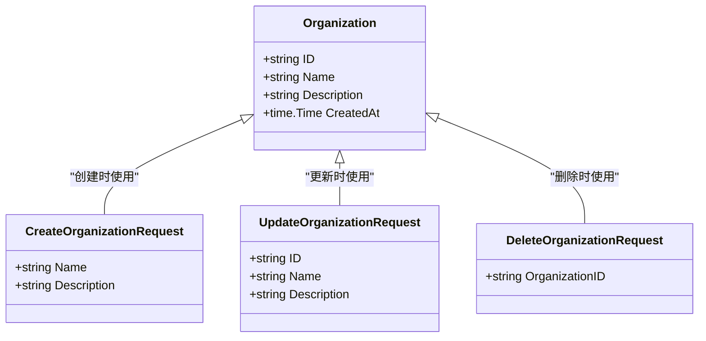
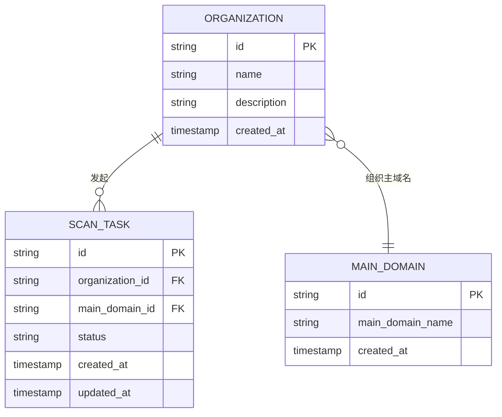
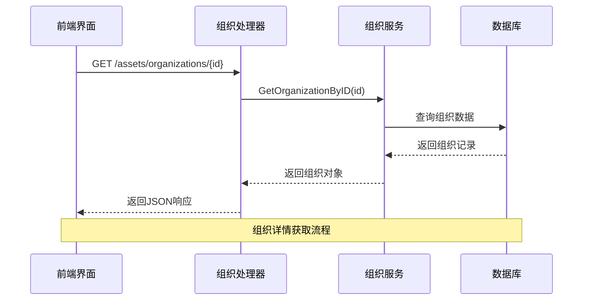

# 组织模型

<cite>
**本文档中引用的文件**
- [organization.go](file://backend/internal/models/organization.go#L0-L30)
- [organization-service.go](file://backend/internal/services/organization-service.go#L0-L157)
- [organization-handler.go](file://backend/internal/handlers/organization-handler.go#L0-L211)
- [初始化.sql](file://backend/初始化.sql#L97-L119)
- [organization-detail.tsx](file://front/components/pages/assets/organizations/organization-detail.tsx#L0-L177)
- [add-organization-dialog.tsx](file://front/components/pages/assets/organizations/add-organization-dialog.tsx#L60-L101)
- [organization-list.tsx](file://front/components/pages/assets/organizations/organization-list.tsx#L95-L168)
</cite>

## 目录
1. [组织模型](#组织模型)
2. [字段定义与业务语义](#字段定义与业务语义)
3. [关联关系分析](#关联关系分析)
4. [数据操作示例](#数据操作示例)
5. [验证规则与数据完整性](#验证规则与数据完整性)
6. [业务场景应用](#业务场景应用)

## 组织模型

组织模型是漏洞扫描系统中的核心实体，用于表示需要进行安全扫描和资产管理的业务单位。该模型定义了组织的基本信息，并通过与其他模型的关联实现资产管理和权限控制功能。

**Section sources**
- [organization.go](file://backend/internal/models/organization.go#L0-L30)

## 字段定义与业务语义

组织模型包含以下字段，每个字段都具有明确的业务含义和数据约束：

**组织模型字段**
- **ID**: `string` - 组织的唯一标识符，使用UUID生成，作为数据库主键
- **Name**: `string` - 组织名称，必填字段，用于标识和显示组织
- **Description**: `string` - 组织描述，可选字段，提供组织的详细信息
- **CreatedAt**: `time.Time` - 创建时间，记录组织创建的时间戳

GORM标签配置：
- `json:"id"` - JSON序列化时的字段名
- `db:"id"` - 数据库列名映射
- `binding:"required"` - 用于请求参数验证，标记必填字段



**Diagram sources**
- [organization.go](file://backend/internal/models/organization.go#L0-L30)

## 关联关系分析

组织模型与其他模型存在多种关联关系，构成了系统的资产管理体系：

### 与主域名的关联
组织与主域名之间存在多对多关系，通过`organization_main_domains`关联表实现：
- 一个组织可以拥有多个主域名
- 一个主域名可以被多个组织共享
- 使用外键约束确保数据完整性

### 与扫描任务的关联
组织与扫描任务之间存在一对多关系：
- 一个组织可以发起多个扫描任务
- 每个扫描任务归属于一个特定组织
- 通过`organization_id`外键建立关联



**Diagram sources**
- [初始化.sql](file://backend/初始化.sql#L97-L119)
- [organization.go](file://backend/internal/models/organization.go#L0-L30)
- [scan.go](file://backend/internal/models/scan.go#L0-L39)

## 数据操作示例

### 查询操作
获取所有组织列表：
```go
func (s *OrganizationService) GetOrganizations() ([]models.Organization, error) {
    query := `
        SELECT id, name, description, created_at
        FROM organizations
        ORDER BY created_at DESC
    `
    
    rows, err := s.db.Query(query)
    if err != nil {
        return nil, err
    }
    defer rows.Close()
    
    var organizations []models.Organization
    for rows.Next() {
        var org models.Organization
        err := rows.Scan(&org.ID, &org.Name, &org.Description, &org.CreatedAt)
        if err != nil {
            return nil, err
        }
        organizations = append(organizations, org)
    }
    
    return organizations, nil
}
```

### 创建操作
创建新组织：
```go
func (s *OrganizationService) CreateOrganization(req models.CreateOrganizationRequest) (*models.Organization, error) {
    id := uuid.New().String()
    
    query := `
        INSERT INTO organizations (id, name, description, created_at)
        VALUES ($1, $2, $3, NOW())
        RETURNING id, name, description, created_at
    `
    
    var org models.Organization
    err := s.db.QueryRow(query, id, req.Name, req.Description).Scan(
        &org.ID, &org.Name, &org.Description, &org.CreatedAt)
    if err != nil {
        return nil, err
    }
    
    return &org, nil
}
```

### 更新操作
更新组织信息：
```go
func (s *OrganizationService) UpdateOrganization(req models.UpdateOrganizationRequest) (*models.Organization, error) {
    query := `
        UPDATE organizations
        SET name = $2, description = $3, updated_at = NOW()
        WHERE id = $1
        RETURNING id, name, description, created_at
    `
    
    var org models.Organization
    err := s.db.QueryRow(query, req.ID, req.Name, req.Description).Scan(
        &org.ID, &org.Name, &org.Description, &org.CreatedAt)
    if err != nil {
        if err == sql.ErrNoRows {
            return nil, fmt.Errorf("organization not found")
        }
        return nil, err
    }
    
    return &org, nil
}
```

**Section sources**
- [organization-service.go](file://backend/internal/services/organization-service.go#L0-L157)

## 验证规则与数据完整性

系统通过多层次的验证机制确保数据完整性：

### 请求参数验证
使用Gin框架的binding标签进行自动验证：
- `binding:"required"` 确保必填字段不为空
- 在Handler层进行参数绑定和验证

```go
func CreateOrganization(c *gin.Context) {
    var req models.CreateOrganizationRequest
    if err := c.ShouldBindJSON(&req); err != nil {
        utils.ValidationErrorResponse(c, "请求参数错误: "+err.Error())
        return
    }
    // ...
}
```

### 业务逻辑验证
在Service层进行业务规则验证：
- 检查组织是否存在（更新、删除操作）
- 验证外键约束（如主域名存在性）
- 处理并发操作和事务完整性

### 数据库约束
通过数据库层面的约束确保数据一致性：
- 主键约束确保ID唯一性
- NOT NULL约束确保必填字段
- 外键约束维护关联完整性

**Section sources**
- [organization-handler.go](file://backend/internal/handlers/organization-handler.go#L0-L211)
- [organization-service.go](file://backend/internal/services/organization-service.go#L0-L157)

## 业务场景应用

### 权限控制
组织模型在权限控制中扮演关键角色：
- 用户被分配到特定组织
- 扫描操作和结果查看受限于组织边界
- 实现多租户环境下的数据隔离

### 资产管理
组织作为资产管理的容器：
- 所有资产（域名、子域名）归属于特定组织
- 扫描任务按组织维度进行管理和统计
- 提供组织级别的资产概览和报告

### 前端交互流程


**Diagram sources**
- [organization-handler.go](file://backend/internal/handlers/organization-handler.go#L0-L211)
- [organization-service.go](file://backend/internal/services/organization-service.go#L0-L157)
- [organization-detail.tsx](file://front/components/pages/assets/organizations/organization-detail.tsx#L0-L177)