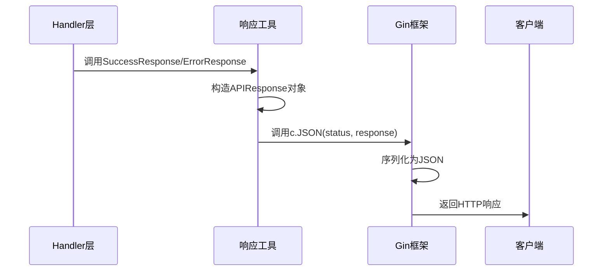
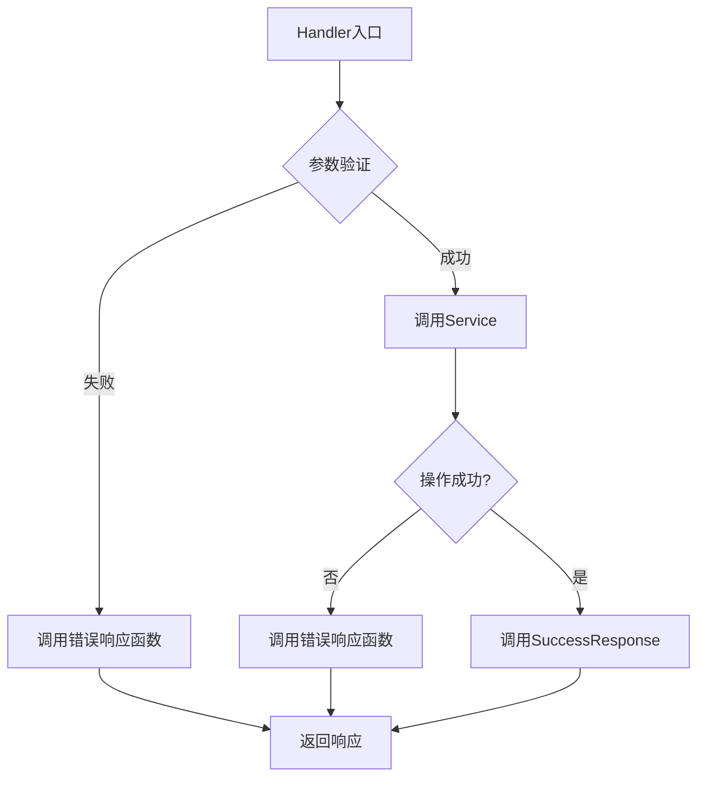

# 统一响应模型

<cite>
**本文档引用文件**  
- [response.go](file://backend/internal/models/response.go)
- [response.go](file://backend/internal/utils/response.go)
- [domain-handler.go](file://backend/internal/handlers/domain-handler.go)
- [organization-handler.go](file://backend/internal/handlers/organization-handler.go)
</cite>

## 目录
1. [引言](#引言)
2. [统一响应模型设计](#统一响应模型设计)
3. [核心结构体详解](#核心结构体详解)
4. [响应构造与序列化机制](#响应构造与序列化机制)
5. [成功与错误响应实现](#成功与错误响应实现)
6. [在Handler层的应用示例](#在handler层的应用示例)
7. [扩展能力与最佳实践](#扩展能力与最佳实践)

## 引言
本项目采用统一的API响应模型，旨在为所有接口提供一致的数据返回格式。该设计提升了客户端处理响应的效率，简化了错误处理逻辑，并增强了系统的可维护性。通过Gin框架的JSON渲染能力，结合自定义响应工具函数，实现了标准化、可复用的响应构造机制。

## 统一响应模型设计

系统采用`APIResponse`结构体作为所有API接口的通用响应格式，确保前后端交互的一致性。该模型包含状态码、消息和数据三个核心字段，适用于成功与错误场景。

```mermaid
classDiagram
class APIResponse {
+string Code
+string Message
+interface{} Data
}
note right of APIResponse : 通用API响应结构体<br/>所有接口返回均基于此模型
```

**图示来源**  
- [response.go](file://backend/internal/models/response.go#L4-L9)

## 核心结构体详解

`APIResponse`结构体定义于`backend/internal/models/response.go`中，是整个响应体系的基础。

```go
// APIResponse 通用API响应结构
type APIResponse struct {
	Code    string      `json:"code"`
	Message string      `json:"message"`
	Data    interface{} `json:"data,omitempty"`
}
```

### 字段说明
- **Code**: 响应状态码，用于标识操作结果类型（如"SUCCESS"、"ERROR"）
- **Message**: 人类可读的消息文本，用于展示给用户或日志记录
- **Data**: 实际业务数据，使用`interface{}`支持任意类型，通过`omitempty`标签在为空时自动省略

该结构体通过JSON标签确保序列化后的字段名符合REST API规范，同时支持灵活的数据嵌套。

**节来源**  
- [response.go](file://backend/internal/models/response.go#L4-L9)

## 响应构造与序列化机制

系统通过`utils/response.go`中的工具函数封装响应构造逻辑，结合Gin上下文实现JSON序列化输出。

### Gin框架集成
利用`c.JSON()`方法自动将Go结构体序列化为JSON格式，并设置正确的Content-Type和HTTP状态码。

### 序列化规则
- `Code`和`Message`字段始终输出
- `Data`字段仅在非空时输出（得益于`omitempty`标签）
- 所有字符串字段均进行UTF-8编码
- 时间类型自动转换为ISO 8601格式（由底层模型决定）



**图示来源**  
- [response.go](file://backend/internal/utils/response.go#L10-L47)
- [domain-handler.go](file://backend/internal/handlers/domain-handler.go#L15-L25)

## 成功与错误响应实现

系统提供了一系列预定义的响应函数，位于`backend/internal/utils/response.go`。

### 成功响应
```go
func SuccessResponse(c *gin.Context, data interface{}) {
	response := models.APIResponse{
		Code:    "SUCCESS",
		Message: "操作成功",
		Data:    data,
	}
	c.JSON(http.StatusOK, response)
}
```

### 错误响应家族
- `ErrorResponse`: 通用错误响应
- `BadRequestResponse`: 400请求错误
- `NotFoundResponse`: 404资源未找到
- `InternalServerErrorResponse`: 500服务器内部错误
- `ValidationErrorResponse`: 422验证错误

这些函数统一设置`Code`为"ERROR"，仅通过`Message`区分具体错误类型。

**节来源**  
- [response.go](file://backend/internal/utils/response.go#L10-L47)

## 在Handler层的应用示例

以组织管理模块为例，展示统一响应模型的实际应用。

### 获取组织列表
```go
func GetOrganizations(c *gin.Context) {
	service := services.NewOrganizationService()
	organizations, err := service.GetOrganizations()
	if err != nil {
		utils.InternalServerErrorResponse(c, "获取组织列表失败: "+err.Error())
		return
	}
	utils.SuccessResponse(c, organizations)
}
```

### 创建组织
```go
func CreateOrganization(c *gin.Context) {
	var req models.CreateOrganizationRequest
	if err := c.ShouldBindJSON(&req); err != nil {
		utils.ValidationErrorResponse(c, "请求参数错误: "+err.Error())
		return
	}
	// ...业务逻辑
	utils.SuccessResponse(c, organization)
}
```

所有Handler函数遵循"验证→业务处理→构造响应"的统一模式，错误处理集中于工具函数。



**图示来源**  
- [organization-handler.go](file://backend/internal/handlers/organization-handler.go#L10-L35)
- [utils/response.go](file://backend/internal/utils/response.go#L10-L47)

## 扩展能力与最佳实践

### 国际化消息支持
可通过将`Message`字段替换为消息键（如"org.create.success"），由客户端根据语言环境解析具体文本，实现国际化。

### 分页元数据扩展
对于分页接口，`Data`字段可包含分页信息：
```json
{
  "code": "SUCCESS",
  "message": "操作成功",
  "data": {
    "items": [...],
    "total": 100,
    "page": 1,
    "page_size": 10
  }
}
```

### 自定义响应包装
可创建特定业务的响应结构体，如：
```go
type PagedResponse struct {
	Items    interface{} `json:"items"`
	Total    int         `json:"total"`
	Page     int         `json:"page"`
	PageSize int         `json:"page_size"`
}
```

### 最佳实践建议
1. **保持Code语义清晰**：使用"SUCCESS"/"ERROR"等通用码，避免过多自定义状态码
2. **Message简洁明了**：提供足够信息用于调试，但避免暴露敏感细节
3. **Data结构一致性**：同类接口返回相似的数据结构
4. **错误分类处理**：根据HTTP状态码合理分类错误类型
5. **避免深层嵌套**：保持响应结构扁平化，便于客户端解析

**节来源**  
- [domain.go](file://backend/internal/models/domain.go#L55-L61)
- [response.go](file://backend/internal/models/response.go#L4-L9)