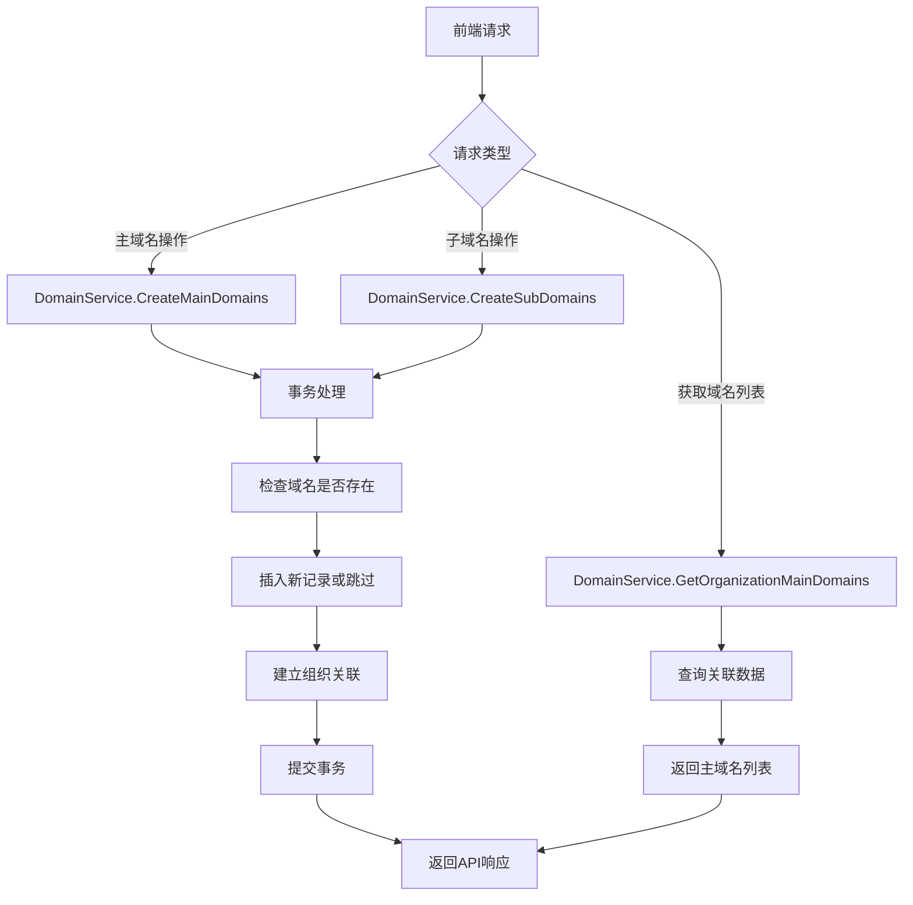
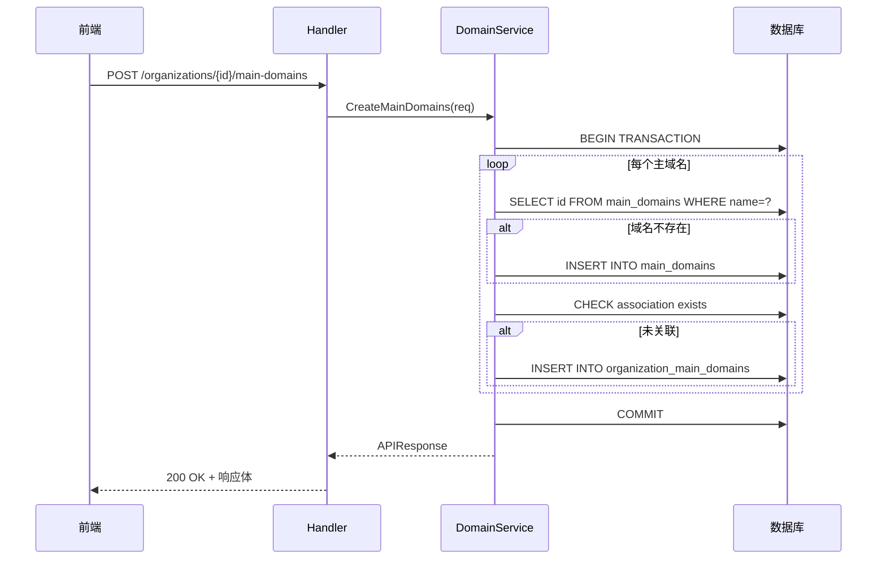
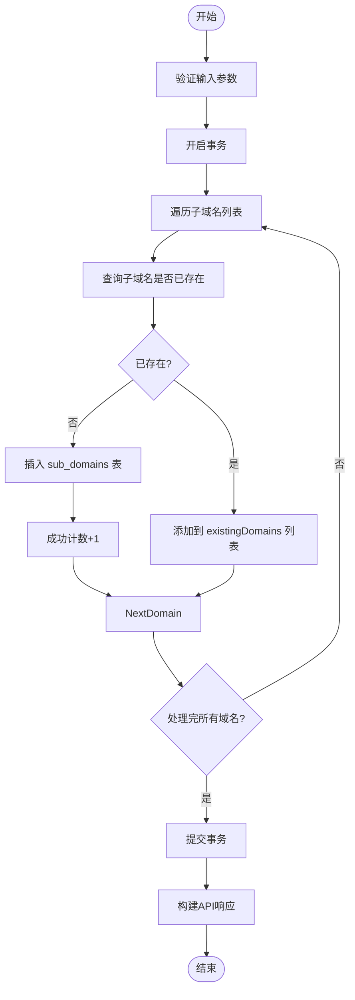
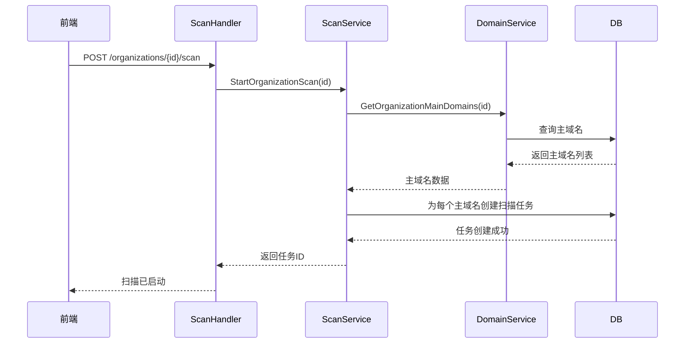
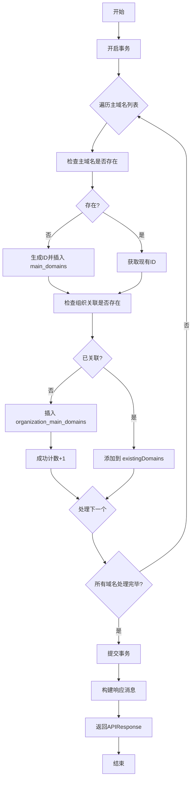

# 域服务

<cite>
**本文档引用的文件**  
- [domain-service.go](file://backend/internal/services/domain-service.go)
- [domain.go](file://backend/internal/models/domain.go)
- [domain-handler.go](file://backend/internal/handlers/domain-handler.go)
- [scan-service.go](file://backend/internal/services/scan-service.go)
- [scan.go](file://backend/internal/models/scan.go)
- [scan-handler.go](file://backend/internal/handlers/scan-handler.go)
</cite>

## 目录
1. [简介](#简介)
2. [核心功能概述](#核心功能概述)
3. [主域名管理](#主域名管理)
4. [子域名管理](#子域名管理)
5. [扫描任务触发机制](#扫描任务触发机制)
6. [服务层接口与数据结构](#服务层接口与数据结构)
7. [关键方法执行流程](#关键方法执行流程)
8. [异常传播策略](#异常传播策略)
9. [性能优化建议](#性能优化建议)
10. [前端调用示例](#前端调用示例)

## 简介
域服务（DomainService）是漏洞扫描系统中的核心业务组件，负责管理主域名与子域名的生命周期，并维护域名与组织之间的归属关系。该服务通过封装数据库操作和事务逻辑，确保资产与组织间关联的数据一致性。同时，它为扫描服务提供数据支持，实现基于组织维度的自动化扫描任务触发。

本服务位于后端 `internal/services` 目录下，与 `domain-handler.go` 配合提供 REST API 接口，供前端进行域名资产的增删改查操作。

**Section sources**
- [domain-service.go](file://backend/internal/services/domain-service.go#L1-L20)
- [domain-handler.go](file://backend/internal/handlers/domain-handler.go#L1-L10)

## 核心功能概述
域服务主要实现以下三大功能：
1. **主域名管理**：支持为组织批量添加主域名，自动处理已存在域名的去重逻辑。
2. **子域名管理**：支持为指定主域名添加子域名，实现资产的层级化管理。
3. **扫描联动机制**：通过与扫描服务的集成，在组织资产变更后可触发全面的安全扫描。

这些功能共同构成了系统的资产发现与管理闭环，是实现持续安全监控的基础。



**Diagram sources**
- [domain-service.go](file://backend/internal/services/domain-service.go#L62-L150)
- [domain-handler.go](file://backend/internal/handlers/domain-handler.go#L30-L50)

## 主域名管理

### 增加主域名
通过 `CreateMainDomains` 方法实现为组织批量添加主域名的功能。该方法采用数据库事务确保操作的原子性。

**执行流程**：
1. 开启数据库事务
2. 遍历请求中的每个主域名
3. 查询该域名是否已存在于系统中
   - 若不存在，则插入 `main_domains` 表
   - 若存在，则复用已有记录ID
4. 检查组织与该主域名是否已建立关联
   - 若未关联，则在 `organization_main_domains` 关联表中插入记录
5. 提交事务并返回结果统计

该设计避免了重复数据的产生，并支持部分成功场景的精细化反馈。



**Diagram sources**
- [domain-service.go](file://backend/internal/services/domain-service.go#L62-L150)
- [domain-handler.go](file://backend/internal/handlers/domain-handler.go#L30-L50)

### 查询主域名
`GetOrganizationMainDomains` 方法用于获取指定组织关联的所有主域名，按创建时间倒序排列。

```sql
SELECT md.id, md.main_domain_name, md.created_at
FROM main_domains md
INNER JOIN organization_main_domains omd ON md.id = omd.main_domain_id
WHERE omd.organization_id = $1
ORDER BY md.created_at DESC
```

**Section sources**
- [domain-service.go](file://backend/internal/services/domain-service.go#L30-L60)
- [domain.go](file://backend/internal/models/domain.go#L10-L15)

### 移除主域名关联
`RemoveOrganizationMainDomain` 方法用于解除组织与主域名的关联关系，仅删除关联记录而不影响主域名本身的存在。

**Section sources**
- [domain-service.go](file://backend/internal/services/domain-service.go#L152-L175)

## 子域名管理

### 增加子域名
`CreateSubDomains` 方法用于为指定主域名添加子域名列表。与主域名创建类似，该方法也使用事务处理，并在主域名上下文中检查子域名的唯一性。

**关键逻辑**：
- 子域名的唯一性约束为 `(sub_domain_name, main_domain_id)` 联合键
- 支持设置子域名初始状态（如 "unknown", "active"）
- 自动设置创建和更新时间戳



**Diagram sources**
- [domain-service.go](file://backend/internal/services/domain-service.go#L280-L342)
- [domain.go](file://backend/internal/models/domain.go#L25-L30)

### 查询子域名（分页）
`GetOrganizationSubDomains` 方法支持分页查询组织下所有主域名关联的子域名，返回包含总数、当前页码等信息的完整响应。

**SQL 查询逻辑**：
1. 先执行 COUNT 查询获取总数
2. 再执行带 LIMIT 和 OFFSET 的分页查询
3. 通过多表 JOIN 获取主域名信息并嵌入子域名对象

**Section sources**
- [domain-service.go](file://backend/internal/services/domain-service.go#L177-L278)

## 扫描任务触发机制
域服务虽不直接执行扫描，但其管理的资产数据是触发扫描任务的基础。当组织资产变更后，可通过调用扫描服务启动全面评估。

### 与扫描服务的集成
在 `scan-service.go` 中，`StartOrganizationScan` 方法首先调用域服务获取组织的主域名列表：

```go
domainService := NewDomainService()
mainDomains, err := domainService.GetOrganizationMainDomains(organizationID)
```

若组织无主域名，则返回错误；否则为每个主域名创建一个扫描任务记录。



**Diagram sources**
- [scan-service.go](file://backend/internal/services/scan-service.go#L15-L45)
- [domain-service.go](file://backend/internal/services/domain-service.go#L30-L60)

## 服务层接口与数据结构
域服务通过清晰的请求/响应模型对外暴露功能。

### 请求数据结构
```go
// 创建主域名请求
type CreateMainDomainsRequest struct {
    MainDomains    []string `json:"main_domains" binding:"required"`
    OrganizationID string   `json:"organization_id" binding:"required"`
}

// 创建子域名请求
type CreateSubDomainsRequest struct {
    SubDomains   []string `json:"sub_domains" binding:"required"`
    MainDomainID string   `json:"main_domain_id" binding:"required"`
    Status       string   `json:"status"`
}
```

### 响应数据结构
```go
// 通用API响应
type APIResponse struct {
    Code    string      `json:"code"`
    Message string      `json:"message"`
    Data    interface{} `json:"data,omitempty"`
}

// 获取子域名响应（含分页）
type GetOrganizationSubDomainsResponse struct {
    SubDomains []SubDomain `json:"sub_domains"`
    Total      int         `json:"total"`
    Page       int         `json:"page"`
    PageSize   int         `json:"page_size"`
}
```

**Section sources**
- [domain.go](file://backend/internal/models/domain.go#L35-L60)
- [response.go](file://backend/internal/models/response.go#L5-L15)

## 关键方法执行流程
### CreateMainDomains 执行流程图


**Diagram sources**
- [domain-service.go](file://backend/internal/services/domain-service.go#L62-L150)

## 异常传播策略
域服务采用分层异常处理策略：

1. **数据库异常**：直接返回给调用方，由 handler 统一转换为 500 错误
2. **业务异常**：如 "association not found"，在 handler 中转换为 404 状态码
3. **参数校验异常**：由 Gin 框架拦截并返回 400 错误

```go
// 在 handler 中处理特定业务错误
if err.Error() == "association not found" {
    utils.NotFoundResponse(c, "未找到关联关系")
    return
}
```

这种策略既保证了错误信息的精确性，又避免了敏感技术细节的暴露。

**Section sources**
- [domain-handler.go](file://backend/internal/handlers/domain-handler.go#L75-L85)
- [domain-service.go](file://backend/internal/services/domain-service.go#L165-L170)

## 性能优化建议
### 缓存策略
对于频繁读取但不常变更的主域名列表，建议引入 Redis 缓存：

- **缓存键**：`org:main_domains:{organization_id}`
- **缓存时间**：300秒（可根据业务需求调整）
- **失效策略**：在 `CreateMainDomains` 和 `RemoveOrganizationMainDomain` 操作后清除缓存

### 批量处理优化
当前 `CreateMainDomains` 方法在事务中逐条处理域名，可优化为：
1. 使用 `INSERT ... ON CONFLICT DO NOTHING` 减少查询次数
2. 采用批量 INSERT 语句提升性能
3. 对于超大列表，考虑分批处理避免事务过长

### 数据库索引优化
确保以下字段已建立索引：
- `main_domains.main_domain_name`（唯一索引）
- `organization_main_domains.organization_id`
- `sub_domains.main_domain_id`
- `scan_tasks.organization_id`

**Section sources**
- [domain-service.go](file://backend/internal/services/domain-service.go#L62-L150)
- [初始化.sql](file://backend/初始化.sql#L31-L56)

## 前端调用示例
### 创建主域名
```typescript
// 前端 domain.service.ts
createMainDomains(organizationId: string, domains: string[]) {
  return axios.post(`/organizations/${organizationId}/main-domains`, {
    main_domains: domains,
    organization_id: organizationId
  });
}

// 在组件中调用
const response = await domainService.createMainDomains(
  'org-123', 
  ['example.com', 'test.com']
);
```

### 启动组织扫描
```tsx
// scan-create.tsx
const handleStartScan = async () => {
  try {
    const response = await scanService.startOrganizationScan(selectedOrganization.id);
    toast.success(response.message);
  } catch (error) {
    toast.error('启动扫描失败: ' + error.message);
  }
};
```

### 域名选择界面
```tsx
// 域名列表选择组件
{filteredDomains.map((domain) => (
  <div 
    key={domain.id}
    onClick={() => handleDomainToggle(domain.id)}
    className={scanConfig.domainIds.includes(domain.id) ? 'selected' : ''}
  >
    <Checkbox checked={scanConfig.domainIds.includes(domain.id)} />
    <label>{domain.main_domain_name}</label>
  </div>
))}
```

**Section sources**
- [scan-create.tsx](file://front/components/pages/scan/create/scan-create.tsx#L80-L122)
- [domain-handler.go](file://backend/internal/handlers/domain-handler.go#L30-L50)