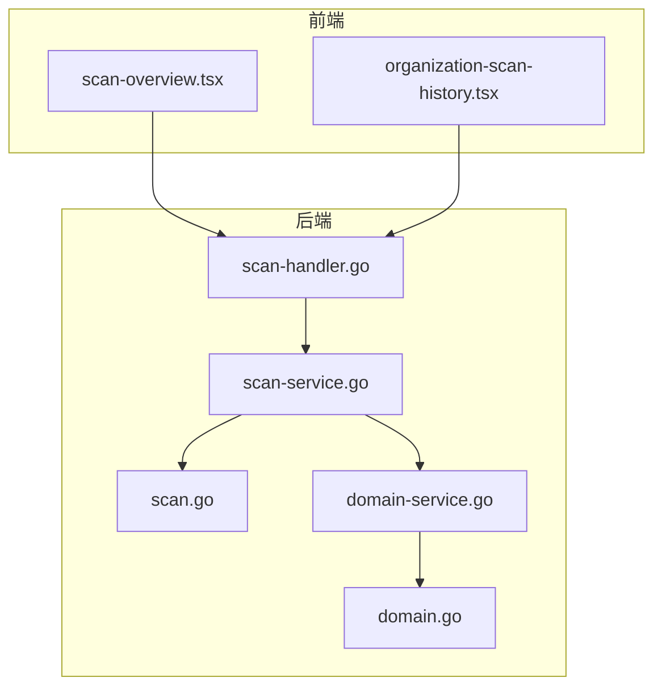
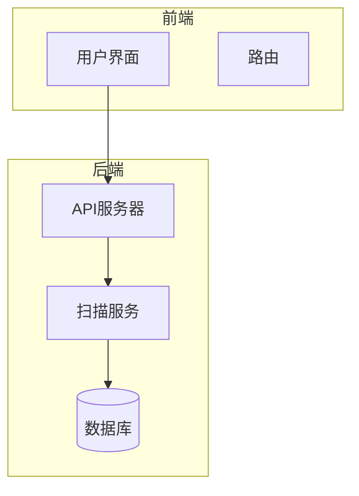
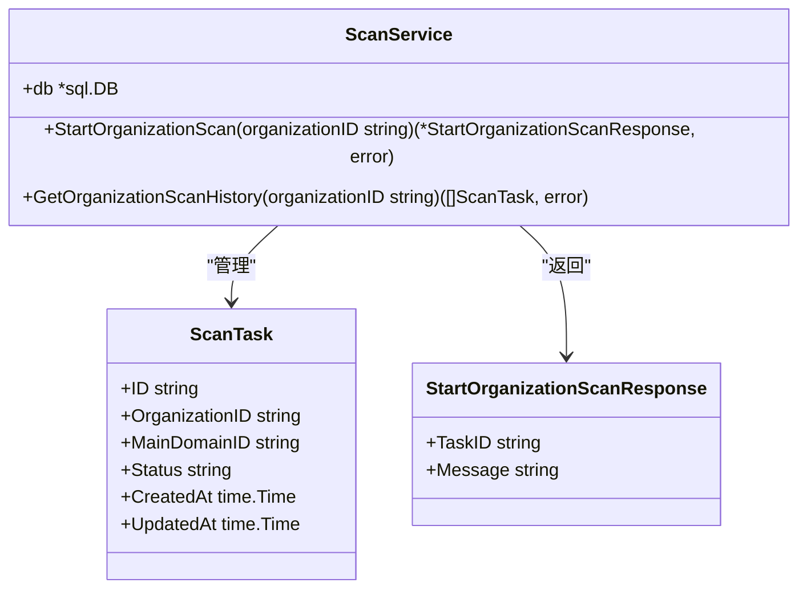
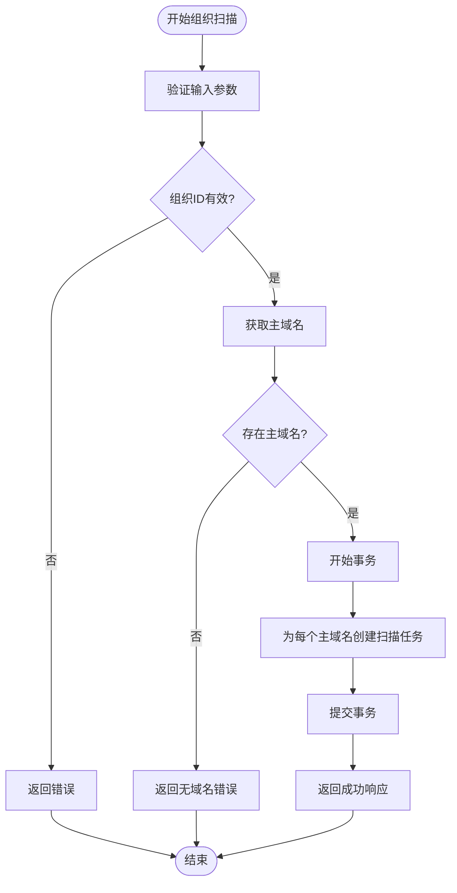
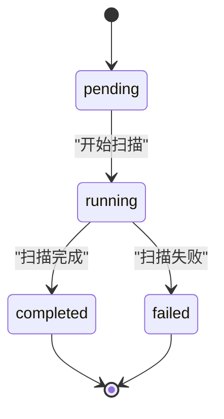

# 扫描服务

<cite>
**本文档中引用的文件**   
- [scan-service.go](file://backend/internal/services/scan-service.go)
- [scan.go](file://backend/internal/models/scan.go)
- [scan-handler.go](file://backend/internal/handlers/scan-handler.go)
- [domain-service.go](file://backend/internal/services/domain-service.go)
- [domain.go](file://backend/internal/models/domain.go)
- [scan-overview.tsx](file://front/components/pages/scan/overview/scan-overview.tsx)
- [organization-scan-history.tsx](file://front/components/pages/assets/organizations/detail/organization-scan-history.tsx)
</cite>

## 目录
1. [简介](#简介)
2. [项目结构](#项目结构)
3. [核心组件](#核心组件)
4. [架构概览](#架构概览)
5. [详细组件分析](#详细组件分析)
6. [依赖分析](#依赖分析)
7. [性能考虑](#性能考虑)
8. [故障排除指南](#故障排除指南)
9. [结论](#结论)

## 简介
本文档全面阐述了扫描服务（scan-service.go）的业务流程，包括扫描任务的启动、状态管理、结果收集与回调处理机制。文档详细说明了服务如何调用外部扫描引擎或工作流引擎，并协调漏洞数据的持久化。重点涵盖扫描任务的状态机设计、超时控制、重试策略及与工作流系统的集成方式，帮助开发者理解异步扫描任务的全生命周期管理。

## 项目结构
本项目采用分层架构设计，分为前端（front）和后端（backend）两个主要部分。后端采用Go语言开发，使用Gin框架处理HTTP请求，前端使用React框架构建用户界面。



**图示来源**
- [scan-service.go](file://backend/internal/services/scan-service.go)
- [scan-handler.go](file://backend/internal/handlers/scan-handler.go)
- [scan-overview.tsx](file://front/components/pages/scan/overview/scan-overview.tsx)

**本节来源**
- [scan-service.go](file://backend/internal/services/scan-service.go)
- [scan-handler.go](file://backend/internal/handlers/scan-handler.go)

## 核心组件
扫描服务的核心组件包括扫描任务管理、组织关联、状态跟踪和结果持久化。系统通过`ScanService`结构体提供主要功能，包括启动组织扫描和获取扫描历史。

**本节来源**
- [scan-service.go](file://backend/internal/services/scan-service.go#L1-L20)
- [scan.go](file://backend/internal/models/scan.go#L1-L10)

## 架构概览
系统采用典型的MVC架构，前端通过API与后端交互，后端服务处理业务逻辑并与数据库交互。



**图示来源**
- [scan-service.go](file://backend/internal/services/scan-service.go#L1-L20)
- [scan-handler.go](file://backend/internal/handlers/scan-handler.go#L1-L10)

## 详细组件分析

### 扫描服务分析
`ScanService`是核心服务组件，负责管理扫描任务的生命周期。

#### 类图


**图示来源**
- [scan-service.go](file://backend/internal/services/scan-service.go#L15-L45)
- [scan.go](file://backend/internal/models/scan.go#L5-L20)

#### 启动组织扫描流程


**图示来源**
- [scan-service.go](file://backend/internal/services/scan-service.go#L47-L121)

**本节来源**
- [scan-service.go](file://backend/internal/services/scan-service.go#L47-L121)
- [domain-service.go](file://backend/internal/services/domain-service.go#L47-L100)

### 扫描任务状态管理
系统定义了多种扫描任务状态，用于跟踪任务的执行进度。



**图示来源**
- [scan.go](file://backend/internal/models/scan.go#L10-L15)
- [scan-overview.tsx](file://front/components/pages/scan/overview/scan-overview.tsx#L223-L264)

## 依赖分析
系统组件之间存在明确的依赖关系，确保了职责分离和代码可维护性。

```mermaid
graph TD
backend/internal/services@NewDomainService[NewDomainService]:::function
backend/internal/services@ScanService.GetOrganizationScanHistory[GetOrganizationScanHistory]:::method
backend/internal/services@ScanService.StartOrganizationScan[StartOrganizationScan]:::method
backend/pkg/database@GetDB[GetDB]:::function
backend/internal/handlers@StartOrganizationScan[StartOrganizationScan]:::function
backend/internal/handlers@GetOrganizationScanHistory[GetOrganizationScanHistory]:::function
backend/internal/models@StartOrganizationScanResponse[StartOrganizationScanResponse]:::struct
backend/internal/services@ScanService[ScanService]:::struct
backend/internal/models@ScanTask[ScanTask]:::struct
backend/internal/services@NewScanService[NewScanService]:::function
backend/internal/services@ScanService.db[db]:::field
backend/internal/services@ScanService.GetOrganizationScanHistory ..> backend/internal/models@ScanTask
backend/internal/services@ScanService --> backend/internal/services@ScanService.GetOrganizationScanHistory
backend/internal/services@ScanService --> backend/internal/services@ScanService.db
backend/internal/services@ScanService --> backend/internal/services@ScanService.StartOrganizationScan
backend/internal/services@NewScanService --> backend/internal/services@ScanService
backend/internal/services@NewScanService ..> backend/internal/services@ScanService
backend/internal/services@NewScanService --> backend/pkg/database@GetDB
```

**图示来源**
- [scan-service.go](file://backend/internal/services/scan-service.go)
- [domain-service.go](file://backend/internal/services/domain-service.go)

**本节来源**
- [scan-service.go](file://backend/internal/services/scan-service.go)
- [domain-service.go](file://backend/internal/services/domain-service.go)

## 性能考虑
系统在设计时考虑了以下性能因素：
- 使用数据库事务确保数据一致性
- 通过批量操作减少数据库交互次数
- 采用连接池管理数据库连接
- 使用索引优化查询性能

## 故障排除指南
### 常见问题及解决方案
1. **组织无主域名可扫描**
   - 问题原因：组织未关联任何主域名
   - 解决方案：通过`CreateMainDomains`接口为组织添加主域名

2. **扫描任务创建失败**
   - 问题原因：数据库事务执行失败
   - 解决方案：检查数据库连接和权限，查看日志中的具体错误信息

3. **扫描历史无法获取**
   - 问题原因：数据库查询失败
   - 解决方案：验证组织ID的有效性，检查数据库表结构

**本节来源**
- [scan-service.go](file://backend/internal/services/scan-service.go#L50-L60)
- [scan-handler.go](file://backend/internal/handlers/scan-handler.go#L10-L20)

## 结论
扫描服务实现了完整的扫描任务管理功能，包括任务创建、状态跟踪和历史查询。系统通过清晰的分层架构和职责分离，确保了代码的可维护性和扩展性。未来可以考虑添加扫描结果分析、漏洞报告生成和自动化修复建议等功能，进一步提升系统的安全价值。