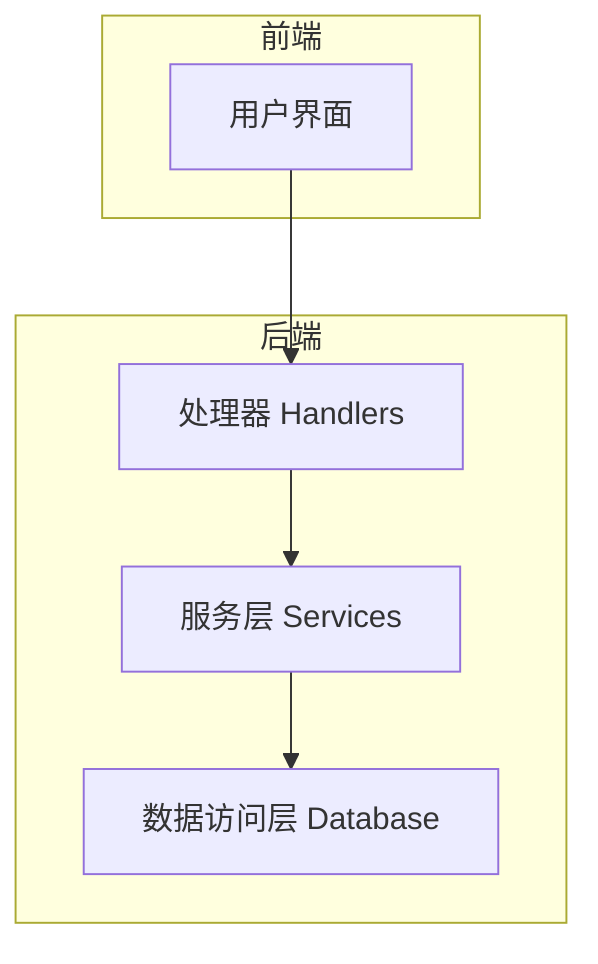
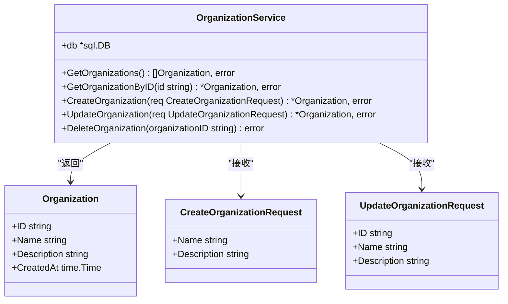
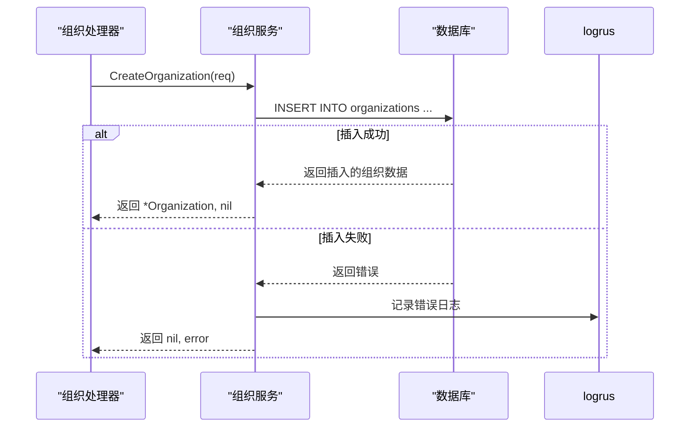
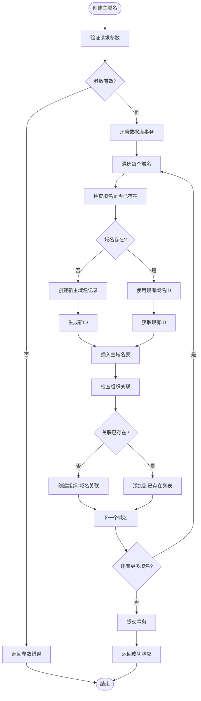
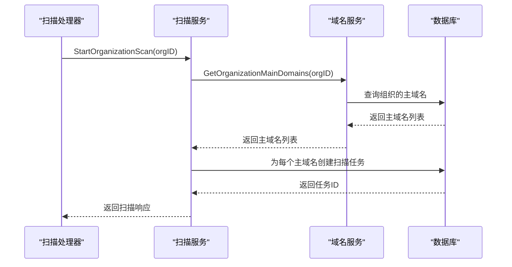
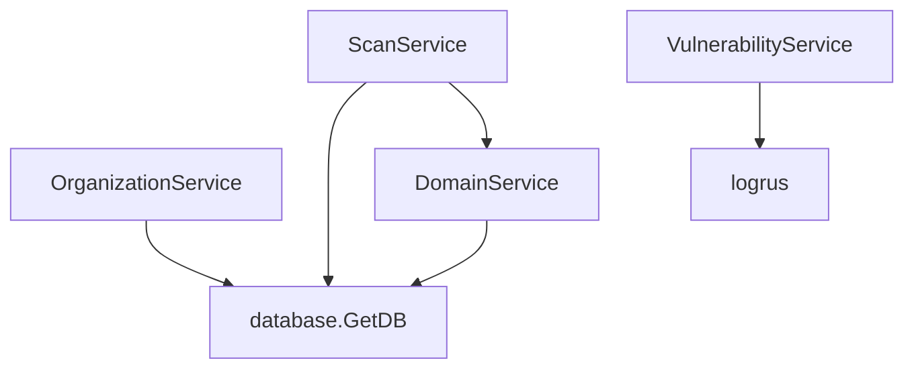

# 服务层

<cite>
**本文档引用的文件**
- [organization-service.go](file://backend/internal/services/organization-service.go)
- [domain-service.go](file://backend/internal/services/domain-service.go)
- [scan-service.go](file://backend/internal/services/scan-service.go)
- [vulnerability-service.go](file://backend/internal/services/vulnerability-service.go)
- [organization.go](file://backend/internal/models/organization.go)
- [domain.go](file://backend/internal/models/domain.go)
- [scan.go](file://backend/internal/models/scan.go)
- [vulnerability.go](file://backend/internal/models/vulnerability.go)
- [organization-handler.go](file://backend/internal/handlers/organization-handler.go)
</cite>

## 目录
1. [引言](#引言)
2. [项目结构](#项目结构)
3. [核心组件](#核心组件)
4. [架构概览](#架构概览)
5. [详细组件分析](#详细组件分析)
6. [依赖分析](#依赖分析)
7. [性能考量](#性能考量)
8. [故障排除指南](#故障排除指南)
9. [结论](#结论)

## 引言
本文档全面记录了漏洞扫描系统后端服务层的架构设计与业务逻辑实现。服务层在MVC模式中扮演承上启下的核心角色，负责封装核心业务规则、协调数据访问、处理事务逻辑并返回领域对象。文档将详细分析`organization-service`、`domain-service`等关键服务模块，结合“创建组织并关联主域名”等具体场景说明服务间的协作机制，帮助开发者深入理解复杂业务流程的内部运作。

## 项目结构
服务层位于`backend/internal/services`目录下，是连接HTTP处理器（handlers）与数据访问层（数据库）的核心业务逻辑中枢。该层遵循清晰的分层架构，每个服务模块（如组织服务、域名服务）都专注于特定领域的业务功能。



**图示来源**
- [organization-handler.go](file://backend/internal/handlers/organization-handler.go)
- [organization-service.go](file://backend/internal/services/organization-service.go)
- [database.go](file://backend/pkg/database/database.go)

**本节来源**
- [organization-service.go](file://backend/internal/services/organization-service.go)
- [organization-handler.go](file://backend/internal/handlers/organization-handler.go)

## 核心组件
服务层的核心组件是四个Go结构体：`OrganizationService`、`DomainService`、`ScanService`和`VulnerabilityService`。它们通过`NewXXXService()`工厂函数创建实例，并持有数据库连接（`*sql.DB`）作为其主要依赖，从而封装了所有与数据库交互的业务逻辑。

**本节来源**
- [organization-service.go](file://backend/internal/services/organization-service.go#L10-L15)
- [domain-service.go](file://backend/internal/services/domain-service.go#L10-L15)

## 架构概览
服务层采用典型的领域驱动设计（DDD）思想，将业务逻辑划分为不同的服务领域。每个服务负责一个聚合根（Aggregate Root）的完整生命周期管理。

```mermaid
graph TD
A[HTTP处理器] --> B[组织服务]
A --> C[域名服务]
A --> D[扫描服务]
A --> E[漏洞服务]
B --> F[(组织表)]
C --> G[(主域名表)]
C --> H[(子域名表)]
C --> I[(组织-主域名关联表)]
D --> J[(扫描任务表)]
E --> K[漏洞数据源]
B < --> C
D --> C
```

**图示来源**
- [organization-service.go](file://backend/internal/services/organization-service.go)
- [domain-service.go](file://backend/internal/services/domain-service.go)
- [scan-service.go](file://backend/internal/services/scan-service.go)

## 详细组件分析
本节将深入分析各服务模块的实现细节，包括接口定义、方法签名、异常处理和性能优化策略。

### 组织服务分析
`OrganizationService`负责管理组织（Organization）的增删改查（CRUD）操作，是系统权限和资源管理的基础。

#### 类图


**图示来源**
- [organization-service.go](file://backend/internal/services/organization-service.go#L10-L157)
- [organization.go](file://backend/internal/models/organization.go#L7-L32)

#### 方法调用序列图


**图示来源**
- [organization-service.go](file://backend/internal/services/organization-service.go#L74-L97)
- [organization-handler.go](file://backend/internal/handlers/organization-handler.go#L26-L38)

**本节来源**
- [organization-service.go](file://backend/internal/services/organization-service.go)
- [organization-handler.go](file://backend/internal/handlers/organization-handler.go)

### 域名服务分析
`DomainService`是系统的核心服务之一，负责管理主域名、子域名及其与组织的关联关系。它实现了复杂的事务性操作，确保数据一致性。

#### 复杂业务逻辑流程图


**图示来源**
- [domain-service.go](file://backend/internal/services/domain-service.go#L48-L146)

#### 服务间协作序列图


**图示来源**
- [scan-service.go](file://backend/internal/services/scan-service.go#L30-L65)
- [domain-service.go](file://backend/internal/services/domain-service.go#L20-L46)

**本节来源**
- [domain-service.go](file://backend/internal/services/domain-service.go)
- [scan-service.go](file://backend/internal/services/scan-service.go)

### 扫描服务分析
`ScanService`负责启动和管理针对组织的扫描任务。它依赖于`DomainService`来获取待扫描的域名，并通过创建数据库记录来“启动”扫描（实际扫描逻辑可能由后台任务处理）。

**本节来源**
- [scan-service.go](file://backend/internal/services/scan-service.go)

### 漏洞服务分析
`VulnerabilityService`目前返回模拟的漏洞数据，为前端提供演示数据。这表明系统设计上将漏洞数据的获取与扫描执行分离，未来可集成真实的漏洞扫描引擎或数据源。

**本节来源**
- [vulnerability-service.go](file://backend/internal/services/vulnerability-service.go)

## 依赖分析
服务层内部存在明确的依赖关系，体现了模块化设计原则。



**图示来源**
- [go.mod](file://backend/go.mod)
- [organization-service.go](file://backend/internal/services/organization-service.go#L13)
- [scan-service.go](file://backend/internal/services/scan-service.go#L30)

**本节来源**
- [organization-service.go](file://backend/internal/services/organization-service.go)
- [scan-service.go](file://backend/internal/services/scan-service.go)

## 性能考量
服务层在性能方面有以下考量：
1.  **数据库连接复用**：所有服务通过`database.GetDB()`共享同一个数据库连接池，避免了频繁创建连接的开销。
2.  **事务管理**：`DomainService`中的`CreateMainDomains`方法使用了数据库事务，确保了批量操作的原子性，防止了数据不一致。
3.  **批量操作**：`BatchDeleteOrganizations`处理器在循环中调用`DeleteOrganization`，虽然简单，但可能产生N+1次数据库查询。优化方案是服务层提供一个批量删除的SQL语句。
4.  **搜索效率**：`SearchOrganizations`处理器先获取所有组织再在内存中过滤，这在数据量大时会成为性能瓶颈。应优化为在数据库层面使用`LIKE`或全文搜索。

## 故障排除指南
当服务层出现问题时，可参考以下指南进行排查：
1.  **数据库连接错误**：检查`pkg/database/database.go`中的数据库配置和连接状态。
2.  **SQL执行失败**：查看日志中由`logrus.WithError(err)`记录的详细错误信息，确认SQL语句和参数是否正确。
3.  **事务未提交**：确保在`tx.Commit()`后没有发生错误，且`defer tx.Rollback()`能正确回滚。
4.  **数据不一致**：检查涉及多个表更新的操作（如创建主域名并关联）是否使用了事务。
5.  **空指针异常**：在返回结构体指针时，确保在错误情况下返回`nil`，在成功时返回有效指针。

**本节来源**
- [organization-service.go](file://backend/internal/services/organization-service.go#L110-L115)
- [domain-service.go](file://backend/internal/services/domain-service.go#L74-L77)

## 结论
服务层是整个漏洞扫描系统业务逻辑的核心。它通过清晰的接口定义和模块化设计，有效地隔离了HTTP协议细节和数据存储细节。`OrganizationService`和`DomainService`提供了坚实的基础功能，而`ScanService`则通过协调其他服务实现了复杂的业务流程。当前的实现已具备良好的可维护性和扩展性，未来可通过引入缓存、优化批量操作和集成真实漏洞数据源来进一步提升系统性能和功能完整性。