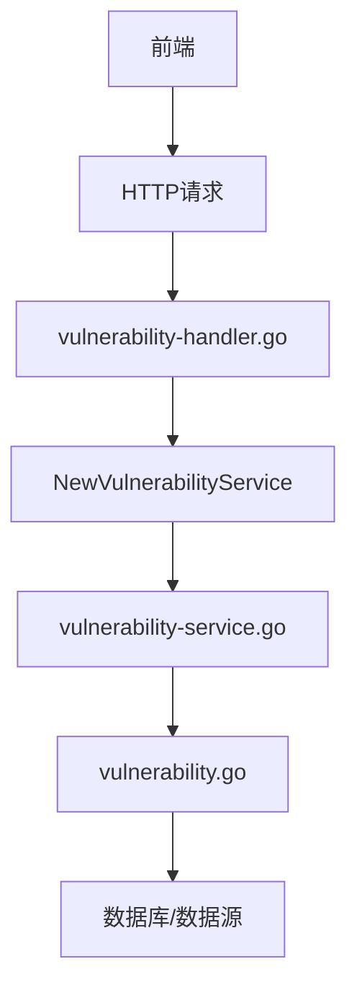
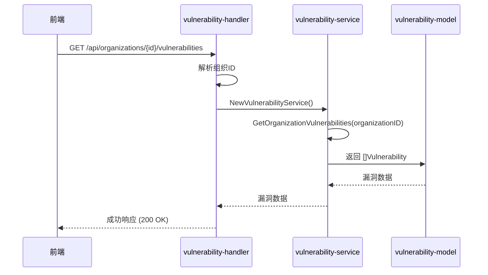
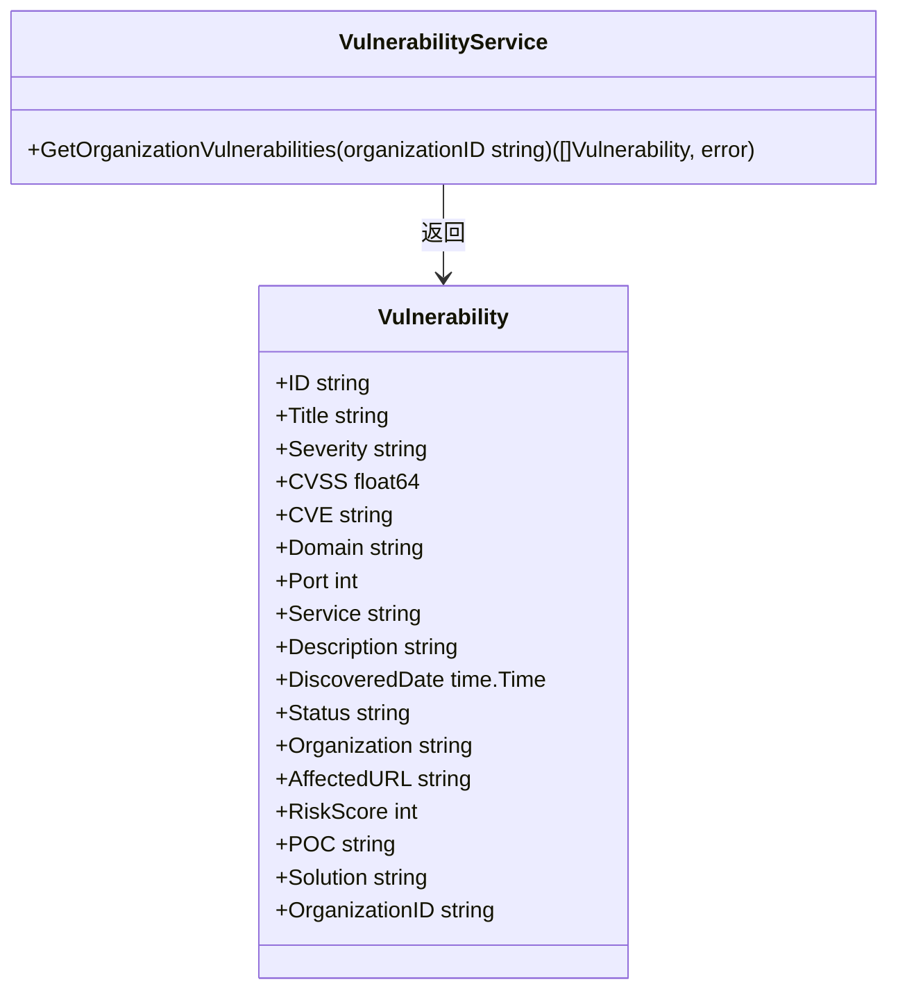
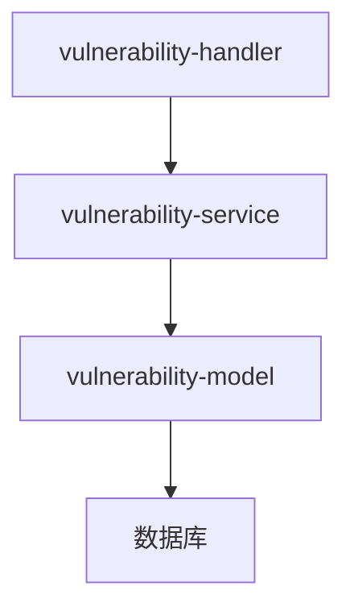

# 漏洞服务

<cite>
**本文档引用的文件**  
- [vulnerability-service.go](file://backend/internal/services/vulnerability-service.go)
- [vulnerability.go](file://backend/internal/models/vulnerability.go)
- [vulnerability-handler.go](file://backend/internal/handlers/vulnerability-handler.go)
</cite>

## 目录
1. [简介](#简介)
2. [项目结构](#项目结构)
3. [核心组件](#核心组件)
4. [架构概览](#架构概览)
5. [详细组件分析](#详细组件分析)
6. [依赖分析](#依赖分析)
7. [性能考虑](#性能考虑)
8. [故障排除指南](#故障排除指南)
9. [结论](#结论)

## 简介
本文档系统化描述漏洞服务（`vulnerability-service.go`）的功能实现，涵盖漏洞数据的接收、分类、严重等级评估、状态更新及与资产和组织的关联逻辑。文档详细说明服务如何处理来自扫描任务的原始漏洞报告，并将其转化为结构化数据。同时，阐述了漏洞状态的流转机制、过滤查询接口的设计、与资产和组织的关联查询优化策略，并提供典型查询场景的代码示例。

## 项目结构
漏洞服务位于后端项目的 `internal/services` 目录下，是整个漏洞管理模块的核心业务逻辑层。它与模型层（`models`）、处理器层（`handlers`）紧密协作，共同完成漏洞数据的处理与响应。



**图示来源**
- [vulnerability-service.go](file://backend/internal/services/vulnerability-service.go)
- [vulnerability-handler.go](file://backend/internal/handlers/vulnerability-handler.go)
- [vulnerability.go](file://backend/internal/models/vulnerability.go)

**本节来源**
- [vulnerability-service.go](file://backend/internal/services/vulnerability-service.go)
- [vulnerability-handler.go](file://backend/internal/handlers/vulnerability-handler.go)

## 核心组件
漏洞服务的核心功能由 `VulnerabilityService` 结构体及其方法实现。主要组件包括：
- **VulnerabilityService**: 漏洞服务的主结构体，封装了所有业务逻辑。
- **NewVulnerabilityService**: 工厂函数，用于创建 `VulnerabilityService` 实例。
- **GetOrganizationVulnerabilities**: 核心方法，用于获取指定组织的漏洞列表。

**本节来源**
- [vulnerability-service.go](file://backend/internal/services/vulnerability-service.go#L1-L10)

## 架构概览
漏洞服务采用典型的分层架构，由前端发起请求，经由处理器（Handler）调用服务层（Service），服务层再与模型层（Model）交互，最终返回数据。



**图示来源**
- [vulnerability-handler.go](file://backend/internal/handlers/vulnerability-handler.go#L1-L27)
- [vulnerability-service.go](file://backend/internal/services/vulnerability-service.go#L1-L125)
- [vulnerability.go](file://backend/internal/models/vulnerability.go#L1-L32)

## 详细组件分析

### 漏洞服务分析
`VulnerabilityService` 是处理漏洞相关业务逻辑的核心组件。它负责从数据源获取漏洞信息，并将其返回给调用者。

#### 服务结构与初始化


**图示来源**
- [vulnerability-service.go](file://backend/internal/services/vulnerability-service.go#L1-L125)
- [vulnerability.go](file://backend/internal/models/vulnerability.go#L1-L32)

#### 核心方法：获取组织漏洞
`GetOrganizationVulnerabilities` 方法是服务的核心，它接收一个组织ID作为参数，并返回该组织的所有漏洞。

**功能流程**
1. 接收组织ID参数。
2. 创建包含模拟数据的漏洞切片。
3. 记录日志，包括组织ID和漏洞数量。
4. 返回漏洞列表。

**代码示例**
```go
func (s *VulnerabilityService) GetOrganizationVulnerabilities(organizationID string) ([]models.Vulnerability, error) {
    // 使用模拟数据，实际项目中应从数据库获取
    vulnerabilities := []models.Vulnerability{
        {
            ID:             "VUL-001",
            Title:          "SQL 注入漏洞",
            Severity:       "高危",
            CVSS:           9.8,
            CVE:            "CVE-2024-1234",
            Domain:         "api.example.com",
            Port:           443,
            Service:        "Web Application",
            Description:    "在用户登录接口发现SQL注入漏洞，可能导致数据库信息泄露",
            DiscoveredDate: time.Now().AddDate(0, 0, -3),
            Status:         "待修复",
            Organization:   "Example Organization",
            AffectedURL:    "https://api.example.com/login",
            RiskScore:      95,
            POC:            "POST /login HTTP/1.1\nContent-Type: application/json\n{\"username\":\"admin' OR 1=1--\",\"password\":\"test\"}",
            Solution:       "使用参数化查询或预编译语句来避免SQL注入",
            OrganizationID: organizationID,
        },
        // ... 其他漏洞
    }

    logrus.WithFields(logrus.Fields{
        "organization_id":       organizationID,
        "vulnerabilities_count": len(vulnerabilities),
    }).Info("Retrieved organization vulnerabilities (mock data)")

    return vulnerabilities, nil
}
```

**本节来源**
- [vulnerability-service.go](file://backend/internal/services/vulnerability-service.go#L1-L125)

### 处理器层分析
`vulnerability-handler.go` 文件中的 `GetOrganizationVulnerabilities` 函数是API的入口点，负责处理HTTP请求。

**功能流程**
1. 从URL路径中提取组织ID。
2. 验证组织ID是否为空。
3. 创建 `VulnerabilityService` 实例。
4. 调用服务的 `GetOrganizationVulnerabilities` 方法。
5. 根据结果返回成功或错误响应。

**代码示例**
```go
func GetOrganizationVulnerabilities(c *gin.Context) {
    organizationID := c.Param("id")
    if organizationID == "" {
        utils.BadRequestResponse(c, "组织ID不能为空")
        return
    }

    service := services.NewVulnerabilityService()
    vulnerabilities, err := service.GetOrganizationVulnerabilities(organizationID)
    if err != nil {
        utils.InternalServerErrorResponse(c, "获取组织漏洞失败: "+err.Error())
        return
    }

    utils.SuccessResponse(c, vulnerabilities)
}
```

**本节来源**
- [vulnerability-handler.go](file://backend/internal/handlers/vulnerability-handler.go#L1-L27)

## 依赖分析
漏洞服务的依赖关系清晰，遵循了低耦合的设计原则。



**图示来源**
- [vulnerability-handler.go](file://backend/internal/handlers/vulnerability-handler.go)
- [vulnerability-service.go](file://backend/internal/services/vulnerability-service.go)
- [vulnerability.go](file://backend/internal/models/vulnerability.go)

**本节来源**
- [vulnerability-handler.go](file://backend/internal/handlers/vulnerability-handler.go)
- [vulnerability-service.go](file://backend/internal/services/vulnerability-service.go)
- [vulnerability.go](file://backend/internal/models/vulnerability.go)

## 性能考虑
当前实现使用模拟数据，性能不是主要瓶颈。但在实际生产环境中，应考虑以下优化：
- **数据库查询优化**：为 `OrganizationID` 字段建立索引，以加快查询速度。
- **缓存机制**：对于频繁访问的组织漏洞数据，可以使用Redis等缓存技术减少数据库压力。
- **分页查询**：当漏洞数量庞大时，应实现分页功能，避免一次性加载过多数据。

## 故障排除指南
常见问题及解决方案：

**问题：返回空的漏洞列表**
- **可能原因**：组织ID不存在或数据库中无相关数据。
- **解决方案**：检查组织ID是否正确，并确认数据库连接正常。

**问题：API返回500错误**
- **可能原因**：服务内部发生未处理的错误。
- **解决方案**：查看日志文件，定位错误原因，并确保所有错误都被正确处理。

**本节来源**
- [vulnerability-service.go](file://backend/internal/services/vulnerability-service.go)
- [vulnerability-handler.go](file://backend/internal/handlers/vulnerability-handler.go)

## 结论
漏洞服务（`vulnerability-service.go`）是整个系统中负责漏洞数据管理的核心模块。它通过清晰的分层架构和简洁的接口设计，实现了漏洞数据的获取与返回。尽管当前使用模拟数据，但其设计为后续接入真实数据源（如数据库）提供了良好的基础。未来可通过引入缓存、分页和更复杂的查询过滤来进一步提升性能和用户体验。