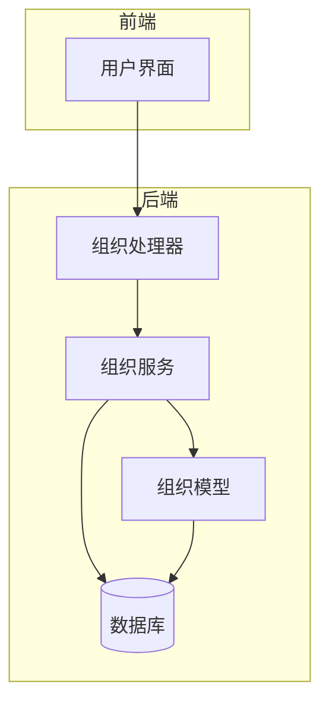
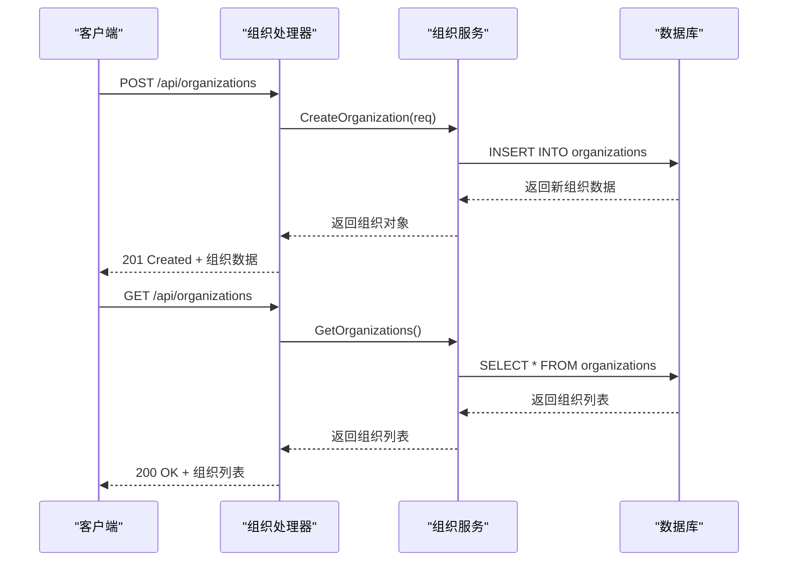
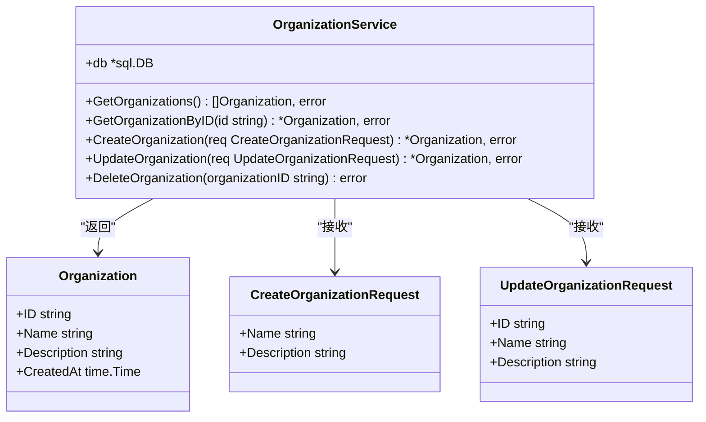
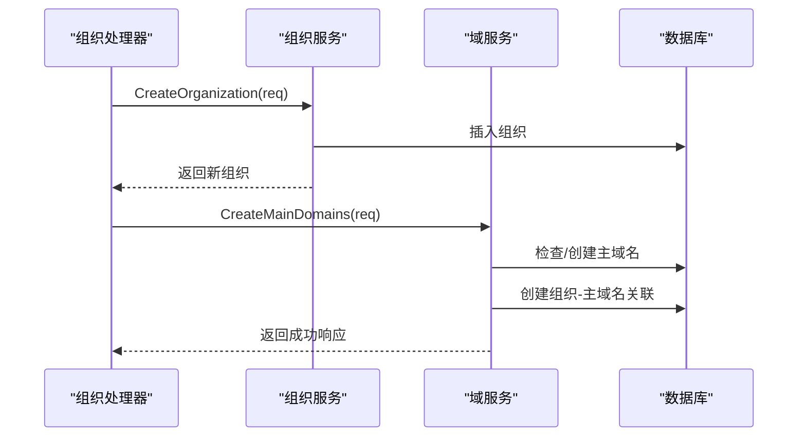

# 组织服务

<cite>
**本文档引用的文件**  
- [organization-service.go](file://backend/internal/services/organization-service.go)
- [organization.go](file://backend/internal/models/organization.go)
- [domain-service.go](file://backend/internal/services/domain-service.go)
- [organization-handler.go](file://backend/internal/handlers/organization-handler.go)
- [初始化.sql](file://backend/初始化.sql)
</cite>

## 目录
1. [简介](#简介)
2. [项目结构](#项目结构)
3. [核心组件](#核心组件)
4. [架构概览](#架构概览)
5. [详细组件分析](#详细组件分析)
6. [依赖关系分析](#依赖关系分析)
7. [性能考量](#性能考量)
8. [故障排查指南](#故障排查指南)
9. [结论](#结论)

## 简介
本文档深入解析组织服务（`organization-service.go`）的实现细节，涵盖组织的创建、更新、删除及查询等核心业务逻辑。说明该服务如何与数据库模型交互，处理事务一致性，并在创建组织时协调主域名的关联操作。文档包含方法签名说明、输入验证规则、错误处理机制以及与其他服务（如域服务）的调用关系，并提供实际调用示例，帮助开发者理解如何在复杂场景中正确使用该服务。

## 项目结构
组织服务位于后端项目的 `internal/services` 目录下，是整个系统中负责管理组织实体的核心业务层。该服务与模型层（`models`）、数据访问层（`database`）和处理层（`handlers`）紧密协作，形成一个典型的分层架构。



**图示来源**  
- [organization-service.go](file://backend/internal/services/organization-service.go)
- [organization-handler.go](file://backend/internal/handlers/organization-handler.go)
- [organization.go](file://backend/internal/models/organization.go)

**本节来源**  
- [organization-service.go](file://backend/internal/services/organization-service.go)
- [organization-handler.go](file://backend/internal/handlers/organization-handler.go)

## 核心组件
组织服务的核心功能包括组织的增删改查（CRUD）操作，其主要组件包括：
- `OrganizationService` 结构体：服务的主实例，封装了数据库连接。
- `NewOrganizationService()` 函数：用于创建服务实例的工厂函数。
- `GetOrganizations()` 方法：获取所有组织列表。
- `GetOrganizationByID()` 方法：根据ID查询单个组织。
- `CreateOrganization()` 方法：创建新组织。
- `UpdateOrganization()` 方法：更新组织信息。
- `DeleteOrganization()` 方法：删除指定组织。

这些方法直接与 `organizations` 数据表交互，执行相应的SQL语句。

**本节来源**  
- [organization-service.go](file://backend/internal/services/organization-service.go#L1-L157)

## 架构概览
组织服务采用典型的三层架构模式：处理层（Handlers）接收HTTP请求，调用服务层（Services）执行业务逻辑，服务层再与数据层（Models）和数据库交互。这种分层设计确保了业务逻辑的集中管理和代码的可维护性。



**图示来源**  
- [organization-service.go](file://backend/internal/services/organization-service.go)
- [organization-handler.go](file://backend/internal/handlers/organization-handler.go)

## 详细组件分析
### 组织服务分析
`OrganizationService` 是一个简单的结构体，仅包含一个 `*sql.DB` 类型的字段，用于执行数据库操作。它通过 `NewOrganizationService()` 函数从全局数据库连接池中获取连接实例。

#### 方法签名与功能说明
以下是组织服务中各方法的详细说明：

**GetOrganizations**
- **功能**：查询所有组织，按创建时间倒序排列。
- **输入**：无。
- **输出**：`[]models.Organization` 和 `error`。
- **SQL语句**：
  ```sql
  SELECT id, name, description, created_at FROM organizations ORDER BY created_at DESC
  ```
- **错误处理**：记录日志并返回错误。

**GetOrganizationByID**
- **功能**：根据ID精确查询单个组织。
- **输入**：`id string`。
- **输出**：`*models.Organization` 和 `error`。
- **SQL语句**：
  ```sql
  SELECT id, name, description, created_at FROM organizations WHERE id = $1
  ```
- **错误处理**：若未找到记录，返回“组织不存在”错误；其他错误记录日志并返回。

**CreateOrganization**
- **功能**：创建新组织，自动生成UUID作为ID。
- **输入**：`models.CreateOrganizationRequest`。
- **输出**：`*models.Organization` 和 `error`。
- **SQL语句**：
  ```sql
  INSERT INTO organizations (id, name, description, created_at) VALUES ($1, $2, $3, NOW()) RETURNING ...
  ```
- **错误处理**：记录日志并返回错误。
- **成功日志**：记录新创建的组织ID和名称。

**UpdateOrganization**
- **功能**：更新指定ID的组织信息。
- **输入**：`models.UpdateOrganizationRequest`。
- **输出**：`*models.Organization` 和 `error`。
- **SQL语句**：
  ```sql
  UPDATE organizations SET name = $2, description = $3, updated_at = NOW() WHERE id = $1 RETURNING ...
  ```
- **错误处理**：若未找到记录，返回“组织不存在”错误；其他错误记录日志并返回。

**DeleteOrganization**
- **功能**：删除指定ID的组织。
- **输入**：`organizationID string`。
- **输出**：`error`。
- **SQL语句**：
  ```sql
  DELETE FROM organizations WHERE id = $1
  ```
- **错误处理**：检查 `RowsAffected`，若为0则返回“组织不存在”错误。



**图示来源**  
- [organization-service.go](file://backend/internal/services/organization-service.go#L1-L157)
- [organization.go](file://backend/internal/models/organization.go#L1-L31)

**本节来源**  
- [organization-service.go](file://backend/internal/services/organization-service.go#L1-L157)
- [organization.go](file://backend/internal/models/organization.go#L1-L31)

### 与域服务的交互
虽然组织服务本身不直接处理域名，但通过数据库的 `organization_main_domains` 关联表，它与域服务（`domain-service.go`）存在数据层面的耦合。当创建组织后，通常需要调用域服务的 `CreateMainDomains` 方法来为其关联主域名。



**图示来源**  
- [organization-service.go](file://backend/internal/services/organization-service.go)
- [domain-service.go](file://backend/internal/services/domain-service.go)
- [初始化.sql](file://backend/初始化.sql)

**本节来源**  
- [domain-service.go](file://backend/internal/services/domain-service.go)
- [初始化.sql](file://backend/初始化.sql)

## 依赖关系分析
组织服务的依赖关系清晰且单一：
- **直接依赖**：
  - `pkg/database`：获取数据库连接。
  - `internal/models`：使用 `Organization`、`CreateOrganizationRequest` 等数据模型。
- **间接依赖**：
  - `internal/handlers`：被组织处理器调用。
  - `internal/services/domain-service`：在业务流程中协同工作，但无代码级直接调用。

这种低耦合的设计使得组织服务易于测试和维护。

```mermaid
graph TD
OrganizationService --> database[database.GetDB]
OrganizationService --> models[models.Organization]
OrganizationService --> models[models.CreateOrganizationRequest]
OrganizationService --> models[models.UpdateOrganizationRequest]
Handler --> OrganizationService
DomainService -.-> OrganizationService : "数据关联"
```

**图示来源**  
- [organization-service.go](file://backend/internal/services/organization-service.go)
- [organization-handler.go](file://backend/internal/handlers/organization-handler.go)

**本节来源**  
- [organization-service.go](file://backend/internal/services/organization-service.go)
- [organization-handler.go](file://backend/internal/handlers/organization-handler.go)

## 性能考量
组织服务的性能主要受数据库查询效率影响：
- **查询操作**：`GetOrganizations` 在组织数量庞大时可能成为性能瓶颈，建议在 `organizations` 表的 `created_at` 字段上建立索引。
- **写入操作**：`CreateOrganization` 和 `UpdateOrganization` 使用了 `RETURNING` 子句，避免了额外的查询，提高了效率。
- **删除操作**：`DeleteOrganization` 通过检查 `RowsAffected` 来判断记录是否存在，这是一种高效的做法。

## 故障排查指南
- **问题**：调用 `CreateOrganization` 返回500错误。
  - **检查**：确认数据库连接是否正常，`organizations` 表是否存在，以及 `name` 字段是否满足非空约束。
- **问题**：调用 `GetOrganizationByID` 返回“组织不存在”。
  - **检查**：确认传入的ID是否正确，且该ID在数据库中存在。
- **问题**：调用 `DeleteOrganization` 返回“组织不存在”，但实际已删除。
  - **说明**：这是正常行为，`RowsAffected` 为0表示没有匹配的记录，可能是已被删除或ID错误。

**本节来源**  
- [organization-service.go](file://backend/internal/services/organization-service.go#L1-L157)
- [organization-handler.go](file://backend/internal/handlers/organization-handler.go#L1-L211)

## 结论
组织服务是系统中管理组织实体的核心模块，其实现简洁高效，遵循了清晰的分层架构。它提供了完整的CRUD接口，并通过良好的错误处理和日志记录确保了系统的健壮性。虽然当前版本未直接处理与域名的关联，但通过与域服务的配合，可以构建完整的资产管理体系。未来可考虑在服务层增加缓存机制以进一步提升查询性能。