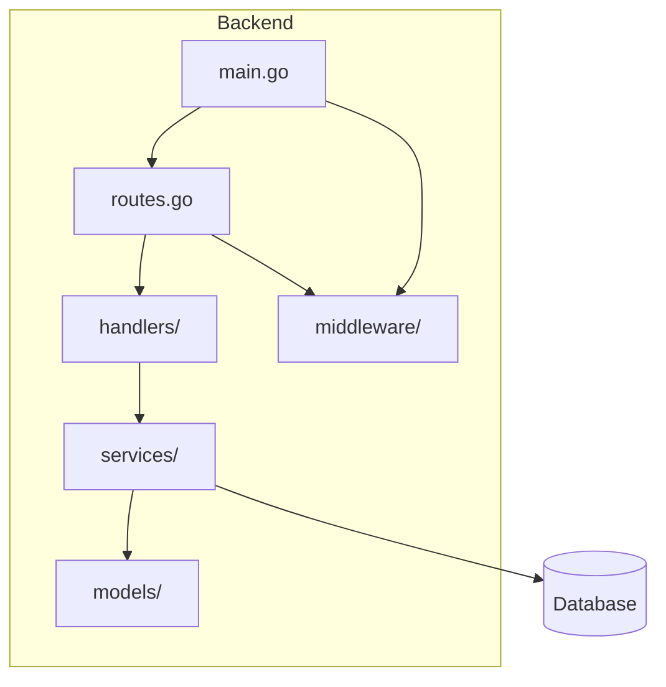
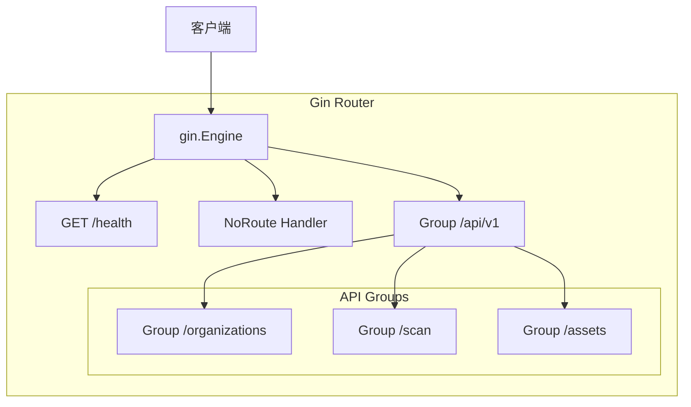
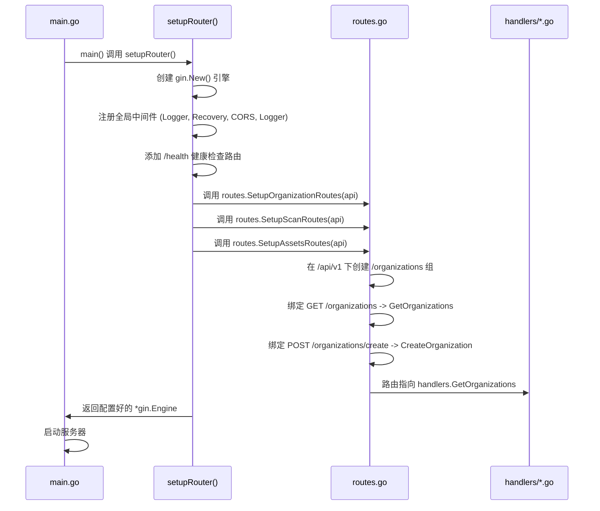
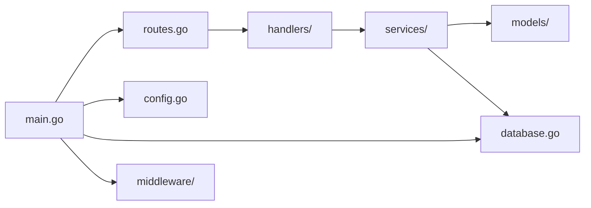

# 路由系统

<cite>
**本文档引用的文件**  
- [main.go](file://backend/cmd/main.go)
- [routes.go](file://backend/routes/routes.go)
- [organization-handler.go](file://backend/internal/handlers/organization-handler.go)
- [scan-handler.go](file://backend/internal/handlers/scan-handler.go)
- [domain-handler.go](file://backend/internal/handlers/domain-handler.go)
- [vulnerability-handler.go](file://backend/internal/handlers/vulnerability-handler.go)
- [cors.go](file://backend/internal/middleware/cors.go)
- [logger.go](file://backend/internal/middleware/logger.go)
</cite>

## 目录
1. [简介](#简介)
2. [项目结构](#项目结构)
3. [核心组件](#核心组件)
4. [架构概览](#架构概览)
5. [详细组件分析](#详细组件分析)
6. [依赖分析](#依赖分析)
7. [性能考虑](#性能考虑)
8. [故障排查指南](#故障排查指南)
9. [结论](#结论)

## 简介
本文档详细解析了“漏洞扫描系统”后端的路由系统设计与实现，重点围绕 `routes.go` 和 `main.go` 文件展开。文档说明了如何通过 Gin 框架将 HTTP 请求映射到对应的处理器（handlers），涵盖了版本化路由（`/api/v1`）的设计模式、路由分组、中间件绑定方式以及整个应用的初始化流程。通过代码示例，展示了新增 API 端点的标准流程，并阐述了当前路由设计对系统可维护性和扩展性的影响。

## 项目结构
后端项目采用典型的分层架构，主要分为 `cmd`、`config`、`internal`、`pkg` 和 `routes` 等目录。`internal` 目录下进一步划分为 `handlers`（处理层）、`services`（服务层）、`models`（数据模型）和 `middleware`（中间件），实现了清晰的关注点分离。`routes` 目录负责定义所有 API 的路由规则。

**图示来源**
- [main.go](file://backend/cmd/main.go#L1-L110)
- [routes.go](file://backend/routes/routes.go#L1-L65)

**本节来源**
- [main.go](file://backend/cmd/main.go#L1-L110)
- [routes.go](file://backend/routes/routes.go#L1-L65)

## 核心组件
路由系统的核心组件包括 `main.go` 中的 `setupRouter` 函数和 `routes.go` 中的各个 `SetupXxxRoutes` 函数。`setupRouter` 负责创建 Gin 引擎、加载中间件并初始化 API 路由组。`routes.go` 中的函数则负责将具体的 HTTP 请求路径和方法绑定到 `handlers` 包中的处理函数。

**本节来源**
- [main.go](file://backend/cmd/main.go#L45-L108)
- [routes.go](file://backend/routes/routes.go#L1-L65)

## 架构概览
系统的路由架构遵循 RESTful 设计原则，所有 API 端点均位于 `/api/v1` 版本化路径下。Gin 框架的路由组（RouterGroup）功能被用来组织不同业务模块的路由，如组织管理、扫描管理、资产管理等。每个路由组都通过独立的函数（如 `SetupOrganizationRoutes`）进行注册，保证了代码的模块化和可维护性。

**图示来源**
- [main.go](file://backend/cmd/main.go#L65-L77)
- [routes.go](file://backend/routes/routes.go#L1-L65)

## 详细组件分析
### 路由注册机制分析
路由注册机制的核心在于 `main.go` 中的 `setupRouter` 函数。该函数首先创建一个全新的 Gin 引擎实例，避免了使用默认引擎可能带来的全局配置污染。随后，它加载了日志、恢复、CORS 和自定义日志等中间件，这些中间件将应用于所有后续的路由。

**图示来源**
- [main.go](file://backend/cmd/main.go#L45-L77)
- [routes.go](file://backend/routes/routes.go#L10-L65)

**本节来源**
- [main.go](file://backend/cmd/main.go#L45-L77)
- [routes.go](file://backend/routes/routes.go#L10-L65)

### 组织管理路由分析
`SetupOrganizationRoutes` 函数是路由分组的一个典型示例。它创建了一个名为 `/organizations` 的子路由组，并在其中定义了对组织资源的 CRUD（创建、读取、更新、删除）操作。例如，`GET /organizations` 映射到 `GetOrganizations` 处理函数，用于获取所有组织列表；`POST /organizations/create` 映射到 `CreateOrganization`，用于创建新组织。这种设计使得路由逻辑集中且易于理解。

**本节来源**
- [routes.go](file://backend/routes/routes.go#L10-L38)
- [organization-handler.go](file://backend/internal/handlers/organization-handler.go#L1-L212)

### 扫描与资产路由分析
`SetupScanRoutes` 和 `SetupAssetsRoutes` 函数展示了更复杂的路由设计。`SetupScanRoutes` 将扫描操作与特定组织关联，通过 `POST /scan/organizations/:id/start` 启动对指定组织的扫描。`SetupAssetsRoutes` 则负责管理主域名和子域名的创建。这些路由的设计体现了资源的层次化关系，例如“组织”是“扫描”和“资产”的父资源。

**本节来源**
- [routes.go](file://backend/routes/routes.go#L40-L63)
- [scan-handler.go](file://backend/internal/handlers/scan-handler.go#L1-L49)
- [domain-handler.go](file://backend/internal/handlers/domain-handler.go#L1-L134)

## 依赖分析
路由系统依赖于多个内部和外部组件。它直接依赖 `handlers` 包来处理业务逻辑，依赖 `middleware` 包来提供跨域和日志功能。`main.go` 中的 `setupRouter` 还依赖 `config` 包来获取服务器运行模式，并依赖 `database` 包进行数据初始化。这种依赖关系清晰地体现在 `main.go` 的导入语句中。

**图示来源**
- [main.go](file://backend/cmd/main.go#L1-L110)
- [routes.go](file://backend/routes/routes.go#L1-L65)

**本节来源**
- [main.go](file://backend/cmd/main.go#L1-L110)
- [routes.go](file://backend/routes/routes.go#L1-L65)

## 性能考虑
当前的路由设计对性能有积极影响。Gin 框架本身基于 Radix Tree 路由算法，具有极高的路由匹配效率。通过使用路由组，减少了重复的路径前缀匹配开销。然而，`SearchOrganizations` 处理函数中的搜索逻辑是在内存中进行的，对于大量数据可能会成为性能瓶颈，建议未来优化为数据库层面的全文搜索。

## 故障排查指南
当遇到 API 路由问题时，可以按照以下步骤排查：
1.  **检查端点是否存在**：确认请求的 URL 和 HTTP 方法是否与 `routes.go` 中定义的完全一致。
2.  **查看日志输出**：检查服务器日志，`middleware.Logger()` 会记录所有请求的详细信息，包括路径、方法、状态码和延迟，是定位问题的第一手资料。
3.  **验证中间件**：如果请求被 CORS 拒绝，检查 `middleware.CORS()` 的配置是否正确。
4.  **调试处理函数**：如果路由匹配成功但返回错误，问题可能出在 `handlers` 或 `services` 层，需要检查相关函数的实现和返回的错误信息。

**本节来源**
- [main.go](file://backend/cmd/main.go#L58-L60)
- [logger.go](file://backend/internal/middleware/logger.go#L1-L24)
- [cors.go](file://backend/internal/middleware/cors.go#L1-L21)

## 结论
该后端路由系统设计良好，通过 Gin 框架实现了高效、清晰的 RESTful API。版本化路由、模块化的路由分组和中间件机制保证了系统的可维护性和扩展性。`main.go` 作为应用的入口，清晰地展示了从初始化到启动的完整流程。未来可以通过实现 `SetupWorkflowRoutes` 和 `SetupDashboardRoutes` 来扩展系统功能，其设计模式已为这些扩展做好了准备。