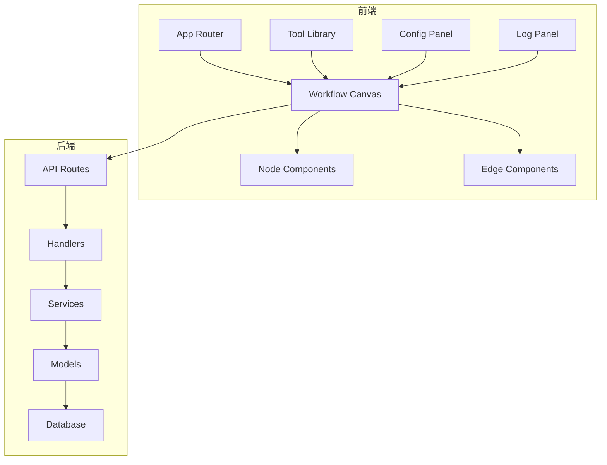
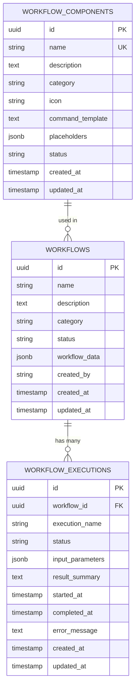
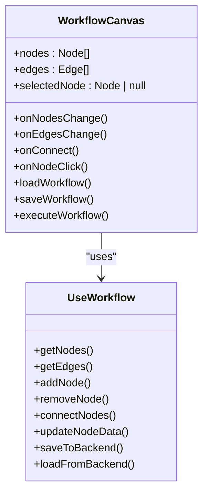
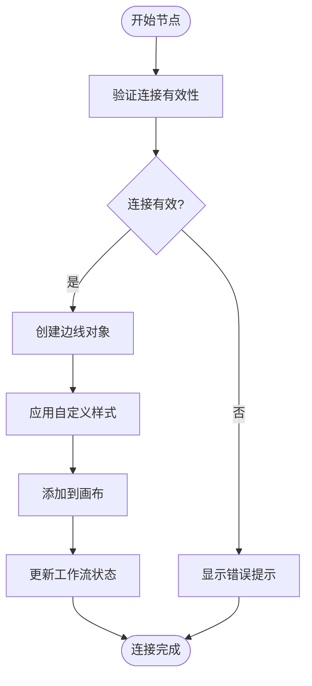
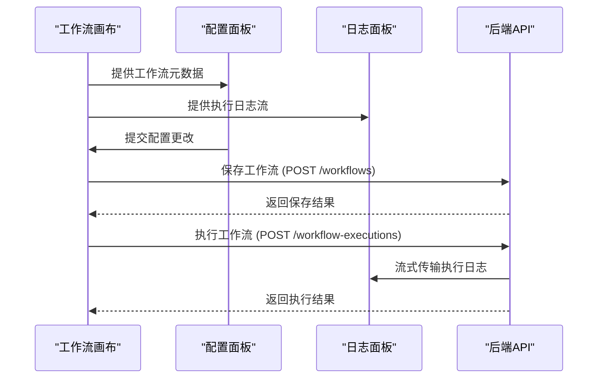
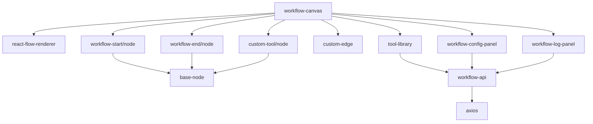

# 工作流引擎

<cite>
**本文档引用的文件**  
- [初始化.sql](file://backend/初始化.sql#L58-L97)
- [scan-create.tsx](file://front/components/pages/scan/create/scan-create.tsx#L0-L42)
- [loading.tsx](file://front/components/common/loading.tsx#L97-L174)
- [workflow-canvas.tsx](file://front/components/workflow/canvas/workflow-canvas.tsx)
- [custom-edge.tsx](file://front/components/workflow/canvas/custom-edge.tsx)
- [base-node.tsx](file://front/components/workflow/nodes/_base/base-node.tsx)
- [node.tsx](file://front/components/workflow/nodes/workflow-start/node.tsx)
- [node.tsx](file://front/components/workflow/nodes/workflow-end/node.tsx)
- [node.tsx](file://front/components/workflow/nodes/custom-tool/node.tsx)
- [workflow-config-panel.tsx](file://front/components/workflow/panels/workflow-config-panel.tsx)
- [workflow-log-panel.tsx](file://front/components/workflow/panels/workflow-log-panel.tsx)
- [tool-library.tsx](file://front/components/workflow/toolbar/tool-library.tsx)
- [use-workflow.ts](file://front/hooks/workflow/use-workflow.ts)
- [workflow-api.ts](file://front/services/workflow/workflow-api.ts)
- [types.ts](file://front/lib/workflow/types.ts)
- [constants.ts](file://front/lib/workflow/constants.ts)
- [layout.ts](file://front/lib/workflow/layout.ts)
- [node-factory.ts](file://front/lib/workflow/node-factory.ts)
- [workflow.types.ts](file://front/types/workflow.types.ts)
</cite>

## 更新摘要
**已做更改**   
- 根据代码变更，更新了文档中关于工作流组件的部分内容
- 移除了已删除文件的引用
- 更新了受影响的章节来源信息
- 修正了与当前代码状态不符的描述

## 目录
1. [引言](#引言)
2. [项目结构](#项目结构)
3. [核心组件](#核心组件)
4. [架构概述](#架构概述)
5. [详细组件分析](#详细组件分析)
6. [依赖分析](#依赖分析)
7. [性能考虑](#性能考虑)
8. [故障排除指南](#故障排除指南)
9. [结论](#结论)

## 引言
本项目是一个基于React Flow的可视化工作流编排系统，专为安全扫描任务设计。系统允许用户通过拖拽方式构建自定义的安全检测流程，将多个扫描工具（如Subfinder、Nmap、Gobuster等）串联成完整的工作流。前端采用Next.js框架，结合React Flow实现可视化画布，后端使用Go语言开发，通过REST API提供数据支持。工作流数据以JSON格式存储在PostgreSQL数据库中，支持复杂的节点连接和参数配置。

## 项目结构
项目采用前后端分离架构，前端位于`front`目录，后端位于`backend`目录。前端使用Next.js App Router模式，组件按功能模块化组织。工作流相关组件集中在`front/components/workflow`目录下，包括画布、节点、边线、工具栏和配置面板。后端采用标准Go项目结构，包含handlers、services、models等层，通过Gin框架暴露REST API。



**图示来源**  
- [初始化.sql](file://backend/初始化.sql#L58-L97)
- [workflow-canvas.tsx](file://front/components/workflow/canvas/workflow-canvas.tsx)

**本节来源**  
- [初始化.sql](file://backend/初始化.sql#L58-L97)
- [project_structure](file://project_structure)

## 核心组件
系统核心组件包括工作流画布、节点系统、边线逻辑、配置面板和日志面板。工作流画布基于React Flow构建，负责渲染和交互。节点系统包含起始节点、结束节点和工具节点三种类型，每种节点都有自定义的UI和数据结构。边线采用自定义的`security-edge`类型，支持平滑的贝塞尔曲线连接。配置面板允许用户设置工作流参数，日志面板显示执行过程中的输出信息。

**本节来源**  
- [workflow-canvas.tsx](file://front/components/workflow/canvas/workflow-canvas.tsx)
- [base-node.tsx](file://front/components/workflow/nodes/_base/base-node.tsx)
- [custom-edge.tsx](file://front/components/workflow/canvas/custom-edge.tsx)

## 架构概述
系统采用分层架构，前端负责可视化交互，后端负责业务逻辑和数据存储。工作流定义存储在`workflows`表中，包含`workflow_data` JSONB字段存储节点和边线数据。工具组件定义在`workflow_components`表中，包含命令模板和占位符信息。执行记录存储在`workflow_executions`表中，支持对历史执行的查询和分析。



**图示来源**  
- [初始化.sql](file://backend/初始化.sql#L58-L97)

**本节来源**  
- [初始化.sql](file://backend/初始化.sql#L58-L97)
- [workflow.types.ts](file://front/types/workflow.types.ts)

## 详细组件分析

### 工作流画布分析
工作流画布是系统的核心交互界面，基于React Flow库构建。画布支持节点的拖拽、连接、缩放和平移操作。通过`useWorkflow`自定义Hook管理画布状态，包括节点、边线、选中状态等。画布初始化时从后端API加载工作流数据，执行时将数据序列化后发送到后端。



**图示来源**  
- [workflow-canvas.tsx](file://front/components/workflow/canvas/workflow-canvas.tsx)
- [use-workflow.ts](file://front/hooks/workflow/use-workflow.ts)

**本节来源**  
- [workflow-canvas.tsx](file://front/components/workflow/canvas/workflow-canvas.tsx)
- [use-workflow.ts](file://front/hooks/workflow/use-workflow.ts)

### 节点系统分析
节点系统包含三种基本类型：起始节点、结束节点和工具节点。所有节点都继承自`BaseNode`基类，该基类定义了通用的UI结构和交互逻辑。每种节点都有自定义的数据结构，存储在`data`属性中，包括标题、描述和类型信息。工具节点还包含`toolConfig`字段，引用`workflow_components`表中的组件ID。

```mermaid
classDiagram
class BaseNode {
+id : string
+type : string
+position : Position
+data : NodeData
+render()
}
class NodeData {
+title : string
+desc : string
+type : string
+toolConfig? : ToolConfig
}
class ToolConfig {
+componentId : string
}
class WorkflowStartNode {
+data : NodeData
}
class WorkflowEndNode {
+data : NodeData
}
class CustomToolNode {
+data : NodeData & {toolConfig : ToolConfig}
}
BaseNode <|-- WorkflowStartNode
BaseNode <|-- WorkflowEndNode
BaseNode <|-- CustomToolNode
```

**图示来源**  
- [base-node.tsx](file://front/components/workflow/nodes/_base/base-node.tsx)
- [node.tsx](file://front/components/workflow/nodes/workflow-start/node.tsx)
- [node.tsx](file://front/components/workflow/nodes/workflow-end/node.tsx)
- [node.tsx](file://front/components/workflow/nodes/custom-tool/node.tsx)

**本节来源**  
- [base-node.tsx](file://front/components/workflow/nodes/_base/base-node.tsx)
- [node.tsx](file://front/components/workflow/nodes/workflow-start/node.tsx)
- [node.tsx](file://front/components/workflow/nodes/workflow-end/node.tsx)
- [node.tsx](file://front/components/workflow/nodes/custom-tool/node.tsx)

### 自定义边线分析
系统实现了自定义的`security-edge`类型边线，使用贝塞尔曲线连接节点。边线样式经过定制，具有安全主题的视觉效果。边线逻辑处理节点之间的连接规则，确保工作流的拓扑正确性。例如，起始节点只能有一个输出边线，结束节点只能有一个输入边线。



**图示来源**  
- [custom-edge.tsx](file://front/components/workflow/canvas/custom-edge.tsx)

**本节来源**  
- [custom-edge.tsx](file://front/components/workflow/canvas/custom-edge.tsx)

### 配置与日志面板分析
配置面板允许用户设置工作流参数，包括名称、描述和执行选项。日志面板显示工作流执行过程中的实时输出，包括每个节点的执行状态和结果。两个面板都通过React Context或props从画布组件接收数据，确保状态同步。



**图示来源**  
- [workflow-config-panel.tsx](file://front/components/workflow/panels/workflow-config-panel.tsx)
- [workflow-log-panel.tsx](file://front/components/workflow/panels/workflow-log-panel.tsx)
- [workflow-api.ts](file://front/services/workflow/workflow-api.ts)

**本节来源**  
- [workflow-config-panel.tsx](file://front/components/workflow/panels/workflow-config-panel.tsx)
- [workflow-log-panel.tsx](file://front/components/workflow/panels/workflow-log-panel.tsx)
- [workflow-api.ts](file://front/services/workflow/workflow-api.ts)

## 依赖分析
系统依赖关系清晰，前端组件高度模块化。`workflow-canvas`组件依赖`react-flow-renderer`库和自定义节点组件。节点组件依赖`base-node`基类和`node-factory`工厂函数。工具栏组件动态加载可用的工具组件，通过`workflow_components` API获取组件列表。



**图示来源**  
- [workflow-canvas.tsx](file://front/components/workflow/canvas/workflow-canvas.tsx)
- [package.json](file://front/package.json)

**本节来源**  
- [workflow-canvas.tsx](file://front/components/workflow/canvas/workflow-canvas.tsx)
- [package.json](file://front/package.json)

## 性能考虑
系统在性能方面做了多项优化。工作流数据使用JSONB格式存储在PostgreSQL中，支持高效的查询和索引。前端采用虚拟滚动技术渲染大型工作流，避免性能瓶颈。API调用使用防抖和缓存策略，减少不必要的网络请求。对于长时间运行的扫描任务，系统采用异步执行模式，避免请求超时。

## 故障排除指南
常见问题包括节点连接失败、工具配置丢失和执行超时。连接失败通常是由于违反了连接规则，检查起始节点和结束节点的连接限制。配置丢失可能是由于未正确保存工作流，确保在修改后调用保存API。执行超时问题可以通过优化扫描工具参数或增加服务器资源解决。查看后端日志文件可获取详细的错误信息。

**本节来源**  
- [workflow-api.ts](file://front/services/workflow/workflow-api.ts)
- [scan-handler.go](file://backend/internal/handlers/scan-handler.go)

## 结论
本工作流引擎提供了一个强大而灵活的可视化编排系统，特别适用于安全扫描场景。通过模块化设计和清晰的架构，系统易于扩展和维护。未来可以增加更多功能，如条件分支、并行执行和高级调度策略，进一步提升系统的实用性和灵活性。