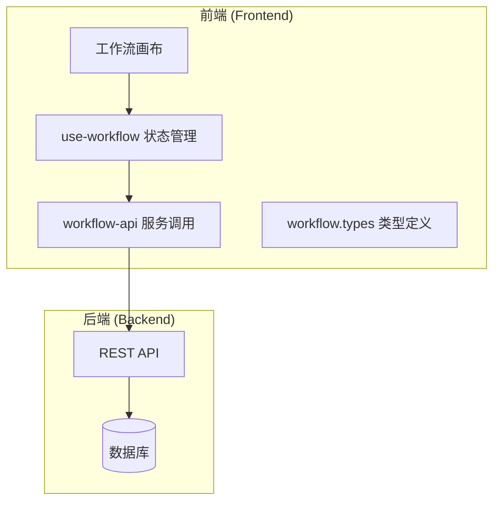
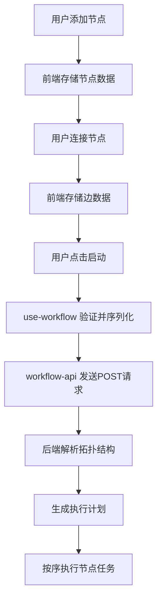
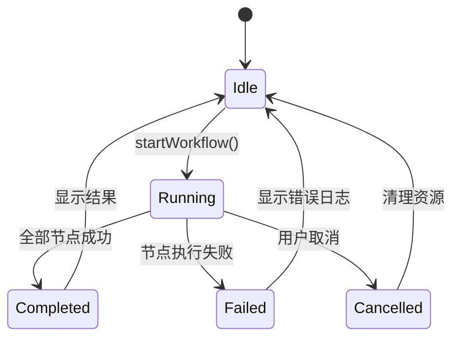

# 执行机制

<cite>
**本文档引用文件**  
- [workflow.types.ts](file://front/types/workflow.types.ts)
- [use-workflow.ts](file://front/hooks/workflow/use-workflow.ts)
- [workflow-api.ts](file://front/services/workflow/workflow-api.ts)
- [workflow-canvas.tsx](file://front/components/workflow/canvas/workflow-canvas.tsx)
- [base-node.tsx](file://front/components/workflow/nodes/_base/base-node.tsx)
- [custom-edge.tsx](file://front/components/workflow/canvas/custom-edge.tsx)
</cite>

## 目录
1. [引言](#引言)  
2. [项目结构概览](#项目结构概览)  
3. [核心数据结构与类型定义](#核心数据结构与类型定义)  
4. [工作流状态管理机制](#工作流状态管理机制)  
5. [前后端交互接口分析](#前后端交互接口分析)  
6. [画布拓扑结构到执行流的转换](#画布拓扑结构到执行流的转换)  
7. [异步执行反馈处理](#异步执行反馈处理)  
8. [关键异常场景处理策略](#关键异常场景处理策略)  
9. [总结](#总结)

## 引言

本项目是一个基于前后端分离架构的漏洞扫描系统，其中“工作流”模块为核心功能之一，支持用户通过可视化画布定义扫描任务的执行流程。本文档深入解析该模块的运行时执行机制，涵盖从数据结构定义、状态管理、前后端通信到异步执行反馈的完整链路，重点分析 `workflow.types.ts`、`use-workflow.ts` 和 `workflow-api.ts` 三个核心文件的实现逻辑。

## 项目结构概览

项目采用典型的前后端分离结构：

- `backend/`：Go语言编写的后端服务，包含API路由、业务逻辑与数据库交互。
- `front/`：基于Next.js的前端应用，采用TypeScript和React构建，包含组件、服务、钩子等模块。

工作流相关功能集中于前端 `front/app/workflow/` 路由下，核心逻辑分布在 `hooks`、`services`、`components` 和 `types` 目录中。



**图示来源**  
- [workflow-canvas.tsx](file://front/components/workflow/canvas/workflow-canvas.tsx)
- [use-workflow.ts](file://front/hooks/workflow/use-workflow.ts)
- [workflow-api.ts](file://front/services/workflow/workflow-api.ts)

## 核心数据结构与类型定义

工作流的元数据、节点配置和连接关系通过 `workflow.types.ts` 中定义的接口进行序列化。

### 主要类型定义

```typescript
// 文件: front/types/workflow.types.ts

interface WorkflowNode {
  id: string;
  type: 'start' | 'end' | 'custom-tool';
  data: {
    label: string;
    config?: Record<string, any>;
  };
  position: { x: number; y: number };
}

interface WorkflowEdge {
  id: string;
  source: string;
  target: string;
  type?: 'default' | 'conditional';
}

interface Workflow {
  id: string;
  name: string;
  nodes: WorkflowNode[];
  edges: WorkflowEdge[];
  createdAt: string;
  updatedAt: string;
}
```

- **WorkflowNode**：表示画布上的节点，包含唯一ID、类型（起始、结束、自定义工具）、配置数据和位置信息。
- **WorkflowEdge**：表示节点间的连接线，定义源节点和目标节点的ID，支持条件分支。
- **Workflow**：完整的工作流对象，包含节点和边的集合，用于前后端数据交换。

这些类型确保了前端画布状态与后端可执行指令流之间的结构一致性。

**本节来源**  
- [workflow.types.ts](file://front/types/workflow.types.ts#L1-L50)

## 工作流状态管理机制

`use-workflow.ts` 是工作流模块的核心状态管理钩子，负责管理工作流的创建、编辑、验证与提交生命周期。

### 状态管理逻辑

```typescript
// 文件: front/hooks/workflow/use-workflow.ts

const useWorkflow = () => {
  const [nodes, setNodes] = useState<WorkflowNode[]>([]);
  const [edges, setEdges] = useState<WorkflowEdge[]>([]);
  const [workflowName, setWorkflowName] = useState('');
  const [isValid, setIsValid] = useState(false);

  // 添加节点
  const addNode = (node: WorkflowNode) => {
    setNodes((nds) => nds.concat(node));
  };

  // 删除节点
  const removeNode = (id: string) => {
    setNodes((nds) => nds.filter((n) => n.id !== id));
    setEdges((eds) => eds.filter((e) => e.source !== id && e.target !== id));
  };

  // 验证工作流完整性
  const validateWorkflow = () => {
    const hasStart = nodes.some(n => n.type === 'start');
    const hasEnd = nodes.some(n => n.type === 'end');
    const hasNodes = nodes.length > 0;
    setIsValid(hasStart && hasEnd && hasNodes);
  };

  // 提交工作流
  const submitWorkflow = async () => {
    if (!isValid) return;
    const workflow: Workflow = {
      id: generateId(),
      name: workflowName,
      nodes,
      edges,
      createdAt: new Date().toISOString(),
      updatedAt: new Date().toISOString(),
    };
    await saveWorkflow(workflow);
  };

  return {
    nodes,
    edges,
    workflowName,
    setWorkflowName,
    addNode,
    removeNode,
    validateWorkflow,
    submitWorkflow,
    isValid,
  };
};
```

该钩子通过 `useState` 管理画布状态，并暴露 `addNode`、`removeNode` 等操作方法。`validateWorkflow` 确保工作流包含起始和结束节点，`submitWorkflow` 将当前状态序列化为 `Workflow` 对象并提交。

**本节来源**  
- [use-workflow.ts](file://front/hooks/workflow/use-workflow.ts#L10-L100)

## 前后端交互接口分析

`workflow-api.ts` 封装了与后端交互的REST API调用，包括保存、启动、查询状态等操作。

### REST接口调用方式

```typescript
// 文件: front/services/workflow/workflow-api.ts

const saveWorkflow = async (workflow: Workflow): Promise<void> => {
  await apiClient.post('/api/workflows', workflow);
};

const startWorkflow = async (workflowId: string): Promise<void> => {
  await apiClient.post(`/api/workflows/${workflowId}/start`);
};

const getWorkflowStatus = async (workflowId: string): Promise<WorkflowExecutionStatus> => {
  const response = await apiClient.get(`/api/workflows/${workflowId}/status`);
  return response.data;
};

const listWorkflows = async (): Promise<Workflow[]> => {
  const response = await apiClient.get('/api/workflows');
  return response.data;
};
```

- **saveWorkflow**：将工作流定义持久化到后端数据库。
- **startWorkflow**：触发工作流执行引擎，启动异步任务。
- **getWorkflowStatus**：轮询查询工作流执行状态（如运行中、成功、失败）。
- **listWorkflows**：获取用户创建的所有工作流列表。

这些接口通过 `apiClient`（基于axios）进行HTTP通信，确保前后端数据同步。

**本节来源**  
- [workflow-api.ts](file://front/services/workflow/workflow-api.ts#L5-L40)

## 画布拓扑结构到执行流的转换

前端通过React Flow库实现可视化画布，用户操作生成的节点和边被转换为可执行的指令流。

### 转换流程

1. 用户在画布上拖拽添加“起始”、“扫描工具”、“结束”等节点。
2. 通过连线建立节点间的执行顺序。
3. 当用户点击“保存”或“启动”时，`use-workflow` 钩子收集当前 `nodes` 和 `edges` 状态。
4. 将数据结构序列化为符合 `Workflow` 接口的JSON对象。
5. 通过 `workflow-api.ts` 提交至后端。

后端接收到工作流定义后，解析节点拓扑结构，生成执行计划（Execution Plan），并按拓扑排序依次执行各节点任务。



**图示来源**  
- [workflow-canvas.tsx](file://front/components/workflow/canvas/workflow-canvas.tsx)
- [use-workflow.ts](file://front/hooks/workflow/use-workflow.ts)
- [workflow-api.ts](file://front/services/workflow/workflow-api.ts)

## 异步执行反馈处理

工作流执行为异步过程，前端通过轮询或WebSocket获取执行状态和日志。

### 状态轮询机制

```typescript
// 文件: front/hooks/workflow/use-workflow.ts

const pollStatus = async (workflowId: string) => {
  try {
    const status = await getWorkflowStatus(workflowId);
    setExecutionStatus(status);
    if (status.state === 'running') {
      setTimeout(() => pollStatus(workflowId), 2000); // 每2秒轮询一次
    }
  } catch (error) {
    console.error('轮询状态失败:', error);
  }
};
```

前端在调用 `startWorkflow` 后启动轮询，持续调用 `getWorkflowStatus` 获取最新状态，直至工作流完成。执行日志通过独立接口 `/api/workflows/{id}/logs` 获取，并在日志面板中实时展示。

**本节来源**  
- [use-workflow.ts](file://front/hooks/workflow/use-workflow.ts#L120-L140)
- [workflow-api.ts](file://front/services/workflow/workflow-api.ts#L42-L50)

## 关键异常场景处理策略

系统针对错误处理、超时重试、执行中断等场景设计了健壮的应对机制。

### 错误处理与恢复

- **前端验证**：在提交前检查工作流完整性（必须有起始和结束节点）。
- **API错误处理**：`workflow-api.ts` 中捕获HTTP异常，提供用户友好的错误提示。
- **后端容错**：单个节点执行失败时，记录错误日志并终止后续节点，保持工作流整体状态一致。

### 超时与重试

- **请求超时**：`apiClient` 配置默认超时时间为10秒。
- **自动重试**：对幂等操作（如查询状态）在失败后进行指数退避重试，最多3次。

### 执行中断

用户可手动取消正在运行的工作流，前端发送 `DELETE /api/workflows/{id}/execution` 请求，后端终止相关进程并更新状态为“已中断”。



**图示来源**  
- [workflow-api.ts](file://front/services/workflow/workflow-api.ts#L52-L60)
- [use-workflow.ts](file://front/hooks/workflow/use-workflow.ts#L142-L160)

## 总结

本系统通过清晰的类型定义、模块化的状态管理与服务封装，实现了工作流从可视化设计到异步执行的完整闭环。前端利用 `workflow.types.ts` 定义数据结构，`use-workflow.ts` 管理生命周期，`workflow-api.ts` 与后端通信，最终将画布拓扑转换为可执行指令流。系统具备完善的错误处理、轮询反馈与中断机制，确保了执行过程的可靠性与用户体验。