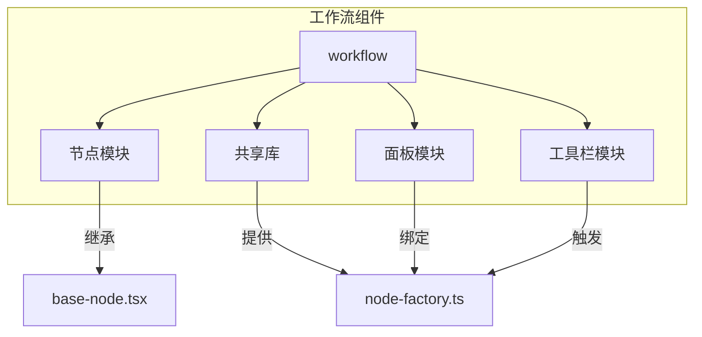
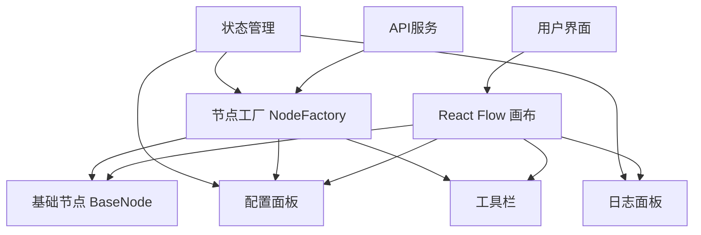
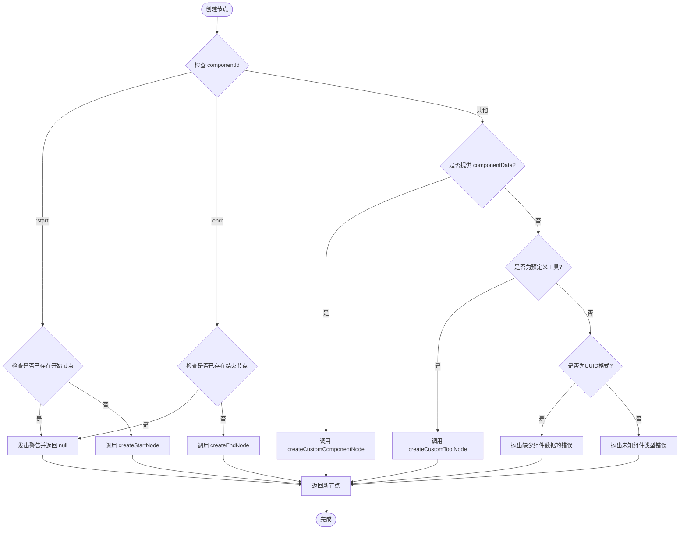
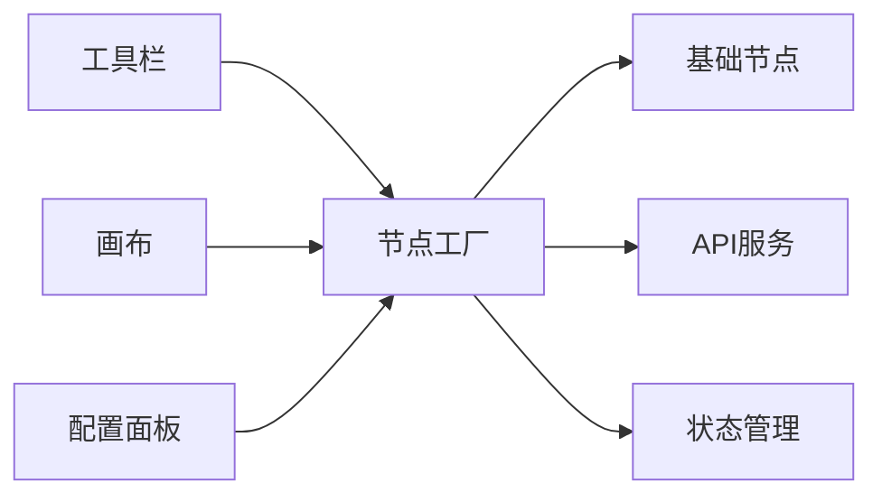

# 组件体系

<cite>
**本文档引用的文件**   
- [base-node.tsx](file://front/components/canvas/base-node.tsx)
- [node-factory.ts](file://front/components/workflow/lib/node-factory.ts)
- [workflow-config-panel.tsx](file://front/components/workflow/panels/workflow-config-panel.tsx)
- [workflow-log-panel.tsx](file://front/components/workflow/panels/workflow-log-panel.tsx)
- [tool-library.tsx](file://front/components/workflow/toolbar/tool-library.tsx)
</cite>

## 目录
1. [简介](#简介)
2. [项目结构](#项目结构)
3. [核心组件](#核心组件)
4. [架构概览](#架构概览)
5. [详细组件分析](#详细组件分析)
6. [依赖分析](#依赖分析)
7. [性能考量](#性能考量)
8. [故障排查指南](#故障排查指南)
9. [结论](#结论)

## 简介
本文档全面阐述了漏洞扫描系统中工作流引擎的组件体系结构。重点分析了基础节点（BaseNode）的抽象封装机制、各类具体节点（起始、结束、自定义工具）的实现差异，以及配置面板、日志面板和工具栏的交互逻辑。同时，深入解析了节点工厂（Node Factory）的注册与动态加载机制，确保系统具备良好的可扩展性以支持未来新增的安全检测工具。

## 项目结构
工作流相关的核心组件主要位于 `front/components/workflow` 目录下，采用功能模块化组织方式。主要包含节点（nodes）、面板（panels）、工具栏（toolbar）和共享库（lib）四个子模块。



**图示来源**
- [base-node.tsx](file://front/components/canvas/base-node.tsx)
- [node-factory.ts](file://front/components/workflow/lib/node-factory.ts)

## 核心组件
系统的核心组件围绕 React Flow 图形库构建，通过自定义节点和面板实现可视化工作流编辑。`BaseNode` 提供了所有节点的视觉和交互基础，`NodeFactory` 负责节点的创建与管理，而 `WorkflowConfigPanel` 和 `WorkflowLogPanel` 则提供了属性配置和执行状态监控的能力。

**组件来源**
- [base-node.tsx](file://front/components/canvas/base-node.tsx#L1-L355)
- [node-factory.ts](file://front/components/workflow/lib/node-factory.ts#L1-L240)

## 架构概览
整个工作流引擎采用分层架构，上层为UI组件，下层为数据与逻辑服务。



**图示来源**
- [base-node.tsx](file://front/components/canvas/base-node.tsx)
- [node-factory.ts](file://front/components/workflow/lib/node-factory.ts)
- [workflow-config-panel.tsx](file://front/components/workflow/panels/workflow-config-panel.tsx)

## 详细组件分析

### 基础节点分析
`BaseNode` 是所有工作流节点的抽象基类，采用组合模式而非继承，通过 `BaseNodeProps` 接口定义了所有节点共有的属性和行为。

#### 类图
```mermaid
classDiagram
class BaseNodeProps {
+id : string
+data : NodeData
+selected : boolean
+children? : ReactNode
+className? : string
+showHandles? : boolean
+targetHandles : HandleConfig[]
+sourceHandles : HandleConfig[]
+icon? : ReactNode
+iconBgColor? : string
+iconColor? : string
+subtitle? : string
+onDelete? : (nodeId : string) => void
+canDelete? : boolean
}
class HandleConfig {
+id : string
+position : Position
+className? : string
}
class NodeData {
+runningStatus? : NodeRunningStatus
+title : string
+desc? : string
}
enum NodeRunningStatus {
Running
Succeeded
Failed
Exception
Waiting
}
BaseNode <.. BaseNodeProps : 使用
BaseNodeProps *-- HandleConfig : 包含
BaseNodeProps --> NodeData : 包含
```

**图示来源**
- [base-node.tsx](file://front/components/canvas/base-node.tsx#L20-L80)

**组件来源**
- [base-node.tsx](file://front/components/canvas/base-node.tsx#L1-L355)

### 节点工厂分析
`node-factory.ts` 是系统的核心逻辑模块，负责根据类型动态创建不同种类的节点实例。

#### 流程图


**图示来源**
- [node-factory.ts](file://front/components/workflow/lib/node-factory.ts#L100-L240)

#### 节点创建函数
`createNodeByType` 函数是工厂的主入口，根据 `componentId` 的值分发到不同的创建函数。

```typescript
export function createNodeByType(
  componentId: string,
  position: { x: number; y: number },
  componentData?: WorkflowComponent,
  existingNodes?: SecurityNode[]
): SecurityNode | null {
  switch (componentId) {
    case 'start':
      if (existingNodes?.some(node => node.id === 'start_node')) {
        console.warn('开始节点已存在，无法重复创建')
        return null
      }
      return createStartNode(position)
    case 'end':
      if (existingNodes?.some(node => node.id === 'end_node')) {
        console.warn('结束节点已存在，无法重复创建')
        return null
      }
      return createEndNode(position)
    default:
      if (componentData) {
        return createCustomComponentNode(componentData, position, existingNodes)
      }
      if (componentId in PREDEFINED_SECURITY_TOOLS) {
        return createCustomToolNode(componentId, position, existingNodes)
      }
      const uuidRegex = /^[0-9a-f]{8}-[0-9a-f]{4}-[0-9a-f]{4}-[0-9a-f]{4}-[0-9a-f]{12}$/i
      if (uuidRegex.test(componentId)) {
        throw new Error(`Custom component data missing for UUID: ${componentId}. Please ensure component data is passed when dragging custom components.`)
      }
      throw new Error(`Unknown component type: ${componentId}`)
  }
}
```

**组件来源**
- [node-factory.ts](file://front/components/workflow/lib/node-factory.ts#L100-L140)

### 配置面板分析
`workflow-config-panel.tsx` 负责动态绑定和展示当前选中节点的属性。它通过监听 React Flow 的 `onNodeClick` 事件获取选中节点的数据，并将其传递给具体的配置表单。

**组件来源**
- [workflow-config-panel.tsx](file://front/components/workflow/panels/workflow-config-panel.tsx)

### 日志面板分析
`workflow-log-panel.tsx` 实时展示工作流的执行状态和日志信息。它通过订阅后端API或状态管理器的事件，获取每个节点的运行状态（如运行中、成功、失败），并在面板中以列表或图表形式呈现。

**组件来源**
- [workflow-log-panel.tsx](file://front/components/workflow/panels/workflow-log-panel.tsx)

### 工具栏分析
`tool-library.tsx` 实现了组件的拖拽注入功能。它渲染一个包含所有可用工具（起始、结束、自定义工具）的列表，当用户拖拽一个工具到画布上时，会触发 `onDragStart` 事件，将 `componentId` 作为数据传递。画布的 `onDrop` 事件处理器接收到该数据后，调用 `NodeFactory.createNodeByType` 来创建新节点。

**组件来源**
- [tool-library.tsx](file://front/components/workflow/toolbar/tool-library.tsx)

## 依赖分析
工作流组件之间存在清晰的依赖关系，形成了一个以 `NodeFactory` 为中心的星型结构。



**图示来源**
- [node-factory.ts](file://front/components/workflow/lib/node-factory.ts)
- [tool-library.tsx](file://front/components/workflow/toolbar/tool-library.tsx)
- [workflow-config-panel.tsx](file://front/components/workflow/panels/workflow-config-panel.tsx)

## 性能考量
- **节点渲染**：`BaseNode` 使用了 `cn` 工具函数进行条件类名合并，并通过 `shadcn/ui` 的原子化CSS优化了样式性能。
- **状态更新**：React Flow 的 `useNodesState` 和 `useEdgesState` 钩子确保了节点和边的高效更新。
- **防抖处理**：在处理频繁的拖拽和连接操作时，应考虑引入防抖机制以避免性能瓶颈。

## 故障排查指南
- **节点无法创建**：检查 `createNodeByType` 中的 `componentId` 是否正确，以及 `existingNodes` 参数是否被正确传递。
- **连接点失效**：确认 `Handle` 组件的 `type` (target/source) 和 `position` (Left/Right) 设置正确，并且 `style` 属性未覆盖关键的交互样式。
- **状态不更新**：确保节点的 `data.runningStatus` 属性被正确修改，并且 React Flow 的状态管理器已接收到更新。

## 结论
该工作流引擎通过 `BaseNode` 提供了统一的视觉和交互规范，通过 `NodeFactory` 实现了灵活的节点创建和扩展机制。配置面板、日志面板和工具栏共同构成了一个完整的可视化编辑环境。这种设计模式清晰、职责分明，为未来集成更多安全检测工具奠定了坚实的基础。