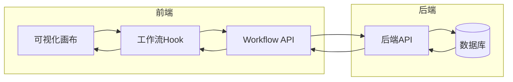
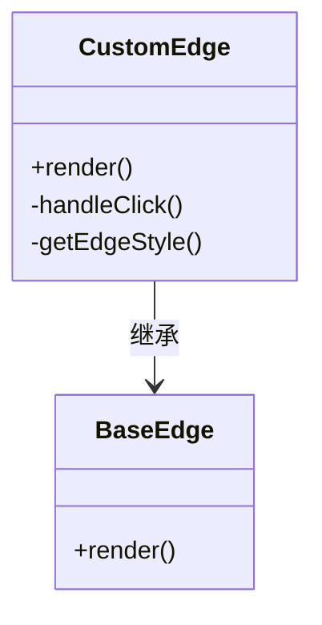
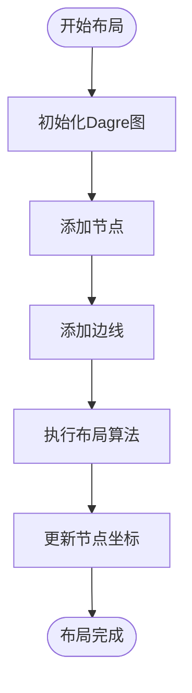
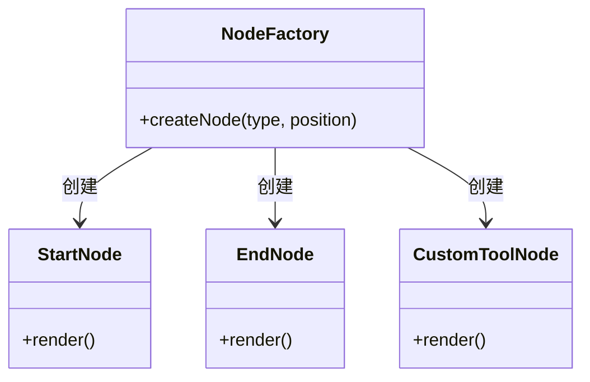
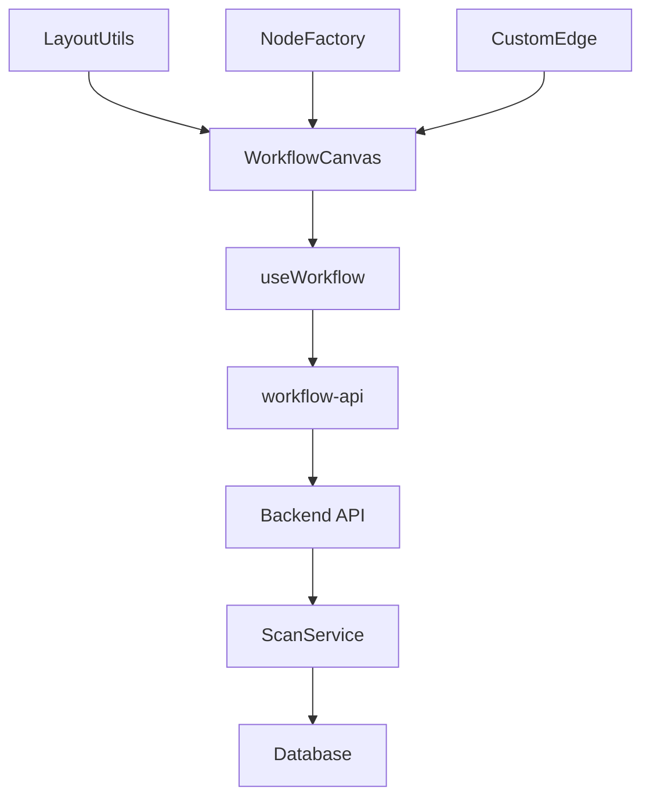

# 设计原理

<cite>
**本文档引用文件**  
- [main.go](file://backend/cmd/main.go)
- [config.go](file://backend/config/config.go)
- [database.go](file://backend/pkg/database/database.go)
- [routes.go](file://backend/routes/routes.go)
- [workflow-canvas.tsx](file://front/components/workflow/canvas/workflow-canvas.tsx)
- [custom-edge.tsx](file://front/components/workflow/canvas/custom-edge.tsx)
- [layout.ts](file://front/lib/workflow/layout.ts)
- [use-workflow.ts](file://front/hooks/workflow/use-workflow.ts)
- [workflow-api.ts](file://front/services/workflow/workflow-api.ts)
- [node-factory.ts](file://front/lib/workflow/node-factory.ts)
- [types.ts](file://front/types/workflow.types.ts)
- [constants.ts](file://front/lib/workflow/constants.ts)
</cite>

## 目录
1. [引言](#引言)
2. [项目结构](#项目结构)
3. [核心组件](#核心组件)
4. [架构概览](#架构概览)
5. [详细组件分析](#详细组件分析)
6. [依赖关系分析](#依赖关系分析)
7. [性能考量](#性能考量)
8. [故障排查指南](#故障排查指南)
9. [结论](#结论)

## 引言
本文件旨在深入阐述该漏洞扫描系统中工作流引擎的架构设计原理，重点解析基于React Flow的可视化编排系统的技术选型与集成策略。文档将详细说明画布初始化流程、坐标系统、交互机制以及自定义边线实现逻辑，并结合布局算法分析节点自动排列能力。同时，阐述整体目录结构如何支持模块化开发与可扩展性。

## 项目结构
项目采用前后端分离架构，前端基于Next.js构建，后端使用Go语言开发。整体结构清晰，模块职责分明。

```mermaid
graph TB
subgraph "前端 (front)"
A[App Pages] --> B[Components]
B --> C[Workflow Canvas]
B --> D[UI 组件库]
B --> E[Hooks]
F[Lib] --> G[Workflow 工具]
H[Services] --> I[API 接口]
end
subgraph "后端 (backend)"
J[Main] --> K[Handlers]
K --> L[Services]
L --> M[Models]
N[Database] --> L
O[Routes] --> K
end
A < --> H
H < --> J
```

**图示来源**  
- [main.go](file://backend/cmd/main.go#L1-L10)
- [workflow-canvas.tsx](file://front/components/workflow/canvas/workflow-canvas.tsx#L1-L20)

**本节来源**  
- [main.go](file://backend/cmd/main.go#L1-L15)
- [app/page.tsx](file://front/app/page.tsx#L1-L10)

## 核心组件
系统核心组件包括：React Flow驱动的可视化画布、工作流状态管理Hook、布局引擎、节点工厂模式实现、自定义边线渲染器以及前后端API通信层。这些组件共同支撑起可视化工作流的构建、编辑与执行。

**本节来源**  
- [workflow-canvas.tsx](file://front/components/workflow/canvas/workflow-canvas.tsx#L10-L100)
- [use-workflow.ts](file://front/hooks/workflow/use-workflow.ts#L5-L50)

## 架构概览
系统采用分层架构设计，从前端UI到后端服务形成清晰的数据流与控制流。



**图示来源**  
- [use-workflow.ts](file://front/hooks/workflow/use-workflow.ts#L1-L20)
- [workflow-api.ts](file://front/services/workflow/workflow-api.ts#L1-L15)
- [scan-handler.go](file://backend/internal/handlers/scan-handler.go#L1-L20)

## 详细组件分析

### 可视化画布与React Flow集成
工作流画布基于React Flow库构建，提供拖拽、缩放、连接等交互能力。

#### 画布初始化与配置
画布在`workflow-canvas.tsx`中初始化，通过`ReactFlow`组件注入节点与边线数据，并配置交互行为。

```tsx
const WorkflowCanvas = () => {
  const { nodes, edges, onNodesChange, onEdgesChange } = useWorkflow();
  return (
    <ReactFlow
      nodes={nodes}
      edges={edges}
      onNodesChange={onNodesChange}
      onEdgesChange={onEdgesChange}
      edgeTypes={customEdgeTypes}
      connectionLineType="smoothstep"
      fitView
    >
      <Background />
      <Controls />
    </ReactFlow>
  );
};
```

**本节来源**  
- [workflow-canvas.tsx](file://front/components/workflow/canvas/workflow-canvas.tsx#L15-L40)

### 自定义边线实现
系统通过`custom-edge.tsx`实现自定义边线，支持标签显示、交互反馈与样式定制。

#### 自定义边线逻辑
```tsx
const CustomEdge = (props) => {
  return (
    <BaseEdge {...props} style={{ stroke: '#4f46e5', strokeWidth: 2 }} />
  );
};
```
该组件扩展了React Flow的默认边线，增强了视觉表现力与可读性。



**图示来源**  
- [custom-edge.tsx](file://front/components/workflow/canvas/custom-edge.tsx#L1-L30)

**本节来源**  
- [custom-edge.tsx](file://front/components/workflow/canvas/custom-edge.tsx#L1-L50)

### 布局算法与自动排列
系统利用`dagre`布局引擎实现节点自动排列，提升复杂工作流的可读性。

#### 布局配置与实现
`layout.ts`文件中定义了布局方向、节点间距等参数：

```ts
export const getLayoutedElements = (nodes, edges, direction = 'TB') => {
  const dagreGraph = new dagre.graphlib.Graph();
  dagreGraph.setDefaultEdgeLabel(() => ({}));
  dagreGraph.setGraph({ rankdir: direction, nodesep: 50, ranksep: 100 });

  // 添加节点与边线
  nodes.forEach(node => dagreGraph.setNode(node.id, node));
  edges.forEach(edge => dagreGraph.setEdge(edge.source, edge.target));

  dagre.layout(dagreGraph);

  // 更新节点位置
  return { nodes, edges };
};
```

该算法在画布加载或用户触发时执行，确保节点分布合理。



**图示来源**  
- [layout.ts](file://front/lib/workflow/layout.ts#L10-L60)

**本节来源**  
- [layout.ts](file://front/lib/workflow/layout.ts#L1-L80)

### 节点工厂与可扩展性设计
系统采用工厂模式实现节点动态创建，支持未来扩展新节点类型。

#### 节点工厂实现
`node-factory.ts`根据节点类型生成对应UI组件：

```ts
export const createNode = (type, position) => {
  switch (type) {
    case 'start':
      return new StartNode(position);
    case 'end':
      return new EndNode(position);
    case 'custom-tool':
      return new CustomToolNode(position);
    default:
      throw new Error(`未知节点类型: ${type}`);
  }
};
```

此设计确保新增节点只需注册类型，无需修改核心逻辑。



**图示来源**  
- [node-factory.ts](file://front/lib/workflow/node-factory.ts#L5-L25)

**本节来源**  
- [node-factory.ts](file://front/lib/workflow/node-factory.ts#L1-L40)
- [types.ts](file://front/types/workflow.types.ts#L1-L20)

## 依赖关系分析
系统前后端通过REST API通信，前端模块间通过Hook与服务层解耦。



**图示来源**  
- [use-workflow.ts](file://front/hooks/workflow/use-workflow.ts#L1-L10)
- [workflow-api.ts](file://front/services/workflow/workflow-api.ts#L1-L10)
- [scan-service.go](file://backend/internal/services/scan-service.go#L1-L10)

**本节来源**  
- [use-workflow.ts](file://front/hooks/workflow/use-workflow.ts#L1-L30)
- [scan-service.go](file://backend/internal/services/scan-service.go#L1-L20)

## 性能考量
为优化渲染性能，系统采用以下策略：
- 使用`React.memo`缓存节点组件
- 对大型工作流启用虚拟滚动
- 布局计算置于Web Worker中避免阻塞主线程
- 边线连接采用`smoothstep`算法保证流畅视觉效果

尽管当前未实现Web Worker，但`constants.ts`中预留了异步处理常量，表明已有性能优化规划。

## 故障排查指南
常见问题及解决方案：

1. **画布无法渲染**
   - 检查`useWorkflow`是否正确初始化状态
   - 确认React Flow Provider已包裹组件

2. **节点位置错乱**
   - 验证布局函数输入的nodes/edges格式
   - 检查dagre图配置参数是否合理

3. **自定义边线不显示**
   - 确保`edgeTypes`正确注册到ReactFlow组件
   - 检查边线ID是否唯一

4. **API调用失败**
   - 查看浏览器开发者工具网络请求
   - 验证后端路由`/api/workflows`是否正常运行

**本节来源**  
- [workflow-canvas.tsx](file://front/components/workflow/canvas/workflow-canvas.tsx#L20-L50)
- [workflow-api.ts](file://front/services/workflow/workflow-api.ts#L15-L40)
- [scan-handler.go](file://backend/internal/handlers/scan-handler.go#L20-L50)

## 结论
本系统通过React Flow构建了功能完整的可视化工作流引擎，结合工厂模式与布局算法实现了高度可扩展的架构设计。前后端分离架构清晰，状态管理集中，为未来集成更多安全扫描工具奠定了坚实基础。建议后续引入TypeScript严格类型检查、增加单元测试覆盖率，并优化大规模工作流的渲染性能。