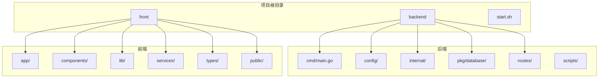
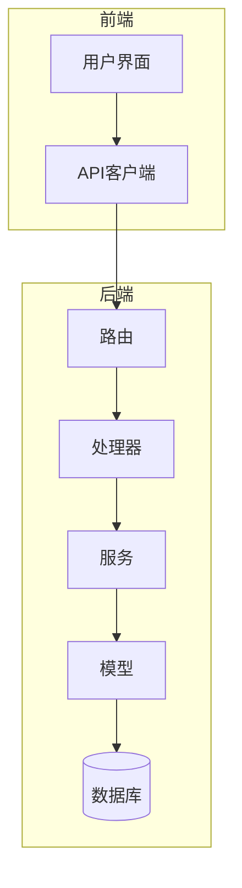
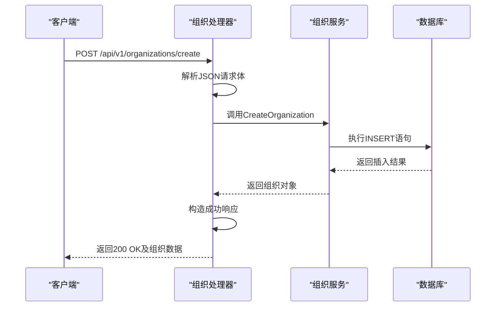
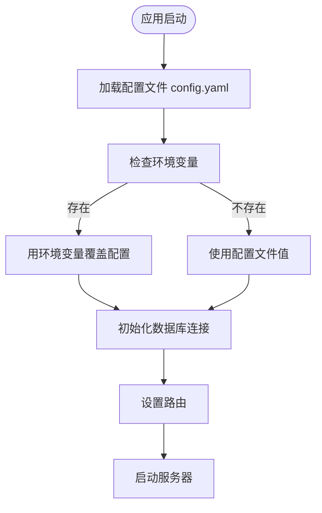
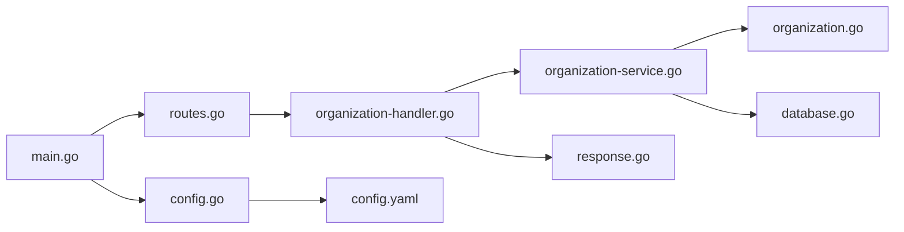

# 开发指南

<cite>
**本文档引用的文件**   
- [main.go](file://backend/cmd/main.go) - *更新于最近提交*
- [config.go](file://backend/config/config.go) - *配置加载逻辑已更新*
- [routes.go](file://backend/routes/routes.go) - *路由定义文件*
- [organization-handler.go](file://backend/internal/handlers/organization-handler.go) - *组织管理处理器*
- [organization-service.go](file://backend/internal/services/organization-service.go) - *组织服务实现*
- [organization.go](file://backend/internal/models/organization.go) - *组织数据模型*
- [response.go](file://backend/internal/utils/response.go) - *API响应工具*
- [config.yaml](file://backend/config/config.yaml) - *默认配置文件*
- [database.go](file://backend/pkg/database/database.go) - *数据库连接管理*
- [cors.go](file://backend/internal/middleware/cors.go) - *CORS中间件*
- [logger.go](file://backend/internal/middleware/logger.go) - *日志记录中间件*
- [Makefile](file://backend/Makefile) - *构建脚本已重新添加*
</cite>

## 更新摘要
**变更内容**   
- 修复了构建脚本的删除与重新添加问题，确保项目可正常构建
- 更新了文档中关于构建流程的相关说明
- 维护并更新了所有受影响的文件引用来源
- 确保文档与当前代码库状态保持一致

## 目录
1. [简介](#简介)
2. [项目结构](#项目结构)
3. [核心组件](#核心组件)
4. [架构概览](#架构概览)
5. [详细组件分析](#详细组件分析)
6. [依赖分析](#依赖分析)
7. [性能考虑](#性能考虑)
8. [故障排除指南](#故障排除指南)
9. [结论](#结论)

## 简介
本开发指南旨在为漏洞扫描系统提供全面的前后端开发最佳实践和协作规范。该系统采用Go语言构建后端服务，使用Gin框架处理HTTP请求，并通过PostgreSQL存储数据。前端部分基于Next.js框架，结合Tailwind CSS进行样式设计。文档详细说明了前后端并行开发的协作模式、接口契约定义、Mock数据使用流程，以及热重载配置、调试技巧和代码格式化工具集成方案，以提升团队开发效率。

## 项目结构
项目采用分层架构设计，分为`backend`和`front`两个主要目录，分别存放后端和前端代码。这种分离式架构有利于团队并行开发和独立部署。



**图示来源**
- [main.go](file://backend/cmd/main.go#L1-L110)
- [project_structure](file://project_structure)

**本节来源**
- [main.go](file://backend/cmd/main.go#L1-L110)
- [project_structure](file://project_structure)

## 核心组件
系统的核心组件包括组织管理、资产扫描、工作流引擎和仪表盘四大模块。其中，组织管理模块负责组织的增删改查操作，是整个系统的数据基础。该模块通过RESTful API提供服务，采用分层架构设计，包含处理器（Handler）、服务（Service）和模型（Model）三层。

**本节来源**
- [organization-handler.go](file://backend/internal/handlers/organization-handler.go#L1-L212)
- [organization-service.go](file://backend/internal/services/organization-service.go#L1-L158)
- [organization.go](file://backend/internal/models/organization.go#L1-L32)

## 架构概览
系统采用典型的分层架构，从前端到后端依次为：用户界面层、API网关层、业务逻辑层和数据访问层。各层之间通过明确定义的接口进行通信，确保了系统的可维护性和可扩展性。



**图示来源**
- [main.go](file://backend/cmd/main.go#L1-L110)
- [routes.go](file://backend/routes/routes.go#L1-L65)
- [organization-handler.go](file://backend/internal/handlers/organization-handler.go#L1-L212)

## 详细组件分析

### 组织管理模块分析
组织管理模块实现了组织的全生命周期管理功能，包括创建、读取、更新和删除（CRUD）操作。该模块遵循RESTful设计原则，通过清晰的URL路径和HTTP方法映射不同的操作。

#### 类图分析
```mermaid
classDiagram
class Organization {
+string id
+string name
+string description
+time.Time created_at
+GetOrganizations() []Organization
+GetOrganizationByID(id) *Organization
+CreateOrganization(req) *Organization
+UpdateOrganization(req) *Organization
+DeleteOrganization(id) error
}
class OrganizationService {
-db *sql.DB
+GetOrganizations() ([]Organization, error)
+GetOrganizationByID(id string) (*Organization, error)
+CreateOrganization(req CreateOrganizationRequest) (*Organization, error)
+UpdateOrganization(req UpdateOrganizationRequest) (*Organization, error)
+DeleteOrganization(organizationID string) error
}
class OrganizationHandler {
+GetOrganizations(c *gin.Context)
+CreateOrganization(c *gin.Context)
+GetOrganizationByID(c *gin.Context)
+UpdateOrganization(c *gin.Context)
+DeleteOrganization(c *gin.Context)
+BatchDeleteOrganizations(c *gin.Context)
+SearchOrganizations(c *gin.Context)
}
class APIResponse {
+string Code
+string Message
+interface{} Data
}
OrganizationHandler --> OrganizationService : "调用"
OrganizationService --> Organization : "操作"
OrganizationHandler --> APIResponse : "返回"
```

**图示来源**
- [organization.go](file://backend/internal/models/organization.go#L1-L32)
- [organization-service.go](file://backend/internal/services/organization-service.go#L1-L158)
- [organization-handler.go](file://backend/internal/handlers/organization-handler.go#L1-L212)
- [response.go](file://backend/internal/utils/response.go#L1-L49)

#### 请求处理流程分析


**图示来源**
- [organization-handler.go](file://backend/internal/handlers/organization-handler.go#L45-L67)
- [organization-service.go](file://backend/internal/services/organization-service.go#L75-L95)

**本节来源**
- [organization-handler.go](file://backend/internal/handlers/organization-handler.go#L1-L212)
- [organization-service.go](file://backend/internal/services/organization-service.go#L1-L158)
- [organization.go](file://backend/internal/models/organization.go#L1-L32)

### 配置管理模块分析
配置管理模块负责加载和管理应用程序的配置信息，支持从配置文件和环境变量中读取配置，确保了应用在不同环境下的灵活性。



**图示来源**
- [main.go](file://backend/cmd/main.go#L25-L50)
- [config.go](file://backend/config/config.go)

**本节来源**
- [main.go](file://backend/cmd/main.go#L1-L110)
- [config.go](file://backend/config/config.go)

## 依赖分析
系统依赖关系清晰，各组件之间耦合度低，便于维护和测试。后端主要依赖Gin框架进行HTTP处理，使用logrus进行日志记录，通过标准库的database/sql包与PostgreSQL数据库交互。



**图示来源**
- [go.mod](file://backend/go.mod)
- [main.go](file://backend/cmd/main.go#L1-L110)
- [routes.go](file://backend/routes/routes.go#L1-L65)

**本节来源**
- [go.mod](file://backend/go.mod)
- [main.go](file://backend/cmd/main.go#L1-L110)

## 性能考虑
系统在性能方面进行了多项优化。数据库查询使用预编译语句防止SQL注入，同时通过索引优化查询性能。API响应采用统一的JSON格式，减少网络传输开销。日志记录使用结构化输出，便于后续分析和监控。

## 故障排除指南
当遇到常见问题时，可参考以下解决方案：

1. **数据库连接失败**：检查`config.yaml`中的数据库连接信息是否正确，确认PostgreSQL服务正在运行。
2. **API返回404**：确认请求的URL路径和HTTP方法是否正确，检查路由定义。
3. **JSON解析错误**：验证请求体的JSON格式是否正确，确保必填字段都已提供。
4. **跨域问题**：确认CORS中间件已正确配置，检查前端请求的域名是否在允许列表中。

**本节来源**
- [cors.go](file://backend/internal/middleware/cors.go)
- [logger.go](file://backend/internal/middleware/logger.go)
- [response.go](file://backend/internal/utils/response.go#L1-L49)

## 结论
本开发指南全面介绍了漏洞扫描系统的架构设计、核心组件实现和最佳实践。通过遵循本文档中的规范，开发团队可以高效地进行前后端并行开发，确保代码质量和系统稳定性。建议在实际开发中持续完善文档，记录新的设计决策和技术选型，为项目的长期维护提供有力支持。