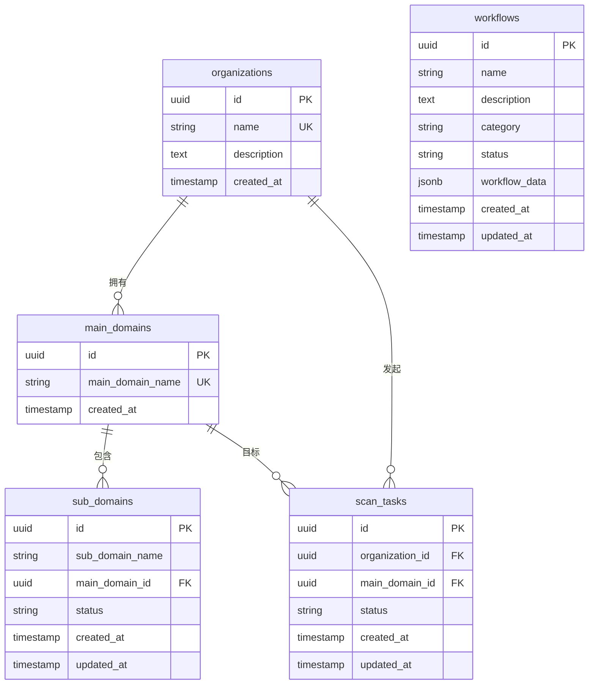
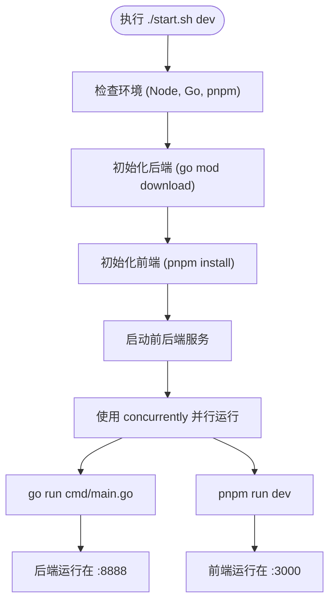

# 快速入门

<cite>
**本文档中引用的文件**   
- [main.go](file://backend/cmd/main.go)
- [config.go](file://backend/config/config.go)
- [config.yaml](file://backend/config/config.yaml)
- [database.go](file://backend/pkg/database/database.go)
- [start.sh](file://start.sh)
- [初始化.sql](file://backend/初始化.sql)
- [routes.go](file://backend/routes/routes.go)
- [organization-handler.go](file://backend/internal/handlers/organization-handler.go)
- [organization-service.go](file://backend/internal/services/organization-service.go)
</cite>

## 目录
1. [简介](#简介)
2. [前置条件与环境准备](#前置条件与环境准备)
3. [项目克隆与依赖安装](#项目克隆与依赖安装)
4. [数据库初始化](#数据库初始化)
5. [配置文件与环境变量](#配置文件与环境变量)
6. [一键启动服务](#一键启动服务)
7. [服务验证](#服务验证)
8. [常见问题排查](#常见问题排查)

## 简介

本指南旨在帮助新手开发者在30分钟内完成“Vulun Scan”漏洞扫描系统的本地环境搭建。该系统采用Go语言开发后端，使用Next.js构建前端，通过PostgreSQL存储数据。文档将详细说明从环境准备到服务验证的完整流程，确保新成员能够快速上手。

## 前置条件与环境准备

在开始之前，请确保您的系统已安装以下软件：

- **Go 1.21+**: 用于编译和运行后端服务
- **Node.js 18+**: 用于运行前端开发服务器
- **pnpm**: 前端包管理工具
- **PostgreSQL 12+**: 用于数据存储

### 安装步骤

#### 1. 安装 Go
访问 [Go 官方网站](https://golang.org/dl/) 下载并安装 Go 1.21 或更高版本。安装完成后，验证版本：
```bash
go version
```

#### 2. 安装 Node.js 和 pnpm
访问 [Node.js 官网](https://nodejs.org/) 下载并安装 Node.js 18 或更高版本。安装完成后，使用 npm 安装 pnpm：
```bash
npm install -g pnpm
```
验证安装：
```bash
node --version
pnpm --version
```

#### 3. 安装 PostgreSQL
- **macOS**: 使用 Homebrew 安装
  ```bash
  brew install postgresql
  brew services start postgresql
  ```
- **Ubuntu**: 使用 apt 安装
  ```bash
  sudo apt-get update
  sudo apt-get install postgresql postgresql-contrib
  sudo service postgresql start
  ```
- **Windows**: 从 [PostgreSQL 官网](https://www.postgresql.org/download/) 下载安装程序。

**Section sources**
- [start.sh](file://start.sh#L45-L55)

## 项目克隆与依赖安装

### 1. 克隆项目
打开终端，执行以下命令克隆项目仓库：
```bash
git clone https://github.com/your-repo/my-vulun-scan.git
cd my-vulun-scan
```

### 2. 安装后端依赖
进入后端目录，下载 Go 模块依赖：
```bash
cd backend
go mod download
go mod tidy
```

### 3. 安装前端依赖
返回项目根目录，进入前端目录并安装 pnpm 依赖：
```bash
cd ../front
pnpm install
```

**Section sources**
- [start.sh](file://start.sh#L120-L137)

## 数据库初始化

### 1. 创建数据库
使用 `psql` 命令行工具创建名为 `vulun_scan` 的数据库：
```bash
createdb vulun_scan
```
或使用 PostgreSQL 命令：
```bash
psql -c "CREATE DATABASE vulun_scan;"
```

### 2. 执行初始化脚本
运行项目提供的 `初始化.sql` 脚本以创建表结构并插入示例数据：
```bash
psql -d vulun_scan -f ../backend/初始化.sql
```
该脚本将创建以下主要表：
- `organizations`: 组织信息
- `main_domains`: 主域名信息
- `sub_domains`: 子域名信息
- `scan_tasks`: 扫描任务
- `workflows`: 工作流定义



**Diagram sources**
- [初始化.sql](file://backend/初始化.sql#L1-L278)

**Section sources**
- [初始化.sql](file://backend/初始化.sql#L1-L278)

## 配置文件与环境变量

### 1. 配置文件说明
后端配置文件位于 `backend/config/config.yaml`，其关键参数如下：

| **参数** | **说明** | **默认值** |
| :--- | :--- | :--- |
| `server.host` | 服务器监听主机 | localhost |
| `server.port` | 服务器监听端口 | 8888 |
| `database.host` | 数据库主机 | localhost |
| `database.port` | 数据库端口 | 5432 |
| `database.user` | 数据库用户名 | postgres |
| `database.password` | 数据库密码 | 123.com |
| `database.dbname` | 数据库名称 | vulun_scan |
| `security.jwt_secret` | JWT密钥 | your-super-secret-jwt-key-change-this-in-production |

### 2. 环境变量覆盖
您可以通过设置环境变量来覆盖配置文件中的值。支持的环境变量包括：
- `DB_HOST`, `DB_PORT`, `DB_USER`, `DB_PASSWORD`, `DB_NAME`
- `JWT_SECRET`, `JWT_EXPIRY_HOUR`

例如，启动时指定数据库密码：
```bash
export DB_PASSWORD="your_password"
```

**Section sources**
- [config.yaml](file://backend/config/config.yaml#L1-L20)
- [database.go](file://backend/pkg/database/database.go#L15-L35)

## 一键启动服务

项目提供了一个便捷的 `start.sh` 脚本，可以一键启动前后端服务。

### 1. 脚本使用方法
```bash
# 查看帮助
./start.sh help

# 开发模式启动（推荐新手使用）
./start.sh dev

# 同时启动前后端
./start.sh all
```

### 2. 脚本工作流程


**Diagram sources**
- [start.sh](file://start.sh#L1-L315)

**Section sources**
- [start.sh](file://start.sh#L1-L315)

## 服务验证

服务启动后，进行以下验证以确保一切正常：

### 1. 后端健康检查
访问后端健康检查接口：
```bash
curl http://localhost:8888/health
```
预期返回：
```json
{
  "status": "ok",
  "timestamp": 1712345678
}
```

### 2. 前端页面访问
打开浏览器，访问 `http://localhost:3000`。您应该能看到前端应用的登录或主页。

### 3. API 接口测试
测试获取组织列表的API：
```bash
curl http://localhost:8888/api/v1/organizations
```
应返回在 `初始化.sql` 中插入的示例组织数据。

**Section sources**
- [main.go](file://backend/cmd/main.go#L75-L82)
- [routes.go](file://backend/routes/routes.go#L10-L15)

## 常见问题排查

### 1. 数据库连接失败
**症状**: 后端启动时报错 `Failed to ping database`。
**解决方案**:
- 确认 PostgreSQL 服务已启动。
- 检查 `config.yaml` 中的数据库连接信息是否正确。
- 确认数据库 `vulun_scan` 已创建。

### 2. 端口被占用
**症状**: 启动时报错 `address already in use`。
**解决方案**:
- 修改 `config.yaml` 中的 `server.port` 为其他端口（如 8889）。
- 或使用 `lsof -i :8888` 找到并终止占用端口的进程。

### 3. 依赖安装失败
**症状**: `go mod download` 或 `pnpm install` 失败。
**解决方案**:
- 检查网络连接，尝试使用代理。
- 对于 Go 模块，可设置 GOPROXY：
  ```bash
  go env -w GOPROXY=https://goproxy.cn,direct
  ```

### 4. 脚本权限问题
**症状**: `./start.sh` 提示权限不足。
**解决方案**:
为脚本添加执行权限：
```bash
chmod +x start.sh
```

**Section sources**
- [database.go](file://backend/pkg/database/database.go#L65-L75)
- [start.sh](file://start.sh#L100-L115)