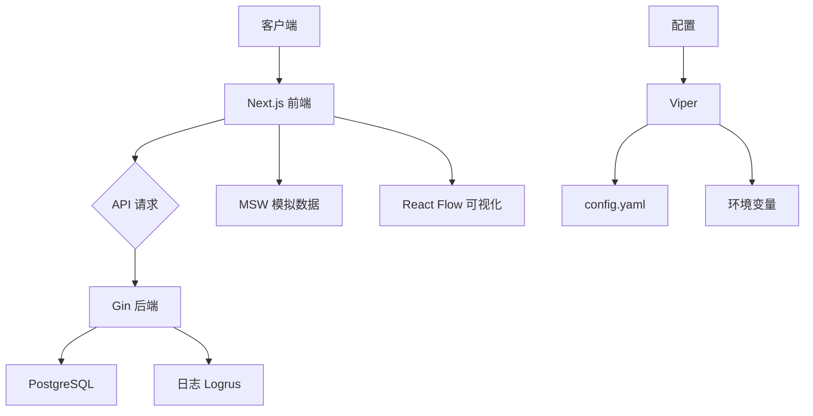

# 技术栈

<cite>
**本文档引用的文件**  
- [main.go](file://backend/cmd/main.go)
- [config.go](file://backend/config/config.go)
- [config.yaml](file://backend/config/config.yaml)
- [database.go](file://backend/pkg/database/database.go)
- [logger.go](file://backend/internal/middleware/logger.go)
- [package.json](file://front/package.json)
- [go.mod](file://backend/go.mod)
- [tailwind.config.ts](file://front/tailwind.config.ts)
- [next.config.mjs](file://front/next.config.mjs)
- [workflow-canvas.tsx](file://front/components/workflow/canvas/workflow-canvas.tsx)
</cite>

## 目录
1. [项目概述](#项目概述)
2. [后端技术栈](#后端技术栈)
3. [前端技术栈](#前端技术栈)
4. [关键依赖库](#关键依赖库)
5. [技术选型分析](#技术选型分析)

## 项目概述

本项目是一个漏洞扫描系统，采用前后端分离架构。后端基于 Go 语言构建，使用 Gin 框架处理 HTTP 请求，Viper 进行配置管理，Logrus 实现日志记录，并通过 PostgreSQL 存储数据。前端采用 Next.js 框架，结合 React Server Components 和 App Router 架构，使用 Tailwind CSS 进行样式设计，并集成 Shadcn UI 组件库和 React Flow 实现工作流可视化功能。

**Section sources**
- [main.go](file://backend/cmd/main.go#L1-L10)
- [package.json](file://front/package.json#L1-L10)

## 后端技术栈

### Gin 框架在路由处理中的作用

Gin 是一个高性能的 Go Web 框架，用于构建 RESTful API。在本项目中，Gin 负责处理所有 HTTP 请求和响应。通过 `setupRouter` 函数初始化路由引擎，并注册多个中间件来增强功能。

```go
func setupRouter() *gin.Engine {
	cfg := config.GetConfig()

	if cfg.Server.Mode == "debug" {
		gin.SetMode(gin.DebugMode)
	} else {
		gin.SetMode(gin.ReleaseMode)
	}

	r := gin.New()

	r.Use(gin.Logger())
	r.Use(gin.Recovery())
	r.Use(middleware.CORS())
	r.Use(middleware.Logger())

	r.GET("/health", func(c *gin.Context) {
		c.JSON(http.StatusOK, gin.H{
			"status":    "ok",
			"timestamp": time.Now().Unix(),
		})
	})

	api := r.Group("/api/v1")
	{
		routes.SetupOrganizationRoutes(api)
		routes.SetupScanRoutes(api)
		routes.SetupWorkflowRoutes(api)
		routes.SetupAssetsRoutes(api)
		routes.SetupDashboardRoutes(api)
	}

	return r
}
```

如上代码所示，Gin 创建了一个新的引擎实例，并注册了日志、恢复、CORS 和自定义日志中间件。同时定义了 `/health` 健康检查接口和 `/api/v1` API 路由组，将不同模块的路由分别注册到对应的路由组中。

**Section sources**
- [main.go](file://backend/cmd/main.go#L40-L77)
- [routes.go](file://backend/routes/routes.go#L1-L20)

### Viper 用于配置管理的方式

Viper 是 Go 语言中强大的配置管理库，支持多种配置格式（如 YAML、JSON、TOML）和环境变量覆盖。本项目使用 `config.yaml` 文件进行配置，并允许通过环境变量动态覆盖。

```go
func LoadConfig() error {
	setDefaults()

	if err := viper.ReadInConfig(); err != nil {
		log.Printf("Warning: config file not found, using default values: %v", err)
	}

	viper.AutomaticEnv()

	if err := viper.Unmarshal(&AppConfig); err != nil {
		return err
	}

	return nil
}
```

配置结构体定义了服务器、数据库和安全相关的参数。`setDefaults` 函数设置了默认值，例如数据库连接信息从环境变量获取或使用默认值。配置文件 `config.yaml` 示例：

```yaml
server:
  host: "localhost"
  port: 8888
  mode: "release"
  read_timeout: 15
  write_timeout: 15

database:
  host: "localhost"
  port: 5432
  user: "postgres"
  password: "123.com"
  dbname: "vulun_scan"
  sslmode: "disable"
  max_conns: 10
```

这种方式实现了配置的灵活性和可维护性，便于在不同环境中部署。

**Section sources**
- [config.go](file://backend/config/config.go#L55-L92)
- [config.yaml](file://backend/config/config.yaml#L1-L18)

### Logrus 日志记录实践

Logrus 是一个结构化日志库，支持 JSON 格式输出和自定义字段。项目中通过 `setupLogger` 函数初始化日志格式为 JSON，并设置时间戳格式。

```go
func setupLogger() {
	logrus.SetFormatter(&logrus.JSONFormatter{
		TimestampFormat: time.RFC3339,
	})
	logrus.SetLevel(logrus.InfoLevel)
	logrus.Info("Starting Vulun Scan Backend Server...")
}
```

此外，还实现了自定义日志中间件 `middleware.Logger()`，记录每个 API 请求的详细信息：

```go
func Logger() gin.HandlerFunc {
	return gin.LoggerWithFormatter(func(param gin.LogFormatterParams) string {
		logrus.WithFields(logrus.Fields{
			"method":     param.Method,
			"path":       param.Path,
			"status":     param.StatusCode,
			"latency":    param.Latency,
			"ip":         param.ClientIP,
			"user_agent": param.Request.UserAgent(),
			"timestamp":  param.TimeStamp.Format(time.RFC3339),
		}).Info("API Request")

		return ""
	})
}
```

该中间件输出包含请求方法、路径、状态码、延迟、客户端 IP、用户代理和时间戳等信息，便于监控和排查问题。

**Section sources**
- [main.go](file://backend/cmd/main.go#L20-L28)
- [logger.go](file://backend/internal/middleware/logger.go#L10-L24)

### PostgreSQL 数据库集成方案

项目使用 `github.com/lib/pq` 驱动连接 PostgreSQL 数据库，并通过 `database.go` 文件封装数据库操作。

```go
func InitDB() {
	cfg := config.GetConfig()

	connStr := fmt.Sprintf("host=%s port=%d user=%s password=%s dbname=%s sslmode=%s",
		cfg.Database.Host,
		cfg.Database.Port,
		cfg.Database.User,
		cfg.Database.Password,
		cfg.Database.DBName,
		cfg.Database.SSLMode,
	)

	var err error
	DB, err = sql.Open("postgres", connStr)
	if err != nil {
		logrus.WithError(err).Fatal("Failed to open database connection")
	}

	DB.SetMaxOpenConns(cfg.Database.MaxConns)
	DB.SetMaxIdleConns(cfg.Database.MaxConns / 2)
	DB.SetConnMaxLifetime(5 * time.Minute)

	if err = DB.Ping(); err != nil {
		logrus.WithError(err).Fatal("Failed to ping database")
	}

	logrus.Info("Database connection established successfully")
}
```

初始化过程中设置了最大连接数、空闲连接数和连接生命周期，确保数据库连接池的高效使用。同时提供了 `WithTx` 方法支持事务操作，保证数据一致性。

**Section sources**
- [database.go](file://backend/pkg/database/database.go#L15-L60)

## 前端技术栈

### Next.js 的 App Router 架构

Next.js 使用 App Router 架构组织页面结构，基于文件系统的路由机制。项目中 `app` 目录下的每个子目录代表一个路由段，`page.tsx` 文件作为页面入口。

```
app/
├── assets
│   ├── domains
│   │   ├── [id]
│   │   │   └── page.tsx
│   │   └── page.tsx
│   └── organizations
│       ├── [id]
│       │   └── page.tsx
│       └── page.tsx
├── workflow
│   ├── components
│   │   └── page.tsx
│   ├── edit
│   │   └── page.tsx
└── page.tsx
```

动态路由使用 `[param]` 语法，如 `[id]` 表示动态 ID 参数。布局文件 `layout.tsx` 定义共享 UI 结构，`loading.tsx` 和 `not-found.tsx` 分别处理加载状态和 404 页面。

**Section sources**
- [layout.tsx](file://front/app/layout.tsx#L1-L10)
- [page.tsx](file://front/app/page.tsx#L1-L5)

### React Server Components 特性

React Server Components 允许在服务端渲染组件，减少客户端 JavaScript 负载。Next.js 默认启用此特性，组件根据文件位置决定渲染方式：`app` 目录下为服务端组件，`components` 目录下为客户端组件。

服务端组件可以直接访问数据库或 API，无需通过客户端请求。例如，在 `page.tsx` 中可以直接调用服务层获取数据：

```tsx
import { getOrganizations } from '@/services/organization.service'

export default async function OrganizationsPage() {
  const organizations = await getOrganizations()
  
  return (
    <div>
      {organizations.map(org => (
        <div key={org.id}>{org.name}</div>
      ))}
    </div>
  )
}
```

这种模式提升了首屏加载性能，并增强了安全性。

**Section sources**
- [page.tsx](file://front/app/assets/organizations/page.tsx#L1-L20)

### Tailwind CSS 样式系统

Tailwind CSS 是一个实用优先的 CSS 框架，通过类名直接应用样式。项目通过 `tailwind.config.ts` 配置主题、插件和扩展样式。

```ts
import type { Config } from 'tailwindcss'

const config = {
  darkMode: ['class'],
  content: [
    './pages/**/*.{ts,tsx}',
    './components/**/*.{ts,tsx}',
    './app/**/*.{ts,tsx}',
    './src/**/*.{ts,tsx}',
  ],
  theme: {
    container: {
      center: true,
      padding: '2rem',
      screens: {
        '2xl': '1400px',
      },
    },
    extend: {
      colors: {
        border: 'hsl(var(--border))',
        input: 'hsl(var(--input))',
      },
    },
  },
  plugins: [require('tailwindcss-animate')],
} satisfies Config

export default config
```

结合 `clsx` 和 `class-variance-authority` 库，实现条件类名和变体类名的动态组合，提升样式复用性。

**Section sources**
- [tailwind.config.ts](file://front/tailwind.config.ts#L1-L30)

### Shadcn UI 组件库定制化使用

Shadcn UI 是基于 Radix UI 和 Tailwind CSS 的可定制组件库。项目中通过 `components.json` 管理组件配置，并在 `ui` 目录下存放所有 UI 组件。

```json
{
  "$schema": "https://ui.shadcn.com/schema.json",
  "style": "default",
  "rsc": true,
  "tsx": true,
  "tailwind": {
    "config": "tailwind.config.ts",
    "css": "app/globals.css",
    "baseColor": "slate",
    "cssVariables": true
  },
  "aliases": {
    "components": "@/components",
    "utils": "@/lib/utils"
  }
}
```

每个组件（如按钮、对话框、表格）都经过 Tailwind 样式定制，支持暗色模式和无障碍访问。通过 `@radix-ui/react-*` 包提供无样式的基础交互逻辑。

**Section sources**
- [components.json](file://front/components.json#L1-L15)
- [button.tsx](file://front/components/ui/button.tsx#L1-L10)

### React Flow 在工作流可视化中的实现机制

React Flow 是一个用于构建交互式节点图的库，适用于工作流、流程图等场景。项目在 `workflow-canvas.tsx` 中实现可视化编辑器。

```tsx
import ReactFlow, { Background, Controls, MiniMap } from 'reactflow'
import 'reactflow/dist/style.css'

import { useWorkflow } from '@/hooks/workflow/use-workflow'
import { BaseNode } from './nodes/_base/base-node'
import { WorkflowStartNode } from './nodes/workflow-start/node'
import { WorkflowEndNode } from './nodes/workflow-end/node'

const nodeTypes = {
  base: BaseNode,
  start: WorkflowStartNode,
  end: WorkflowEndNode,
}

export function WorkflowCanvas() {
  const { nodes, edges, onNodesChange, onEdgesChange, onConnect } = useWorkflow()

  return (
    <ReactFlow
      nodes={nodes}
      edges={edges}
      onNodesChange={onNodesChange}
      onEdgesChange={onEdgesChange}
      onConnect={onConnect}
      nodeTypes={nodeTypes}
      fitView
    >
      <Background />
      <Controls />
      <MiniMap />
    </ReactFlow>
  )
}
```

通过自定义节点类型和钩子 `useWorkflow` 管理状态，实现拖拽、连接、删除等交互功能。结合 `dagre` 布局库自动排列节点，提升用户体验。

**Section sources**
- [workflow-canvas.tsx](file://front/components/workflow/canvas/workflow-canvas.tsx#L1-L50)
- [use-workflow.ts](file://front/hooks/workflow/use-workflow.ts#L1-L20)

## 关键依赖库

### Axios
Axios 是一个基于 Promise 的 HTTP 客户端，用于浏览器和 Node.js。前端通过 `http-client.ts` 封装 Axios 实例，统一处理请求拦截、响应拦截和错误处理。

```ts
import axios from 'axios'

export const httpClient = axios.create({
  baseURL: process.env.NEXT_PUBLIC_API_URL,
  timeout: 10000,
})

httpClient.interceptors.request.use((config) => {
  const token = localStorage.getItem('token')
  if (token) {
    config.headers.Authorization = `Bearer ${token}`
  }
  return config
})
```

### MSW (Mock Service Worker)
MSW 用于前端 API 模拟，通过 Service Worker 拦截网络请求，返回预定义的响应数据。项目在 `mocks` 目录下定义 handlers，支持开发和测试阶段无需后端依赖。

```ts
import { rest } from 'msw'
import { apiHandlers } from './api/index'

export const handlers = [...apiHandlers]
```

### Lucide
Lucide 是一个简洁的图标库，提供 React 组件形式的 SVG 图标。项目通过 `lucide-react` 包引入图标，如数据库、仪表盘、工作流等。

```tsx
import { Database, Home, Workflow } from 'lucide-react'

<Database className="h-4 w-4" />
```

这些图标与 Tailwind CSS 结合，实现响应式和主题适配。

**Section sources**
- [package.json](file://front/package.json#L20-L30)
- [http-client.ts](file://front/lib/http-client.ts#L1-L15)

## 技术选型分析

### 后端技术选型依据

| 技术 | 版本 | 选型理由 |
|------|------|----------|
| Go | 1.21 | 高性能、并发能力强、编译型语言适合后端服务 |
| Gin | v1.9.1 | 轻量级、高性能、社区活跃、中间件生态丰富 |
| Viper | v1.16.0 | 支持多格式配置、环境变量覆盖、易于集成 |
| Logrus | v1.9.3 | 结构化日志、支持 JSON 输出、便于日志分析 |
| PostgreSQL | - | 关系型数据库、事务支持、JSON 字段支持、扩展性强 |

**Section sources**
- [go.mod](file://backend/go.mod#L1-L10)

### 前端技术选型依据

| 技术 | 版本 | 选型理由 |
|------|------|----------|
| Next.js | 15.2.4 | 支持 SSR、ISR、App Router、内置优化、SEO 友好 |
| React | 19 | 最流行的前端框架、生态系统完善、组件化开发 |
| Tailwind CSS | 3.4.17 | 实用优先、原子类、高度可定制、与 Shadcn 集成良好 |
| Shadcn UI | - | 基于 Radix UI、可定制、无障碍、暗色模式支持 |
| React Flow | 11.11.4 | 专业的节点图库、交互性强、支持自定义节点和边 |

**Section sources**
- [package.json](file://front/package.json#L1-L20)



**Diagram sources**
- [main.go](file://backend/cmd/main.go#L1-L80)
- [package.json](file://front/package.json#L1-L80)