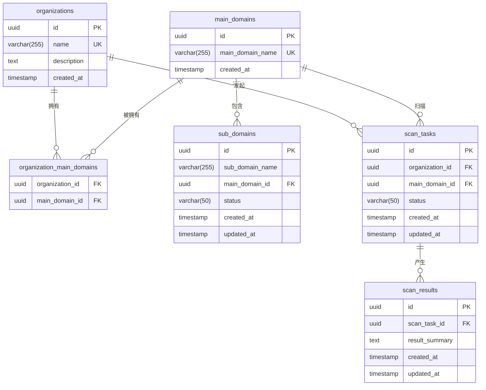

# 数据库设计

<cite>
**本文档引用的文件**  
- [init.sql](file://backend/init.sql)
- [organization.go](file://backend/internal/models/organization.go)
- [domain.go](file://backend/internal/models/domain.go)
- [scan.go](file://backend/internal/models/scan.go)
- [vulnerability.go](file://backend/internal/models/vulnerability.go)
- [database.go](file://backend/pkg/database/database.go)
- [config.go](file://backend/config/config.go)
</cite>

## 目录
1. [引言](#引言)
2. [核心数据表结构](#核心数据表结构)
3. [实体关系图（ER图）](#实体关系图er图)
4. [GORM模型映射规则](#gorm模型映射规则)
5. [数据库连接与事务管理](#数据库连接与事务管理)
6. [索引策略与查询优化](#索引策略与查询优化)
7. [数据迁移策略](#数据迁移策略)

## 引言

本数据库设计文档基于项目中的 `init.sql` 脚本和 Go 语言模型文件（位于 `backend/internal/models/` 目录下），全面描述了漏洞扫描系统的核心数据结构。文档详细阐述了 `organizations`、`main_domains`、`sub_domains`、`scan_tasks`、`scan_results`、`vulnerabilities` 等核心数据表的字段定义、数据类型、主外键关系和索引策略。通过实体关系图（ER图）直观展示各实体间的关联，如组织与主域名的一对多关系。同时，文档解释了 GORM 框架的模型映射规则、数据库连接池配置、事务管理机制和数据迁移策略，为数据访问层的开发提供权威参考。

**Section sources**
- [init.sql](file://backend/init.sql#L1-L278)
- [organization.go](file://backend/internal/models/organization.go#L1-L32)
- [domain.go](file://backend/internal/models/domain.go#L1-L62)
- [scan.go](file://backend/internal/models/scan.go#L1-L41)

## 核心数据表结构

### 组织表 (organizations)

该表存储系统中的组织信息。

**字段定义：**

| 字段名 | 数据类型 | 约束 | 描述 |
| :--- | :--- | :--- | :--- |
| `id` | UUID | PRIMARY KEY, DEFAULT gen_random_uuid() | 组织唯一标识符 |
| `name` | VARCHAR(255) | NOT NULL, UNIQUE | 组织名称 |
| `description` | TEXT | | 组织描述 |
| `created_at` | TIMESTAMP WITH TIME ZONE | NOT NULL | 创建时间 |

**Section sources**
- [init.sql](file://backend/init.sql#L12-L17)
- [organization.go](file://backend/internal/models/organization.go#L7-L11)

### 主域名表 (main_domains)

该表存储所有被监控的主域名。

**字段定义：**

| 字段名 | 数据类型 | 约束 | 描述 |
| :--- | :--- | :--- | :--- |
| `id` | UUID | PRIMARY KEY, DEFAULT gen_random_uuid() | 主域名唯一标识符 |
| `main_domain_name` | VARCHAR(255) | NOT NULL, UNIQUE | 主域名名称 |
| `created_at` | TIMESTAMP WITH TIME ZONE | NOT NULL | 创建时间 |

**Section sources**
- [init.sql](file://backend/init.sql#L19-L24)
- [domain.go](file://backend/internal/models/domain.go#L7-L10)

### 组织-主域名关联表 (organization_main_domains)

该表实现组织与主域名之间的多对多关系。

**字段定义：**

| 字段名 | 数据类型 | 约束 | 描述 |
| :--- | :--- | :--- | :--- |
| `organization_id` | UUID | NOT NULL, FOREIGN KEY (REFERENCES organizations.id) ON DELETE CASCADE | 组织ID |
| `main_domain_id` | UUID | NOT NULL, FOREIGN KEY (REFERENCES main_domains.id) ON DELETE CASCADE | 主域名ID |
| (联合主键) | | PRIMARY KEY (organization_id, main_domain_id) | 联合主键，确保关联的唯一性 |

**Section sources**
- [init.sql](file://backend/init.sql#L26-L31)
- [domain.go](file://backend/internal/models/domain.go#L12-L15)

### 子域名表 (sub_domains)

该表存储从主域名中发现的子域名。

**字段定义：**

| 字段名 | 数据类型 | 约束 | 描述 |
| :--- | :--- | :--- | :--- |
| `id` | UUID | PRIMARY KEY, DEFAULT gen_random_uuid() | 子域名唯一标识符 |
| `sub_domain_name` | VARCHAR(255) | NOT NULL | 子域名全名 |
| `main_domain_id` | UUID | NOT NULL, FOREIGN KEY (REFERENCES main_domains.id) ON DELETE CASCADE | 所属主域名ID |
| `status` | VARCHAR(50) | NOT NULL, DEFAULT 'unknown' | 子域名状态（如 active, inactive） |
| `created_at` | TIMESTAMP WITH TIME ZONE | NOT NULL | 创建时间 |
| `updated_at` | TIMESTAMP WITH TIME ZONE | NOT NULL | 更新时间 |
| (唯一约束) | | UNIQUE (sub_domain_name, main_domain_id) | 确保同一主域名下的子域名名称唯一 |

**Section sources**
- [init.sql](file://backend/init.sql#L33-L41)
- [domain.go](file://backend/internal/models/domain.go#L17-L24)

### 扫描任务表 (scan_tasks)

该表记录针对特定组织和主域名发起的扫描任务。

**字段定义：**

| 字段名 | 数据类型 | 约束 | 描述 |
| :--- | :--- | :--- | :--- |
| `id` | UUID | PRIMARY KEY, DEFAULT gen_random_uuid() | 扫描任务唯一标识符 |
| `organization_id` | UUID | NOT NULL, FOREIGN KEY (REFERENCES organizations.id) ON DELETE CASCADE | 关联的组织ID |
| `main_domain_id` | UUID | NOT NULL, FOREIGN KEY (REFERENCES main_domains.id) ON DELETE CASCADE | 关联的主域名ID |
| `status` | VARCHAR(50) | NOT NULL, DEFAULT 'pending' | 任务状态（pending, running, completed, failed） |
| `created_at` | TIMESTAMP WITH TIME ZONE | NOT NULL | 任务创建时间 |
| `updated_at` | TIMESTAMP WITH TIME ZONE | NOT NULL | 任务状态更新时间 |

**Section sources**
- [init.sql](file://backend/init.sql#L43-L51)
- [scan.go](file://backend/internal/models/scan.go#L7-L14)

### 扫描结果表 (scan_results)

该表存储扫描任务的执行结果摘要。

**字段定义：**

| 字段名 | 数据类型 | 约束 | 描述 |
| :--- | :--- | :--- | :--- |
| `id` | UUID | PRIMARY KEY, DEFAULT gen_random_uuid() | 扫描结果唯一标识符 |
| `scan_task_id` | UUID | NOT NULL, FOREIGN KEY (REFERENCES scan_tasks.id) ON DELETE CASCADE | 关联的扫描任务ID |
| `result_summary` | TEXT | | 扫描结果摘要 |
| `created_at` | TIMESTAMP WITH TIME ZONE | NOT NULL | 结果创建时间 |
| `updated_at` | TIMESTAMP WITH TIME ZONE | NOT NULL | 结果更新时间 |

**Section sources**
- [init.sql](file://backend/init.sql#L53-L59)
- [scan.go](file://backend/internal/models/scan.go#L16-L21)

### 漏洞表 (vulnerabilities)

该表用于存储扫描发现的漏洞信息。根据 `vulnerability.go` 文件，此为一个模拟的数据结构，实际系统可能有更复杂的实现。

**字段定义：**

| 字段名 | 数据类型 | 约束 | 描述 |
| :--- | :--- | :--- | :--- |
| `id` | string | | 漏洞唯一标识符 |
| `title` | string | | 漏洞标题 |
| `severity` | string | | 严重程度（如 high, medium） |
| `cvss` | float64 | | CVSS评分 |
| `cve` | string | | CVE编号 |
| `domain` | string | | 漏洞所在域名 |
| `port` | int | | 漏洞端口 |
| `service` | string | | 运行的服务 |
| `description` | string | | 漏洞描述 |
| `discovered_date` | time.Time | | 发现日期 |
| `status` | string | | 漏洞状态 |
| `organization` | string | | 所属组织名称 |
| `affected_url` | string | | 受影响的URL |
| `risk_score` | int | | 风险评分 |
| `poc` | string | | 漏洞利用代码 |
| `solution` | string | | 修复方案 |
| `organization_id` | string | | 所属组织ID |

**Section sources**
- [vulnerability.go](file://backend/internal/models/vulnerability.go#L7-L28)

## 实体关系图（ER图）



**Diagram sources**
- [init.sql](file://backend/init.sql#L12-L59)
- [organization.go](file://backend/internal/models/organization.go#L7-L11)
- [domain.go](file://backend/internal/models/domain.go#L7-L24)
- [scan.go](file://backend/internal/models/scan.go#L7-L21)

## GORM模型映射规则

GORM 是 Go 语言中流行的 ORM 框架。本项目通过结构体标签（struct tags）将 Go 结构体映射到数据库表。

**映射规则分析：**

*   **结构体与表名映射**：GORM 默认使用结构体名的复数形式作为表名。例如，`Organization` 结构体对应 `organizations` 表。此规则与 `init.sql` 中的表名完全一致。
*   **字段与列名映射**：通过 `db` 标签指定数据库列名。例如，在 `Organization` 结构体中，`ID string json:"id" db:"id"` 表示 Go 字段 `ID` 映射到数据库的 `id` 列。
*   **JSON序列化**：通过 `json` 标签控制结构体在 JSON 序列化/反序列化时的字段名。例如，`Name string json:"name" db:"name"` 表示在 API 传输时，该字段名为 `name`。
*   **嵌套结构体**：`SubDomain` 结构体中包含一个指向 `MainDomain` 的指针 `MainDomain *MainDomain json:"main_domain,omitempty"`。这表示在查询子域名时，可以预加载（preload）其关联的主域名信息，形成嵌套的 JSON 响应。
*   **请求/响应模型**：`models` 包中定义了如 `CreateOrganizationRequest`、`GetOrganizationScanHistoryResponse` 等结构体，这些是用于 API 接口的输入和输出模型，通过 `binding` 标签进行参数校验。

**Section sources**
- [organization.go](file://backend/internal/models/organization.go#L7-L31)
- [domain.go](file://backend/internal/models/domain.go#L7-L61)
- [scan.go](file://backend/internal/models/scan.go#L7-L40)

## 数据库连接与事务管理

### 数据库连接池配置

数据库连接由 `pkg/database/database.go` 文件中的 `InitDB()` 函数初始化。该函数从 `config.yaml` 文件加载配置，并设置连接池参数以优化性能和资源利用。

**连接池配置参数：**

| 配置项 | 配置来源 | 描述 |
| :--- | :--- | :--- |
| `SetMaxOpenConns` | `config.Database.MaxConns` | 设置数据库的最大打开连接数。默认值为10，可通过环境变量 `DB_MAX_CONNS` 覆盖。 |
| `SetMaxIdleConns` | `config.Database.MaxConns / 2` | 设置连接池中最大空闲连接数，通常设置为最大打开连接数的一半，以平衡资源占用和连接获取速度。 |
| `SetConnMaxLifetime` | 固定值 `5 * time.Minute` | 设置连接的最大生命周期，超过此时间的连接将被关闭并从池中移除，有助于防止数据库服务器因长时间空闲连接而断开。 |

**Section sources**
- [database.go](file://backend/pkg/database/database.go#L25-L45)
- [config.go](file://backend/config/config.go#L52-L58)

### 事务管理机制

为了保证数据的一致性，系统提供了事务支持。`WithTx` 函数是执行数据库事务的核心。

**事务管理流程：**

1.  **开始事务**：调用 `DB.Begin()` 创建一个新的事务。
2.  **执行操作**：将需要在事务中执行的数据库操作封装在一个函数中，并作为参数传递给 `WithTx`。
3.  **异常处理**：`WithTx` 函数内部使用 `defer` 和 `recover()` 来捕获任何 panic。如果在执行过程中发生错误或 panic，事务将被回滚（`tx.Rollback()`）。
4.  **提交事务**：如果所有操作都成功完成，调用 `tx.Commit()` 提交事务。

此机制确保了如“创建组织并同时添加主域名”这类复合操作的原子性。

```go
// 伪代码示例
err := database.WithTx(func(tx *sql.Tx) error {
    // 在事务中执行多个操作
    if err := createOrganization(tx, org); err != nil {
        return err
    }
    if err := addMainDomainToOrganization(tx, domain); err != nil {
        return err
    }
    return nil // 返回 nil 以提交事务
})
```

**Section sources**
- [database.go](file://backend/pkg/database/database.go#L73-L94)

## 索引策略与查询优化

`init.sql` 脚本在末尾创建了大量索引，这是查询优化的关键。

**主要索引策略：**

*   **主键索引**：所有表的 `id` 字段都自动创建了主键索引，用于快速定位单条记录。
*   **唯一索引**：`organizations.name` 和 `main_domains.main_domain_name` 字段上的唯一索引，既保证了数据的唯一性，也加速了基于名称的查询。
*   **外键索引**：为所有外键字段创建了索引，例如 `idx_sub_domains_main_domain_id`。这极大地加速了表连接（JOIN）操作，如查询某个主域名下的所有子域名。
*   **状态索引**：为 `sub_domains.status` 和 `scan_tasks.status` 等状态字段创建了索引。这使得按状态（如查找所有 `pending` 状态的扫描任务）进行筛选的查询非常高效。
*   **GIN索引**：为 `workflow_components.placeholders` 和 `workflows.workflow_data` 等 `JSONB` 字段创建了 GIN 索引。这种索引专门用于加速对 JSON 数据的查询，例如查找包含特定占位符的工作流组件。

**Section sources**
- [init.sql](file://backend/init.sql#L260-L288)

## 数据迁移策略

该项目目前采用直接执行 SQL 脚本（`init.sql`）的方式进行数据库初始化。这是一种简单直接的迁移策略。

**策略分析：**

*   **优点**：简单易懂，易于版本控制。脚本中包含了表结构定义、索引创建和初始数据插入，可以一键初始化数据库。
*   **缺点**：缺乏对增量变更（migrations）的支持。当需要修改表结构（如添加新字段）时，需要手动编写新的 SQL 脚本并确保其能安全地应用于已存在的数据库，这容易出错。
*   **改进建议**：对于生产环境，建议引入专业的数据库迁移工具（如 Goose、GORM Migrate 或 Flyway）。这些工具通过版本化的迁移脚本（migration scripts）来管理数据库模式的演进，能够安全地执行 `up`（升级）和 `down`（降级）操作，更好地支持持续集成和部署。

**Section sources**
- [init.sql](file://backend/init.sql#L1-L288)