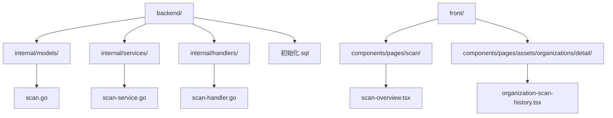
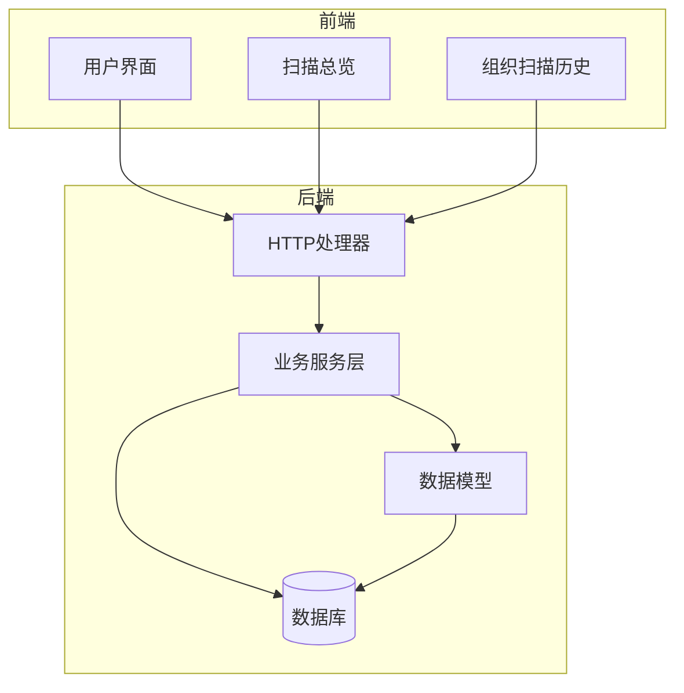
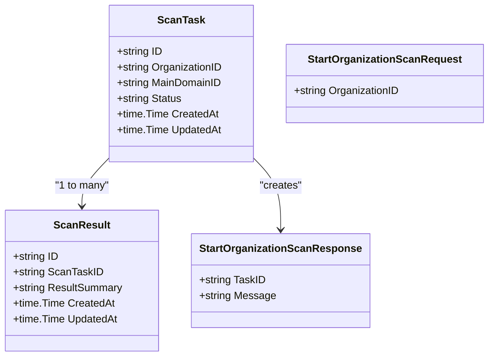
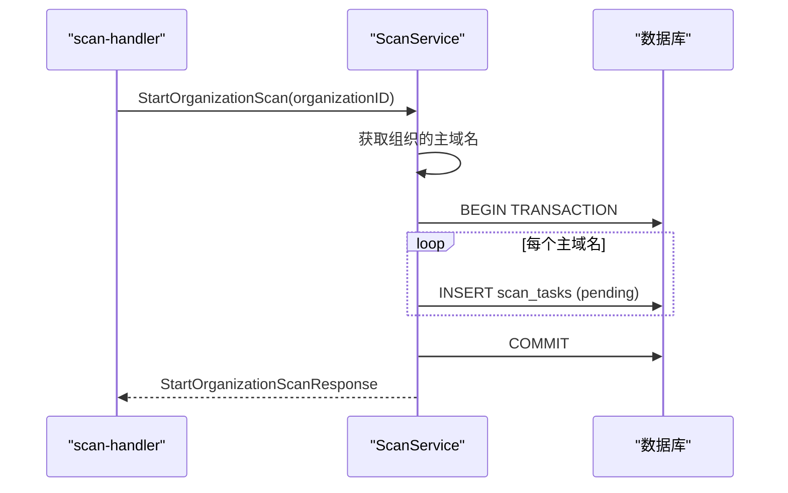
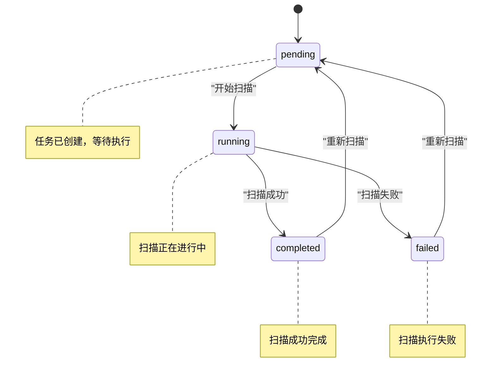
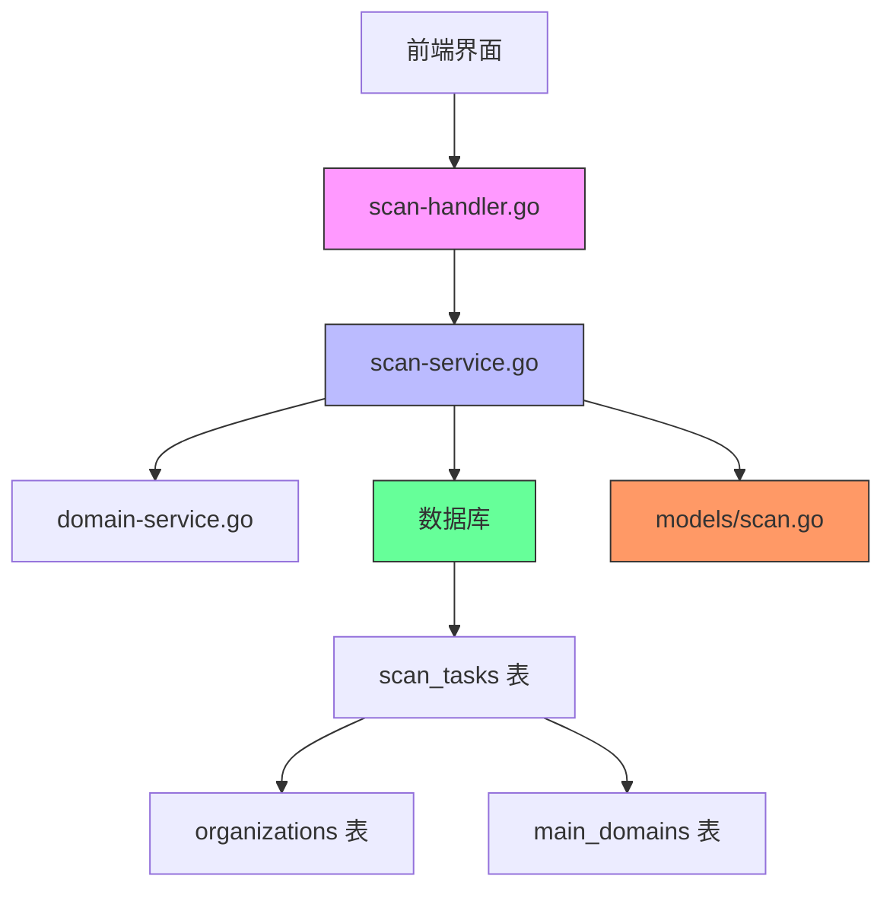

# 扫描任务模型

<cite>
**本文档引用的文件**   
- [scan.go](file://backend/internal/models/scan.go#L1-L40)
- [scan-service.go](file://backend/internal/services/scan-service.go#L1-L122)
- [scan-handler.go](file://backend/internal/handlers/scan-handler.go#L1-L49)
- [初始化.sql](file://backend/初始化.sql#L1-L279)
- [organization-scan-history.tsx](file://front/components/pages/assets/organizations/detail/organization-scan-history.tsx#L368-L443)
- [scan-overview.tsx](file://front/components/pages/scan/overview/scan-overview.tsx#L37-L91)
</cite>

## 目录
1. [项目结构](#项目结构)
2. [核心组件](#核心组件)
3. [架构概览](#架构概览)
4. [详细组件分析](#详细组件分析)
5. [依赖分析](#依赖分析)
6. [性能考量](#性能考量)
7. [故障排除指南](#故障排除指南)
8. [结论](#结论)

## 项目结构

根据项目目录结构，扫描任务相关的核心文件主要分布在后端的 `models`、`services` 和 `handlers` 目录中。前端的扫描任务管理界面位于 `front/components/pages/scan` 目录下。



**图源**
- [scan.go](file://backend/internal/models/scan.go)
- [scan-service.go](file://backend/internal/services/scan-service.go)
- [scan-handler.go](file://backend/internal/handlers/scan-handler.go)
- [scan-overview.tsx](file://front/components/pages/scan/overview/scan-overview.tsx)
- [organization-scan-history.tsx](file://front/components/pages/assets/organizations/detail/organization-scan-history.tsx)

**本节来源**
- [scan.go](file://backend/internal/models/scan.go#L1-L40)
- [scan-service.go](file://backend/internal/services/scan-service.go#L1-L122)
- [scan-handler.go](file://backend/internal/handlers/scan-handler.go#L1-L49)

## 核心组件

扫描任务模型的核心组件包括：
1. **ScanTask 结构体**：定义了扫描任务的数据模型，包含任务ID、组织ID、主域名ID、状态和时间戳。
2. **ScanService 服务**：提供了创建和查询扫描任务的业务逻辑。
3. **HTTP 处理器**：暴露了创建和获取扫描历史的API端点。
4. **数据库表 scan_tasks**：持久化存储扫描任务数据。

**本节来源**
- [scan.go](file://backend/internal/models/scan.go#L1-L40)
- [scan-service.go](file://backend/internal/services/scan-service.go#L1-L122)
- [scan-handler.go](file://backend/internal/handlers/scan-handler.go#L1-L49)
- [初始化.sql](file://backend/初始化.sql#L1-L279)

## 架构概览

系统采用典型的分层架构，从前端界面到后端服务再到数据库，形成了清晰的数据流和控制流。



**图源**
- [scan-handler.go](file://backend/internal/handlers/scan-handler.go#L1-L49)
- [scan-service.go](file://backend/internal/services/scan-service.go#L1-L122)
- [scan.go](file://backend/internal/models/scan.go#L1-L40)
- [初始化.sql](file://backend/初始化.sql#L1-L279)

## 详细组件分析

### 扫描任务模型分析

`ScanTask` 结构体是扫描任务的核心数据模型，定义了任务的基本属性。



**图源**
- [scan.go](file://backend/internal/models/scan.go#L1-L40)

**本节来源**
- [scan.go](file://backend/internal/models/scan.go#L1-L40)

### 扫描服务分析

`ScanService` 提供了创建和查询扫描任务的核心业务逻辑。`StartOrganizationScan` 方法会为组织的每个主域名创建一个扫描任务。



**图源**
- [scan-service.go](file://backend/internal/services/scan-service.go#L1-L122)
- [scan-handler.go](file://backend/internal/handlers/scan-handler.go#L1-L49)

**本节来源**
- [scan-service.go](file://backend/internal/services/scan-service.go#L1-L122)
- [scan-handler.go](file://backend/internal/handlers/scan-handler.go#L1-L49)

### 状态机分析

扫描任务的状态机定义了任务的生命周期，从创建到完成或失败的流转过程。



**图源**
- [scan.go](file://backend/internal/models/scan.go#L1-L40)
- [scan-overview.tsx](file://front/components/pages/scan/overview/scan-overview.tsx#L37-L91)

**本节来源**
- [scan.go](file://backend/internal/models/scan.go#L1-L40)
- [scan-overview.tsx](file://front/components/pages/scan/overview/scan-overview.tsx#L223-L264)

## 依赖分析

扫描任务模块与其他模块存在明确的依赖关系，形成了完整的业务闭环。



**图源**
- [scan-handler.go](file://backend/internal/handlers/scan-handler.go#L1-L49)
- [scan-service.go](file://backend/internal/services/scan-service.go#L1-L122)
- [scan.go](file://backend/internal/models/scan.go#L1-L40)
- [初始化.sql](file://backend/初始化.sql#L1-L279)

**本节来源**
- [scan-handler.go](file://backend/internal/handlers/scan-handler.go#L1-L49)
- [scan-service.go](file://backend/internal/services/scan-service.go#L1-L122)
- [scan.go](file://backend/internal/models/scan.go#L1-L40)
- [初始化.sql](file://backend/初始化.sql#L1-L279)

## 性能考量

在高并发环境下，扫描任务的创建需要考虑数据库事务的性能和锁竞争问题。建议采用以下优化策略：

1. **批量插入**：当一个组织有多个主域名时，可以使用批量插入语句减少数据库交互次数。
2. **连接池优化**：合理配置数据库连接池大小，避免连接耗尽。
3. **索引优化**：确保 `scan_tasks` 表的 `organization_id` 和 `status` 字段有适当的索引。
4. **异步处理**：将实际的扫描执行逻辑放入消息队列，避免HTTP请求长时间阻塞。

```sql
-- 确保必要的索引存在
CREATE INDEX IF NOT EXISTS idx_scan_tasks_org_id ON scan_tasks(organization_id);
CREATE INDEX IF NOT EXISTS idx_scan_tasks_status ON scan_tasks(status);
CREATE INDEX IF NOT EXISTS idx_scan_tasks_org_status ON scan_tasks(organization_id, status);
```

**本节来源**
- [scan-service.go](file://backend/internal/services/scan-service.go#L1-L122)
- [初始化.sql](file://backend/初始化.sql#L1-L279)

## 故障排除指南

### 常见问题及解决方案

1. **问题**：创建扫描任务时返回 "该组织没有主域名可以扫描"
   **原因**：指定的组织ID不存在或该组织没有关联任何主域名
   **解决方案**：检查组织ID是否正确，并确保该组织已配置主域名

2. **问题**：扫描任务状态长时间停留在 "pending"
   **原因**：扫描执行器未启动或存在调度问题
   **解决方案**：检查扫描执行服务是否正常运行，查看相关日志

3. **问题**：获取扫描历史时返回500错误
   **原因**：数据库连接失败或查询语句执行错误
   **解决方案**：检查数据库服务状态，验证数据库连接配置

**本节来源**
- [scan-handler.go](file://backend/internal/handlers/scan-handler.go#L1-L49)
- [scan-service.go](file://backend/internal/services/scan-service.go#L1-L122)

## 结论

扫描任务模型是漏洞扫描系统的核心组件之一，它通过清晰的分层架构和明确的状态机管理，实现了对扫描任务的全生命周期管理。模型设计简洁而完整，包含了任务ID、组织ID、主域名ID、状态和时间戳等必要字段。服务层通过事务保证了数据的一致性，而前端界面则提供了直观的任务状态展示。未来可以考虑增加任务优先级、超时配置、重试机制等高级功能，以满足更复杂的扫描需求。