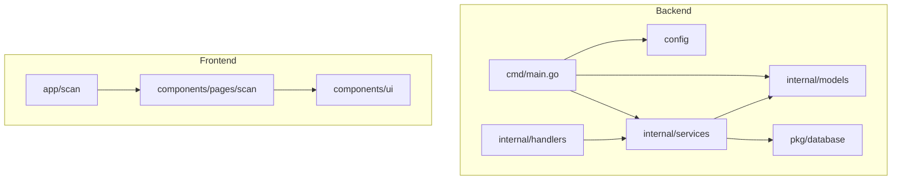
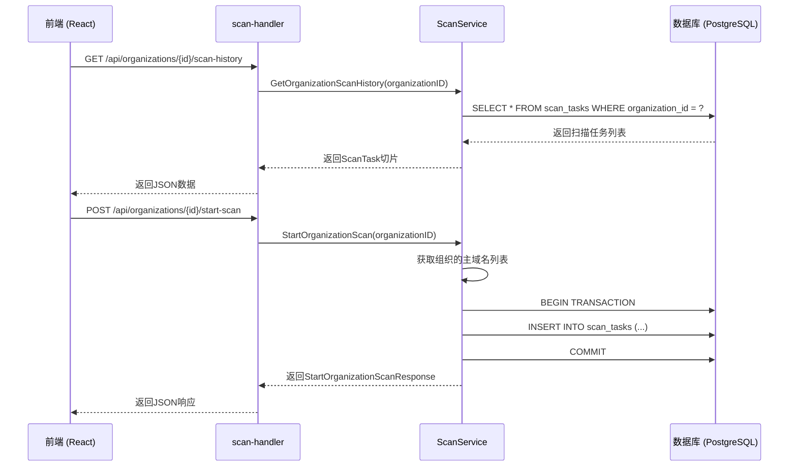
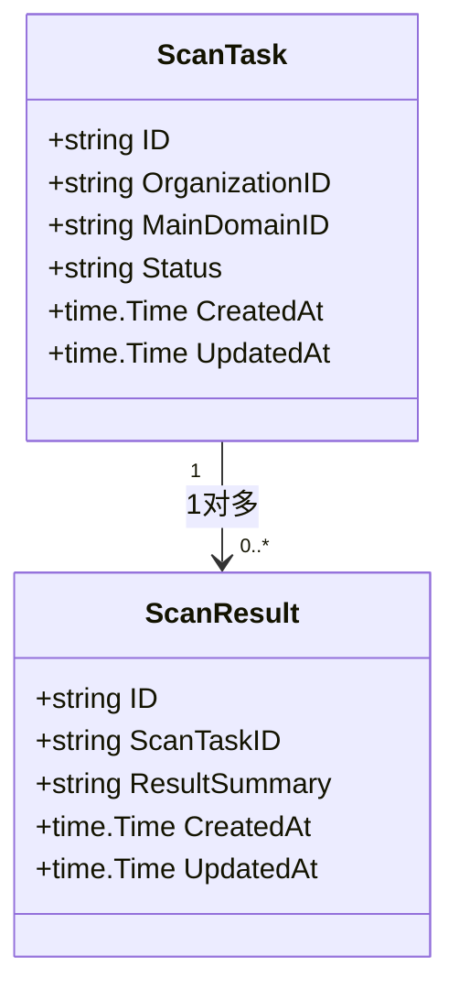
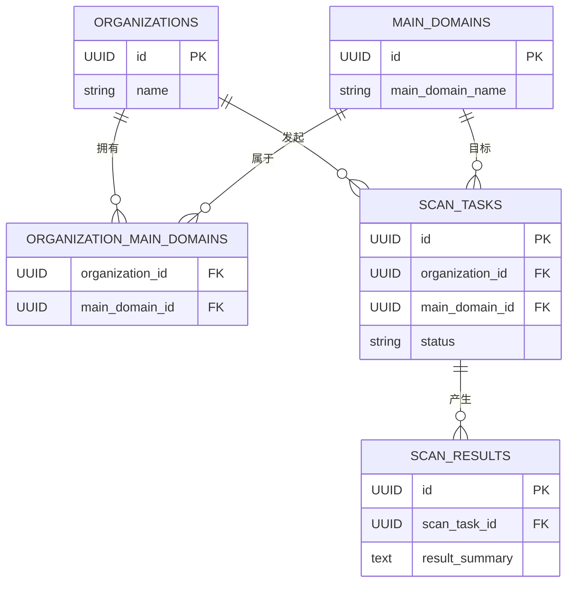
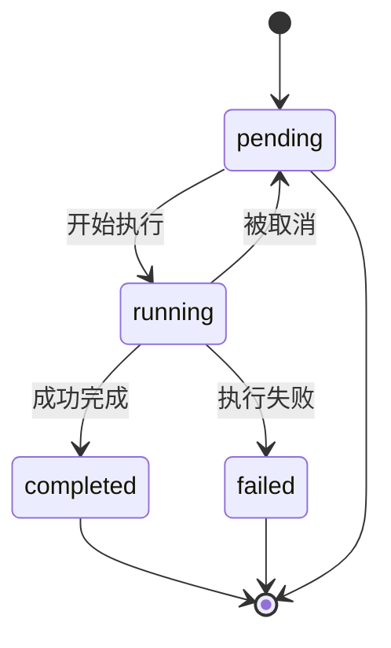
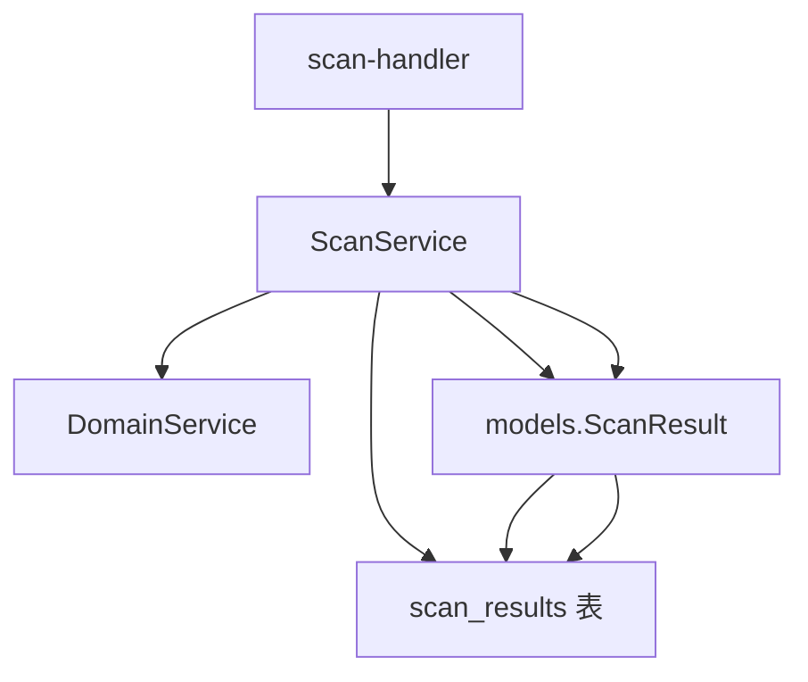

# 扫描模型

<cite>
**本文档引用的文件**   
- [scan.go](file://backend/internal/models/scan.go)
- [scan-service.go](file://backend/internal/services/scan-service.go)
- [scan-handler.go](file://backend/internal/handlers/scan-handler.go)
- [初始化.sql](file://backend/初始化.sql)
</cite>

## 目录
1. [引言](#引言)
2. [项目结构](#项目结构)
3. [核心组件](#核心组件)
4. [架构概述](#架构概述)
5. [详细组件分析](#详细组件分析)
6. [依赖分析](#依赖分析)
7. [性能考虑](#性能考虑)
8. [故障排除指南](#故障排除指南)
9. [结论](#结论)

## 引言
本文档深入解析了“漏洞扫描系统”中的扫描模型，重点分析了`ScanTask`和`ScanResult`结构体的设计与实现。文档详细阐述了扫描任务的生命周期、状态机设计、与资产（域名）的多对多关系建模，以及结果数据的存储与查询策略。通过结合数据库初始化脚本、Go模型定义、服务层逻辑和前端交互，全面揭示了该扫描系统的技术架构和核心功能。

## 项目结构
项目采用典型的分层架构，后端（`backend`）遵循MVC模式，前端（`front`）基于React框架。扫描模型的核心逻辑位于后端的`internal`目录下。



**Diagram sources**
- [scan.go](file://backend/internal/models/scan.go)
- [scan-service.go](file://backend/internal/services/scan-service.go)
- [scan-handler.go](file://backend/internal/handlers/scan-handler.go)

**Section sources**
- [scan.go](file://backend/internal/models/scan.go)
- [scan-service.go](file://backend/internal/services/scan-service.go)

## 核心组件
扫描模型的核心由三个部分构成：数据模型（`ScanTask`, `ScanResult`）、服务逻辑（`ScanService`）和API处理器（`scan-handler`）。这些组件协同工作，实现了从创建扫描任务到获取扫描历史的完整流程。

**Section sources**
- [scan.go](file://backend/internal/models/scan.go)
- [scan-service.go](file://backend/internal/services/scan-service.go)
- [scan-handler.go](file://backend/internal/handlers/scan-handler.go)

## 架构概述
系统采用前后端分离架构。前端通过HTTP API与后端交互。后端的`scan-handler`接收请求，调用`ScanService`进行业务处理，`ScanService`通过GORM操作数据库，数据模型`ScanTask`和`ScanResult`则定义了数据的结构。



**Diagram sources**
- [scan-handler.go](file://backend/internal/handlers/scan-handler.go)
- [scan-service.go](file://backend/internal/services/scan-service.go)
- [初始化.sql](file://backend/初始化.sql)

## 详细组件分析

### ScanTask 与 ScanResult 数据模型分析
`ScanTask`和`ScanResult`是扫描模型的核心数据结构，定义了扫描任务和结果的属性。

#### 数据结构与字段解析


**Diagram sources**
- [scan.go](file://backend/internal/models/scan.go)

**Section sources**
- [scan.go](file://backend/internal/models/scan.go)

- **ScanTask (扫描任务)**:
  - `ID`: 任务的唯一标识符，使用UUID。
  - `OrganizationID`: 关联的组织ID，建立与`organizations`表的外键关系。
  - `MainDomainID`: 关联的主域名ID，建立与`main_domains`表的外键关系。
  - `Status`: 任务的执行状态，是状态机的核心字段。
  - `CreatedAt` 和 `UpdatedAt`: 记录任务的创建和更新时间。

- **ScanResult (扫描结果)**:
  - `ID`: 结果的唯一标识符。
  - `ScanTaskID`: 外键，指向`scan_tasks`表，实现一对多关系。
  - `ResultSummary`: 存储扫描结果的摘要信息，当前为TEXT类型，可用于存储JSON格式的原始输出。

#### 扫描任务与资产的多对多关系建模
系统通过`organization_main_domains`关联表实现了组织与主域名的多对多关系。当启动一个组织的扫描时，`ScanService`会查询该组织关联的所有主域名，并为每个主域名创建一个独立的`ScanTask`。这使得一个组织可以拥有多个扫描任务，而一个扫描任务只针对一个主域名。



**Diagram sources**
- [初始化.sql](file://backend/初始化.sql)

**Section sources**
- [初始化.sql](file://backend/初始化.sql)
- [scan-service.go](file://backend/internal/services/scan-service.go)

### 扫描任务状态机设计
扫描任务的状态机是系统的核心，它清晰地定义了任务的生命周期。

#### 状态机设计与实现


**Diagram sources**
- [初始化.sql](file://backend/初始化.sql)
- [scan.go](file://backend/internal/models/scan.go)

**Section sources**
- [初始化.sql](file://backend/初始化.sql)
- [scan.go](file://backend/internal/models/scan.go)

- **状态值**:
  - `pending` (待执行): 任务已创建，等待执行。这是任务的初始状态。
  - `running` (进行中): 任务正在执行扫描。
  - `completed` (已完成): 任务成功执行完毕。
  - `failed` (失败): 任务执行过程中发生错误。
  - （前端代码中还提到了`已取消`，这可能对应于从`running`或`pending`状态被手动终止）。

- **状态转换**:
  - 状态转换由`ScanService`中的业务逻辑驱动。例如，`StartOrganizationScan`方法在创建任务时将其状态设为`pending`。当实际的扫描工作开始时，服务应更新状态为`running`。扫描完成后，根据结果更新为`completed`或`failed`。

- **超时处理与重试逻辑**:
  - 当前代码中未直接实现超时和重试逻辑。但`ScanTask`的`UpdatedAt`字段可用于实现超时检测。例如，可以有一个后台任务定期检查所有`running`状态的任务，如果其`UpdatedAt`时间超过预设的超时阈值，则将其状态更新为`failed`。
  - 重试逻辑可以在`ScanService`中实现。例如，提供一个`RetryScanTask(taskID)`方法，该方法创建一个新的`ScanTask`（或重置原任务的状态），并重新执行扫描流程。

- **高并发锁控制建议**:
  - **数据库事务**: `StartOrganizationScan`方法已经使用了数据库事务（`BEGIN`/`COMMIT`），这确保了为一个组织创建多个扫描任务的原子性，防止了部分创建的脏数据。
  - **行级锁**: 在更新任务状态时，应使用`SELECT ... FOR UPDATE`来锁定特定的`scan_task`行，防止并发更新导致状态不一致。
  - **应用级锁**: 对于可能产生竞争条件的复杂操作（如重试失败任务），可以使用Redis等分布式锁来协调多个应用实例。

### GORM中JSON类型存储与查询
虽然当前`ScanResult.ResultSummary`是TEXT类型，但系统设计上非常适合使用JSON类型来存储原始扫描输出。

#### 技术实现与查询示例
- **技术实现**:
  - 在GORM模型中，可以将`ResultSummary`字段的类型定义为`map[string]interface{}`或`[]byte`，并使用`json`标签。
  - ```go
    type ScanResult struct {
        // ... 其他字段
        ResultSummary map[string]interface{} `json:"result_summary" db:"result_summary" gorm:"type:jsonb"`
    }
    ```
  - 这样，GORM会自动将Go的map或slice序列化为JSONB格式存储在PostgreSQL中。

- **数据库查询示例**:
  - **提取特定漏洞特征**: 假设`ResultSummary`是一个包含`vulnerabilities`数组的JSON对象，每个漏洞有`type`和`severity`字段。可以通过以下SQL查询所有高危的SQL注入漏洞：
    ```sql
    SELECT * FROM scan_results 
    WHERE result_summary @> '[{"type": "SQL Injection", "severity": "high"}]';
    ```
  - **查询包含特定子域名的扫描结果**:
    ```sql
    SELECT * FROM scan_results 
    WHERE result_summary->'subdomains' ? 'admin.example.com';
    ```
  - **聚合查询**: 统计所有扫描中发现的中危漏洞总数。
    ```sql
    SELECT SUM(COALESCE(jsonb_array_length(result_summary->'vulnerabilities'), 0)) 
    FROM scan_results 
    WHERE result_summary @> '{"vulnerabilities": [{"severity": "medium"}]}';
    ```

**Section sources**
- [scan.go](file://backend/internal/models/scan.go)
- [初始化.sql](file://backend/初始化.sql)

## 依赖分析
扫描模型的组件依赖关系清晰，遵循了低耦合的设计原则。



**Diagram sources**
- [scan-handler.go](file://backend/internal/handlers/scan-handler.go)
- [scan-service.go](file://backend/internal/services/scan-service.go)
- [scan.go](file://backend/internal/models/scan.go)
- [初始化.sql](file://backend/初始化.sql)

**Section sources**
- [scan-handler.go](file://backend/internal/handlers/scan-handler.go)
- [scan-service.go](file://backend/internal/services/scan-service.go)

## 性能考虑
- **数据库索引**: `初始化.sql`脚本中为`scan_tasks`表的`organization_id`、`main_domain_id`和`status`字段创建了索引，这极大地优化了按组织、域名或状态查询扫描任务的性能。
- **批量操作**: `StartOrganizationScan`方法在一个事务中批量插入多个任务，减少了数据库的往返次数，提高了效率。
- **JSONB查询**: 使用PostgreSQL的JSONB类型和GIN索引，可以高效地查询和索引嵌套的JSON数据，避免了全表扫描。

## 故障排除指南
- **问题**: 调用`/api/organizations/{id}/start-scan`返回“该组织没有主域名可以扫描”。
  - **原因**: 指定的组织ID在`organization_main_domains`表中没有关联的主域名。
  - **解决方案**: 检查`organizations`和`main_domains`表，并确保在`organization_main_domains`表中存在正确的关联记录。

- **问题**: 扫描任务状态长时间停留在`pending`。
  - **原因**: 当前代码只创建了任务记录，但没有触发实际的扫描工作（如启动goroutine）。需要实现后续的扫描执行器来消费`pending`状态的任务。
  - **解决方案**: 实现一个后台工作池（Worker Pool），定期从数据库中查询`pending`状态的任务，并将其状态更新为`running`，然后执行扫描逻辑。

- **问题**: 无法查询到扫描历史。
  - **原因**: 可能是`organizationID`参数传递错误，或者该组织确实没有创建过扫描任务。
  - **解决方案**: 验证`organizationID`的格式和值，并检查`scan_tasks`表中是否存在相关记录。

**Section sources**
- [scan-service.go](file://backend/internal/services/scan-service.go)
- [scan-handler.go](file://backend/internal/handlers/scan-handler.go)

## 结论
本技术文档全面解析了漏洞扫描系统中的扫描模型。该模型通过`ScanTask`和`ScanResult`两个核心结构体，结合清晰的状态机和合理的数据库设计，有效地管理了扫描任务的生命周期。系统利用GORM和PostgreSQL的JSONB功能，为存储和查询复杂的扫描结果提供了强大的支持。尽管当前实现侧重于任务的创建和历史查询，但其设计为后续实现完整的扫描执行、结果分析和报告生成奠定了坚实的基础。