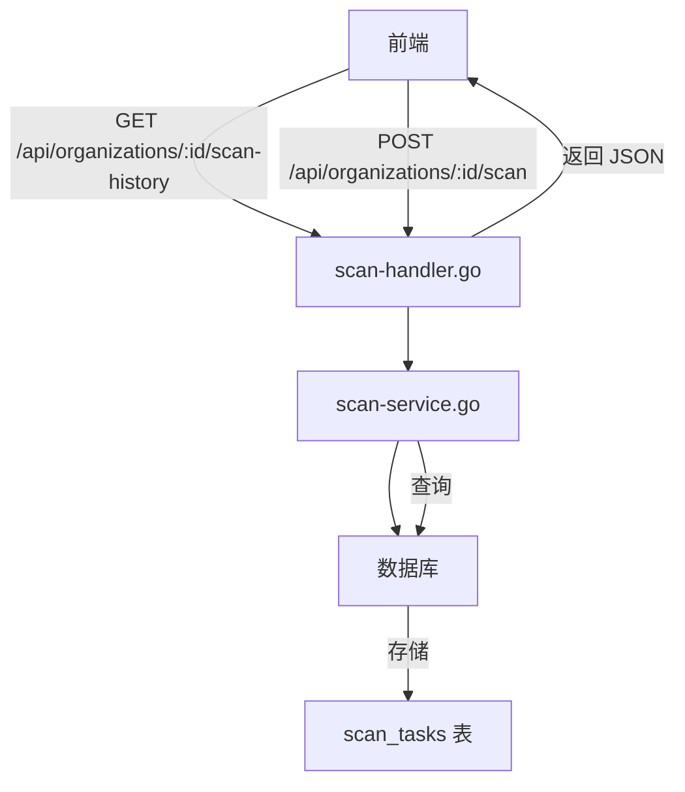
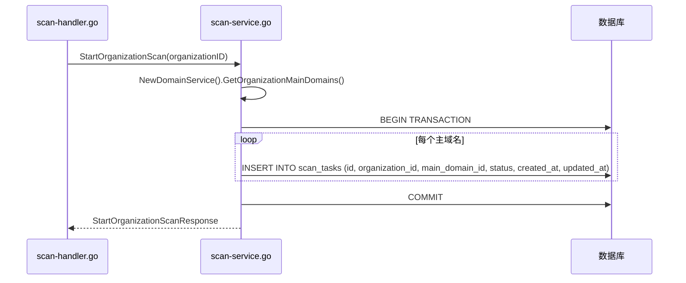
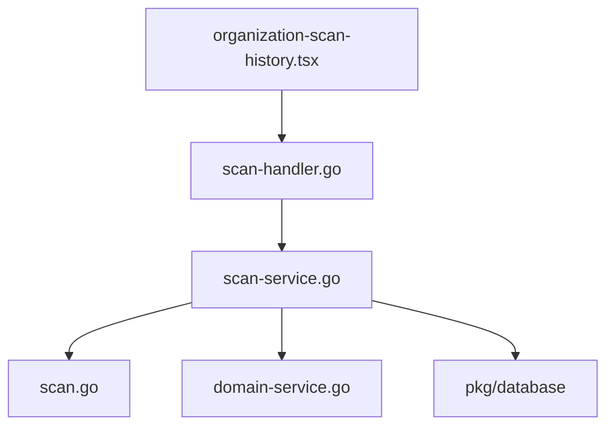

# 扫描结果模型

<cite>
**本文档引用的文件**  
- [scan.go](file://backend/internal/models/scan.go#L17-L40)
- [scan-service.go](file://backend/internal/services/scan-service.go#L1-L122)
- [scan-handler.go](file://backend/internal/handlers/scan-handler.go#L1-L49)
- [organization-scan-history.tsx](file://front/components/pages/assets/organizations/detail/organization-scan-history.tsx#L12-L443)
</cite>

## 目录
1. [引言](#引言)
2. [项目结构](#项目结构)
3. [核心组件](#核心组件)
4. [架构概览](#架构概览)
5. [详细组件分析](#详细组件分析)
6. [依赖关系分析](#依赖关系分析)
7. [性能考量](#性能考量)
8. [故障排查指南](#故障排查指南)
9. [结论](#结论)

## 引言

本技术文档旨在深入解析“漏洞扫描系统”中的扫描结果模型（ScanResult）及其相关组件的设计原理、数据结构、存储策略与业务流程。文档将重点阐述扫描任务与结果的数据模型、后端服务逻辑、API 接口行为以及前端展示方式，帮助开发者和系统维护人员全面理解该模块的实现机制。

## 项目结构

项目采用典型的前后端分离架构，后端使用 Go 语言（Gin 框架）实现，前端使用 React（Next.js）构建。

- **后端 (backend)**:
  - `cmd/main.go`: 应用程序入口。
  - `internal/models/`: 定义数据模型，如 `ScanTask` 和 `ScanResult`。
  - `internal/handlers/`: 处理 HTTP 请求，如 `scan-handler.go` 提供扫描相关的 API。
  - `internal/services/`: 实现核心业务逻辑，如 `scan-service.go` 负责任务的创建与查询。
  - `pkg/database/`: 数据库连接与操作封装。

- **前端 (front)**:
  - `components/pages/assets/organizations/detail/organization-scan-history.tsx`: 组织扫描历史页面，负责展示 `ScanTask` 数据。
  - `services/`: 前端 API 调用服务。

**Section sources**
- [scan.go](file://backend/internal/models/scan.go#L1-L40)
- [scan-handler.go](file://backend/internal/handlers/scan-handler.go#L1-L49)

## 核心组件

核心组件围绕“扫描任务”（ScanTask）展开，`ScanResult` 结构体在当前代码中定义但尚未被完全使用。系统的核心流程是：用户请求开始扫描 -> 后端创建 `ScanTask` 记录 -> 扫描完成后更新任务状态 -> 前端查询并展示历史记录。

**Section sources**
- [scan.go](file://backend/internal/models/scan.go#L17-L40)
- [scan-service.go](file://backend/internal/services/scan-service.go#L1-L122)

## 架构概览



**Diagram sources**
- [scan-handler.go](file://backend/internal/handlers/scan-handler.go#L1-L49)
- [scan-service.go](file://backend/internal/services/scan-service.go#L1-L122)
- [scan.go](file://backend/internal/models/scan.go#L17-L40)

## 详细组件分析

### 扫描结果模型 (ScanResult) 分析

尽管名为“扫描结果模型”，但根据 `scan.go` 文件中的定义，`ScanResult` 结构体目前仅包含一个 `ResultSummary` 字段，其设计和用途与典型的漏洞扫描结果有显著差异。

```go
// ScanResult 扫描结果模型
type ScanResult struct {
	ID            string    `json:"id" db:"id"`
	ScanTaskID    string    `json:"scan_task_id" db:"scan_task_id"`
	ResultSummary string    `json:"result_summary" db:"result_summary"` // 摘要信息
	CreatedAt     time.Time `json:"created_at" db:"created_at"`
	UpdatedAt     time.Time `json:"updated_at" db:"updated_at"`
}
```

#### 字段定义与用途

- **ID**: 结果的唯一标识符，主键。
- **ScanTaskID**: 关联的扫描任务 ID，用于建立与 `ScanTask` 的外键关系。
- **ResultSummary**: **结果摘要**。当前设计中，它可能存储一个简短的文本摘要或 JSON 字符串，而非详细的漏洞列表。这与文档目标中提到的“漏洞详情”、“原始输出（JSON格式）”等字段不符，表明该模型可能尚未完成或设计意图不同。
- **CreatedAt/UpdatedAt**: 记录的创建和更新时间。

#### 存储策略与优化

- **JSONB 类型应用**: 虽然 `ScanResult` 本身没有直接使用 JSONB，但 `ResultSummary` 字段可以存储 JSON 格式的字符串。为了高效存储和查询非结构化数据，建议将 `ResultSummary` 的数据库类型设为 `JSONB`。
- **GORM 与 SQL 函数**: 可以通过 GORM 执行原生 SQL 查询，利用 PostgreSQL 的 `->` 或 `->>` 操作符来提取特定信息。例如，查询包含特定 CVE 编号的结果：
  ```sql
  SELECT * FROM scan_results WHERE result_summary::jsonb @> '{"vulnerabilities": [{"cve": "CVE-2024-1234"}]}';
  ```
- **索引优化**: 为 `ScanTaskID` 字段建立索引，可以加速通过任务 ID 查询结果的操作。如果 `ResultSummary` 中包含频繁查询的字段（如 `severity`），可以创建 GIN 索引。

**Section sources**
- [scan.go](file://backend/internal/models/scan.go#L17-L40)

### 扫描任务服务 (ScanService) 分析

`ScanService` 是业务逻辑的核心，它负责与数据库交互，管理 `ScanTask` 的生命周期。

#### StartOrganizationScan 方法

该方法为一个组织下的所有主域名创建扫描任务。



**Diagram sources**
- [scan-service.go](file://backend/internal/services/scan-service.go#L35-L75)

#### GetOrganizationScanHistory 方法

该方法查询指定组织的所有扫描任务历史。

```go
func (s *ScanService) GetOrganizationScanHistory(organizationID string) ([]models.ScanTask, error) {
	query := `
		SELECT id, organization_id, main_domain_id, status, created_at, updated_at
		FROM scan_tasks
		WHERE organization_id = $1
		ORDER BY created_at DESC
	`
	// ... 执行查询并扫描结果
}
```

此方法直接返回 `ScanTask` 列表，而 `ScanResult` 并未在此流程中被查询或使用。

**Section sources**
- [scan-service.go](file://backend/internal/services/scan-service.go#L77-L122)

### API 处理器 (scan-handler.go) 分析

该文件定义了两个 RESTful API 端点。

- **StartOrganizationScan**: 接收组织 ID，调用 `ScanService.StartOrganizationScan`，并将 `StartOrganizationScanResponse` 序列化为 JSON 返回给前端。
- **GetOrganizationScanHistory**: 接收组织 ID，调用 `ScanService.GetOrganizationScanHistory`，并将 `[]ScanTask` 序列化为 JSON 返回。

此过程确保了原始数据的安全序列化，但目前返回的是任务状态，而非详细的扫描结果。

**Section sources**
- [scan-handler.go](file://backend/internal/handlers/scan-handler.go#L1-L49)

### 前端展示 (organization-scan-history.tsx) 分析

前端组件 `organization-scan-history.tsx` 展示了从后端获取的 `ScanTask` 数据，但其展示的字段超出了 `ScanTask` 模型的定义。

```tsx
// 模拟数据中的字段
const sampleScanHistory = [
  {
    id: "SCAN-001",
    type: "全面扫描",
    startTime: "2024-03-20T09:00:00Z",
    endTime: "2024-03-20T12:30:00Z",
    duration: "3小时30分钟",
    status: "已完成",
    domainsScanned: 12,
    vulnerabilitiesFound: 24,
    highRisk: 3,
    mediumRisk: 8,
    lowRisk: 13,
    scanBy: "system",
    reportUrl: "/reports/scan-001.pdf",
    // ... 其他字段
  }
]
```

这些字段（如 `vulnerabilitiesFound`, `highRisk`, `duration`）并未在后端的 `ScanTask` 模型中定义，表明：
1.  `ScanTask` 模型可能不完整，缺少这些业务展示字段。
2.  或者，前端在获取 `ScanTask` 后，通过另一个 API（如 `/scan-results`）获取了 `ScanResult`，并将两者合并展示。

**Section sources**
- [organization-scan-history.tsx](file://front/components/pages/assets/organizations/detail/organization-scan-history.tsx#L12-L443)

## 依赖关系分析



**Diagram sources**
- [scan-handler.go](file://backend/internal/handlers/scan-handler.go#L1-L49)
- [scan-service.go](file://backend/internal/services/scan-service.go#L1-L122)

## 性能考量

- **复合索引**: 在 `scan_tasks` 表的 `organization_id` 和 `created_at` 字段上建立复合索引，可以极大提升 `GetOrganizationScanHistory` 查询的性能。
- **结果归档与清理**: 对于历史扫描结果，可以实施基于时间的 TTL（Time-To-Live）策略，例如自动归档或删除超过一年的数据。
- **分表建议**: 当 `scan_tasks` 表数据量巨大时，可以考虑按 `organization_id` 或时间范围进行分表（Sharding），以分散单表压力。

## 故障排查指南

- **问题**: 调用 `/api/organizations/:id/scan` 返回 "该组织没有主域名可以扫描"。
  - **原因**: `ScanService.StartOrganizationScan` 方法检查到该组织没有关联的主域名。
  - **解决**: 确保在启动扫描前，已为该组织添加了主域名。

- **问题**: 扫描历史列表为空。
  - **原因**: 该组织 ID 不存在，或该组织下没有任何 `scan_tasks` 记录。
  - **解决**: 检查组织 ID 是否正确，并确认 `scan_tasks` 表中存在相关数据。

**Section sources**
- [scan-service.go](file://backend/internal/services/scan-service.go#L35-L75)
- [scan-handler.go](file://backend/internal/handlers/scan-handler.go#L1-L49)

## 结论

当前的“扫描结果模型” (`ScanResult`) 与文档目标存在较大差距。系统的核心是 `ScanTask` 模型，它管理扫描任务的生命周期。`ScanResult` 模型虽然已定义，但其功能和字段（特别是 `ResultSummary`）需要进一步明确和扩展，以支持存储详细的漏洞信息、原始输出和扫描耗时等。建议将 `ScanResult` 与 `ScanTask` 进行关联，并利用 PostgreSQL 的 JSONB 特性来存储和查询复杂的扫描结果数据，同时在 `ScanTask` 模型中补充 `startTime`, `endTime`, `duration`, `vulnerabilitiesFound` 等关键业务字段，以满足前端展示需求。