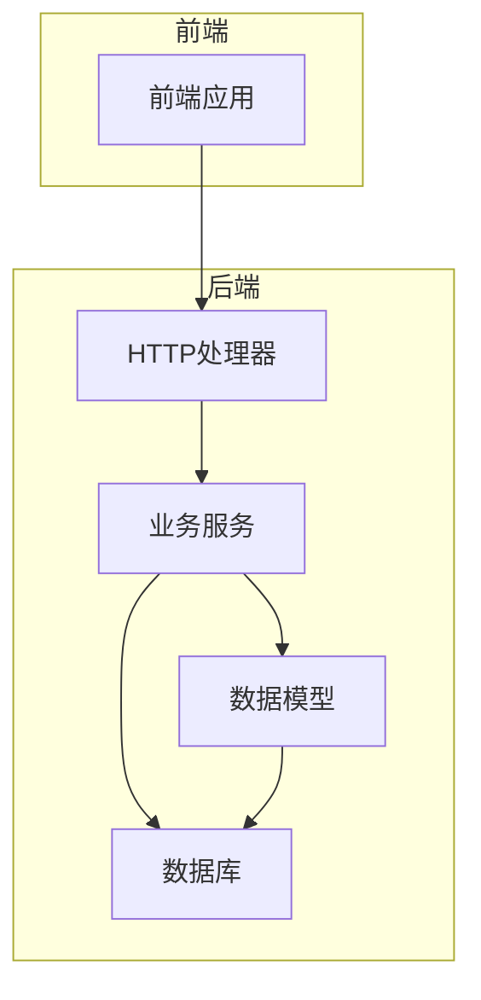
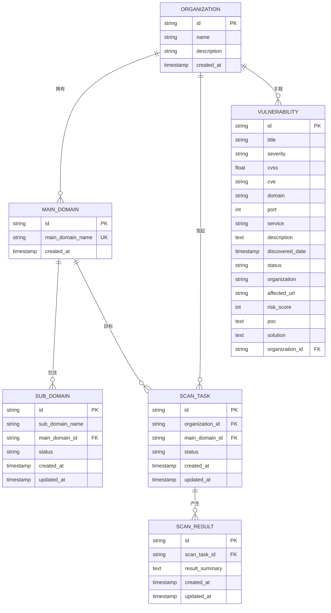
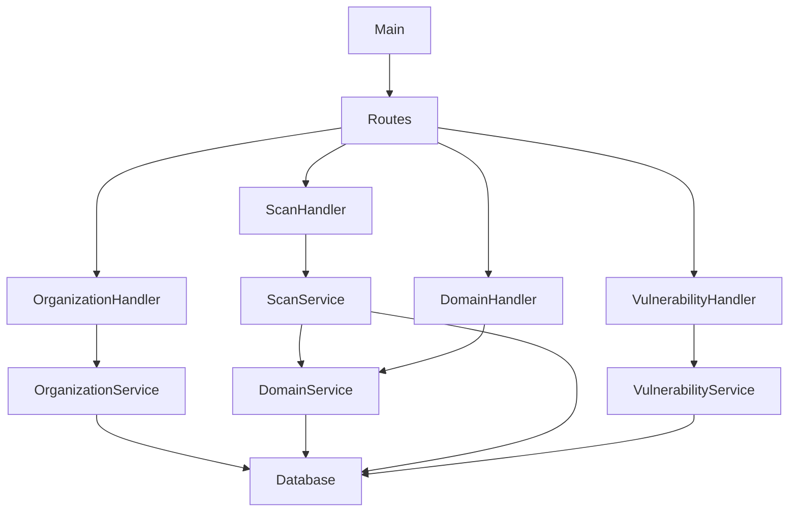

# 数据模型

<cite>
**本文档引用的文件**  
- [organization.go](file://backend/internal/models/organization.go)
- [domain.go](file://backend/internal/models/domain.go)
- [scan.go](file://backend/internal/models/scan.go)
- [vulnerability.go](file://backend/internal/models/vulnerability.go)
- [organization-service.go](file://backend/internal/services/organization-service.go)
- [scan-service.go](file://backend/internal/services/scan-service.go)
- [vulnerability-service.go](file://backend/internal/services/vulnerability-service.go)
- [初始化.sql](file://backend/初始化.sql)
</cite>

## 目录
1. [简介](#简介)
2. [项目结构](#项目结构)
3. [核心数据模型](#核心数据模型)
4. [模型关系与数据库设计](#模型关系与数据库设计)
5. [详细组件分析](#详细组件分析)
6. [依赖分析](#依赖分析)
7. [性能考虑](#性能考虑)
8. [故障排除指南](#故障排除指南)
9. [结论](#结论)

## 简介
本项目是一个基于Go语言的漏洞扫描系统后端服务，采用Gin框架构建RESTful API，通过GORM进行数据库操作。系统主要功能包括组织管理、域名资产发现、扫描任务调度和漏洞数据展示。本文档详细说明了系统中的核心数据模型，包括`Organization`、`Domain`、`ScanTask`、`ScanResult`和`Vulnerability`等结构体的定义、字段映射规则、标签配置以及它们之间的关联关系。

## 项目结构
项目采用分层架构设计，主要包括以下目录：
- `cmd/main.go`：应用程序入口
- `config/`：配置管理
- `internal/handlers/`：HTTP处理器
- `internal/models/`：数据模型定义
- `internal/services/`：业务逻辑服务
- `internal/utils/`：工具函数
- `pkg/database/`：数据库连接封装
- `routes/`：路由定义



**图示来源**
- [main.go](file://backend/cmd/main.go)
- [routes.go](file://backend/routes/routes.go)

## 核心数据模型

### 组织模型 (Organization)
`Organization`结构体定义了组织的基本信息，是系统中的核心实体之一。

```go
type Organization struct {
	ID          string    `json:"id" db:"id"`
	Name        string    `json:"name" db:"name"`
	Description string    `json:"description" db:"description"`
	CreatedAt   time.Time `json:"created_at" db:"created_at"`
}
```

**字段说明：**
- `ID`：组织唯一标识符，对应数据库中的UUID主键
- `Name`：组织名称，JSON序列化时使用`name`字段
- `Description`：组织描述信息
- `CreatedAt`：组织创建时间，自动记录

该模型与数据库`organizations`表直接映射，通过GORM标签`db`指定字段映射关系，`json`标签用于API响应序列化。

**节来源**
- [organization.go](file://backend/internal/models/organization.go#L7-L12)

### 域名模型 (Domain)
域名模型包含主域名(`MainDomain`)、子域名(`SubDomain`)和组织-主域名关联(`OrganizationMainDomain`)三个结构体。

```go
type MainDomain struct {
	ID             string    `json:"id" db:"id"`
	MainDomainName string    `json:"main_domain_name" db:"main_domain_name"`
	CreatedAt      time.Time `json:"created_at" db:"created_at"`
}

type SubDomain struct {
	ID            string      `json:"id" db:"id"`
	SubDomainName string      `json:"sub_domain_name" db:"sub_domain_name"`
	MainDomainID  string      `json:"main_domain_id" db:"main_domain_id"`
	Status        string      `json:"status" db:"status"`
	CreatedAt     time.Time   `json:"created_at" db:"created_at"`
	UpdatedAt     time.Time   `json:"updated_at" db:"updated_at"`
	MainDomain    *MainDomain `json:"main_domain,omitempty"`
}
```

**字段说明：**
- `MainDomain`：主域名实体，包含域名名称和创建时间
- `SubDomain`：子域名实体，包含状态字段（如"active"、"inactive"）和更新时间戳
- `MainDomain`字段在`SubDomain`中作为嵌套对象，实现关联查询

**节来源**
- [domain.go](file://backend/internal/models/domain.go#L7-L30)

### 扫描任务模型 (ScanTask)
`ScanTask`结构体表示一个扫描任务，关联到特定的组织和主域名。

```go
type ScanTask struct {
	ID             string    `json:"id" db:"id"`
	OrganizationID string    `json:"organization_id" db:"organization_id"`
	MainDomainID   string    `json:"main_domain_id" db:"main_domain_id"`
	Status         string    `json:"status" db:"status"`
	CreatedAt      time.Time `json:"created_at" db:"created_at"`
	UpdatedAt      time.Time `json:"updated_at" db:"updated_at"`
}
```

**字段说明：**
- `Status`：任务状态，支持"pending"、"running"、"completed"、"failed"等值
- 包含`UpdatedAt`字段，支持记录任务状态变更时间
- 通过`OrganizationID`和`MainDomainID`建立外键关联

**节来源**
- [scan.go](file://backend/internal/models/scan.go#L7-L14)

### 扫描结果模型 (ScanResult)
`ScanResult`结构体存储扫描任务的执行结果摘要。

```go
type ScanResult struct {
	ID            string    `json:"id" db:"id"`
	ScanTaskID    string    `json:"scan_task_id" db:"scan_task_id"`
	ResultSummary string    `json:"result_summary" db:"result_summary"`
	CreatedAt     time.Time `json:"created_at" db:"created_at"`
	UpdatedAt     time.Time `json:"updated_at" db:"updated_at"`
}
```

**字段说明：**
- `ResultSummary`：文本类型的扫描结果摘要，可存储JSON格式的详细结果
- 与`ScanTask`形成一对多关系（一个任务对应多个结果）

**节来源**
- [scan.go](file://backend/internal/models/scan.go#L17-L23)

### 漏洞模型 (Vulnerability)
`Vulnerability`结构体定义了漏洞的详细信息，用于展示扫描发现的安全问题。

```go
type Vulnerability struct {
	ID             string    `json:"id"`
	Title          string    `json:"title"`
	Severity       string    `json:"severity"`
	CVSS           float64   `json:"cvss"`
	CVE            string    `json:"cve"`
	Domain         string    `json:"domain"`
	Port           int       `json:"port"`
	Service        string    `json:"service"`
	Description    string    `json:"description"`
	DiscoveredDate time.Time `json:"discovered_date"`
	Status         string    `json:"status"`
	Organization   string    `json:"organization"`
	AffectedURL    string    `json:"affected_url"`
	RiskScore      int       `json:"risk_score"`
	POC            string    `json:"poc"`
	Solution       string    `json:"solution"`
	OrganizationID string    `json:"organization_id"`
}
```

**字段说明：**
- `Severity`：严重等级，分为"高危"、"中危"、"低危"
- `CVSS`：通用漏洞评分系统分数，浮点数类型
- `RiskScore`：风险评分，整数类型，便于排序和筛选
- `POC`：漏洞验证代码，用于复现问题
- `Solution`：修复建议

**节来源**
- [vulnerability.go](file://backend/internal/models/vulnerability.go#L7-L25)

## 模型关系与数据库设计



**图示来源**
- [初始化.sql](file://backend/初始化.sql)
- [organization.go](file://backend/internal/models/organization.go)
- [domain.go](file://backend/internal/models/domain.go)

## 详细组件分析

### 组织服务分析
`OrganizationService`提供了组织相关的业务逻辑实现。

```go
func (s *OrganizationService) GetOrganizations() ([]models.Organization, error) {
	query := `
		SELECT id, name, description, created_at
		FROM organizations
		ORDER BY created_at DESC
	`

	rows, err := s.db.Query(query)
	if err != nil {
		logrus.WithError(err).Error("Failed to query organizations")
		return nil, err
	}
	defer rows.Close()

	var organizations []models.Organization
	for rows.Next() {
		var org models.Organization
		err := rows.Scan(&org.ID, &org.Name, &org.Description, &org.CreatedAt)
		if err != nil {
			logrus.WithError(err).Error("Failed to scan organization")
			return nil, err
		}
		organizations = append(organizations, org)
	}

	return organizations, nil
}
```

**实现特点：**
- 使用原生SQL查询提高性能
- 通过`rows.Scan`将数据库记录映射到结构体
- 完整的错误处理和日志记录
- 返回排序后的组织列表（按创建时间降序）

**节来源**
- [organization-service.go](file://backend/internal/services/organization-service.go#L25-L57)

### 扫描服务分析
`ScanService`负责扫描任务的创建和历史查询。

```go
func (s *ScanService) StartOrganizationScan(organizationID string) (*models.StartOrganizationScanResponse, error) {
	domainService := NewDomainService()
	mainDomains, err := domainService.GetOrganizationMainDomains(organizationID)
	if err != nil {
		return nil, err
	}

	if len(mainDomains) == 0 {
		return nil, fmt.Errorf("organization has no main domains to scan")
	}

	tx, err := s.db.Begin()
	if err != nil {
		return nil, err
	}
	defer tx.Rollback()

	var taskIDs []string
	for _, mainDomain := range mainDomains {
		taskID := uuid.New().String()
		insertQuery := `
			INSERT INTO scan_tasks (id, organization_id, main_domain_id, status, created_at, updated_at)
			VALUES ($1, $2, $3, $4, NOW(), NOW())
		`
		_, err = tx.Exec(insertQuery, taskID, organizationID, mainDomain.ID, "pending")
		if err != nil {
			return nil, err
		}
		taskIDs = append(taskIDs, taskID)
	}

	if err := tx.Commit(); err != nil {
		return nil, err
	}

	response := &models.StartOrganizationScanResponse{
		TaskID:  taskIDs[0],
		Message: fmt.Sprintf("成功创建 %d 个扫描任务", len(taskIDs)),
	}

	return response, nil
}
```

**实现特点：**
- 事务性操作确保数据一致性
- 先查询组织的主域名，再为每个主域名创建扫描任务
- 使用UUID生成任务ID
- 返回第一个任务ID作为代表，便于前端处理

**节来源**
- [scan-service.go](file://backend/internal/services/scan-service.go#L47-L91)

### 漏洞服务分析
`VulnerabilityService`目前返回模拟数据，展示了漏洞数据的结构。

```go
func (s *VulnerabilityService) GetOrganizationVulnerabilities(organizationID string) ([]models.Vulnerability, error) {
	vulnerabilities := []models.Vulnerability{
		{
			ID:             "VUL-001",
			Title:          "SQL 注入漏洞",
			Severity:       "高危",
			CVSS:           9.8,
			CVE:            "CVE-2024-1234",
			Domain:         "api.example.com",
			Port:           443,
			Service:        "Web Application",
			Description:    "在用户登录接口发现SQL注入漏洞，可能导致数据库信息泄露",
			DiscoveredDate: time.Now().AddDate(0, 0, -3),
			Status:         "待修复",
			Organization:   "Example Organization",
			AffectedURL:    "https://api.example.com/login",
			RiskScore:      95,
			POC:            "POST /login HTTP/1.1\nContent-Type: application/json\n{\"username\":\"admin' OR 1=1--\",\"password\":\"test\"}",
			Solution:       "使用参数化查询或预编译语句来避免SQL注入",
			OrganizationID: organizationID,
		},
		// ... 其他漏洞
	}

	return vulnerabilities, nil
}
```

**实现特点：**
- 使用模拟数据便于开发和测试
- 包含完整的漏洞信息，包括POC和修复建议
- 时间字段使用`time.Now().AddDate()`模拟历史数据
- 通过`OrganizationID`参数实现按组织过滤

**节来源**
- [vulnerability-service.go](file://backend/internal/services/vulnerability-service.go#L76-L124)

## 依赖分析



**图示来源**
- [services](file://backend/internal/services/)
- [handlers](file://backend/internal/handlers/)

## 性能考虑
1. **数据库索引**：在`初始化.sql`中为关键字段创建了索引，如`idx_scan_tasks_org_id`、`idx_sub_domains_status`等，提高查询性能
2. **批量操作**：扫描服务中使用事务批量创建扫描任务，减少数据库交互次数
3. **连接池**：通过`pkg/database`包管理数据库连接，避免频繁创建和销毁连接
4. **查询优化**：使用原生SQL而非ORM的链式调用，更好地控制查询性能

## 故障排除指南
1. **组织无主域名无法扫描**：检查`organization_main_domains`关联表，确保组织与主域名正确关联
2. **扫描任务状态不更新**：确认`UpdatedAt`字段在状态变更时被正确更新
3. **漏洞数据不显示**：检查`OrganizationID`是否正确传递，确保数据按组织过滤
4. **数据库连接失败**：验证数据库配置和网络连接，确保PostgreSQL服务正常运行

**节来源**
- [scan-service.go](file://backend/internal/services/scan-service.go#L47-L91)
- [vulnerability-service.go](file://backend/internal/services/vulnerability-service.go#L76-L124)

## 结论
本系统通过清晰的分层架构和规范的数据模型设计，实现了漏洞扫描系统的核心功能。数据模型设计合理，字段命名规范，关系明确，支持系统的扩展需求。建议未来将漏洞服务从模拟数据迁移到真实数据库存储，并增加更多的索引优化查询性能。